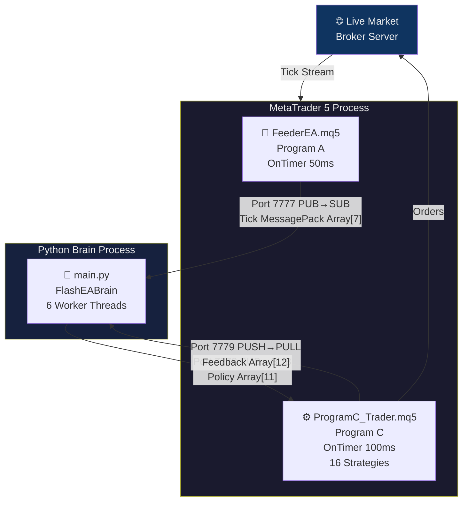
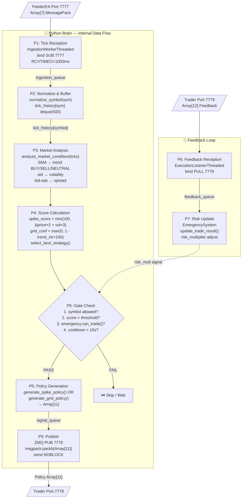
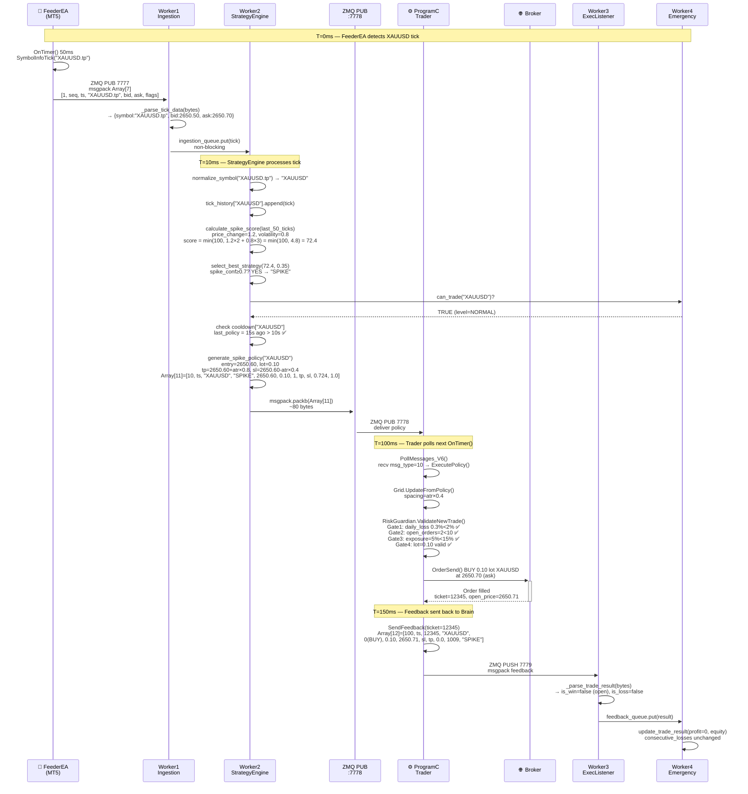
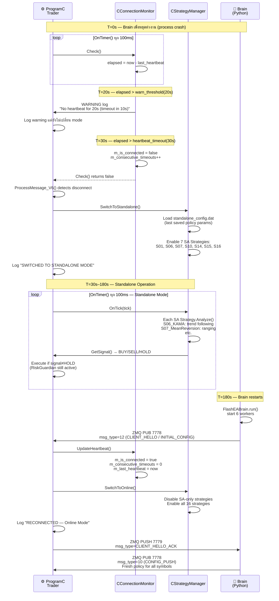
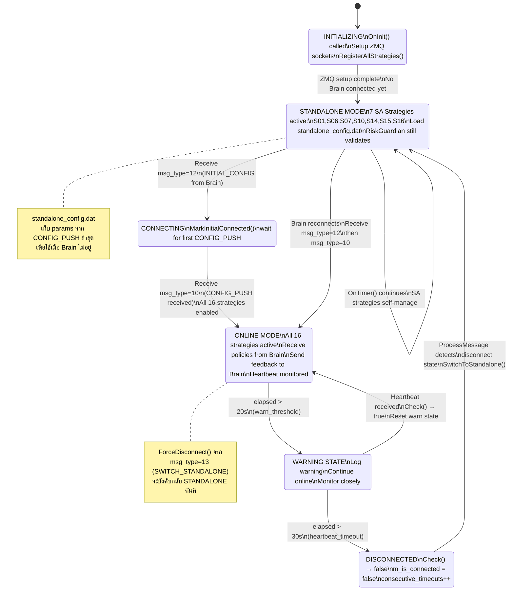
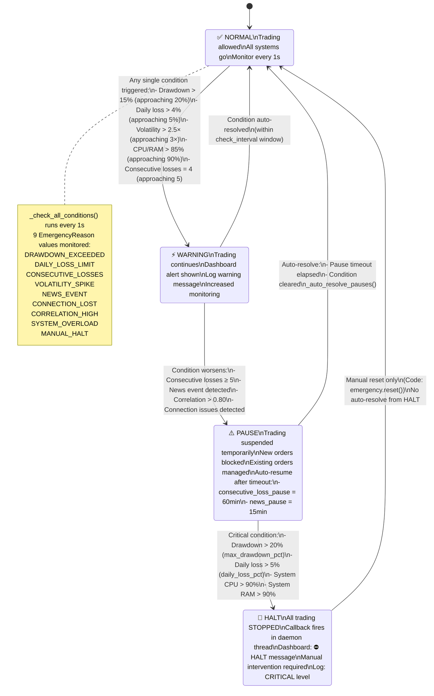
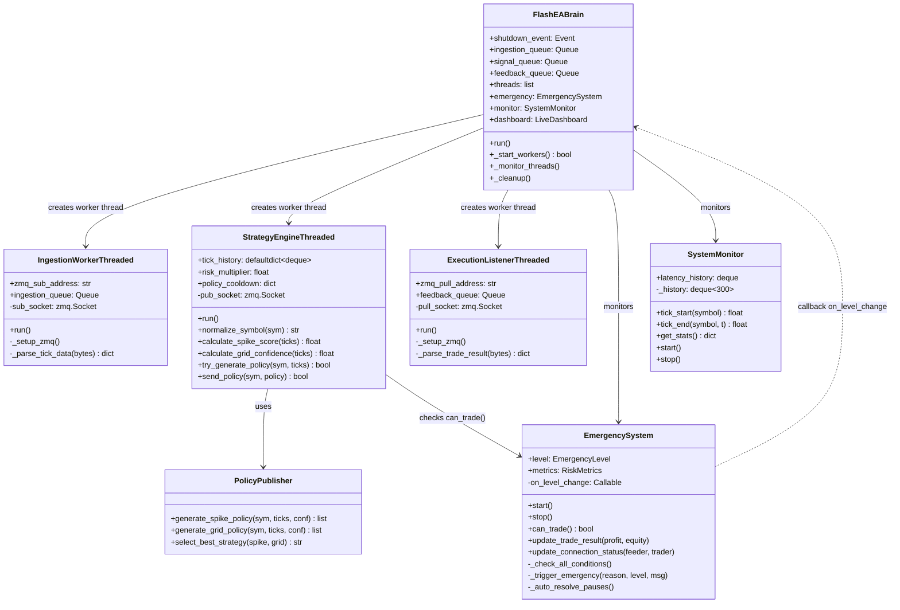
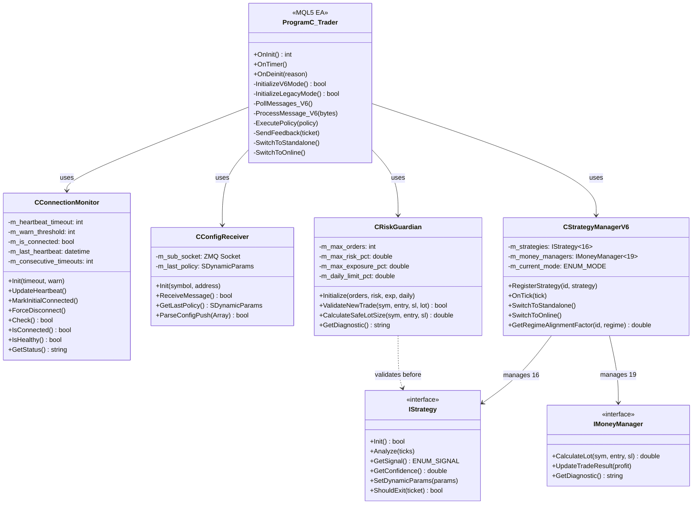

# Section 5 — Diagram-Ready Summary: FlashEASuite V2 ทั้งระบบ

> **วัตถุประสงค์**: เอกสารนี้รวบรวม Diagram พร้อม Mermaid code ทุก diagram ของระบบ
> สามารถนำไปวางใน [mermaid.live](https://mermaid.live), Notion, Obsidian, หรือ GitHub
> ทำขึ้นจากการ Deep-Dive analysis ของ FlashEASuite V2 (V6 Architecture)
> **วันที่**: 2026-03-01 | **Version**: 2.1.0 (Phase P9-5)

---

## สารบัญ

| # | Diagram | ประเภท |
|---|---------|--------|
| [5.1](#51-system-context-diagram-level-0-dfd) | System Context Diagram (Level 0 DFD) | ASCII + Mermaid |
| [5.2](#52-component-architecture-diagram) | Component Architecture | ASCII class map |
| [5.3](#53-data-flow-diagram-level-1-brain-internals) | Data Flow Level 1 — Brain Internals | ASCII + Mermaid |
| [5.4](#54-sequence-diagram-happy-path-spike-detected) | Sequence: Happy Path (Spike Detected) | Mermaid sequenceDiagram |
| [5.5](#55-sequence-diagram-disconnect--standalone--reconnect) | Sequence: Disconnect → Standalone → Reconnect | Mermaid sequenceDiagram |
| [5.6](#56-state-machine-connection--mode) | State Machine: Connection & Mode | Mermaid stateDiagram |
| [5.7](#57-state-machine-emergency-system) | State Machine: Emergency System | Mermaid stateDiagram |
| [5.8](#58-class-relationship-diagram) | Class Relationship Diagram | Mermaid classDiagram |
| [5.9](#59-timing-diagram) | Timing Diagram | Frequency table + timeline |
| [5.10](#510-message-format-reference) | Message Format Reference | Array format all ZMQ types |
| [5.11](#511-deployment-diagram) | Deployment Diagram | Port topology |
| [5.12](#512-quick-reference--constants) | Quick Reference — Constants | Magic numbers + thresholds |
| [5.13](#513-master-component-table) | Master Component Table | All files, class, role |

---

## 5.1 System Context Diagram (Level 0 DFD)

### ASCII Overview

```
┌─────────────────────────────────────────────────────────────────────┐
│                      VPS / Local Machine                            │
│                                                                     │
│  ┌──────────────────────────────┐    ┌───────────────────────────┐  │
│  │   MetaTrader 5 Process       │    │   Python Brain Process    │  │
│  │                              │    │                           │  │
│  │  ┌──────────────────────┐   │    │  ┌─────────────────────┐  │  │
│  │  │   FeederEA.mq5       │   │    │  │   main.py           │  │  │
│  │  │   (Program A)        │   │    │  │   FlashEABrain      │  │  │
│  │  │                      │──────────▶│   (Program B)       │  │  │
│  │  │  OnTimer() 50ms      │   │    │  │                     │  │  │
│  │  │  4 symbols SUB PUB   │   │    │  │  6 Worker Threads   │  │  │
│  │  └──────────────────────┘   │    │  └──────────┬──────────┘  │  │
│  │                              │    │             │             │  │
│  │  ┌──────────────────────┐   │    │             │             │  │
│  │  │  ProgramC_Trader.mq5 │◀──────────────────────┘             │  │
│  │  │  (Program C)         │   │    │                           │  │
│  │  │                      │──────────▶                          │  │
│  │  │  OnTimer() 100ms     │   │    │                           │  │
│  │  │  16 Strategies       │   │    │                           │  │
│  │  └──────────────────────┘   │    └───────────────────────────┘  │
│  └──────────────────────────────┘                                   │
│                                                                     │
│  Port 7777: FeederEA ──PUB──▶ Brain SUB (Tick Data, MessagePack)   │
│  Port 7778: Brain ───PUB──▶ Trader SUB (Policy, Array[11])         │
│  Port 7779: Trader ──PUSH──▶ Brain PULL (Feedback, Array[12])      │
└─────────────────────────────────────────────────────────────────────┘
                         │
              [Broker Server via Internet]
                         │
                  ┌──────▼──────┐
                  │  Live Market│
                  │  XAUUSD     │
                  │  EURUSD     │
                  │  GBPUSD     │
                  │  USDJPY     │
                  └─────────────┘
```

### Mermaid Code



---

## 5.2 Component Architecture Diagram

### Python Brain — Class & Module Map

```
02_Brain/
├── main.py
│   └── class FlashEABrain
│       ├── __init__()          → queues, shutdown_event, threads[]
│       ├── _setup_emergency_system()
│       ├── _setup_system_monitor()
│       ├── _setup_dashboard()
│       ├── _start_workers()    → 6 threads
│       ├── _monitor_threads()  → main loop (check every 5s)
│       └── _cleanup()
│
├── core/
│   ├── ingestion.py
│   │   └── class IngestionWorkerThreaded
│   │       ├── _setup_zmq()   → bind tcp://127.0.0.1:7777 SUB
│   │       ├── _parse_tick_data(bytes) → dict{7 fields}
│   │       └── run()          → recv → parse → queue.put()
│   │
│   ├── execution_listener.py
│   │   └── class ExecutionListenerThreaded
│   │       ├── _setup_zmq()   → bind tcp://127.0.0.1:7779 PULL
│   │       ├── _parse_trade_result(bytes) → dict{12 fields}
│   │       └── run()          → recv → parse → queue.put()
│   │
│   ├── emergency_system.py
│   │   ├── class EmergencySystem
│   │   │   ├── _check_all_conditions() → 9 checks per 1s
│   │   │   ├── _trigger_emergency(reason, level, msg)
│   │   │   ├── update_trade_result(profit, equity)
│   │   │   └── update_connection_status(feeder, trader)
│   │   ├── enum EmergencyLevel {NORMAL, WARNING, PAUSE, HALT}
│   │   ├── enum EmergencyReason {9 values}
│   │   └── dataclass RiskMetrics
│   │
│   ├── system_monitor.py
│   │   └── class SystemMonitor
│   │       ├── tick_start(symbol) → float (perf_counter)
│   │       ├── tick_end(symbol, t) → float (elapsed_ms)
│   │       └── get_stats() → {latency_p95, throughput, cpu, mem}
│   │
│   └── strategy/
│       ├── engine.py
│       │   └── class StrategyEngineThreaded (v2.3)
│       │       ├── normalize_symbol(sym) → str
│       │       ├── calculate_spike_score(ticks) → float 0-100
│       │       ├── calculate_grid_confidence(ticks) → float 0-1
│       │       ├── try_generate_policy(symbol, ticks) → bool
│       │       ├── send_policy(symbol, policy) → bool
│       │       └── run() → ingestion_queue → signal_queue loop
│       │
│       ├── analysis.py
│       │   └── analyze_market_condition(ticks) → dict
│       │       {trend, volatility, confidence, spread}
│       │
│       └── policy.py
│           └── class PolicyPublisher
│               ├── generate_spike_policy(symbol, ticks, conf) → Array[11]
│               ├── generate_grid_policy(symbol, ticks, conf) → Array[11]
│               └── select_best_strategy(spike_conf, grid_conf) → str
│
└── dashboard.py
    └── class LiveDashboard
        ├── add_alert(msg, level)
        ├── update_connection(feeder, trader, strategy, regime)
        └── start(blocking=False)
```

### MQL5 Trader — Class & File Map

```
03_Trader/ProgramC_Trader.mq5 (v2.13)
│
├── Global Variables
│   ├── g_strategy_manager_v6  (CStrategyManagerV6)
│   ├── g_connection_monitor   (CConnectionMonitor)
│   ├── g_config_receiver      (CConfigReceiver)
│   └── g_risk_guardian        (CRiskGuardian)
│
├── OnInit() → InitializeV6Mode() OR InitializeLegacyMode()
│   ├── InitializeV6Mode()
│   │   ├── RegisterAllStrategies() → g_strategy_table[16]
│   │   ├── ConnectionMonitor.Init(30, 20)
│   │   ├── ConfigReceiver.Init(symbol, sub_address=7778)
│   │   └── SwitchToStandalone() → 7 SA strategies
│   └── InitializeLegacyMode()
│       ├── ZMQ HUB: SUB 7778, PUB 7779
│       └── RiskGuardian.Initialize(10, 2%, 15%, 2%)
│
├── OnTimer() 100ms
│   ├── PollMessages_V6()  → drain 20 msg/call
│   │   └── ProcessMessage_V6(bytes)
│   │       └── switch(msg_type):
│   │           ├── 10 → ExecutePolicy()
│   │           ├── 12 → SwitchToOnline()
│   │           ├── 13 → SwitchToStandalone()
│   │           ├── 30 → UpdateHeartbeat()
│   │           ├── 31 → HandleEmergency()
│   │           ├── 40 → LoadStrategyUpdate()
│   │           ├── 50 → HandleDiagnosticRequest()
│   │           └── 99 → HandleShutdown()
│   ├── g_strategy_manager_v6.OnTick(tick)
│   └── ConnectionMonitor.Check() → timeout → SwitchToStandalone()
│
└── Include/
    ├── Logic/
    │   ├── StrategyConstants.mqh   → ENUM_STRATEGY_ID, g_strategy_table[16]
    │   ├── ConnectionMonitor.mqh  → CConnectionMonitor
    │   └── ConfigReceiver.mqh     → CConfigReceiver
    ├── Network/Protocol/
    │   └── Definitions.mqh        → ENUM_MSG_TYPE_V6, SDynamicParams
    └── Risk/
        └── RiskGuardian.mqh       → CRiskGuardian (4 gates)
```

---

## 5.3 Data Flow Diagram Level 1 — Brain Internals

### ASCII DFD

```
 External: FeederEA (7777)         External: Trader (7779)
       │                                    │
       ▼                                    ▼
 ┌─────────────────┐              ┌─────────────────────┐
 │  P1: Tick        │              │  P6: Feedback        │
 │  Reception       │              │  Reception           │
 │  (Ingestion      │              │  (ExecutionListener) │
 │   Worker)        │              │                      │
 └────────┬─────────┘              └──────────┬───────────┘
          │ ingestion_queue                   │ feedback_queue
          ▼                                   ▼
 ┌─────────────────┐              ┌─────────────────────┐
 │  P2: Normalize  │              │  P7: Risk Update     │
 │  & Buffer       │              │  EmergencySystem     │
 │  normalize_sym()│              │  update_trade_result │
 │  deque(500)     │              │  risk_multiplier adj │
 └────────┬─────────┘              └─────────────────────┘
          │ tick_history[symbol]
          ▼
 ┌─────────────────────────────────────────────────────────┐
 │  P3: Market Analysis (analyze_market_condition)         │
 │  Input: deque[500 ticks]                                │
 │  ├── SMA comparison → trend (BUY/SELL/NEUTRAL)          │
 │  ├── price_std → volatility                             │
 │  ├── ask-bid → spread                                   │
 │  └── Output: {trend, volatility, confidence, spread}    │
 └────────┬────────────────────────────────────────────────┘
          │
          ▼
 ┌─────────────────────────────────────────────────────────┐
 │  P4: Score Calculation                                  │
 │  ├── calculate_spike_score()                            │
 │  │   50-tick window: price_change×2 + volatility×3     │
 │  │   Result: spike_score 0–100                         │
 │  ├── calculate_grid_confidence()                        │
 │  │   50-tick window: 1 - trend_strength×100            │
 │  │   Result: grid_confidence 0–1                       │
 │  └── select_best_strategy(spike_score, grid_conf)      │
 │       Spike if conf≥0.7, Grid if conf≥0.6              │
 └────────┬────────────────────────────────────────────────┘
          │
          ▼
 ┌─────────────────────────────────────────────────────────┐
 │  P5: Policy Generation (try_generate_policy)            │
 │  Gate 1: symbol in ALLOWED_SYMBOLS?                     │
 │  Gate 2: score > threshold?                             │
 │  Gate 3: EmergencySystem.can_trade()?                  │
 │  Gate 4: cooldown[symbol] > 10s?                        │
 │                                                         │
 │  If pass → generate_*_policy() → Array[11]             │
 │  [type=10, ts, symbol, strategy, entry, lot,            │
 │   max_orders, tp, sl, confidence, risk_mult]            │
 └────────┬────────────────────────────────────────────────┘
          │ signal_queue
          ▼
 ┌─────────────────┐
 │  P5: Publish    │
 │  (ZMQ PUB 7778) │
 │  msgpack.packb()│
 │  send(NOBLOCK)  │
 └─────────────────┘
          │
          ▼
 External: Trader (7778)
```

### Mermaid Code



---

## 5.4 Sequence Diagram: Happy Path (Spike Detected)

> Scenario: XAUUSD Spike ตรวจพบ → Policy ส่ง → Trade Executed → Feedback กลับ Brain



---

## 5.5 Sequence Diagram: Disconnect → Standalone → Reconnect

> Scenario: Brain Python process หยุดทำงาน → Trader ตรวจพบ → สลับ Standalone → Brain กลับมา



---

## 5.6 State Machine: Connection & Mode



---

## 5.7 State Machine: Emergency System



---

## 5.8 Class Relationship Diagram

### Python Brain Classes



### MQL5 Trader Classes



---

## 5.9 Timing Diagram

### ตารางความถี่ทุก Component

| Component | File | Trigger | Interval | Action |
|-----------|------|---------|----------|--------|
| FeederEA | FeederEA.mq5 | OnTimer | 50ms | SymbolInfoTick() × 4 symbols → ZMQ PUB 7777 |
| IngestionWorker | ingestion.py | recv loop | ~1ms (RCVTIMEO=1000ms) | parse tick → ingestion_queue.put() |
| StrategyEngine | engine.py | queue.get | ~1-10ms | normalize → score → policy → ZMQ PUB 7778 |
| ProgramC_Trader | Trader.mq5 | OnTimer | 100ms | PollMessages(20) → OnTick → Check heartbeat |
| ExecutionListener | execution_listener.py | recv loop | ~1ms | parse feedback → feedback_queue.put() |
| EmergencySystem | emergency_system.py | background | 1000ms | _check_all_conditions() × 9 checks |
| SystemMonitor | system_monitor.py | background | 1000ms | CPU/RAM snapshot → history deque(300) |
| Dashboard | dashboard.py | background | 1000ms | Refresh terminal display |
| ConnectionMonitor | ConnectionMonitor.mqh | OnTimer | 100ms (every ~10 calls) | Check() heartbeat elapsed |
| Policy Cooldown | engine.py | per symbol | 10s min | POLICY_COOLDOWN prevents flood |

### 1-Second Timeline (1000ms window)

```
ms    0    100   200   300   400   500   600   700   800   900  1000
      │    │     │     │     │     │     │     │     │     │    │
FDR   ●────●─────●─────●─────●─────●─────●─────●─────●─────●───●  (20 ticks × 4 sym = 80)
      [T1] [T2]  [T3]  [T4]  ...
ING   ●●●●●●●●●●●●●●●●●●●●●●●●●●●●●●●●●●●●●●●●●●●●●●●●●●●●●●●●  (continuous recv)
ENG   ●    ●     ●     ●     ●     ●     ●     ●     ●     ●    ●  (per tick received)
TDR   ●    ●     ●     ●     ●     ●     ●     ●     ●     ●    ●  (10 timer calls/sec)
EXL   ●●●●●●●●●●●●●●●●●●●●●●●●●●●●●●●●●●●●●●●●●●●●●●●●●●●●●●●●  (continuous recv)
EMG   │                                                        ●  (1× per second)
MON   │                                                        ●  (1× per second)
DASH  │                                                        ●  (1× per second)

Legend: ● = execution point, ─ = running
```

---

## 5.10 Message Format Reference

### ZMQ Port 7777 — Tick Data (FeederEA → Brain)

```
Format: MessagePack Array[7]
Size:   ~60-80 bytes

Index  Field          Type    Description
─────  ─────────────  ──────  ────────────────────────────────
  0    msg_type       int     Always 1 (TICK_V6)
  1    seq_id         int     Monotonic sequence counter
  2    timestamp      double  tick.time_msc (milliseconds)
  3    symbol         str     Raw symbol e.g. "XAUUSD.tp"
  4    bid            double  Bid price
  5    ask            double  Ask price
  6    flags          int     Tick flags bitmask

Example (JSON equivalent):
[1, 100042, 1709251200000.0, "XAUUSD.tp", 2650.50, 2650.70, 3]
```

### ZMQ Port 7778 — Policy/Config Push (Brain → Trader)

```
Format: MessagePack Array[11]
Size:   ~80-120 bytes
msg_type=10 (CONFIG_PUSH)

Index  Field          Type    Description
─────  ─────────────  ──────  ────────────────────────────────
  0    msg_type       int     Always 10 (CONFIG_PUSH)
  1    timestamp      double  Unix timestamp ms
  2    symbol         str     Normalized e.g. "XAUUSD"
  3    strategy       str     "SPIKE" or "GRID"
  4    entry          double  Entry price reference
  5    lot            double  Calculated lot size
  6    max_orders     int     Maximum concurrent orders
  7    tp             double  Take profit price
  8    sl             double  Stop loss price
  9    confidence     double  Signal confidence 0.0–1.0
 10    risk_mult      double  Risk multiplier (adj by feedback)

Example:
[10, 1709251205000.0, "XAUUSD", "SPIKE", 2650.60, 0.10, 1, 2652.20, 2649.90, 0.724, 1.0]

Other msg_types on 7778:
  12 = INITIAL_CONFIG (Brain→Trader after reconnect)
  13 = SWITCH_STANDALONE (Brain forces standalone)
  30 = HEARTBEAT (periodic, updates ConnectionMonitor)
  31 = EMERGENCY_COMMAND (halt trading)
  40 = STRATEGY_UPDATE (hot-reload single strategy params)
  50 = DIAGNOSTIC_REQUEST
  99 = SHUTDOWN
```

### ZMQ Port 7779 — Trade Feedback (Trader → Brain)

```
Format: MessagePack Array[12]
Size:   ~100-130 bytes
msg_type=100 (TRADE_REPORT)

Index  Field          Type    Description
─────  ─────────────  ──────  ────────────────────────────────
  0    msg_type       int     Always 100 (TRADE_REPORT)
  1    timestamp      double  TimeCurrent()*1000.0
  2    ticket         long    Order ticket number
  3    symbol         str     e.g. "XAUUSD.tp"
  4    order_type     int     0=BUY, 1=SELL
  5    volume         double  Lot size filled
  6    open_price     double  Actual fill price
  7    sl             double  Stop loss set
  8    tp             double  Take profit set
  9    profit         double  Current/closed profit (USD)
 10    magic          int     Strategy magic 1001–1016
 11    comment        str     e.g. "S09_SPIKE_ENTRY"

Derived fields (added by _parse_trade_result):
  is_win   = profit > 0
  is_loss  = profit < 0
  datetime = human-readable from timestamp

Example:
[100, 1709251210000.0, 12345, "XAUUSD.tp", 0, 0.10, 2650.71, 2649.90, 2652.20, 0.0, 1009, "S09_SPIKE"]
```

### standalone_config.dat — Fallback Persistence

```
Format: INI-style key=value (written every CONFIG_PUSH)
File:   <MT5 Data folder>/MQL5/Files/standalone_config.dat

[XAUUSD]
strategy=SPIKE
entry=2650.60
lot=0.10
max_orders=1
tp=2652.20
sl=2649.90
confidence=0.724
risk_mult=1.0
timestamp=1709251205

[EURUSD]
strategy=GRID
...
```

---

## 5.11 Deployment Diagram

```
┌─────────────────────────────────────────────────────────────────────────────┐
│                        Single Machine / VPS                                  │
│                                                                              │
│  ┌─────────────────────────────────────────────────────────────────────┐    │
│  │                    MetaTrader 5 Process                              │    │
│  │                                                                      │    │
│  │  ┌──────────────────────┐    ┌──────────────────────────────────┐   │    │
│  │  │ FeederEA.mq5         │    │ ProgramC_Trader.mq5              │   │    │
│  │  │ (Chart: XAUUSD H1)   │    │ (Chart: EURUSD M1)              │   │    │
│  │  │                      │    │                                  │   │    │
│  │  │ Timer: 50ms           │    │ Timer: 100ms                    │   │    │
│  │  │ Symbols: 4            │    │ Strategies: 16 (7 SA / all)    │   │    │
│  │  │ ZMQ PUB 7777  ────────────▶ ZMQ SUB 7778                   │   │    │
│  │  │                      │    │ ZMQ PUSH 7779                   │   │    │
│  │  └──────────────────────┘    └────────────────┬─────────────────┘   │    │
│  │                                               │                      │    │
│  │  Memory:                                      │ Files:               │    │
│  │  g_strategy_table[16]                         │ standalone_config.dat│    │
│  │  g_connection_monitor                         │ <MQL5/Files/>        │    │
│  │  g_risk_guardian                              │                      │    │
│  └───────────────────────────────────────────────┼──────────────────────┘    │
│                                                  │                           │
│  ┌───────────────────────────────────────────────▼──────────────────────┐    │
│  │                    Python Brain Process                               │    │
│  │                    python main.py (02_Brain/)                        │    │
│  │                                                                      │    │
│  │  Worker1: IngestionWorkerThreaded   ← ZMQ SUB bind :7777            │    │
│  │  Worker2: StrategyEngineThreaded                                     │    │
│  │  Worker3: ExecutionListenerThreaded ← ZMQ PULL bind :7779           │    │
│  │  Worker4: EmergencySystem (daemon)                                   │    │
│  │  Worker5: SystemMonitor (daemon)                                     │    │
│  │  Worker6: LiveDashboard (daemon)    ZMQ PUB bind :7778 ─────────────────▶ │
│  │                                                                      │    │
│  │  Memory: tick_history[sym] deque(500)                                │    │
│  │          policy_cooldown[sym] timestamp                              │    │
│  │          risk_multiplier float                                       │    │
│  └──────────────────────────────────────────────────────────────────────┘    │
│                                                                              │
│  ZMQ Transport: tcp://127.0.0.1 (loopback — no network exposure)            │
│  Port 7777: FeederEA PUB → Brain SUB (tick data)                           │
│  Port 7778: Brain PUB → Trader SUB (policy)                                │
│  Port 7779: Trader PUSH → Brain PULL (feedback)                            │
└─────────────────────────────────────────────────────────────────────────────┘
                              │
                      [Internet / Broker]
                              │
                    ┌─────────▼─────────┐
                    │   Broker Server   │
                    │   (e.g. ICMarkets)│
                    │   FIX / MT5 Proto │
                    │   XAUUSD/EURUSD/  │
                    │   GBPUSD/USDJPY   │
                    └───────────────────┘
```

---

## 5.12 Quick Reference — Constants

### Magic Numbers (Strategy Identification)

| Strategy ID | Enum Name | Magic | Standalone | Best Regime |
|-------------|-----------|-------|------------|-------------|
| 0 | S01_STAT_ARB | 1001 | ✅ Yes | RANGING |
| 1 | S02_ML_ENSEMBLE | 1002 | ❌ No | ALL |
| 2 | S03_SMC | 1003 | ❌ No | TRENDING |
| 3 | S04_MARKET_PROFILE | 1004 | ❌ No | RANGING |
| 4 | S05_SUPPLY_DEMAND | 1005 | ❌ No | RANGING |
| 5 | S06_KAMA | 1006 | ✅ Yes | TRENDING |
| 6 | S07_MEAN_REVERSION | 1007 | ✅ Yes | RANGING |
| 7 | S08_INTERMARKET | 1008 | ❌ No | TRENDING |
| 8 | S09_SESSION_BREAKOUT | 1009 | ❌ No | VOLATILE |
| 9 | S10_TURTLE | 1010 | ✅ Yes | TRENDING |
| 10 | S11_ICHIMOKU | 1011 | ❌ No | TRENDING |
| 11 | S12_PRICE_ACTION | 1012 | ❌ No | TRENDING |
| 12 | S13_FIB_STOCH | 1013 | ❌ No | RANGING |
| 13 | S14_BB_SQUEEZE | 1014 | ✅ Yes | SQUEEZE |
| 14 | S15_GRID | 1015 | ✅ Yes | RANGING |
| 15 | S16_SPIKE | 1016 | ✅ Yes | VOLATILE |

### Thresholds & Tuning Constants

| Constant | Value | Location | หมายเหตุ |
|----------|-------|----------|----------|
| POLICY_COOLDOWN | 10s | engine.py | ป้องกัน policy flood ต่อ symbol |
| TICK_BUFFER | deque(500) | engine.py | rolling tick history per symbol |
| SCORE_WINDOW | 50 ticks | engine.py | window สำหรับคำนวณ spike/grid |
| SPIKE_CONF_THRESHOLD | 0.7 | policy.py | ขั้นต่ำเลือก SPIKE strategy |
| GRID_CONF_THRESHOLD | 0.6 | policy.py | ขั้นต่ำเลือก GRID strategy |
| HEARTBEAT_TIMEOUT | 30s | ConnectionMonitor | timeout → switch standalone |
| HEARTBEAT_WARN | 20s | ConnectionMonitor | warn ก่อน timeout 10s |
| EMERGENCY_CHECK | 1s | emergency_system.py | check ทุก condition |
| MAX_DRAWDOWN_PCT | 20.0% | main.py EMERGENCY_CONFIG | trigger HALT |
| DAILY_LOSS_PCT | 5.0% | main.py EMERGENCY_CONFIG | trigger HALT |
| CONSECUTIVE_LOSSES | 5 | main.py EMERGENCY_CONFIG | trigger PAUSE 60min |
| VOLATILITY_MULT | 3.0× | main.py EMERGENCY_CONFIG | ATR multiplier trigger |
| CPU_THRESHOLD | 90.0% | main.py EMERGENCY_CONFIG | system overload |
| MEM_THRESHOLD | 90.0% | main.py EMERGENCY_CONFIG | system overload |
| FEEDER_TIMER | 50ms | FeederEA.mq5 InpTimerMs | 20 ticks/sec/symbol |
| TRADER_TIMER | 100ms | ProgramC_Trader.mq5 | 10 polls/sec |
| MAX_POLL_PER_TIMER | 20 | ProgramC_Trader.mq5 | drain limit per OnTimer() |
| RISK_MAX_ORDERS | 10 | RiskGuardian.Initialize | max open orders |
| RISK_MAX_RISK_PCT | 2.0% | RiskGuardian.Initialize | per-trade risk % |
| RISK_MAX_EXPOSURE | 15.0% | RiskGuardian.Initialize | total exposure % |
| RISK_DAILY_LIMIT | 2.0% | RiskGuardian.Initialize | daily loss limit |

### ZMQ Port Summary

| Port | Pattern | Binder | Connector | Direction | Data |
|------|---------|--------|-----------|-----------|------|
| 7777 | PUB/SUB | Brain SUB | FeederEA PUB | Feeder→Brain | Tick Array[7] |
| 7778 | PUB/SUB | Brain PUB | Trader SUB | Brain→Trader | Policy Array[11] |
| 7779 | PUSH/PULL | Brain PULL | Trader PUSH | Trader→Brain | Feedback Array[12] |

---

## 5.13 Master Component Table

### Python Brain Files

| File Path | Class | Version | Role |
|-----------|-------|---------|------|
| `02_Brain/main.py` | `FlashEABrain` | 2.1.0 | Orchestrator — สร้าง/monitor ทุก worker |
| `02_Brain/core/ingestion.py` | `IngestionWorkerThreaded` | — | รับ tick จาก FeederEA port 7777 |
| `02_Brain/core/strategy/engine.py` | `StrategyEngineThreaded` | 2.3 | คำนวณ score + ส่ง policy |
| `02_Brain/core/strategy/analysis.py` | `MarketAnalyzer` | — | วิเคราะห์ตลาด (trend/volatility/spread) |
| `02_Brain/core/strategy/policy.py` | `PolicyPublisher` | — | สร้าง policy Array[11] |
| `02_Brain/core/execution_listener.py` | `ExecutionListenerThreaded` | — | รับ feedback จาก Trader port 7779 |
| `02_Brain/core/emergency_system.py` | `EmergencySystem` | 1.0.0 | ตรวจสอบ 9 เงื่อนไขฉุกเฉินทุก 1s |
| `02_Brain/core/system_monitor.py` | `SystemMonitor` | 1.0.0 | ติดตาม CPU/RAM/latency |
| `02_Brain/dashboard.py` | `LiveDashboard` | — | Terminal UI real-time |

### MQL5 Files

| File Path | Class | Version | Role |
|-----------|-------|---------|------|
| `01_Feeder/Src/FeederEA.mq5` | — (EA) | — | ส่ง tick 4 symbols ทุก 50ms |
| `03_Trader/ProgramC_Trader.mq5` | — (EA) | 2.13 | รับ policy + execute trades |
| `Include/Logic/StrategyConstants.mqh` | `SStrategyInfo` | 6.00 | ตาราง 16 strategies + regime map |
| `Include/Logic/ConnectionMonitor.mqh` | `CConnectionMonitor` | 6.01 | ติดตาม heartbeat, timeout→Standalone |
| `Include/Logic/ConfigReceiver.mqh` | `CConfigReceiver` | — | รับ policy จาก Brain port 7778 |
| `Include/Network/Protocol/Definitions.mqh` | `SDynamicParams`, enums | 6.0 | โครงสร้างข้อมูลทุกประเภท |
| `Include/Risk/RiskGuardian.mqh` | `CRiskGuardian` | 2.10 | validate trade: 4 gates |

### Key Interfaces (MQL5)

| Interface | Methods | Implementors |
|-----------|---------|--------------|
| `IStrategy` | `Init()`, `Analyze()`, `GetSignal()`, `GetConfidence()`, `SetDynamicParams()`, `ShouldExit()` | S01–S16 (16 classes) |
| `IMoneyManager` | `CalculateLot()`, `UpdateTradeResult()`, `GetDiagnostic()` | MM01–MM19 (19 classes) |

---

## ภาคผนวก: วิธีใช้ Diagram เหล่านี้

### วิธีที่ 1: Mermaid Live Editor
1. เปิด https://mermaid.live
2. Copy Mermaid code block (ระหว่าง ` ```mermaid ` ... ` ``` `)
3. วางใน editor ด้านซ้าย
4. Export เป็น PNG/SVG

### วิธีที่ 2: GitHub / GitLab
- Mermaid code blocks render อัตโนมัติใน `.md` files
- Push ไฟล์นี้ขึ้น repository แล้ว view ใน GitHub

### วิธีที่ 3: Notion
- สร้าง Code block → เลือก language = "mermaid"
- วาง Mermaid code → render อัตโนมัติ

### วิธีที่ 4: Obsidian
- ติดตั้ง plugin "Mermaid" (built-in ใน Obsidian 1.0+)
- วาง code block ปกติ → Preview mode จะ render

### วิธีที่ 5: draw.io (ปรับแต่งได้มากที่สุด)
- เปิด draw.io → Extras → Edit Diagram
- หรือใช้ ASCII diagram ใน section 5.1 เป็น reference ในการวาด manual

---

*สร้างโดย Deep-Dive Technical Analysis — FlashEASuite V2 V6 Architecture*
*Author: Dr. Suksaeng Kukanok | Analysis Date: 2026-03-01*
