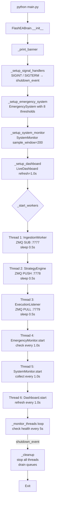
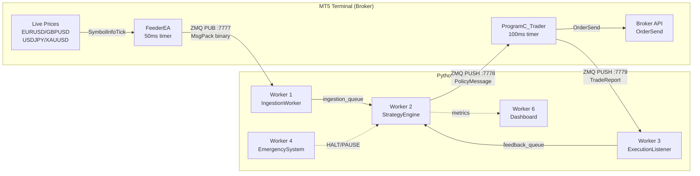
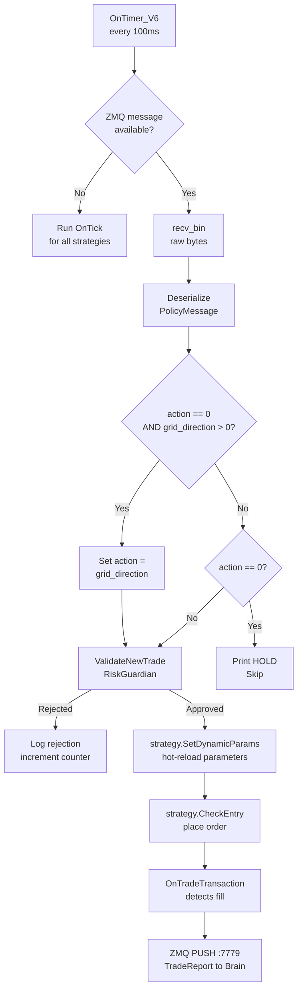
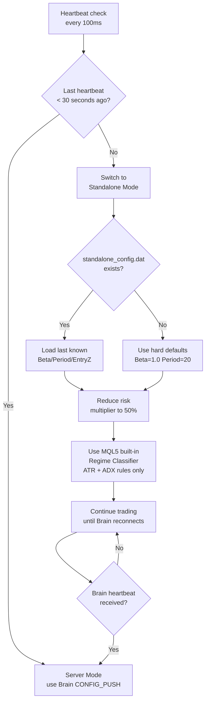

# SD01 — สถาปัตยกรรมระบบและการจัดวางองค์ประกอบ
## FlashEASuite V2 | คู่มือเทคนิคเชิงลึกฉบับสมบูรณ์
### จัดทำ: 2026-03-02 | Phase P9-5 | Jimmi Deep-Dive Edition

---

## 1. ข้อมูลเบื้องต้นของระบบ

| ฟิลด์ | ค่า | คำอธิบาย |
|-------|-----|----------|
| **ชื่อระบบ** | FlashEASuite V2 | ระบบซื้อขายอัลกอริทึมหลายกลยุทธ์ — สถาปัตยกรรมรุ่น 6 (V6) |
| **เวอร์ชันสถาปัตยกรรม** | V6 | ออกแบบใหม่ทั้งหมดจาก V5; แยกระบบปัญญา (Python) ออกจากการดำเนินการ (MQL5) |
| **คำขวัญ** | "Smart Server, Powerful Client" | Server ทำงานหนักทั้งหมด; Client ดำเนินการแบบ real-time ทั้งหมด |
| **จำนวนองค์ประกอบ** | 3 หลัก + 6 ระบบย่อย | FeederEA, Brain (6 workers), ProgramC_Trader |
| **โปรโตคอลสื่อสาร** | ZMQ + MessagePack | Binary, ความหน่วงต่ำ, ส่งข้อความแบบ guaranteed-delivery |
| **Ports** | 7777, 7778, 7779 | ข้อมูลขาเข้า, นโยบายขาออก, Feedback ขาเข้า |
| **กลยุทธ์** | 16 (S01–S16) | ครอบคลุมประเภท HYBRID และ FULL_MQL5 |
| **Money Managers** | 19 (MM01–MM19) | เลือกได้แบบ dynamic ต่อกลยุทธ์ต่อ regime |
| **Regimes ที่รองรับ** | 5 | UNKNOWN, TRENDING, RANGING, VOLATILE, SQUEEZE |
| **ผู้เขียน** | Dr. Suksaeng Kukanok | หัวหน้านักออกแบบระบบและนักพัฒนาเชิงปริมาณ |
| **เวอร์ชัน** | 2.1.0 | Phase 0-3: Emergency Safety + Live Dashboard |

---

### 1.1 สรุปผู้บริหาร

FlashEASuite V2 คือ **ระบบซื้อขายอัลกอริทึมแบบ hybrid สามองค์ประกอบ** ที่ถือกำเนิดจากคำถามพื้นฐานข้อหนึ่ง: *ทำไมระบบซื้อขายที่ดีที่สุดถึงต้องเลือกระหว่างความฉลาดกับความเร็ว?*

แพลตฟอร์ม Python มีห้องสมุดสำหรับงาน Machine Learning ครบครัน ไม่ว่าจะเป็น numpy, scikit-learn, statsmodels หรือ hmmlearn แต่มันช้าเกินไปสำหรับการส่ง order ด้วยความหน่วงระดับ millisecond ในทางกลับกัน MQL5 Expert Advisor เข้าถึง MT5 API ได้โดยตรงและตอบสนองต่อ tick อย่างฉับพลัน แต่ไม่มีทางรัน Random Forest classifiers, cointegration tests หรือ Hidden Markov Models ได้ในระดับ production

V6 ตัดสินใจไม่เลือกฝ่ายใด — แต่ **มอบงานแต่ละชิ้นให้กับแพลตฟอร์มที่เหมาะสมที่สุด**:

- **Python Brain (The Server)**: วิเคราะห์สถิติ, จัดประเภท market regime, ให้คะแนนกลยุทธ์ทั้ง 16 ตัว, เพิ่มประสิทธิภาพความเสี่ยง และเรียนรู้จาก feedback อย่างต่อเนื่อง
- **MQL5 Trader (The Client)**: คำนวณสัญญาณ tick-by-tick, วางคำสั่งซื้อขาย, บังคับใช้กฎความเสี่ยง และจัดการ positions แบบ real-time
- **FeederEA (The Bridge)**: แปลกระแส tick ภายใน MT5 ให้เป็นข้อมูล binary ที่ Python Brain สามารถอ่านได้ผ่าน ZeroMQ

ทั้งสามองค์ประกอบสื่อสารกันผ่าน **ZeroMQ บน localhost** ด้วยความหน่วงต่ำกว่า 1 millisecond — เร็วพอที่ Trader จะรับ policy ที่เพิ่งถูก optimize ใหม่จาก Brain, นำไปใช้ และวางคำสั่ง ทั้งหมดก่อนที่ broker จะประมวลผลคำสั่งเสร็จด้วยซ้ำ

---

### 1.2 แนวคิด: ทำไมถึงใช้ "Smart Server, Powerful Client"?

#### ข้อจำกัดของแนวทาง Single-EA แบบดั้งเดิม

ในการพัฒนา MQL5 ทั่วไป ตรรกะทุกอย่าง ไม่ว่าจะเป็นการสร้างสัญญาณ, การจัดการความเสี่ยง หรือการเพิ่มประสิทธิภาพ จะอยู่รวมกันในไฟล์ `.mq5` เดียวที่รันภายใน MT5 terminal แนวทางนี้สะดวกแต่ซ่อนเพดานขีดจำกัดพื้นฐานสามประการ:

**เพดานที่ 1 — การคำนวณ:** MQL5 ไม่มี numpy, scipy, pandas หรือ scikit-learn การทดสอบ cointegration (Engle-Granger), Hidden Markov Models และ Random Forest classifiers นั้น "เป็นไปไม่ได้จริงๆ" หรือต้องใช้โค้ดหลายพันบรรทัดเพื่อ implement จากศูนย์โดยไม่มีการทดสอบอย่างพอเพียง

**เพดานที่ 2 — การเพิ่มประสิทธิภาพ:** EA ที่รันอยู่ไม่สามารถ backtest parameters ของตัวเองแบบ real-time ได้ ไม่สามารถเปรียบเทียบชุด parameters ปัจจุบันกับทางเลือก 500 ชุดและสลับไปใช้ชุดที่ดีที่สุดขณะที่ positions กำลังเปิดอยู่

**เพดานที่ 3 — การเรียนรู้:** MQL5 ไม่มีกลไกในตัวสำหรับให้กลยุทธ์ "จดจำ" ได้ว่าตัวเองแพ้ 3 trade ติดต่อกันในวันอังคารช่วง VOLATILE regime แล้วลด lot size ตามนั้นในรอบถัดไป

#### โซลูชัน: สถาปัตยกรรม Hybrid

V6 ทลายโมเดลกระบวนการเดียวออกเป็น **สถาปัตยกรรม client-server ผ่าน localhost ZMQ**:

```
[Python Brain]  ←→  ZMQ localhost  ←→  [MQL5 Trader]
Heavy compute                            Fast execution
Learns over time                         Zero-latency orders
Optimizes parameters                     Direct broker API
Classifies regime                        Manages positions
```

ข้อคิดสำคัญคือ **ความหน่วงในการส่ง parameter ผ่าน localhost ZMQ นั้นต่ำกว่า 1 millisecond** ซึ่งเล็กน้อยมากเมื่อเทียบกับความหน่วงในการประมวลผลคำสั่งของ broker (10–100ms) หมายความว่า Trader สามารถรับ CONFIG_PUSH ที่เพิ่งถูก optimize ใหม่จาก Brain, นำไปใช้ และวางคำสั่ง ทั้งหมดเร็วกว่าที่ broker จะประมวลผลคำสั่งนั้นเสียอีก

---

### 1.3 โมเดลสามกระบวนการ

```
┌─────────────────────────────────────────────────────────────────────────┐
│                     FlashEASuite V2 — Process Map                       │
├────────────────┬──────────────────────────┬───────────────────────────  │
│  PROCESS A     │  PROCESS B               │  PROCESS C                  │
│  FeederEA.mq5  │  main.py (The Brain)     │  ProgramC_Trader.mq5        │
│                │                          │                             │
│  Platform:     │  Platform:               │  Platform:                  │
│  MT5 Terminal  │  Python 3.10+            │  MT5 Terminal               │
│  (MQL5 EA)     │  (Console App)           │  (MQL5 EA)                  │
│                │                          │                             │
│  บทบาท:        │  บทบาท:                  │  บทบาท:                     │
│  Market Data   │  Intelligence Engine     │  Trade Executor             │
│  Publisher     │  + Optimizer             │  + Position Manager         │
│                │                          │                             │
│  Timer: 50ms   │  Threads: 6 workers      │  Timer: 100ms               │
│  (20 Hz)       │  (async, daemon)         │  (10 Hz)                    │
│                │                          │                             │
│  ZMQ: PUB      │  ZMQ: SUB(7777)          │  ZMQ: PULL(7778)            │
│  Port: 7777    │       PUSH(7778)         │       PUSH(7779)            │
│                │       PULL(7779)         │                             │
└────────────────┴──────────────────────────┴─────────────────────────────┘
```

> **สรุปแนวคิด — โมเดลสามกระบวนการ**
>
> FlashEASuite V2 แยก "สมอง" (Python) ออกจาก "กล้ามเนื้อ" (MQL5) โดยใช้ ZMQ เป็นเส้นประสาทเชื่อมต่อ แต่ละกระบวนการทำงานได้อย่างอิสระและล้มเหลวได้โดยไม่ทำให้กระบวนการอื่นหยุดทำงาน หาก Brain หยุดทำงาน Trader จะสลับไปใช้ Standalone Mode โดยอัตโนมัติ

---

## 2. สถาปัตยกรรมการสื่อสาร ZMQ

### 2.1 แนวคิดการออกแบบ Port

Port ทั้งสามสร้าง **pipeline ข้อมูลแบบทิศทางเดียว** พร้อม feedback loop:

| Port | ทิศทาง | ZMQ Pattern | บทบาท |
|------|--------|------------|-------|
| **7777** | FeederEA → Brain | PUB → SUB | กระแสข้อมูลตลาดดิบ |
| **7778** | Brain → Trader | PUSH → PULL | คำสั่ง policy กลยุทธ์ |
| **7779** | Trader → Brain | PUSH → PULL | Feedback ผลการดำเนินการซื้อขาย |

ทำไมต้องใช้สาม port แยกกันแทนที่จะใช้ port เดียว? เพราะช่องทางการสื่อสารแต่ละช่องมีข้อกำหนดที่ต่างกันอย่างสิ้นเชิง:

**Port 7777 (PUB-SUB)** เหมาะกับ tick data เป็นอย่างยิ่ง เพราะ Feeder เผยแพร่ข้อมูลโดยไม่สนใจว่ามี subscriber รับฟังอยู่หรือเปล่า Pattern นี้ยังช่วยให้ Brain หลายอินสแตนซ์ subscribe พร้อมกันได้ (multi-tenant) และ Feeder ไม่ต้องบล็อกรอการยืนยัน การสูญเสีย tick บางตัวนั้นยอมรับได้ — tick ที่พลาดไปหมายความว่า Brain ทำงานจากข้อมูลเก่าไปสักเสี้ยววินาที ไม่ใช่ระบบล้มเหลว

**Port 7778 (PUSH-PULL)** เลือกใช้เพราะ CONFIG_PUSH ทุกชุด *ต้องถึง* Trader แน่นอน ต่างจาก PUB-SUB PUSH-PULL ให้ **guaranteed delivery** — ข้อความจะเข้าคิวใน ZMQ internal buffer หาก Trader ยุ่งชั่วคราว สิ่งนี้สำคัญมาก เพราะการพลาด CONFIG_PUSH หมายถึง Trader อาจทำงานด้วย parameters ที่ล้าสมัย

**Port 7779 (PUSH-PULL)** ใช้ pattern เดียวกับ 7778 ด้วยเหตุผลเดียวกัน — ผลการซื้อขายทุกรายการต้องถึง Brain เพื่อ feedback loop การพลาดรายงาน trade หมายความว่า PerformanceTracker จะคำนวณ win rate ที่ผิดเพี้ยน และ confidence scores ของกลยุทธ์ในอนาคตจะไม่น่าเชื่อถือ

### 2.2 ภาพรวมการไหลของข้อมูล

```
                  ┌─────────────────────────────────────────┐
                  │         MT5 Terminal (Broker)            │
                  │  ราคาสด EURUSD, GBPUSD,                  │
                  │  USDJPY, XAUUSD (มี suffix .tp)          │
                  └────────────────┬────────────────────────┘
                                   │ SymbolInfoTick() ทุก 50ms
                                   ▼
                  ┌─────────────────────────────────────────┐
                  │           FeederEA.mq5                   │
                  │  OnTimer() ทุก interval 50ms             │
                  │  ตรวจจับ tick ใหม่ผ่าน time_msc delta   │
                  │  Pack: [type=1, seq, ts, sym, bid, ask]  │
                  │  ส่งผ่าน ZMQ PUB socket                  │
                  └────────────────┬────────────────────────┘
                                   │ ZMQ PUB → Port 7777
                                   ▼
                  ┌─────────────────────────────────────────┐
                  │    Brain: IngestionWorker (Thread 1)     │
                  │  ZMQ SUB → ingestion_queue              │
                  └────────────────┬────────────────────────┘
                                   │ Python queue.Queue
                                   ▼
                  ┌─────────────────────────────────────────┐
                  │   Brain: StrategyEngine (Thread 2)       │
                  │  Dequeue ticks → Regime Classification  │
                  │  → 16-Strategy Matrix Scan               │
                  │  → Confidence Scoring                    │
                  │  → AI Council Decision                   │
                  │  → CONFIG_PUSH (type=10) generation      │
                  └────────────────┬────────────────────────┘
                                   │ ZMQ PUSH → Port 7778
                                   ▼
                  ┌─────────────────────────────────────────┐
                  │        ProgramC_Trader.mq5               │
                  │  OnTimer() 100ms → polls ZMQ PULL        │
                  │  Parse PolicyMessage struct             │
                  │  Route to strategy handler              │
                  │  → Risk validation (RiskGuardian)        │
                  │  → Order placement via MT5 API           │
                  └────────────────┬────────────────────────┘
                                   │ ZMQ PUSH → Port 7779
                                   ▼
                  ┌─────────────────────────────────────────┐
                  │  Brain: ExecutionListener (Thread 3)     │
                  │  ZMQ PULL → feedback_queue              │
                  │  อัปเดต PerformanceTracker              │
                  │  ป้อนกลับเข้า AI Council               │
                  └─────────────────────────────────────────┘
```

> **สรุปแนวคิด — การไหลของข้อมูล ZMQ**
>
> ข้อมูลไหลทางเดียว: ตลาด → Feeder → Brain → Trader → Broker โดย Feedback วนกลับจาก Trader ไปยัง Brain ผ่าน port 7779 ทำให้ระบบสามารถเรียนรู้และปรับตัวได้ตามผลการซื้อขายจริง

---

## 3. องค์ประกอบ A — FeederEA.mq5

### 3.1 วัตถุประสงค์และหลักการ

ลองนึกถึงปัญหา: Python Brain ต้องการข้อมูล tick แบบ real-time เพื่อวิเคราะห์ตลาด แต่ Python ไม่สามารถเรียก `SymbolInfoTick()` ได้โดยตรง มันอยู่นอกอาณาเขตของ MT5

FeederEA เกิดขึ้นเพื่อแก้ปัญหานี้โดยเฉพาะ มันทำหน้าที่เป็น **สะพาน data** ระหว่างโลกสองใบ: รันใน MT5 (ที่มีข้อมูล tick อยู่) และส่งออกไปยัง Python (ที่มีพลังการคำนวณ) ผ่าน ZMQ บน localhost ความรับผิดชอบของมันมีอยู่อย่างเดียวคือ **แปลกระแส tick ให้เป็น binary frame แล้วส่งออก** — ไม่มีตรรกะการซื้อขาย ไม่มีการสร้างสัญญาณ ไม่มีการจัดการคำสั่งใดทั้งสิ้น

### 3.2 ลำดับการเริ่มต้น (Initialization Sequence)

```mql5
// File: 01_Feeder/Src/FeederEA.mq5

int OnInit() {
    // ขั้นตอนที่ 1: สร้าง ZMQ Context
    g_Context.initialize();

    // ขั้นตอนที่ 2: สร้าง PUB socket
    g_Socket.initialize(g_Context, ZMQ_PUB);

    // ขั้นตอนที่ 3: เชื่อมต่อกับ port 7777
    g_Socket.connect("tcp://127.0.0.1:7777");

    // ขั้นตอนที่ 4: ตั้งค่า socket
    g_Socket.setLinger(0);                    // ปิดทันทีเมื่อ shutdown
    g_Socket.setSendHighWaterMark(100000);    // Buffer 100,000 messages

    // ขั้นตอนที่ 5: เริ่มต้น timestamp ของ tick แต่ละ symbol
    ArrayResize(g_LastTickTime, 4);
    ArrayInitialize(g_LastTickTime, 0);

    // ขั้นตอนที่ 6: เริ่ม timer polling 50ms
    EventSetMillisecondTimer(50);             // 20 Hz = ตรวจสอบ 20 ครั้งต่อวินาที

    return INIT_SUCCEEDED;
}
```

**ค่าการตั้งค่าสำคัญที่ควรทำความเข้าใจ:**

- `InpZmqConnStr = "tcp://127.0.0.1:7777"` — localhost เท่านั้น ข้อมูลตลาดไม่ออกนอกเครื่อง
- `InpTimerMs = 50` → polling rate 20 Hz
- `setSendHighWaterMark(100000)` — สำรอง buffer ไว้ถึง 100,000 messages เพื่อรองรับ Brain ที่เพิ่งเริ่มต้นหรือช้าชั่วคราวโดยไม่สูญเสียข้อมูล
- `setLinger(0)` — ปิด socket ทันทีเมื่อ `OnDeinit()` ทำงาน ป้องกัน EA ค้างระหว่าง MT5 shutdown

### 3.3 OnTimer() — การตรวจจับ Tick และการเผยแพร่

```mql5
// เรียกทุก 50ms (20 ครั้งต่อวินาที)
void OnTimer() {
    MqlTick tick;

    for(int i = 0; i < 4; i++) {             // วนลูปทั้ง 4 symbols
        // Query tick ปัจจุบัน
        if(!SymbolInfoTick(g_StandardSymbols[i], tick)) continue;

        // ข้ามถ้าไม่ใช่ tick ใหม่ (ขจัดซ้ำโดยใช้ timestamp)
        if(tick.time_msc <= g_LastTickTime[i]) continue;
        g_LastTickTime[i] = tick.time_msc;
        g_SequenceID++;

        // Pack MessagePack array 7 elements
        g_MsgPack.Reset();
        g_MsgPack.PackArray(7);
        g_MsgPack.PackInt(1);                 // [0] msg_type = MSG_TICK_DATA
        g_MsgPack.PackInt(g_SequenceID);      // [1] ตัวนับ sequence ทั่วโลก
        g_MsgPack.PackInt(tick.time_msc);     // [2] tick timestamp (ms)
        g_MsgPack.PackString(symbol);         // [3] เช่น "EURUSD.tp"
        g_MsgPack.PackDouble(tick.bid);       // [4] ราคา bid
        g_MsgPack.PackDouble(tick.ask);       // [5] ราคา ask
        g_MsgPack.PackInt(tick.flags);        // [6] tick flags (bid/ask/last)

        // ส่ง binary payload ผ่าน ZMQ PUB
        g_Socket.send_bin(data, true);        // การส่งแบบ non-blocking
    }
}
```

**ตรรกะการขจัดซ้ำของ Tick:** เนื่องจาก `OnTimer()` ทำงาน 20 ครั้งต่อวินาที แต่ broker อาจสร้าง tick น้อยกว่านั้นมาก `g_LastTickTime[i]` จึงทำหน้าที่เป็น "ลายนิ้วมือ" ของ tick ล่าสุด — เฉพาะเมื่อ `tick.time_msc > g_LastTickTime[i]` เท่านั้น Feeder จึงจะเผยแพร่ ทำให้มั่นใจว่า tick เดียวกันไม่ถูกส่งซ้ำสองครั้ง

### 3.4 การจัดการ Symbol Suffix

```mql5
// การตั้งค่า suffix เฉพาะ broker
string g_StandardSymbols[] = { "EURUSD.tp", "GBPUSD.tp", "USDJPY.tp", "XAUUSD.tp" };
```

Broker TP Trades Group ใช้ suffix `.tp` Brain รับชื่อ symbol รวม suffix (เช่น `"EURUSD.tp"`) แล้วตัดออกก่อนประมวลผล ส่วน Trader จะเพิ่ม suffix กลับคืนเมื่อวางคำสั่ง กระบวนการสามขั้นตอนนี้ (เพิ่ม suffix → ตัด → เพิ่มกลับ) ทำให้แน่ใจว่า symbol ตรงกับชื่อ instrument ของ broker เสมอทั้งสำหรับ `SymbolInfoTick()` และ `OrderSend()`

### 3.5 การวิเคราะห์ Throughput ข้อมูล FeederEA

| ตัวชี้วัด | ค่า | หมายเหตุ |
|----------|-----|---------|
| **อัตรา polling** | 20 Hz (50ms) | ต่อ symbol ต่อ timer tick |
| **Symbols ที่ติดตาม** | 4 | EURUSD, GBPUSD, USDJPY, XAUUSD |
| **อัตรา publish สูงสุด** | ~80 messages/sec | ทฤษฎีสูงสุด (4 × 20 Hz) |
| **อัตรา publish ปกติ** | 10–40 messages/sec | ขึ้นอยู่กับกิจกรรมตลาด |
| **ขนาด message** | ~60–80 bytes | MessagePack array 7 elements |
| **Bandwidth สูงสุด** | ~6,400 bytes/sec (~6 KB/s) | ต่ำกว่า capacity ของ localhost มาก |
| **ZMQ buffer** | 100,000 messages | ข้อมูล ~60–80 วินาทีที่อัตราสูงสุด |

> **สรุปแนวคิด — FeederEA**
>
> FeederEA เป็น "สะพาน" เชื่อมโลก MT5 กับ Python มีหน้าที่เดียวแต่สำคัญ คือแปลง tick stream ให้เป็น binary ที่ส่งผ่าน ZMQ การออกแบบ PUB socket ช่วยให้ส่งข้อมูลได้อย่างต่อเนื่องโดยไม่บล็อก และ buffer 100,000 messages ทำให้ข้อมูลไม่สูญหายแม้ Brain ยังไม่พร้อม

---

## 4. องค์ประกอบ B — main.py (The Brain)

### 4.1 วัตถุประสงค์และหลักการ

ถ้า FeederEA คือหูที่รับฟังตลาด Brain ก็คือ **สมองที่คิดวิเคราะห์** มันเป็นแอปพลิเคชัน Python แบบ multi-threaded (class `FlashEABrain`) ที่ทำงานสี่สิ่งพร้อมกัน:

1. บริโภคข้อมูล tick สดจาก Feeder อย่างต่อเนื่อง
2. จัดประเภท market regime ปัจจุบันด้วย 3-layer classifier (Rules → Random Forest → HMM)
3. ให้คะแนนกลยุทธ์ทั้ง 16 ตัวเทียบกับสภาวะตลาดปัจจุบัน แล้วเลือกที่เหมาะสมที่สุด
4. Push configuration policies ไปยัง Trader และเรียนรู้จากผลการซื้อขายที่ได้รับกลับมา

**ทำไมต้องใช้ Python แทน MQL5 EA ตัวที่สอง?** Python ให้การเข้าถึง scientific computing stack เต็มรูปแบบ: `numpy` สำหรับ matrix operations, `pandas` สำหรับการวิเคราะห์ time-series, `statsmodels` สำหรับการทดสอบ cointegration, `scikit-learn` สำหรับ Random Forest regime classification และ `hmmlearn` สำหรับ Hidden Markov Models ไลบรารีเหล่านี้ผ่านการทดสอบในระดับ production มาแล้ว และการ implement ใหม่ใน MQL5 จะต้องใช้โค้ดหลายพันบรรทัดโดยไม่มีการทดสอบรองรับ

### 4.2 สถาปัตยกรรม Brain — โมเดล 6-Worker Thread

```python
class FlashEABrain:
    def __init__(self):
        self.shutdown_event  = threading.Event()  # สัญญาณหยุดทั่วโลก
        self.ingestion_queue = queue.Queue()       # Ticks: Feeder → Strategy
        self.signal_queue    = queue.Queue()       # Signals: Strategy → (ไม่ใช้)
        self.feedback_queue  = queue.Queue()       # Results: Trader → Strategy
        self.threads         = []                  # Registry thread ที่ใช้งาน
        self.emergency       = EmergencySystem     # ระบบความปลอดภัย 8 เงื่อนไข
        self.monitor         = SystemMonitor       # ติดตาม CPU/Memory/Latency
        self.dashboard       = LiveDashboard       # UI terminal แบบ real-time
```

**โครงร่าง Thread:**

```
              ┌─────────────────────────────┐
              │       FlashEABrain           │
              │                              │
 [ZMQ:7777] ──► │ Thread 1: IngestionWorker   │
              │   ↓ ingestion_queue          │
              │ Thread 2: StrategyEngine    │ ──► [ZMQ:7778]
              │   ↓ feedback_queue           │
              │ Thread 3: ExecutionListener  │ ◄── [ZMQ:7779]
              │                              │
              │ Thread 4: EmergencyMonitor   │ (interval 1s)
              │ Thread 5: SystemMonitor      │ (interval 1s)
              │ Thread 6: LiveDashboard      │ (interval 1s)
              │                              │
              │ Main thread: thread health   │ (interval 5s)
              └─────────────────────────────┘
```

### 4.3 Worker 1 — IngestionWorker

**ไฟล์:** `02_Brain/core/ingestion.py`

**บทบาท:** ZMQ SUB socket subscriber บน port 7777 Deserialize incoming MessagePack binary frames ให้เป็น Python dicts และใส่เข้า `ingestion_queue`

**โปรโตคอล:**
```python
# Layout ของ binary frame ที่เข้ามา (จาก FeederEA):
# [type, seq_id, timestamp_ms, symbol, bid, ask, flags]
# Index: 0    1         2         3      4    5     6

msg = msgpack.unpackb(frame)
tick = {
    "type":      msg[0],        # int: 1 = MSG_TICK_DATA
    "seq":       msg[1],        # int: sequence ID ทั่วโลก
    "ts_ms":     msg[2],        # int: millisecond timestamp
    "symbol":    msg[3],        # str: "EURUSD.tp"
    "bid":       msg[4],        # float: ราคา bid
    "ask":       msg[5],        # float: ราคา ask
    "flags":     msg[6],        # int: tick flags
}
ingestion_queue.put(tick)
```

**พฤติกรรมเมื่อ Brain เริ่มต้น:** ZMQ PUB-SUB มีปัญหา "slow joiner" ที่รู้จักกัน — messages ที่ส่งทันทีหลัง SUB socket เชื่อมต่ออาจถูกทิ้งก่อนที่ handshake จะเสร็จ การหน่วง `time.sleep(0.5)` ระหว่างการเริ่มต้น workers (ใน `_start_workers()`) ให้เวลา SUB socket ทำ connection handshake ให้เสร็จก่อนที่ tick แรกของ Feeder จะมาถึง

### 4.4 Worker 2 — StrategyEngine

**ไฟล์:** `02_Brain/core/strategy/engine.py`

**บทบาท:** Thread ความฉลาดหลักของระบบ Dequeue ticks จาก `ingestion_queue`, รัน analysis pipeline, และส่ง CONFIG_PUSH messages ไปยัง Trader ผ่าน ZMQ PUSH บน port 7778

**Pipeline ภายในต่อ tick batch:**

```
ingestion_queue.get() ─► รวม Tick
                              ↓
                     จัดประเภท Regime
                     (ATR/ADX rule + HMM fallback)
                              ↓
                     สแกน Matrix 16 กลยุทธ์
                     (ให้คะแนน confidence ต่อกลยุทธ์)
                              ↓
                     AI Council Arbitration
                     (โหวตแบบถ่วงน้ำหนัก → กลยุทธ์อันดับสูงสุด)
                              ↓
                     สร้าง PolicyMessage
                     (action, lot, entry, SL, TP)
                              ↓
                     Serialize ด้วย MessagePack
                              ↓
                     ZMQ PUSH → Port 7778 → Trader
```

**รูปแบบ array CONFIG_PUSH (Type 10):**
```python
# PolicyMessage pack เป็น array 11 elements
payload = msgpack.packb([
    10,                 # [0]  msg_type = MSG_CONFIG_PUSH
    timestamp_ms,       # [1]  unix timestamp (ms)
    symbol,             # [2]  "XAUUSD" (ไม่มี suffix — Brain ใช้ชื่อ base)
    strategy_id,        # [3]  เช่น "S15" หรือ "GRID"
    entry_price,        # [4]  ราคา entry ที่แนะนำ
    lot_size,           # [5]  ขนาด lot ที่คำนวณแล้ว
    max_orders,         # [6]  จำนวน grid levels พร้อมกันสูงสุด
    take_profit,        # [7]  ระดับ TP
    stop_loss,          # [8]  ระดับ SL
    confidence,         # [9]  0.0–1.0 composite confidence
    risk_multiplier,    # [10] 0.5–2.0 ตัวคูณความเสี่ยง
    grid_direction,     # [11] 0=NONE, 1=BUY, 2=SELL
])
```

### 4.5 Worker 3 — ExecutionListener

**ไฟล์:** `02_Brain/core/execution_listener.py`

**บทบาท:** ZMQ PULL socket บน port 7779 รับ `TRADE_REPORT` messages จาก Trader, deserialize และใส่เข้า `feedback_queue` สำหรับ feedback loop ของ StrategyEngine

**โครงสร้างข้อมูล Feedback (Type 20):**
```python
report = {
    "type":        20,           # MSG_TRADE_REPORT
    "symbol":      "XAUUSD.tp", # broker symbol (มี suffix)
    "strategy_id": "S15",       # กลยุทธ์ที่วาง trade
    "magic":       1015,        # magic number
    "order_type":  0,           # 0=BUY, 1=SELL
    "lots":        0.01,
    "open_price":  5385.84,
    "close_price": 5390.20,
    "profit":      4.36,        # P&L เป็น USD
    "open_time_ms":  ...,
    "close_time_ms": ...,
}
feedback_queue.put(report)
```

StrategyEngine อ่านจาก `feedback_queue` และอัปเดต `PerformanceTracker` ซึ่งรักษา EMA-weighted win rates ต่อกลยุทธ์ต่อ regime ข้อมูลนี้ป้อนกลับสู่การถ่วงน้ำหนัก confidence ของ AI Council สร้างเป็น **ระบบการเรียนรู้แบบวงปิด** ที่กลยุทธ์ซึ่งผลงานดีในสภาวะตลาดปัจจุบันจะถูกเลือกบ่อยขึ้นโดยอัตโนมัติ

### 4.6 Workers 4–6 — ความปลอดภัย, Monitor, Dashboard

**Worker 4 — EmergencySystem** (`02_Brain/core/emergency_system.py`):
ตรวจสอบเงื่อนไข emergency 8 อย่างทุก 1 วินาที โดยเรียงตามความรุนแรง:
1. Max drawdown ≥ 20% → HALT (หยุดทั้งระบบ)
2. Daily loss ≥ 5% → HALT
3. Consecutive losses ≥ 5 → PAUSE (พัก 60 นาที)
4. Volatility spike ≥ 3× baseline → PAUSE
5. CPU utilization ≥ 90% → WARNING
6. Memory utilization ≥ 90% → WARNING
7. Correlation breakdown ≥ 0.80 threshold → WARNING
8. ZMQ connection timeout ≥ 30s → WARNING

**Worker 5 — SystemMonitor** (`02_Brain/core/system_monitor.py`):
สุ่มตัวอย่าง CPU, memory และ queue depths ทุก 1 วินาที รักษา rolling window ของ 200 ตัวอย่างสำหรับการคำนวณ latency percentile และป้อน metrics เข้า LiveDashboard

**Worker 6 — LiveDashboard** (`02_Brain/dashboard.py`):
Render UI terminal แบบ real-time (curses-based) refresh ทุก 1 วินาที แสดง: สถานะการเชื่อมต่อ, regime ปัจจุบัน, กลยุทธ์ที่ใช้งาน, สรุป equity curve, resource gauges และ alert log

### 4.7 ลำดับการเริ่มต้น Brain



> **สรุปแนวคิด — สถาปัตยกรรม Brain**
>
> Brain ใช้ 6 threads แยกกันตามหน้าที่ แต่ละ thread ทำงานอิสระและสื่อสารผ่าน Python queues เท่านั้น ไม่มี shared state โดยตรงระหว่าง threads ซึ่งทำให้ระบบปลอดภัยจาก race conditions และง่ายต่อการ debug อย่างมาก

---

## 5. องค์ประกอบ C — ProgramC_Trader.mq5

### 5.1 วัตถุประสงค์และหลักการ

ถ้า Brain คือนักวิเคราะห์ที่วางแผนการซื้อขาย ProgramC_Trader ก็คือ **เทรดเดอร์ที่กดปุ่มส่ง order จริง** มันรันใน MT5 เป็น Expert Advisor ที่มี broker API access เต็มรูปแบบ ซึ่ง Python ไม่สามารถมีได้โดยตรง ความรับผิดชอบของมันมี 7 ประการ:

1. Poll หา CONFIG_PUSH messages จาก Brain ทุก 100ms
2. Route แต่ละ policy ไปยัง strategy handler ที่ถูกต้อง
3. Validate trades ผ่าน RiskGuardian (4-check pipeline)
4. วางคำสั่งผ่าน `OrderSend()` ไปยัง broker
5. จัดการ open positions ต่างๆ (exits, trailing stops, grid levels)
6. รายงาน closed trades กลับไปยัง Brain ผ่าน port 7779
7. Fallback ไปยัง Standalone Mode เมื่อ Brain ไม่พร้อมใช้งาน

### 5.2 สถาปัตยกรรม Timer

```mql5
// เรียกทุก 100ms (10 Hz) — EventSetMillisecondTimer(100)
void OnTimer() {
    // Dispatch ตาม configuration mode
    if(g_use_v6_mode)
        OnTimer_V6();    // ตรรกะ V6 เต็มรูปแบบ (แนะนำ)
    else
        OnTimer_Legacy(); // เส้นทาง backward-compatible ของ V5
}
```

**ทำไมต้องใช้ 100ms แทน 50ms?** FeederEA poll ที่ 50ms เพื่อจับ tick ทั้งหมด แต่ Trader poll ที่ 100ms เพราะ CONFIG_PUSH messages มาในความถี่ที่ต่ำกว่ามาก โดยปกติครั้งละ 1–10 วินาทีต่อ symbol การ poll ที่ 10 Hz ลด CPU overhead ขณะที่ยังมั่นใจว่าการอัปเดต policy จะถูกนำไปใช้ภายใน 100ms ซึ่งเร็วพอสมควรเมื่อเทียบกับความหน่วงในการเติม order ของ broker (10–150ms)

### 5.3 OnTimer_V6() — Main Logic Loop

```mql5
void OnTimer_V6() {
    // Phase 1: Poll Brain หา CONFIG_PUSH messages ใหม่
    while(g_zmq_pull.has_message()) {
        uchar raw_data[];
        g_zmq_pull.recv_bin(raw_data);

        PolicyMessage policy;
        if(Serialization_Deserialize(raw_data, policy)) {
            ExecutePolicy(policy);
        }
    }

    // Phase 2: อัปเดต strategies ที่ใช้งานอยู่ทั้งหมด (tick logic)
    for(int i = 0; i < g_strategy_count; i++) {
        if(g_strategies[i].IsActive())
            g_strategies[i].OnTick();
    }

    // Phase 3: ตรวจสอบ standalone fallback timer
    // (ถ้าไม่มี CONFIG_PUSH นานกว่า 30s ให้สลับไปยัง standalone)
    CheckConnectionTimeout();
}
```

### 5.4 ExecutePolicy() — การ Route Policy

```mql5
void ExecutePolicy(PolicyMessage &policy) {
    // Fix: Grid policies มาพร้อม action=0 (HOLD) จาก serialization
    // ดึง direction จริงจาก field grid_direction
    if(policy.action == 0 && (policy.grid_direction == 1 || policy.grid_direction == 2))
        policy.action = policy.grid_direction;

    // ข้าม HOLD signals จริง
    if(policy.action == 0) {
        Print("Action is HOLD — skipping execution");
        return;
    }

    // Route ไปยัง strategy ที่ถูกต้องตาม policy.symbol + strategy type
    string base_symbol = StripSuffix(policy.symbol);  // "XAUUSD.tp" → "XAUUSD"

    // ค้นหา strategy handler ที่ตรงกัน
    CStrategyBase* strategy = FindStrategy(base_symbol);
    if(strategy == NULL) return;

    // ใช้ policy parameters (hot-reload — ไม่ต้อง restart)
    strategy.SetDynamicParams(policy);

    // Validate ผ่าน RiskGuardian
    double lot = policy.position_size;
    if(!g_risk_guardian.ValidateNewTrade(policy.symbol, policy.entry_price,
                                          policy.stop_loss, lot)) return;

    // Execute
    strategy.CheckEntry();
}
```

### 5.5 การรวม RiskGuardian

ทุก trade ต้องผ่าน `CRiskGuardian::ValidateNewTrade()` ก่อนวางคำสั่ง — ระบบไม่อนุญาตให้ข้ามขั้นตอนนี้ไม่ว่าในกรณีใด:

```
ValidateNewTrade()
├── การตรวจสอบที่ 1: ขีดจำกัดการสูญเสียรายวัน (CDailyLossLimit)
│   └── ปฏิเสธถ้า account equity ลดลง > 4% วันนี้
├── การตรวจสอบที่ 2: คำสั่งสูงสุด (CountOpenPositions)
│   └── นับ positions ที่ magic=999000 AND comment ขึ้นต้นด้วย "Grid_L"
│   └── ปฏิเสธถ้านับ ≥ m_max_orders (ค่าเริ่มต้น: 10)
├── การตรวจสอบที่ 3: การกำหนดขนาด lot
│   ├── Lot ที่ Brain ให้มา → ใช้โดยตรง (กลยุทธ์ Spike)
│   └── Lot=0 → คำนวณผ่าน CPositionSizingManager (กลยุทธ์ Grid)
└── การตรวจสอบที่ 4: ขีดจำกัด exposure (CalculateCurrentExposure)
    └── นับเฉพาะ positions ของ EA นี้ (magic=999000, comment "Grid_L*")
    └── ปฏิเสธถ้า exposure% > m_max_exposure_percent (ค่าเริ่มต้น: 15%)
```

**หมายเหตุ implement ที่สำคัญ:** ทั้ง `CountOpenPositions()` และ `CalculateCurrentExposure()` filter โดยใช้ **ทั้งสองเงื่อนไขพร้อมกัน** ได้แก่ `POSITION_MAGIC == 999000` และ `StringFind(comment, "Grid_L") == 0` filter คู่นี้ป้องกันการนับ test positions เก่า (เช่น comment `"TransferToGrid_DRAWDOWN"`) ที่ใช้ magic number เดียวกันแต่สร้างโดย standalone testing tools

> **สรุปแนวคิด — ProgramC_Trader**
>
> Trader เป็น "มือ" ของระบบที่ส่งคำสั่งจริงไปยัง broker ทุก trade ถูก validate ผ่าน 4 ชั้น RiskGuardian ก่อนเสมอ และ Trader สามารถทำงานในโหมด Standalone ได้เมื่อ Brain ไม่พร้อมใช้งาน

---

## 6. โปรโตคอลการสื่อสารเชิงลึก

### 6.1 MessagePack เทียบกับ JSON

FlashEASuite V2 เลือกใช้ **MessagePack** binary serialization สำหรับ ZMQ messages ทุกชุด ด้วยเหตุผลที่เป็นรูปธรรม:

| คุณสมบัติ | JSON | MessagePack |
|----------|------|-------------|
| Encoding | UTF-8 text | Binary |
| ขนาดสำหรับ tick ทั่วไป | ~120 bytes | ~45–55 bytes (เล็กกว่า 60%) |
| ความเร็วในการ parse | ช้า (string tokenizing) | เร็ว (อ่าน binary โดยตรง) |
| รองรับ binary โดยกำเนิด | ไม่ (ต้องใช้ Base64) | ใช่ |
| Human-readable | ใช่ | ไม่ |
| ไลบรารี MQL5 ที่ใช้ได้ | ต้องสร้างเอง | `MqlMsgPack.mqh` มีให้ |

ที่อัตรา 40 ticks/วินาทีอย่างต่อเนื่อง MessagePack ประหยัด bandwidth ได้ ~2.8 KB/s และลด CPU overhead ในการ parse ได้ ~40% เมื่อเทียบกับ JSON ตัวเลขเหล่านี้ดูเล็กน้อยในช่วงสั้น แต่สะสมเป็นนัยสำคัญในชั่วโมงการทำงานต่อเนื่อง

### 6.2 MSG_CONFIG_PUSH (Type 10) — แผนที่ฟิลด์เต็มรูปแบบ

คำสั่งหลักจาก Brain ไปยัง Trader:

```
PolicyMessage struct (MQL5) ←→ Python dict
─────────────────────────────────────────────────────────────────
Field              MQL5 Type    Python Type    คำอธิบาย
─────────────────────────────────────────────────────────────────
symbol             string       str            Symbol หลัก ("XAUUSD")
action             int          int            0=HOLD, 1=BUY, 2=SELL
confidence         double       float          0.0–1.0 composite score
entry_price        double       float          Entry ที่แนะนำ
stop_loss          double       float          ระดับราคา SL
take_profit        double       float          ระดับราคา TP
position_size      double       float          ขนาด Lot (0=คำนวณ)
timestamp_ms       long         int            Unix ms
model_version      string       str            สตริงเวอร์ชัน Brain
risk_multiplier    double       float          0.5–2.0 ตัวคูณความเสี่ยง
is_in_cooldown     bool         bool           True = Brain หยุดชั่วคราว
csm_usd/eur/...    double×8     float×8        matrix ความแข็งแกร่งของสกุลเงิน
grid_direction     int          int            0=NONE, 1=BUY, 2=SELL
─────────────────────────────────────────────────────────────────
```

### 6.3 MSG_TICK_DATA (Type 1) — Array Layout

```
Index  ฟิลด์          Type    ตัวอย่าง
─────────────────────────────────────────────
[0]    msg_type       int     1
[1]    sequence_id    int     15842
[2]    timestamp_ms   int     1740930412345
[3]    symbol         str     "EURUSD.tp"
[4]    bid            float   1.08342
[5]    ask            float   1.08345
[6]    flags          int     6  (TICK_FLAG_BID | TICK_FLAG_ASK)
─────────────────────────────────────────────
```

### 6.4 MSG_HEARTBEAT (Type 13) — Keep-Alive

```
Interval:  10 วินาที (Brain → Trader broadcast)
Timeout:   30 วินาที (Trader side)
Action:    ถ้าไม่มี heartbeat นาน 30s → Trader สลับไป Standalone Mode
Struct:    [type=13, timestamp_ms, source="SERVER", sequence, is_alive=true]
```

### 6.5 MSG_TRADE_REPORT (Type 20) — Feedback Loop Trigger

```
Source:  ProgramC_Trader.mq5
Target:  Brain ExecutionListener (port 7779)
Trigger: ทุก position close event (OnTradeTransaction callback)
Effect:  → Brain อัปเดต win rate ของ PerformanceTracker
         → StrategyEngine ปรับ confidence weights
         → CONFIG_PUSH ถัดไปสะท้อนการเรียนรู้ที่อัปเดต
```

> **สรุปแนวคิด — โปรโตคอล MessagePack**
>
> การใช้ MessagePack แทน JSON ลดขนาด message ได้ 60% และเพิ่มความเร็วในการ parse การออกแบบ array แบบมี index (แทน dict ที่มี key) ทำให้ serialize/deserialize เร็วขึ้นอีก แต่ต้องระวังความถูกต้องของลำดับ index เป็นพิเศษ เพราะไม่มี key ที่อ่านได้เป็น safety net

---

## 7. สถาปัตยกรรมเวลา

### 7.1 แผนที่เวลาทั่วทั้งระบบ

```
องค์ประกอบ          Timer/Interval    กลไก                  วัตถุประสงค์
──────────────────────────────────────────────────────────────────────
FeederEA            50ms             EventSetMillisecondTimer  Tick polling
ProgramC_Trader     100ms            EventSetMillisecondTimer  Policy polling
Brain: Ingestion    ต่อเนื่อง        ZMQ socket recv()         รับข้อมูล
Brain: Strategy     ~100–500ms       Queue-driven              วงจรการวิเคราะห์
Brain: Execution    ต่อเนื่อง        ZMQ socket recv()         รับผล
Brain: Emergency    1,000ms          threading.Timer           ตรวจสอบความปลอดภัย
Brain: Dashboard    1,000ms          threading.Timer           รีเฟรช UI
Brain: SysMonitor   1,000ms          threading.Timer           รวบรวม metrics
Brain: MainThread   5,000ms          time.sleep(5)             ตรวจสุขภาพ thread
Heartbeat           10,000ms         Brain ส่ง                 Keep-alive
Heartbeat timeout   30,000ms         Trader เฝ้าดู             Standalone trigger
```

### 7.2 งบประมาณความหน่วงแบบ End-to-End

จากเหตุการณ์ตลาดถึงการวางคำสั่ง:

```
1. Broker สร้าง tick                   t = 0ms
2. FeederEA OnTimer() ตรวจจับ tick     t = 0–50ms   (ความละเอียด timer)
3. FeederEA pack + ส่งผ่าน ZMQ         t = +1ms
4. Brain IngestionWorker รับ           t = +0.1ms   (localhost ZMQ)
5. Brain ใส่ tick เข้าคิว              t = +0.1ms
6. Brain StrategyEngine dequeue        t = +1–10ms  (ความเร็วดึง queue)
7. Brain รัน analysis pipeline         t = +10–100ms (regime + scoring)
8. Brain ส่ง CONFIG_PUSH ผ่าน ZMQ      t = +1ms
9. Trader OnTimer() รับ (100ms)        t = +0–100ms (ช่วง timer)
10. Trader parse + validate            t = +1ms
11. Trader เรียก OrderSend()           t = +1ms
12. Broker ประมวลผลคำสั่ง             t = +10–150ms (ความหน่วง broker)
──────────────────────────────────────────────────────────────────────
ขั้นต่ำ:  ~25ms   ปกติ: ~100–300ms   สูงสุด: ~500ms
```

**ข้อคิดสำคัญ:** ขั้นตอน 6–9 (Brain analysis + CONFIG_PUSH delivery) ครองงบประมาณความหน่วงส่วนใหญ่ และนี่คือสิ่งที่ตั้งใจไว้ FlashEASuite V2 เป็นระบบ **medium-frequency** (วินาที/นาทีต่อ trade) ไม่ใช่ระบบ high-frequency (microseconds) งบประมาณความหน่วงนี้เหมาะสมอย่างยิ่งสำหรับกลยุทธ์ Grid, Spike, Mean Reversion และกลยุทธ์อื่นๆ ในระบบ

---

## 8. Mermaid Flowcharts ทั่วทั้งระบบ

### 8.1 การไหลของข้อมูลระบบทั้งหมด



**คำอธิบาย:** ลูกศรทึบ = การไหลข้อมูลหลัก, ลูกศรประ = การควบคุม/metrics ระบบ ข้อมูลตลาดไหลซ้ายไปขวา feedback จาก trade ไหลขวาไปซ้าย

### 8.2 การประมวลผล CONFIG_PUSH ใน Trader



**คำอธิบาย:** การแก้ไข `action=0` เป็น `grid_direction` (กล่อง F→G) คือ bug fix สำคัญที่ป้องกัน Grid policies ทั้งหมดถูกเพิกเฉยในฐานะ HOLD signals

### 8.3 Standalone Mode Fallback



**คำอธิบาย:** เมื่อ Brain หายไปนาน 30 วินาที Trader ไม่หยุดทำงาน แต่สลับไปใช้ MQL5 classifier แบบง่ายพร้อมลดความเสี่ยงลง 50% ทันทีที่ Brain กลับมา ระบบจะกลับสู่ Server Mode โดยอัตโนมัติ ไม่ต้อง restart

---

## 9. อ้างอิงไฟล์

| ไฟล์ | องค์ประกอบ | บทบาท |
|-----|-----------|------|
| `01_Feeder/Src/FeederEA.mq5` | Feeder | ผู้เผยแพร่ข้อมูลตลาด — ZMQ PUB port 7777 |
| `02_Brain/main.py` | Brain | Orchestrator หลัก — โมเดล 6-worker thread |
| `02_Brain/core/ingestion.py` | Brain W1 | ZMQ SUB intake → ingestion_queue |
| `02_Brain/core/strategy/engine.py` | Brain W2 | Strategy scoring + CONFIG_PUSH generation |
| `02_Brain/core/execution_listener.py` | Brain W3 | ZMQ PULL feedback → feedback_queue |
| `02_Brain/core/emergency_system.py` | Brain W4 | ระบบหยุด safety 8 เงื่อนไข |
| `02_Brain/core/system_monitor.py` | Brain W5 | metrics CPU/memory/latency |
| `02_Brain/dashboard.py` | Brain W6 | UI terminal แสดงผล real-time |
| `03_Trader/ProgramC_Trader.mq5` | Trader | EA หลัก — dispatch policy + วาง order |
| `Include/Network/Protocol/Definitions.mqh` | Shared | enums type message ทั้งหมด + structs (V5 + V6) |
| `Include/Network/Serialization.mqh` | Trader | MessagePack deserializer (PolicyMessage) |
| `Include/Risk/RiskGuardian.mqh` | Trader | Trade validation — 4-check risk pipeline |
| `Include/Logic/StrategyConstants.mqh` | Trader | Strategy enum, magic numbers, regime table |
| `Include/Logic/Grid/GridCore.mqh` | Trader | Grid order placement — comment "Grid_L{N}" |
| `Include/Logic/Grid/GridConfig.mqh` | Trader | Grid configuration — m_name = "ElasticGrid" |

---

## 10. สรุปโหมดการทำงาน

| โหมด | Trigger | Brain ที่ใช้ | แหล่ง Regime | ระดับความเสี่ยง |
|-----|--------|------------|-------------|----------------|
| **Server Mode** | Brain เชื่อมต่อ, heartbeat OK | ใช่ — full pipeline | Python HMM + RF | ความเสี่ยงตาม config เต็มรูปแบบ |
| **Standalone Mode** | ไม่มี heartbeat > 30s | ไม่ — config ล่าสุด | MQL5 ATR + ADX rules | 50% ของความเสี่ยงตาม config |
| **Emergency PAUSE** | Daily loss ≥ 5%, losses 5+ | Brain monitor, block sends | N/A | 0% (ไม่มี trade ใหม่) |
| **Emergency HALT** | Drawdown ≥ 20% | Brain block ทุก send | N/A | 0% (ปิด positions) |

---

## 11. การวิจารณ์และ Trade-offs สถาปัตยกรรมที่ทราบ

### 11.1 Single-Point-of-Failure: Python Brain

ถ้า Python process crash Trader จะเข้า Standalone Mode โดยอัตโนมัติผ่าน heartbeat timeout อย่างไรก็ตาม Standalone Mode ใช้ parameters แบบ static จาก `standalone_config.dat` และ regime classifier แบบง่าย — ประสิทธิภาพจะด้อยลงเมื่อเทียบกับการทำงานแบบ full Brain

**การบรรเทา:** Brain รวม auto-restart capability ผ่าน OS process manager (เช่น `pm2`, `supervisor` หรือ Windows Task Scheduler ที่มี restart-on-failure) การตั้งค่า `setLinger(0)` + `HighWaterMark(100000)` บน Feeder ทำให้มั่นใจว่าไม่มีข้อมูลสูญหายระหว่าง Brain restarts ชั่วคราว

### 11.2 ความซับซ้อนของ Symbol Suffix Transform

suffix `.tp` ต้องการการแปลงสามขั้นตอน: Feeder เผยแพร่ `"EURUSD.tp"` → Brain ตัดเหลือ `"EURUSD"` → Trader เพิ่มกลับเป็น `"EURUSD.tp"` สำหรับ OrderSend การแปลงแต่ละขั้นเป็นจุดที่อาจเกิดความไม่ตรงกันได้หาก configure ผิด

**การบรรเทา:** `engine.py` ของ Brain ตัด suffix ผ่าน `base = symbol.split('.')[0]` Trader เพิ่มกลับผ่าน input parameter `g_symbol_suffix` ทั้งสองตั้งค่าได้ง่าย — การเปลี่ยน broker ต้องอัปเดตเพียงค่าทั้งสองนี้เท่านั้น

### 11.3 Queue Backpressure

ภายใต้สภาวะสุดโต่ง (CPU spike, market event) `ingestion_queue` สามารถสะสม ticks เร็วกว่าที่ StrategyEngine ประมวลผลได้ เมื่อ queue depth > 100 Brain จะ log คำเตือน ยังไม่มีกลไกปัจจุบันสำหรับทิ้ง stale ticks ใน queue

**การแก้ไขที่แนะนำ:** เพิ่ม parameter `maxsize` ใน `ingestion_queue = queue.Queue(maxsize=500)` และใช้ `put_nowait()` พร้อม exception handling เพื่อทิ้ง tick ที่เก่าที่สุดเมื่อเต็ม

### 11.4 เวลา: Trader ที่ 10 Hz เทียบกับ Feeder ที่ 20 Hz

Trader poll หา CONFIG_PUSH ที่ interval 100ms หาก Brain ส่ง CONFIG_PUSH สองข้อความอย่างรวดเร็วภายใน window 100ms เดียวกัน Trader จะประมวลผลตามลำดับใน timer tick ถัดไป — อาจใช้ policy เก่าก่อนอันใหม่

**การบรรเทา:** loop `while(g_zmq_pull.has_message())` ภายใน `OnTimer_V6()` ดึง messages ทั้งหมดที่มีอยู่ต่อ timer tick ทำให้มั่นใจว่าไม่มี CONFIG_PUSH เหลือประมวลผลเกิน window 100ms หนึ่งไว้

---

## 12. การวินิจฉัยอย่างรวดเร็ว

### ตรวจสอบว่าทุก Component ทำงานอยู่

```bash
# ตรวจสอบว่า Brain ยังมีชีวิต
tasklist | grep python
# หรือ
ps aux | grep main.py

# ตรวจสอบว่า ZMQ ports เปิดอยู่
netstat -an | grep -E "7777|7778|7779"
# ที่คาดหวัง: 3 รายการ LISTEN หรือ ESTABLISHED
```

### ตรวจสอบ MT5 Expert Log (ProgramC_Trader)

```
ลำดับการเริ่มต้นที่คาดหวังใน Experts tab:
  Risk Guardian initialized successfully
     Max Orders: 10
     Max Exposure: 15.0%
  ZMQ connection established: tcp://127.0.0.1:7778
  ProgramC_Trader V6 initialized
  Brain started
  [S15_Grid] EURUSD: policy received, action=BUY
  Trade validated
     Symbol: EURUSD.tp
     Lot Size: 0.01
  [Grid] Opened Grid Level 0 | Type: BUY | Lot: 0.01
```

### ปัญหาทั่วไปและวิธีแก้ไข

| อาการ | สาเหตุหลัก | วิธีแก้ |
|------|----------|--------|
| ไม่ได้รับ CONFIG_PUSH | Brain ไม่ได้เริ่มหรือ ZMQ port ไม่ตรง | เริ่ม `python main.py`; ตรวจ port 7778 |
| "Max orders reached" ทำงานบน 0 positions | Test positions เก่าที่มี magic ตรงกัน | `CountOpenPositions` ต้อง filter โดย `"Grid_L"` comment prefix |
| Exposure เสมอ 77%+ | `CalculateCurrentExposure` นับ positions ทั้งหมด 257 รายการของ account | ต้องใช้ filter "Grid_L" + magic=999000 เดียวกัน |
| Trader ใน Standalone หลัง Brain เริ่ม | Heartbeat timeout ไม่ถูก reset | ตรวจ port 7778 ไม่ถูก firewall บล็อก; ตรวจทิศทาง Brain → Trader |
| FeederEA: "No tick data for EURUSD.tp" | Symbol ไม่อยู่ใน Market Watch | คลิกขวา Market Watch → Show All, ค้นหา EURUSD.tp |
| Brain queue depth > 100 | StrategyEngine ช้าเกินไป | ตรวจ CPU; ลด symbol count; เพิ่ม queue maxsize |
| action=0 บน Grid policies ทั้งหมด | ค่า default ของ Serialization | แก้ไข `ExecutePolicy`: ดึง action จาก `grid_direction` |

---

*SD01 System Architecture — FlashEASuite V2 | Jimmi Deep-Dive Edition | Phase P9-5*
*ผู้เขียน: Dr. Suksaeng Kukanok | หัวหน้านักออกแบบระบบและนักพัฒนาเชิงปริมาณ | 2026-03-02*
