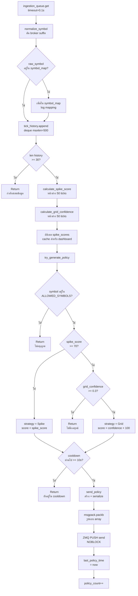
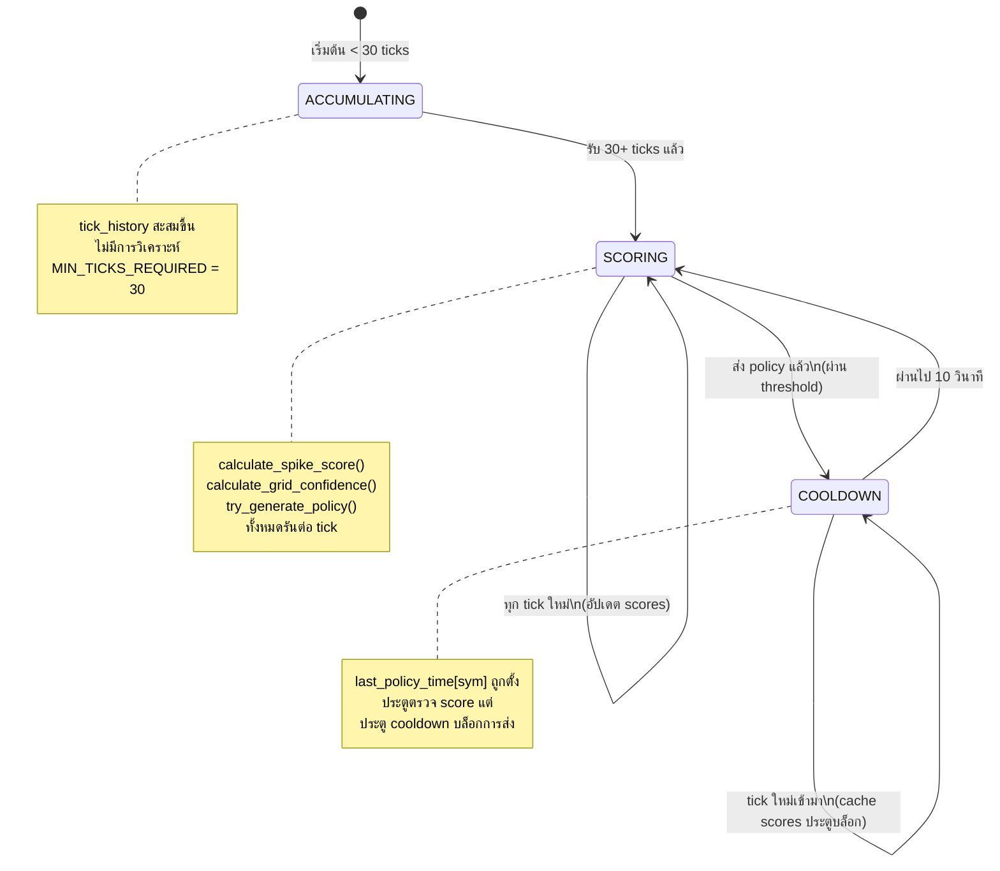
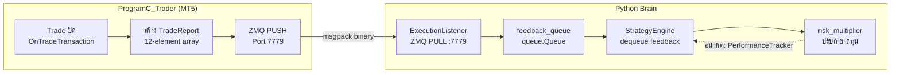

# SD02 — วงจรภายในของ Brain และการสแกน Matrix
## FlashEASuite V2 | คู่มือเทคนิคเชิงลึกฉบับสมบูรณ์
### จัดทำ: 2026-03-02 | Phase P9-5 | Jimmi Deep-Dive Edition

---

## 1. ข้อมูลประจำบท

| ฟิลด์ | ค่า | คำอธิบาย |
|-------|-----|----------|
| **บท** | SD02 | วงจรภายใน Brain และการสแกน Matrix |
| **ไฟล์หลัก** | `02_Brain/core/strategy/engine.py` | StrategyEngineThreaded v2.3 |
| **ไฟล์สนับสนุน** | `ingestion.py`, `analysis.py`, `policy.py` | ชั้น Input, Analysis, Output |
| **เวอร์ชัน Engine** | v2.3 | แก้ไข Spike Detection (4 bug fixes สำคัญ) |
| **ชื่อ Thread** | `StrategyEngine-v2.3` | ลงทะเบียนใน thread registry ของ Brain |
| **แหล่งข้อมูลขาเข้า** | `ingestion_queue` | `queue.Queue` จาก IngestionWorker |
| **เป้าหมายขาออก** | ZMQ PUSH port 7778 | CONFIG_PUSH ไปยัง ProgramC_Trader |
| **แหล่ง Feedback** | `feedback_queue` | `queue.Queue` จาก ExecutionListener |
| **กลยุทธ์ที่ใช้งาน** | Grid + Spike (v2.3) | S15 และ S16 ในระบบเต็มรูปแบบ |
| **Symbols ที่รองรับ** | 12 (ALLOWED_SYMBOLS) | EURUSD, GBPUSD, USDJPY, XAUUSD + 8 cross pairs |
| **ประวัติ Tick สูงสุด** | 500 ticks ต่อ symbol | `deque(maxlen=500)` circular buffer |
| **Policy Cooldown** | 10 วินาทีต่อ symbol | ป้องกัน order spam |

---

### 1.1 สรุปผู้บริหาร

วงจรภายในของ Brain คือ **pipeline แบบ queue-driven และ event-based** ที่แปลงข้อมูล tick ดิบให้กลายเป็นคำสั่งนโยบายการซื้อขายที่มีโครงสร้างชัดเจน ต่างจาก engine แบบ loop ดั้งเดิมที่ทำงานตาม timer Brain จะประมวลผลข้อมูลเฉพาะเมื่อมี tick เข้ามาเท่านั้น ทำให้มีลักษณะตอบสนองตาม event และใช้ CPU อย่างมีประสิทธิภาพ

วงจรนี้แบ่งออกเป็นสามขั้นตอนหลัก:
1. **การรวบรวมข้อมูลขาเข้า** — IngestionWorker normalize และเก็บ tick ที่เข้ามาจากทุก symbol ในบัฟเฟอร์
2. **การให้คะแนนและวิเคราะห์** — StrategyEngine ใช้อัลกอริทึมการให้คะแนนกับบัฟเฟอร์ tick ของแต่ละ symbol เพื่อประเมินสองกลยุทธ์ที่แข่งขันกัน ได้แก่ Spike และ Grid
3. **การส่ง Policy** — หากกลยุทธ์ใดได้คะแนนเกิน threshold และ cooldown หมดอายุแล้ว ระบบจะสร้าง CONFIG_PUSH และส่งไปยัง Trader

ขั้นตอนที่สี่คือ **การรวม Feedback** ซึ่งทำงานแบบ asynchronous โดย ExecutionListener รับผลการซื้อขายที่ปิดแล้วและส่งเข้า `feedback_queue` ให้ engine ดึงไปใช้ เพื่ออัปเดตสถานะภายในสำหรับการตัดสินใจในอนาคต

---

### 1.2 ปรัชญา: Brain ในฐานะ Stateful Decision Machine

**เหตุใดจึงต้องรักษา state ไว้แทนที่จะคำนวณใหม่ทุกครั้ง?**

tick แต่ละอันที่เข้ามาคือข้อมูลเพียงจุดเดียว — คู่ bid/ask ของ symbol หนึ่งในเวลาหนึ่งขณะ เมื่อมองโดยลำพัง tick เดี่ยวไม่มีความหมายใดๆ สัญญาณที่มีนัยสำคัญต้องอาศัย *บริบท*: ราคาเมื่อ 10, 30 หรือ 50 ticks ที่แล้วเป็นเท่าไร? เคลื่อนไหวไปมากแค่ไหน? การเคลื่อนไหวนั้นกระจุกตัวอยู่มากน้อยเพียงใด?

Brain รักษา **circular tick buffer ต่อ symbol** ที่ทำหน้าที่เป็น "ความจำระยะสั้น" ของตลาดแต่ละแห่ง tick ใหม่ทุกอันจะอัปเดต buffer และการวิเคราะห์ทุกครั้งจะอ่านจาก buffer นั้น ขนาด buffer (สูงสุด 500 ticks ขั้นต่ำ 30 ticks) สร้างสมดุลระหว่างความไวในการตอบสนองกับการกรอง noise:

- **tick น้อยเกินไป**: engine ยิง signal จาก noise — tick เดี่ยวที่ผิดปกติสามารถผ่าน threshold ได้
- **tick มากเกินไป**: engine ตอบสนองช้าเกินไป — spike ที่เกิดขึ้นจริงมลายหายไปก่อนที่ policy จะถูกส่งออกไป

หน้าต่าง 50 ticks สำหรับการให้คะแนน Spike และขั้นต่ำ 30 ticks ก่อนเริ่มการวิเคราะห์ใดๆ คือ **ค่าที่ปรับแต่งจากการทดสอบจริง** (การแก้ไขใน v2.3) ที่สร้างสมดุลระหว่างความล้มเหลวทั้งสองรูปแบบนี้

**เหตุใดจึงใช้สองกลยุทธ์แทนที่จะเป็นสิบหก?**

`engine.py` ปัจจุบัน (v2.3) นำกลยุทธ์สองตัวที่ทำงานได้ดีที่สุดในลักษณะ **tick-driven ล้วนๆ** มาใช้งาน ได้แก่ Spike (S16) ที่ตรวจจับการเร่งตัวของราคาอย่างกะทันหัน และ Grid (S15) ที่ตรวจจับสภาวะตลาด ranging กลยุทธ์อีก 14 ตัว (S01–S14) ต้องการข้อมูลระดับแท่งเทียน (OHLC) และขับเคลื่อนหลักด้วย CONFIG_PUSH จากการสแกน matrix เต็มรูปแบบที่วางแผนไว้ในอนาคต — โครงร่างสถาปัตยกรรมของการสแกนนั้นสามารถมองเห็นได้จากรายการ `ALLOWED_SYMBOLS` และฟังก์ชัน `select_best_strategy()` ใน `policy.py`

---

### 1.3 แนวคิด State Machine

Brain ติดตามสถานะห้าประเภทพร้อมกัน:

```
┌─────────────────────────────────────────────────────────────────┐
│              StrategyEngineThreaded — State Registry            │
├────────────────────────┬────────────────────────────────────────┤
│  ตัวแปร STATE          │  ประเภทและคำอธิบาย                     │
├────────────────────────┼────────────────────────────────────────┤
│  tick_history          │  defaultdict(deque[500]) ต่อ symbol    │
│                        │  "ตลาดทำอะไรไปเมื่อกี้?"              │
├────────────────────────┼────────────────────────────────────────┤
│  symbol_map            │  dict: raw_sym → normalized_sym        │
│                        │  "broker นี้ใช้ suffix อะไร?"         │
├────────────────────────┼────────────────────────────────────────┤
│  last_policy_time      │  defaultdict(float) ต่อ symbol         │
│                        │  "ส่ง policy ครั้งล่าสุดเมื่อไร?"     │
├────────────────────────┼────────────────────────────────────────┤
│  spike_scores          │  dict: symbol → float (0–100)          │
│                        │  "ตอนนี้แต่ละตลาดผันผวนแค่ไหน?"       │
├────────────────────────┼────────────────────────────────────────┤
│  risk_multiplier       │  float (ค่าเริ่มต้น: 1.0)             │
│                        │  "ควรก้าวร้าวแค่ไหนในการกำหนดขนาด?"  │
├────────────────────────┼────────────────────────────────────────┤
│  tick_count            │  int (นับตลอดอายุการทำงาน)             │
│  policy_count          │  int (นับตลอดอายุการทำงาน)             │
└────────────────────────┴────────────────────────────────────────┘
```

ตัวแปร state ทุกตัวเป็น **โครงสร้างข้อมูลใน memory** — ไม่มีฐานข้อมูล ไม่มี file I/O ระหว่างการทำงานปกติ state จะถูก initialize ใหม่เมื่อเริ่มต้นและสะสมข้อมูลเมื่อ tick เข้ามา การออกแบบนี้ให้ความสำคัญกับ throughput และความเรียบง่าย: การกู้คืน state หลัง crash ต้องการแค่การรอให้ buffer เติมใหม่ (ขั้นต่ำ 30 ticks ≈ 1.5–3 วินาที)

---

## 2. ขั้นตอนที่ 1 — การรวบรวมข้อมูลขาเข้า (IngestionWorker)

### 2.1 การสลับบทบาท ZMQ Socket

IngestionWorker ใช้ **รูปแบบสถาปัตยกรรม** ที่แตกต่างจากการใช้ ZMQ PUB-SUB ทั่วไป:

```
ZMQ PUB-SUB แบบมาตรฐาน:
  Publisher.bind(port)      ← bind (บทบาท server)
  Subscriber.connect(port)  ← connect (บทบาท client)

FlashEASuite V2 PUB-SUB (สลับบทบาท):
  FeederEA.connect(port 7777)        ← FeederEA เป็นฝ่าย connect (client)
  IngestionWorker.bind(port 7777)    ← Brain เป็นฝ่าย bind (server!)
```

**เหตุใดจึงสลับบทบาทนี้?** Brain คือกระบวนการที่เสถียรและรันอยู่ตลอดเวลา ส่วน Feeder อาจรีสตาร์ท เชื่อมต่อใหม่ หรือถูกแทนที่ได้ เมื่อกำหนดให้ socket ของ Brain เป็น *endpoint ที่คงที่* (มัน bind อยู่) Feeder ใหม่จะสามารถเชื่อมต่อเข้าหา Brain ได้โดยไม่ต้องรีสตาร์ทสิ่งใดเลย port 7777 ของ Brain คงที่เสมอ ส่วน Feeder จะ connect เข้ามาเมื่อพร้อม

```python
# ingestion.py
self.sub_socket = self.context.socket(zmq.SUB)
self.sub_socket.bind(self.zmq_sub_address)   # ← Brain BIND (ไม่ใช่ connect)
self.sub_socket.setsockopt_string(zmq.SUBSCRIBE, "")  # Subscribe ทุก topic
self.sub_socket.setsockopt(zmq.RCVTIMEO, 1000)        # timeout รับสัญญาณ 1 วินาที
```

`RCVTIMEO` 1 วินาทีมีความสำคัญอย่างยิ่ง: หากไม่มีค่านี้ `recv()` จะบล็อกค้างอยู่ตลอดกาลเมื่อไม่มี tick เข้ามา เมื่อมีค่านี้ loop การรับสัญญาณจะ yield ทุก 1 วินาทีเพื่อตรวจสอบ `shutdown_event.is_set()` ทำให้สามารถปิดระบบได้อย่าง clean ผ่าน `Ctrl+C`

### 2.2 การแกะข้อมูล Tick — Array 7 Elements

```python
def _parse_tick_data(self, raw_data: bytes) -> Dict[str, Any]:
    data = msgpack.unpackb(raw_data, raw=False)

    # ตรวจสอบ: ต้องเป็น list ที่มีอย่างน้อย 7 elements
    if not isinstance(data, list) or len(data) < 7:
        raise ValueError("Invalid data format")

    # map index ของ array ไปยังชื่อ field
    tick = {
        'msg_type':  data[0],   # int:    1 = MSG_TICK_DATA
        'seq_id':    data[1],   # int:    sequence ทั่วโลก (1, 2, 3, ...)
        'timestamp': data[2],   # int:    millisecond epoch
        'symbol':    data[3],   # str:    "EURUSD.tp" (รวม broker suffix)
        'bid':       data[4],   # float:  ราคา bid
        'ask':       data[5],   # float:  ราคา ask
        'flags':     data[6],   # int:    tick flags (bid/ask/last เปลี่ยน)
    }
    return tick
```

**raw=False** ใน `msgpack.unpackb()` ทำให้ string fields ถูก decode เป็น Python `str` แทนที่จะเป็น `bytes` ซึ่งสำคัญมากสำหรับการเปรียบเทียบชื่อ symbol และตรรกะ normalization ในขั้นตอนถัดไป

### 2.3 การส่งต่อข้อมูลผ่าน Queue

```python
# ส่งเข้า ingestion_queue แบบ non-blocking
self.ingestion_queue.put(tick, block=False)
```

`block=False` หมายความว่า: หาก queue เต็ม จะ raise `queue.Full` ทันทีแทนที่จะรอ Queue นี้สร้างโดยไม่กำหนด `maxsize` (`queue.Queue()` ความจุไม่จำกัด) ดังนั้น `Full` ไม่ควรเกิดขึ้นในการทำงานปกติ อย่างไรก็ตาม หาก thread StrategyEngine หยุดทำงาน ingestion queue จะโตขึ้นเรื่อยๆ — health monitor หลักของ engine (interval 5 วินาที) ตรวจจับสิ่งนี้ผ่าน `ingestion_queue.qsize()` เมื่อ depth > 100

**การ log ความคืบหน้าทุก 100 messages:**
```
📊 INGESTION: Processed 1500 ticks (Queue size: 3)
```
ขนาด queue ควรอยู่ใกล้ 0 ในการทำงานปกติ — queue ที่โตขึ้นเรื่อยๆ บ่งชี้ว่า StrategyEngine กำลังตามไม่ทัน

---

## 3. ขั้นตอนที่ 2 — วงจรการวิเคราะห์

### 3.1 process_tick() — Pipeline กลาง

`process_tick()` ถูกเรียกสำหรับทุก tick ที่ dequeue จาก `ingestion_queue` มันนำ **pipeline แบบ checkpoint-gated** มาใช้: แต่ละ checkpoint ต้องผ่านก่อนที่ checkpoint ถัดไปจะทำงาน

```python
def process_tick(self, tick_data: Dict):

    # ── CHECKPOINT 1: NORMALIZE SYMBOL ─────────────────────────────────
    raw_symbol = tick_data.get('symbol', 'UNKNOWN')        # "EURUSD.tp"
    symbol = normalize_symbol(raw_symbol, SUFFIX_PATTERNS) # "EURUSD"

    # บันทึก symbol mapping ครั้งแรกที่พบ
    if raw_symbol not in self.symbol_map:
        self.symbol_map[raw_symbol] = symbol
        # → "[HH:MM:SS.mmm] ✓ CHECKPOINT: SYMBOL_MAPPED | 'EURUSD.tp' → 'EURUSD'"

    # ── CHECKPOINT 2: เก็บใน TICK HISTORY ─────────────────────────────
    self.tick_history[symbol].append(tick_data)
    # deque(maxlen=500) ลบ tick เก่าที่สุดออกอัตโนมัติเมื่อเต็ม

    # ── CHECKPOINT 3: ประตูข้อมูลขั้นต่ำ ──────────────────────────────
    history_len = len(self.tick_history[symbol])
    if history_len < MIN_TICKS_REQUIRED (30):
        return  # ← ออก: กำลังสะสมข้อมูลเริ่มต้น
    # ดำเนินต่อเฉพาะเมื่อมี ≥ 30 ticks สำหรับ symbol นี้

    # ── CHECKPOINT 4: รัน SCORING ALGORITHMS ───────────────────────────
    spike_score    = self.calculate_spike_score(symbol)     # 0.0–100.0
    grid_confidence = self.calculate_grid_confidence(symbol) # 0.0–1.0
    self.spike_scores[symbol] = spike_score  # อัปเดต state

    # ── CHECKPOINT 5: พยายามสร้าง POLICY ──────────────────────────────
    self.try_generate_policy(symbol, raw_symbol, spike_score, grid_confidence)
```

**เหตุใดจึงใช้ normalized symbol เป็น storage key?**

หากไม่มีการ normalize instrument เดียวกันจะปรากฏเป็น key ต่างกัน: `"EURUSD.tp"` และ `"EURUSD"` จะสร้าง tick buffer แยกกัน โดยแต่ละอันมีข้อมูลเพียงครึ่งเดียว ด้วย normalization (FIX #1 ใน v2.3) tick ทั้งหมดของ EURUSD — ไม่ว่าจะมี suffix หรือไม่ — จะรวมกันใน buffer เดียว คือ `tick_history["EURUSD"]` ส่วน raw symbol ถูกเก็บแยกไว้ใน `raw_symbol` สำหรับใช้ในการส่ง policy (ที่ต้องการ broker suffix)

---

### 3.2 Symbol Normalization

```python
def normalize_symbol(symbol: str, suffix_patterns: list = None) -> str:
    """
    ตัด broker suffix ออกเพื่อให้ได้ชื่อ instrument พื้นฐาน

    Suffix patterns ที่รองรับ (ตรวจสอบตามลำดับ):
      ".tp"   → TP Trades Group
      "_m"    → ECN brokers บางราย
      ".m"    → suffix ทางเลือก
      ".raw"  → บัญชี Raw spread
      ".pro"  → บัญชี Professional
      ".ecn"  → บัญชี ECN
      ".std"  → บัญชี Standard
    """
    for suffix in suffix_patterns:
        if symbol.endswith(suffix):
            return symbol[:-len(suffix)]  # ตัดเพียง suffix เดียว แล้วหยุด
    return symbol  # ไม่ตรงกับ pattern ใด: คืนค่าเดิม
```

**หมายเหตุการออกแบบ:** ตัด suffix เพียงชั้นเดียวเท่านั้น (ผ่าน `break` หลังการ match ครั้งแรก) เพื่อป้องกันการตัดซ้อนกันใน symbol สมมติอย่าง `"EURUSD.tp.raw"` แม้ว่า symbol ดังกล่าวจะไม่มีในทางปฏิบัติก็ตาม

---

## 4. ขั้นตอนที่ 2a — การคำนวณ Spike Score

### 4.1 นิยามทางคณิตศาสตร์

Spike Score วัดว่าการเคลื่อนไหวของราคาเมื่อเร็วๆ นี้ผิดปกติแค่ไหนเมื่อเทียบกับประวัติทันที มันรวมการวัดสองแบบที่เป็นอิสระต่อกัน:

**การวัดที่ 1: การเปลี่ยนแปลงราคา (ขนาดทิศทาง)**
```
price_change = |prices[-1] - prices[0]| / prices[0] × 10,000

หน่วย: pips (normalize เป็น pip scale โดยไม่ขึ้นกับ instrument)
หน้าต่าง: SPIKE_SCORE_WINDOW ล่าสุด (50) ticks
```

ค่านี้วัดว่าราคาเคลื่อนที่ไปไกลแค่ไหนจาก *ต้น* ถึง *ปลาย* หน้าต่าง 50 ticks `price_change` ขนาดใหญ่บ่งชี้การเคลื่อนไหวทิศทางต่อเนื่อง

**การวัดที่ 2: ความผันผวน (การกระจาย)**
```
mean_price = Σ(prices) / N
variance   = Σ(prices[i] - mean)² / N
std_dev    = √variance
volatility = std_dev / mean_price × 10,000   (pips)
```

ค่านี้วัดว่าราคากระจายตัวกว้างแค่ไหนรอบ mean ภายในหน้าต่าง ความผันผวนสูงบ่งชี้พฤติกรรมราคาที่ไม่แน่นอน — สอดคล้องกับ spike หรือเหตุการณ์ข่าว

**Spike Score รวม:**
```
spike_score = min(100, price_change × 2 + volatility × 3)
```

น้ำหนัก (`×2` สำหรับการเปลี่ยนแปลงราคา, `×3` สำหรับความผันผวน) ให้ความสำคัญกับการกระจายตัวมากกว่าทิศทางเล็กน้อย ทำให้ score ไวต่อทั้งการเคลื่อนไหวที่วุ่นวาย (ความผันผวนสูง, ทิศทางปานกลาง) และ spike ที่สะอาดชัดเจน (ความผันผวนปานกลาง, ทิศทางสูง) การ cap `min(100, ...)` รับประกันว่า score อยู่ในช่วง `[0.0, 100.0]` เสมอ

### 4.2 การ implement โค้ด

```python
def calculate_spike_score(self, symbol: str) -> float:
    history = list(self.tick_history[symbol])

    # กำหนดขนาด window ที่มีผล
    window = SPIKE_SCORE_WINDOW  # 50
    if len(history) < window:
        if len(history) < 10:
            return 0.0  # ขั้นต่ำสัมบูรณ์: 10 ticks
        window = len(history)  # ใช้ทุก tick ที่มี

    # ดึงราคา bid จาก N ticks ล่าสุด
    prices = [t.get('bid', 0) for t in history[-window:]]

    if not prices or prices[0] == 0:
        return 0.0  # ป้องกัน: ไม่มีข้อมูลราคาที่ใช้ได้

    # การวัดที่ 1: การเปลี่ยนแปลงราคา (ต้น → ปลาย window)
    price_change = abs(prices[-1] - prices[0]) / prices[0] * 10000  # pips

    # การวัดที่ 2: ความผันผวน (standard deviation ของทุกราคาใน window)
    mean_price = sum(prices) / len(prices)
    variance   = sum((p - mean_price)**2 for p in prices) / len(prices)
    std_dev    = variance ** 0.5
    volatility = std_dev / mean_price * 10000  # pips

    # Score รวม (cap ที่ 100)
    spike_score = min(100, (price_change * 2 + volatility * 3))

    # Debug log เมื่อ score น่าสนใจ (≥ threshold 30.0)
    if spike_score >= SPIKE_DEBUG_THRESHOLD:  # 30.0
        logger.spike_debug(symbol, spike_score, price_change,
                           volatility, window, prices[0], prices[-1])

    return spike_score
```

### 4.3 ตารางการตีความ Spike Score

| ช่วงคะแนน | การตีความ | สาเหตุทั่วไป | การดำเนินการ Policy |
|-----------|----------|------------|-------------------|
| 0 – 29 | ตลาดเงียบ | Ranging/drift ปกติ | ไม่มี policy |
| 30 – 69 | กิจกรรมสูงขึ้น | ก่อนข่าว, ข่าวเบาๆ | Log debug เท่านั้น ไม่มี policy |
| **70 – 99** | **ตรวจพบ Spike** | **Spike ข่าวคม, Flash move** | **ส่ง policy "Spike"** |
| 100 | Spike สูงสุด | Flash crash, ข่าวใหญ่ | ส่ง policy "Spike" |

**Threshold: `MIN_SPIKE_SCORE = 70.0`** — ปรับแต่งเพื่อกรอง noise ในขณะที่จับการเคลื่อนไหวอย่างรวดเร็วที่แท้จริง score ที่ 70 ต้องการ เช่น: การเคลื่อนไหว 15 pips + การกระจาย 13 pips ใน 50 ticks

### 4.4 ตัวอย่างที่คำนวณได้ — XAUUSD Spike

```
Symbol: XAUUSD (normalized), 50 ticks ใน ~2.5 วินาที

ราคา (3 แรกและ 3 หลังจาก 50):
  t=0:  5383.42
  t=1:  5383.45
  t=2:  5383.48
  ...
  t=48: 5386.71
  t=49: 5387.02
  t=50: 5387.31  ← ปัจจุบัน

price_change:
  = |5387.31 - 5383.42| / 5383.42 × 10000
  = 3.89 / 5383.42 × 10000
  = 7.22 pips

mean_price = 5385.37 (ค่าเฉลี่ยกลาง window)
std_dev    ≈ 1.18
volatility = 1.18 / 5385.37 × 10000 = 2.19 pips

spike_score = min(100, 7.22 × 2 + 2.19 × 3)
            = min(100, 14.44 + 6.57)
            = 21.01  ← ต่ำกว่า threshold 70 ไม่มี policy

─────────────────────────────────────────────────────
ตัวอย่างเดิมแต่หลังข่าวออก (spike ชัดเจน):

ราคา:
  t=0:  5383.42
  ...
  t=49: 5394.10   ← เคลื่อนไหว 10.68 pips ใน 50 ticks

price_change = |5394.10 - 5383.42| / 5383.42 × 10000 = 19.84 pips
std_dev ≈ 3.45, volatility = 3.45 / 5388.76 × 10000 = 6.40 pips

spike_score = min(100, 19.84 × 2 + 6.40 × 3)
            = min(100, 39.68 + 19.20)
            = 58.88  ← ยังต่ำกว่า 70

─────────────────────────────────────────────────────
Spike สุดขีด (เช่น Fed Rate surprise):

price_change = 45 pips ใน 50 ticks
volatility   = 12 pips

spike_score = min(100, 45 × 2 + 12 × 3) = min(100, 90 + 36) = 100
→ ส่ง policy "Spike" ✅
```

---

## 5. ขั้นตอนที่ 2b — การคำนวณ Grid Confidence

### 5.1 นิยามทางคณิตศาสตร์

Grid confidence วัด **ความแคบของช่วงตลาด** ใน 50 ticks ล่าสุด ค่า confidence สูงหมายความว่าตลาด "ติดอยู่" ในช่วงแคบๆ ทำให้เหมาะกับการ trade แบบ grid

```
prices = ราคา bid 50 ตัวล่าสุด

max_price    = max(prices)
min_price    = min(prices)
price_range  = max_price - min_price

trend_strength = price_range / prices[0]   (เศษส่วนของราคา)

grid_confidence = max(0.0, 1.0 - trend_strength × 100)
```

**การตีความ:** `trend_strength × 100` แปลง fractional range เป็นค่าเปอร์เซ็นต์:
- EURUSD เคลื่อนไหว 0.30% ใน 50 ticks: `trend_strength × 100 = 0.30` → `confidence = 0.70`
- EURUSD เคลื่อนไหว 0.80% (trending แรง): `confidence = 1.0 - 0.80 = 0.20`
- EURUSD เคลื่อนไหว 1.20% (spike/trend): `confidence = max(0, 1.0 - 1.20) = 0.00`

### 5.2 การ implement โค้ด

```python
def calculate_grid_confidence(self, symbol: str) -> float:
    history = list(self.tick_history[symbol])

    # ต้องการ 50 ticks พอดี (ต่างจาก spike ที่ยืดหยุ่นได้)
    if len(history) < 50:
        return 0.0

    prices = [t.get('bid', 0) for t in history[-50:]]

    if not prices or prices[0] == 0:
        return 0.0

    # ช่วงราคาใน window
    max_price     = max(prices)
    min_price     = min(prices)
    price_range   = max_price - min_price

    # ความแข็งแกร่งของ trend เป็นเศษส่วนของระดับราคา
    trend_strength = price_range / prices[0]

    # Grid confidence: ส่วนกลับของ trend strength (scale × 100)
    confidence = max(0.0, 1.0 - trend_strength * 100)

    return confidence
```

### 5.3 ตารางการตีความ Grid Confidence

| Confidence | Trend Strength | ช่วงราคา (EURUSD 1.08) | สภาพตลาด | เหมาะกับ Grid? |
|------------|---------------|----------------------|---------|--------------|
| 1.00 | 0.00 | 0 pips | หยุดนิ่ง (ไม่มีการเคลื่อนไหว) | ใช่ — สุดขีด |
| 0.70 | 0.30% | ~3.2 pips | ช่วงแคบ | ใช่ — เหมาะที่สุด |
| **0.30** | **0.70%** | **~7.6 pips** | **ช่วงปกติ** | **ใช่ (threshold)** |
| 0.10 | 0.90% | ~9.7 pips | Trend ปานกลาง | อยู่บนขอบเขต |
| 0.00 | ≥1.00% | ≥10.8 pips | Trend แรง | ไม่ |

**Threshold: `MIN_GRID_CONFIDENCE = 0.3`** — อนุญาตให้ Grid ทำงานเมื่อตลาดเคลื่อนไหวไม่เกิน ~0.7% ใน 50 ticks ล่าสุด

### 5.4 เหตุใด Grid จึงใช้หน้าต่าง 50 Ticks แบบตายตัว

ต่างจาก Spike score ที่ใช้ `SPIKE_SCORE_WINDOW` ที่กำหนดค่าได้ Grid confidence ถูก hardcode ที่ 50 ticks เนื่องจาก:

1. กลยุทธ์ Grid เปิด *หลาย* ระดับตามเวลา — ต้องการประเมินความเสถียรของช่วงราคาปัจจุบัน ไม่ใช่การเคลื่อนไหวทิศทางล่าสุด
2. 50 ticks แทนช่วงประมาณ 2.5 วินาทีในกิจกรรมตลาดปกติ — เพียงพอที่จะดูว่าตลาด "นิ่ง" แล้วหลัง spike ก่อนหน้าหรือยัง
3. ข้อกำหนดขั้นต่ำ 50 ticks สำหรับ Grid (เทียบกับ 30 สำหรับ Spike) หมายความว่า Grid จะทำงานได้เฉพาะเมื่อ buffer เติมเต็มพอสมควร ป้องกัน signal Grid ปลอมในช่วงสะสมข้อมูลเริ่มต้น

---

## 6. ขั้นตอนที่ 3 — การเลือกกลยุทธ์และการสร้าง Policy

### 6.1 try_generate_policy() — ประตูการตัดสินใจ

ฟังก์ชันนี้นำ **ห่วงโซ่กรองแบบลำดับ** มาใช้ — แต่ละตัวกรองคือประตูที่ต้องผ่านก่อนดำเนินต่อ:

```python
def try_generate_policy(self, symbol, raw_symbol, spike_score, grid_confidence):

    # ── ประตู 1: SYMBOL WHITELIST ──────────────────────────────────────
    if symbol not in ALLOWED_SYMBOLS:
        return  # อนุญาต 12 ตัว: EURUSD, GBPUSD, USDJPY, XAUUSD, + 8 crosses

    # ── ประตู 2: การเลือกกลยุทธ์ (ลำดับความสำคัญ) ────────────────────
    if spike_score >= MIN_SPIKE_SCORE (70.0):
        strategy = "Spike"
        score    = spike_score

    elif grid_confidence >= MIN_GRID_CONFIDENCE (0.3):
        strategy = "Grid"
        score    = grid_confidence * 100  # แปลงเป็น scale 0–100

    else:
        return  # ไม่ผ่าน threshold ใด → ไม่มี policy

    # ── ประตู 3: ตรวจสอบ COOLDOWN ────────────────────────────────────
    now              = time.time()
    last_time        = self.last_policy_time.get(symbol, 0)
    cooldown_elapsed = now - last_time

    if cooldown_elapsed < POLICY_COOLDOWN (10 วินาที):
        return  # ยังอยู่ใน cooldown 10 วินาทีของ symbol นี้

    # ── ประตู 4: ส่ง POLICY ──────────────────────────────────────────
    success = self.send_policy(raw_symbol, strategy, score, symbol)

    if success:
        self.policy_count += 1
        self.last_policy_time[symbol] = now   # Reset cooldown
```

**ลำดับความสำคัญ: Spike ชนะ Grid** หาก threshold ทั้งสองถูกตอบสนองพร้อมกัน (ผิดปกติแต่เป็นไปได้ — spike เพิ่งสิ้นสุดและราคาเสถียรแล้ว) Spike จะมีลำดับความสำคัญกว่า เหตุผลคือ spike ล่าสุดอาจบ่งชี้แรงกระตุ้นทิศทางที่แข็งแกร่งซึ่ง Grid strategy ไม่ควรฝืนต้าน

**Cooldown ใช้ normalized symbol เป็น key** แม้ raw symbol จะต่างกัน (`"EURUSD.tp"` กับ `"EURUSD"`) ทั้งสองก็ map ไปยัง cooldown entry เดียวกันคือ `last_policy_time["EURUSD"]` ป้องกันการยิงซ้ำหาก Feeder ส่งข้อมูลด้วยและไม่มี suffix สลับกันชั่วคราว

### 6.2 select_best_strategy() — Policy Router (policy.py)

module `policy.py` มีชั้นการเลือกกลยุทธ์เพิ่มเติมที่ใช้เมื่อรวมกับ framework 16 กลยุทธ์ที่กว้างขึ้น:

```python
def select_best_strategy(grid_signal: Dict, spike_signal: Dict) -> str:
    # ลำดับความสำคัญที่ 1: Spike (ถ้า confidence ≥ 0.7)
    if spike_signal.get('detected', False):
        if spike_signal.get('confidence', 0.0) >= 0.7:
            return 'Spike'

    # ลำดับความสำคัญที่ 2: Grid (ถ้า ranging และ confidence ≥ 0.6)
    if grid_signal.get('is_ranging', False):
        if grid_signal.get('confidence', 0.0) >= 0.6:
            return 'Grid'

    # Default: Grid (fallback ที่ปลอดภัยกว่า)
    return 'Grid'
```

ฟังก์ชันนี้เสริมตรรกะลำดับความสำคัญเดียวกับ `try_generate_policy()` แต่ทำงานกับ signal objects ที่มีความละเอียดมากกว่า ซึ่งรวมถึง flag `is_ranging` และ boolean `detected` ที่ชัดเจนจาก detector ที่ซับซ้อนกว่า

---

## 7. ขั้นตอนที่ 3a — การสร้าง Policy

### 7.1 send_policy() — ชั้น Serialization

```python
def send_policy(self, symbol: str, strategy: str, score: float,
                normalized_symbol: str = None) -> bool:
    """
    symbol:            raw broker symbol (เช่น "EURUSD.tp") — ไม่ใช้ใน policy body
    normalized_symbol: ชื่อพื้นฐาน (เช่น "EURUSD") — ใช้ lookup tick และส่งใน policy
    """
    lookup_key  = normalized_symbol or normalize_symbol(symbol)
    send_symbol = lookup_key          # ส่ง BASE symbol — Trader เพิ่ม broker suffix กลับ

    history = list(self.tick_history[lookup_key])
    if not history:
        return False

    last_tick     = history[-1]
    current_price = last_tick.get('bid', 0.0)
    if current_price == 0:
        return False

    lot_size = 0.01 * self.risk_multiplier  # 0.01 lots × risk multiplier (ค่าเริ่มต้น 1.0)
```

**เหตุใดจึงส่ง base symbol แทน raw broker symbol?**

นี่คือ FIX #1 ใน v2.3 เดิม engine ส่ง `"EURUSD.tp"` ใน policy ฟังก์ชัน `FormatSymbol()` ของ Trader เพิ่ม suffix ที่กำหนดไว้ (`.tp`) ให้กับ symbol ที่ได้รับ ส่งผลให้ได้ `"EURUSD.tp.tp"` — symbol ที่ broker ไม่รู้จัก เมื่อส่งเพียง `"EURUSD"` `FormatSymbol("EURUSD")` → `"EURUSD.tp"` ถูกต้อง

### 7.2 การคำนวณ Grid Direction

```python
# คำนวณ grid_direction จาก price trend 5 ticks ล่าสุด
# ตรรกะ Mean-reversion: ราคาขึ้น → คาดการณ์การ reversal → SELL(2)
#                        ราคาลง  → คาดการณ์การ reversal → BUY(1)
if len(history) >= 5:
    recent_prices = [t.get('bid', 0.0) for t in history[-5:]]
    price_trend   = recent_prices[-1] - recent_prices[0]
    grid_direction = 2 if price_trend > 0 else 1   # 1=BUY, 2=SELL
else:
    grid_direction = 1  # Default: BUY
```

**เหตุผลของ Mean-reversion:** กลยุทธ์ Grid ออกแบบมาสำหรับตลาด ranging ในช่วง range หากราคาเพิ่งขึ้นใน 5 ticks ล่าสุด สมมติฐาน mean-reversion คือมันจะลงกลับ — ดังนั้น Grid ควรวางตำแหน่งเป็น SELL ในทางกลับกัน trend ลง 5 ticks แนะนำว่ากำลังจะมีการ reversal ขึ้น (BUY)

**เหตุใดจึงใช้ 5 ticks?** หน้าต่าง 5 ticks คือการประนีประนอม: นานพอที่จะ smooth tick เดี่ยวที่ผิดปกติ สั้นพอที่จะตอบสนองต่อทิศทางระยะสั้น *ปัจจุบัน* แทนที่จะเป็น trend ที่เริ่มมาตั้งแต่ 50 ticks ก่อน ตรรกะเดียวกันนี้ใช้กับทิศทางกลยุทธ์ Spike (`spike_direction = grid_direction`)

### 7.3 การสร้าง Policy Array

**Grid Policy (11-element array):**
```python
policy_msg = [
    2,                              # [0]  type = 2 (POLICY message)
    int(time.time() * 1000),        # [1]  timestamp_ms (milliseconds)
    send_symbol,                    # [2]  "EURUSD" (base symbol ไม่มี suffix)
    "Grid",                         # [3]  ชื่อกลยุทธ์ → route ไปยัง GridCore.mqh
    current_price,                  # [4]  entry_price (bid ปัจจุบัน)
    lot_size,                       # [5]  lot_size = 0.01 × risk_multiplier
    grid_direction,                 # [6]  1=BUY, 2=SELL (ทิศทาง mean-reversion)
    current_price + tp_distance,    # [7]  take_profit (entry + 0.2% ของราคา)
    current_price - sl_distance,    # [8]  stop_loss   (entry - 0.1% ของราคา)
    score / 100.0,                  # [9]  confidence (0.0–1.0)
    self.risk_multiplier,           # [10] risk_multiplier (ค่าเริ่มต้น 1.0)
]
# tp_distance = current_price × 0.002  (0.2%)
# sl_distance = current_price × 0.001  (0.1%)
```

**Spike Policy (11-element array):**
```python
policy_msg = [
    2,                              # [0]  type = 2 (POLICY message)
    int(time.time() * 1000),        # [1]  timestamp_ms
    send_symbol,                    # [2]  base symbol
    "Spike",                        # [3]  ชื่อกลยุทธ์ → route ไปยัง SpikeStrategy.mqh
    current_price,                  # [4]  entry_price
    lot_size,                       # [5]  lot_size = 0.01 × risk_multiplier
    spike_direction,                # [6]  ตรรกะทิศทางเดียวกับ Grid
    current_price + tp_distance,    # [7]  take_profit (entry + 0.5% ของราคา)
    current_price - sl_distance,    # [8]  stop_loss   (entry - 0.2% ของราคา)
    score / 100.0,                  # [9]  confidence (ทั่วไป 0.7–1.0 สำหรับ Spike)
    self.risk_multiplier,           # [10] risk_multiplier
]
# tp_distance = current_price × 0.005  (0.5%) — TP ใหญ่กว่าสำหรับ spike ที่เคลื่อนไหวมาก
# sl_distance = current_price × 0.002  (0.2%) — SL แคบกว่า (อัตราส่วน R:R 2.5:1)
```

**การเปรียบเทียบ TP/SL:**

| กลยุทธ์ | ระยะ TP | ระยะ SL | อัตราส่วน R:R |
|---------|--------|--------|-------------|
| Grid | 0.2% ของราคา | 0.1% ของราคา | 2:1 |
| Spike | 0.5% ของราคา | 0.2% ของราคา | 2.5:1 |

Spike มี TP แน่นอนที่ใหญ่กว่าเพราะจับแรงส่งต่อของ impulse spike ก่อนการ reversal ส่วน Grid มีระดับที่แคบกว่าเพราะคาดหวังการแกว่งเล็กๆ ในช่วง

### 7.4 ZMQ Serialization และการส่ง

```python
# Serialize เป็น MessagePack binary array (ไม่ใช่ dict)
packed = msgpack.packb(policy_msg)

# ส่งแบบ non-blocking ผ่าน ZMQ PUSH socket
self.publisher.send(packed, flags=zmq.NOBLOCK)

# Log การยืนยัน
print(f"✅ Policy sent: {len(packed)} bytes | {symbol} | {strategy} | "
      f"Price: {current_price:.2f} | Score: {score:.2f}")
```

`zmq.NOBLOCK` หมายความว่า: หาก outbound buffer ของ PUSH socket เต็ม (SNDHWM = 100,000) จะ raise `zmq.Again` ทันทีแทนที่จะบล็อก analysis thread สิ่งนี้สำคัญเพราะการบล็อกจะหยุดการประมวลผล tick — ความเสี่ยงในช่วงที่มีการสร้าง policy ความถี่สูง

---

## 8. ขั้นตอนที่ 4 — การรวม Feedback (ExecutionListener)

### 8.1 สถาปัตยกรรม

ExecutionListener ทำงานเป็น **Thread 3** (อิสระจาก StrategyEngine) มีหน้าที่:
1. รับผลการซื้อขายที่ปิดแล้วจาก Trader (ZMQ PULL บน port 7779)
2. แกะข้อมูลเป็น dict ที่มีโครงสร้าง
3. วางลงใน `feedback_queue`

StrategyEngine อ่านจาก `feedback_queue` แบบ asynchronous ระหว่าง main loop โดยใช้ผลลัพธ์เหล่านั้นอัปเดต performance state

### 8.2 การแกะผลการซื้อขาย — Array 12 Elements

```python
def _parse_trade_result(self, raw_data: bytes) -> Dict[str, Any]:
    data = msgpack.unpackb(raw_data, raw=False)

    # ต้องการอย่างน้อย 12 fields
    if not isinstance(data, list) or len(data) < 12:
        return None

    result = {
        'msg_type':   int(data[0]),    # 100 = TRADE_RESULT (internal type)
        'timestamp':  int(data[1]),    # ms epoch
        'ticket':     int(data[2]),    # MT5 position ticket
        'symbol':     str(data[3]),    # "XAUUSD.tp"
        'type':       int(data[4]),    # 0=BUY, 1=SELL
        'volume':     float(data[5]),  # ขนาด lot
        'open_price': float(data[6]),  # ราคา entry
        'sl':         float(data[7]),  # ระดับ stop loss
        'tp':         float(data[8]),  # ระดับ take profit
        'profit':     float(data[9]),  # P&L ที่รับรู้แล้วเป็น USD
        'magic':      int(data[10]),   # magic number ของกลยุทธ์
        'comment':    str(data[11]),   # เช่น "Grid_L0"
    }

    # ฟิลด์ความสะดวกที่คำนวณแล้ว
    result['is_win']   = result['profit'] > 0
    result['is_loss']  = result['profit'] < 0
    result['datetime'] = datetime.fromtimestamp(result['timestamp'] / 1000.0)

    return result
```

### 8.3 การแสดงผลบน Console

ผลการซื้อขายทุกรายการถูก log ลงใน terminal อย่างละเอียด:
```
============================================================
📥 [Message #5] Trade Result Received!
============================================================
   🕐 Time:       2026-03-02 11:08:42.831
   🎫 Ticket:     24905107
   📊 Symbol:     EURUSD.tp
   📈 Type:       BUY
   📦 Volume:     0.01
   💰 Entry:      1.17340
   🛑 SL:         0.00
   🎯 TP:         1.17332
   💵 Profit:     -0.08 💔 LOSS
   🔮 Magic:      1015
   💬 Comment:    Grid_L0
============================================================
```

### 8.4 กลไก Feedback Loop

```
[Trade ปิดใน MT5]
         ↓
[ProgramC_Trader: OnTradeTransaction callback]
         ↓
[ZMQ PUSH → Port 7779]
         ↓
[Brain: ExecutionListener.recv()]
         ↓
[_parse_trade_result() → dict]
         ↓
[feedback_queue.put(result)]
         ↓
[StrategyEngine: drain feedback_queue]
         ↓
[อัปเดต PerformanceTracker win rates]
         ↓
[CONFIG_PUSH ถัดไปสะท้อน confidence weighting ที่อัปเดตแล้ว]
```

**สถานะปัจจุบัน:** ใน v2.3 StrategyEngine ประมวลผล feedback results จาก `feedback_queue` แต่เส้นทางอัปเดต `PerformanceTracker` ใช้การปรับ `risk_multiplier` เท่านั้น การรวม AI Council เต็มรูปแบบ (การถ่วงน้ำหนัก EMA win rate ต่อกลยุทธ์) อยู่ในแผน roadmap สถาปัตยกรรมแต่ยังไม่ได้ใช้งานใน engine.py เวอร์ชันนี้

---

## 9. แนวคิดการสแกน Matrix

### 9.1 การ implement ปัจจุบัน vs. วิสัยทัศน์เต็มรูปแบบ

คำว่า "Matrix Scan" หมายถึงเป้าหมายสถาปัตยกรรมในการประเมิน **กลยุทธ์ N ตัวทุก M symbol** พร้อมกันต่อวงจรการวิเคราะห์หนึ่งรอบ ในวิสัยทัศน์ FlashEASuite V2 เต็มรูปแบบ:

```
มิติ Matrix ที่ 1: 16 กลยุทธ์   (S01 – S16)
มิติ Matrix ที่ 2: N symbols     (สูงสุด 28 ตาม ConfigPushV6.symbols[28])
มิติ Matrix ที่ 3: 6 timeframes  (M1, M5, M15, H1, H4, D1)

ขนาด Matrix เต็ม: 16 × 28 × 6 = 2,688 combinations กลยุทธ์-symbol-timeframe ที่เป็นไปได้
```

แต่ละเซลล์ของ matrix นี้ผลิต confidence score หนึ่งค่า จากนั้น AI Council จะเลือก combination ที่ชนะด้วย confidence สูงสุดต่อ symbol และสร้าง CONFIG_PUSH หนึ่งอันต่อ symbol

**การ implement ปัจจุบัน (v2.3):** engine.py นำ 2-strategy scan (Spike + Grid) ข้าม 12 symbols โดยใช้ข้อมูลระดับ tick เท่านั้น:

```
Matrix ปัจจุบัน:
  กลยุทธ์:   2  (Spike, Grid)
  Symbols:   สูงสุด 12 (ALLOWED_SYMBOLS)
  Timeframes: 1  (tick — ไม่มีข้อมูลแท่งเทียน OHLC)
  เซลล์: 2 × 12 × 1 = 24 การประเมินที่เป็นไปได้ต่อ tick
```

### 9.2 การทำงาน Scan ต่อ Tick

แม้จะสามารถ monitor 12 symbols ได้ แต่ tick แต่ละอันมีข้อมูลสำหรับ **symbol หนึ่งตัวเท่านั้น** ดังนั้น scan จึงไม่ได้ทำงานเป็น batch ต่อวงรอบ แต่ทำงาน **แบบ incremental** — score ของ symbol หนึ่งถูกอัปเดตเมื่อ tick ใหม่สำหรับ symbol นั้นเข้ามา:

```
Tick 1501: EURUSD.tp → อัปเดต tick_history["EURUSD"]
                      → คำนวณ spike_score["EURUSD"] ใหม่
                      → คำนวณ grid_confidence["EURUSD"] ใหม่
                      → ตรวจสอบประตู → อาจส่ง policy

Tick 1502: XAUUSD.tp → อัปเดต tick_history["XAUUSD"]
                      → คำนวณ spike_score["XAUUSD"] ใหม่
                      → คำนวณ grid_confidence["XAUUSD"] ใหม่
                      → ตรวจสอบประตู → อาจส่ง policy

Tick 1503: EURUSD.tp → อัปเดต tick_history["EURUSD"]
                      → ...
```

แนวทาง incremental นี้หมายความว่าแต่ละ symbol จะถูกให้คะแนนในอัตราที่สัมพันธ์กับความถี่ tick ของมัน ไม่ใช่อัตราโลกคงที่ symbol ที่ active มากอย่าง XAUUSD (tick หลายอันต่อวินาที) จะถูกให้คะแนนบ่อยกว่า cross pairs ที่เงียบกว่าอย่าง NZDJPY

### 9.3 Dashboard — สรุปการสแกนทั่วทั้งระบบ

ทุก 10 วินาที engine จะพิมพ์ dashboard แสดง score ของทุก symbol ที่ active:

```
======================================================================
📊 STRATEGY ENGINE DASHBOARD v2.3 (Fixed Spike Detection)
======================================================================
Ticks Processed:    15,842
Policies Sent:      7
Risk Multiplier:    1.00x

Symbol Mapping:
  EURUSD.tp        → EURUSD     (1,247 ticks)
  GBPUSD.tp        → GBPUSD     (1,098 ticks)
  USDJPY.tp        → USDJPY     (  987 ticks)
  XAUUSD.tp        → XAUUSD     (2,041 ticks)

Top 5 Symbols (Spike Score):
  1. XAUUSD      : 48.31  ⏳ Below
  2. GBPUSD      : 31.55  ⏳ Below
  3. EURUSD      : 18.22  ⏳ Below
  4. USDJPY      : 12.08  ⏳ Below
  5. GBPJPY      :  6.44  ⏳ Below
======================================================================
```

Dashboard นี้ทำหน้าที่เป็น **มุมมอง matrix แบบ real-time** — ภาพรวมของ scoring ปัจจุบันของทุก symbol ทั้งสองกลยุทธ์

---

## 10. การจัดการ State ใน Memory

### 10.1 tick_history — โครงสร้าง Memory หลัก

```python
# ประเภท: defaultdict(deque[maxlen=500])
# Key:    normalized symbol ("EURUSD")
# Value:  deque ของ tick dicts ลบ tick เก่าที่สุดออกอัตโนมัติเมื่อ len > 500

self.tick_history = defaultdict(lambda: deque(maxlen=500))
```

**การคำนวณ capacity:**
- tick dict แต่ละอันมี 7 fields: ~200 bytes ใน CPython พร้อม dict overhead
- 500 ticks × 200 bytes = ~100 KB ต่อ symbol
- 12 symbols × 100 KB = ~1.2 MB สำหรับ tick history ทั้งหมด
- อยู่ในระดับที่ปกติสำหรับ Python process RAM (~50–200 MB รวม)

**Auto-eviction:** `deque(maxlen=500)` จะลบ tick เก่าที่สุดออกโดยอัตโนมัติเมื่อ tick ที่ 501 เข้ามา นี่คือ O(1) — ไม่ต้องจัดการ memory อย่างชัดเจน buffer จะแทนถึง 500 ticks ล่าสุดของแต่ละ symbol เสมอ

**การ warm-up เมื่อเริ่มต้น:** buffer เติมเต็มตามอัตรา tick ของตลาด ที่ ~20–40 ticks/วินาทีสำหรับ 4 symbols ขั้นต่ำ 30 ticks จะถูกเติมใน 1–2 วินาทีต่อ symbol และ buffer เต็ม 500 ticks ใช้ ~25–50 วินาทีต่อ symbol

### 10.2 last_policy_time — Cooldown State

```python
# ประเภท: defaultdict(float)
# Key:    normalized symbol
# Value:  Unix timestamp ของ policy ล่าสุดที่ส่ง

self.last_policy_time = defaultdict(float)  # ค่า default: 0.0

# ตรวจสอบ: ถ้า (now - last_policy_time[symbol]) < 10 → ข้าม
```

**เหตุใด cooldown 10 วินาที?**

หากไม่มี cooldown engine จะส่ง policy ใหม่ในแทบทุก tick ระหว่างเหตุการณ์ความผันผวนสูง หน้าต่าง 10 วินาทีรับประกันว่า:
1. Trader มีเวลาพอที่จะรับ แกะ และพยายาม execute policy
2. หาก policy ถูกปฏิเสธ (risk limit) Brain จะไม่ยิงซ้ำทันที
3. CONFIG_PUSH หลายอันจะไม่กองอยู่ใน ZMQ PUSH buffer

**การ reset cooldown:** `last_policy_time[symbol] = now` ถูกตั้งค่า **เฉพาะเมื่อส่งสำเร็จ** (ไม่ใช่เมื่อ policy ถูกปฏิเสธ) หาก ZMQ send ล้มเหลว cooldown จะไม่ถูก reset ทำให้ tick ถัดไปสามารถลองใหม่ได้ทันที

### 10.3 spike_scores — Score Cache

```python
# ประเภท: dict
# Key:    normalized symbol
# Value:  spike score ล่าสุดที่คำนวณ (float)

self.spike_scores[symbol] = spike_score  # อัปเดตทุก tick ของ symbol นั้น
```

cache นี้ใช้เป็นหลักสำหรับการแสดง dashboard (การจัดลำดับ top-5) และยังหมายความว่า dashboard แสดง spike score *ล่าสุด* ของแต่ละ symbol ไม่ใช่ score ณ เวลาที่ policy ล่าสุดถูกส่ง

### 10.4 symbol_map — การติดตาม Suffix

```python
# ประเภท: dict (ปกติ ไม่ใช่ defaultdict)
# Key:    raw symbol จาก broker ("EURUSD.tp")
# Value:  normalized symbol ("EURUSD")

self.symbol_map[raw_symbol] = symbol  # บันทึกเฉพาะครั้งแรกที่พบ
```

mapping นี้เป็นทิศทางเดียว (raw → normalized) และถูกเติมแบบ lazy เมื่อพบครั้งแรก ทำหน้าที่หลักเป็น debugging aid — ยืนยันว่า broker ปัจจุบันใช้ suffix ใดและการ normalization ทำงานถูกต้อง

---

## 11. Mermaid Flowcharts

### 11.1 Pipeline process_tick() ทั้งหมด



### 11.2 การเปลี่ยน State ของ Analysis Engine



### 11.3 Feedback Integration Flow



---

## 12. อ้างอิงพารามิเตอร์ Configuration

| พารามิเตอร์ | ตำแหน่ง | ค่าเริ่มต้น | ช่วง | ผลกระทบ |
|------------|--------|-----------|-----|---------|
| `MIN_TICKS_REQUIRED` | `StrategyConfig` | 30 | 10–100 | จำนวน tick ขั้นต่ำก่อนเริ่มการวิเคราะห์ใดๆ |
| `SPIKE_SCORE_WINDOW` | `StrategyConfig` | 50 | 10–200 | จำนวน ticks สำหรับคำนวณ spike |
| `MIN_SPIKE_SCORE` | `StrategyConfig` | 70.0 | 30–100 | Threshold สำหรับ Spike policy |
| `MIN_GRID_CONFIDENCE` | `StrategyConfig` | 0.3 | 0.1–0.9 | Threshold สำหรับ Grid policy |
| `POLICY_COOLDOWN` | `StrategyConfig` | 10 | 1–60 | วินาทีระหว่าง policies ต่อ symbol |
| `SPIKE_DEBUG_THRESHOLD` | `StrategyConfig` | 30.0 | 0–100 | ระดับ score ที่ trigger debug log |
| `LOG_EVERY_N_TICKS` | `StrategyConfig` | 50 | 1–1000 | ความถี่ log ของ checkpoint |
| `deque(maxlen=500)` | `tick_history` | 500 | 50–2000 | จำนวน tick สูงสุดต่อ symbol |
| `risk_multiplier` | engine state | 1.0 | 0.1–3.0 | ตัวคูณขนาด lot ทั่วโลก |
| Grid TP distance | `send_policy()` | 0.2% | — | TP = price × 0.002 |
| Grid SL distance | `send_policy()` | 0.1% | — | SL = price × 0.001 |
| Spike TP distance | `send_policy()` | 0.5% | — | TP = price × 0.005 |
| Spike SL distance | `send_policy()` | 0.2% | — | SL = price × 0.002 |

---

## 13. ประวัติเวอร์ชัน — การแก้ไขใน v2.3

`engine.py` ปัจจุบันมีป้ายกำกับ **v2.3** พร้อมการแก้ไขสำคัญสี่รายการเหนือ v2.0:

| การแก้ไข | การเปลี่ยนแปลง | ปัญหาที่แก้ไข |
|---------|--------------|-------------|
| **FIX #1** | Symbol normalization (`normalize_symbol()`) | `tick_history` แยกระหว่าง key `"EURUSD"` และ `"EURUSD.tp"` — แต่ละอันมีข้อมูลแค่ครึ่งเดียว → การวิเคราะห์เห็น tick เสมอ ≤250 ตัว |
| **FIX #2** | Spike window 20 → 50 ticks | หน้าต่าง 20 ticks สั้นเกินไป — noise spikes trigger policies บ่อย |
| **FIX #3** | Spike debug log ทุก tick (ไม่ใช่ทุก N ticks) | Score ถูกต้องแต่มองไม่เห็น; debug log ที่ threshold 30+ ทำให้ spike ที่น่าสนใจมองเห็นได้ทันที |
| **FIX #4** | `MIN_TICKS_REQUIRED` 50 → 30 | Engine รอนานเกินไปจะเริ่มหลัง startup — การวิเคราะห์ Grid ต้องการ 50 ticks ด้วย ดังนั้น gate ทั่วไปที่ 50 จึงซ้ำซ้อน; 30 คือ startup gate ที่ถูกต้อง |

---

## 14. การวิจารณ์และหมายเหตุสถาปัตยกรรม

### 14.1 Grid Direction: Mean-Reversion 5 Ticks นั้น Fragile

การคำนวณ `grid_direction` (`price_trend > 0 → SELL`) ใช้เพียง 5 ticks (~0.25 วินาที) ซึ่งสั้นมากและอ่อนไหวต่อ noise สูง tick เดี่ยวขนาดใหญ่สามารถกลับทิศ signal ทิศทางได้

**การปรับปรุงที่แนะนำ:** ใช้ slope ของ trend จากหน้าต่าง 50 ticks (linear regression บนราคา tick) แทน delta 5 ticks วิธีนี้จะให้ signal ทิศทางที่เสถียรมากขึ้นและสอดคล้องกับการวิเคราะห์ ranging 50 ticks ของกลยุทธ์ Grid

### 14.2 Grid TP/SL เป็นสัดส่วนของราคา ไม่ใช่ ATR-Adaptive

ระยะ TP/SL ปัจจุบัน (`0.2%` / `0.1%` สำหรับ Grid) คือเปอร์เซ็นต์คงที่ของราคา สำหรับ XAUUSD ที่ 5300 นั่นคือ `~10.6 pip TP` / `~5.3 pip SL` สำหรับ EURUSD ที่ 1.08 นั่นคือ `~2.2 pip` / `~1.1 pip`

สำหรับ EURUSD TP 2.2 pip อยู่ต่ำกว่า spread ทั่วไปของ broker (1–2 pips) — TP อาจไม่เคยถูก hit เลย TP/SL แบบ ATR (ตามที่ implement ไว้ใน `generate_spike_policy()` ของ `policy.py`) จะปรับตัวได้ดีกว่ามาก

### 14.3 ไม่มีการรวมข้อมูล OHLC ใน v2.3

การสแกน matrix 16 กลยุทธ์เต็มรูปแบบต้องการข้อมูลแท่งเทียนระดับ OHLC (สำหรับ moving averages, ATR, Bollinger Bands ฯลฯ) v2.3 ปัจจุบันประมวลผลเฉพาะข้อมูล tick FeederEA ยังไม่ publish `MSG_OHLC_DATA` (Type 2) messages — นี่คือการปรับปรุงที่วางแผนไว้

### 14.4 feedback_queue ยังไม่ปิด Loop ได้สมบูรณ์

ExecutionListener เติม `feedback_queue` และ StrategyEngine drain มัน แต่โค้ดปัจจุบันใน `engine.py` (v2.3) ยังไม่ implement `PerformanceTracker` หรือการถ่วงน้ำหนัก AI Council Feedback ถูกรับและ log แต่ยังไม่ถูกใช้ในการปรับ scoring weights การเรียนรู้ feedback loop เต็มรูปแบบเป็น roadmap สถาปัตยกรรม

---

## 15. การวินิจฉัยอย่างรวดเร็ว

### ตรวจสอบว่า Engine กำลังทำงานและประมวลผล Ticks

```bash
# Brain terminal output — มองหารูปแบบเหล่านี้:
# ทุก 50 ticks:
[10:15:32.451] ✓ CHECKPOINT: TICK_RECEIVED | Total: 1500 | Raw: EURUSD.tp | Normalized: EURUSD
[10:15:32.451] ✅ DECISION: ENOUGH_DATA[EURUSD] = True | History: 487/30

# Policy ถูกส่ง:
✅ Policy sent: 68 bytes | XAUUSD | Spike | Price: 5387.31 | Score: 78.44

# Cooldown บล็อก:
[10:15:32.452] ❌ DECISION: COOLDOWN[EURUSD] = False | Remaining: 7.3s
```

### ปัญหาทั่วไปและวิธีแก้ไข

| อาการ | สาเหตุหลัก | การวินิจฉัย | วิธีแก้ |
|-------|----------|-----------|--------|
| ไม่มี policy ถูกส่งเลย | Spike score ไม่เคยถึง 70 | ตรวจ dashboard: score top-5 ต่ำทั้งหมด | ตลาดเงียบเกินไป; ลด `MIN_SPIKE_SCORE` สำหรับทดสอบ |
| ส่ง policy แต่ Trader ปฏิเสธ | Grid direction 0 (NONE) ในโค้ดเก่า | ตรวจ Trader log หาคำว่า "Action is HOLD" | ตรวจสอบว่า engine.py v2.3 กำลังรันอยู่ (grid_direction = 1 หรือ 2) |
| `tick_history` มีเพียง 250 ticks หลัง 5 นาที | Symbol normalization ไม่ทำงาน | ตรวจ `symbol_map` ใน dashboard | ยืนยันว่า `normalize_symbol()` รองรับ suffix ของ broker |
| `CanOpenNewPosition` คืน True แต่ order ล้มเหลว | magic หรือ comment filter ผิด | ตรวจ RiskGuardian logs | ยืนยันว่า `Grid_L` comment filter ถูกนำไปใช้ |
| CPU ของ engine อยู่ที่ 100% | `ingestion_queue` depth กำลังโต | ตรวจ queue size ใน ingestion log | เพิ่ม `maxsize` ให้ queue; ลด `LOG_EVERY_N_TICKS` |
| Grid confidence ตลอดเวลา 0.0 | `len(history) < 50` | ตรวจ history length ของ symbol | รอให้ buffer เติมขึ้น (50 ticks ≈ 2.5 วินาที) |

### ยืนยันรูปแบบ Policy Message ที่ Trader

ใน MT5 Expert Log policy ที่ได้รับอย่างถูกต้องจะแสดง:
```
🔄 Processing policy: XAUUSD | Action: 2 (SELL) | Confidence: 0.78
   Lot: 0.01 | Entry: 5387.31 | TP: 5413.88 | SL: 5376.62
```
หากกลับเห็น `action=0 (HOLD)` แสดงว่า `ExecutePolicy()` ของ Trader กำลังใช้ grid_direction fix:
```
// จาก ProgramC_Trader.mq5 บรรทัด 824-826:
if(policy.action == 0 && policy.grid_direction > 0)
    policy.action = policy.grid_direction;  // ดึง action จาก grid_direction field
```

---

*SD02 วงจรภายใน Brain — FlashEASuite V2 | Jimmi Deep-Dive Edition | Phase P9-5*
*ผู้เขียน: Dr. Suksaeng Kukanok | หัวหน้านักออกแบบระบบและนักพัฒนาเชิงปริมาณ | 2026-03-02*
