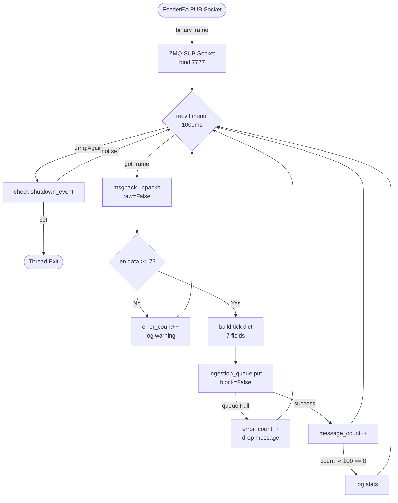
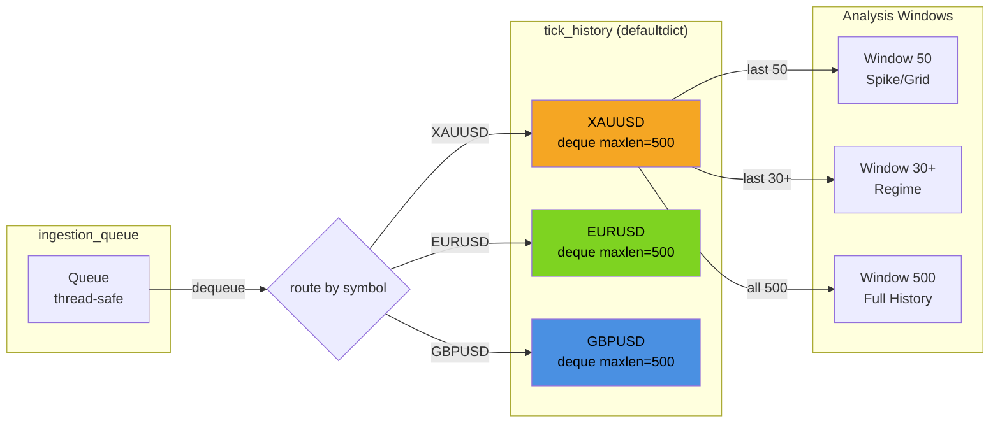
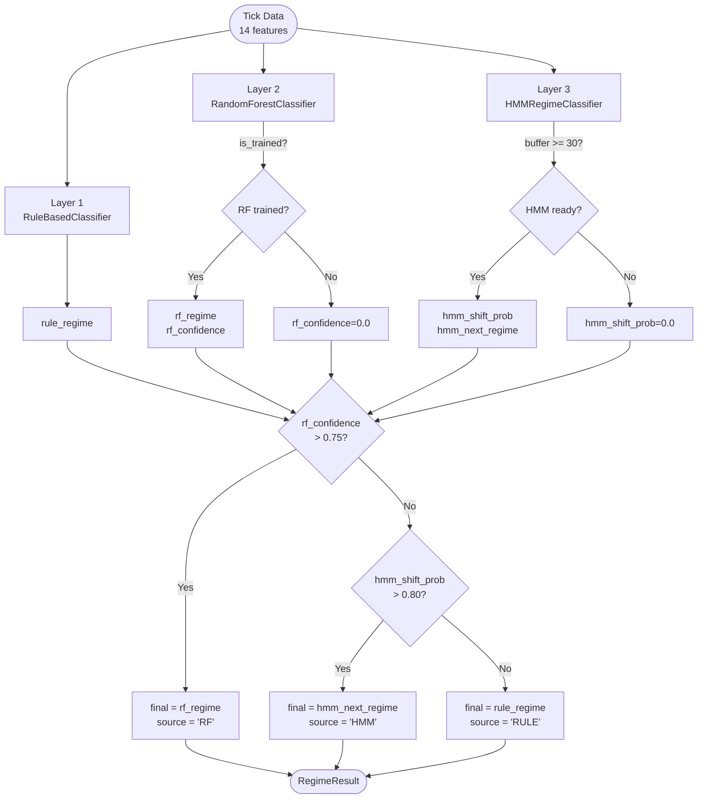
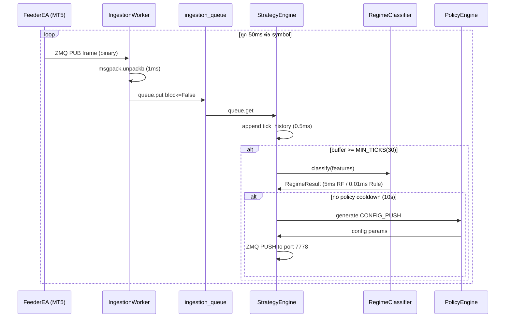
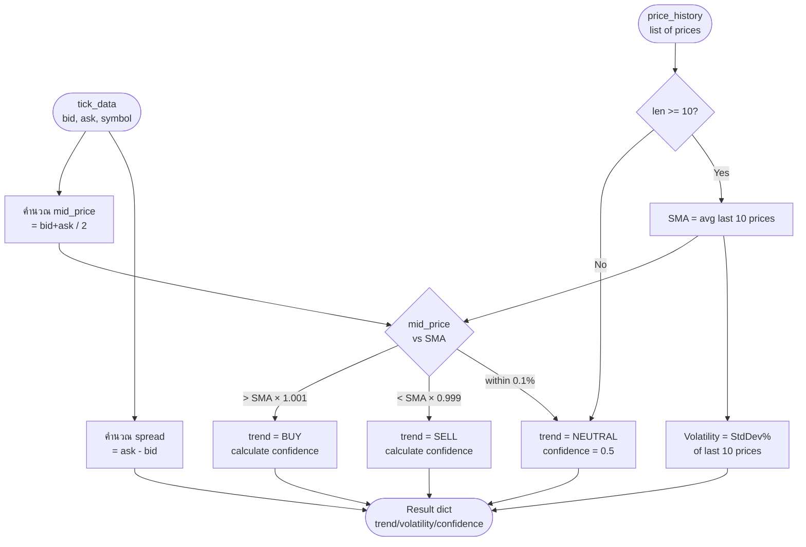

# SD03 — การประมวลผลสัญญาณฝั่ง Server และการจัดการข้อมูลแบบ Circular Buffer

**FlashEASuite V2 | System Deep-Dive Manual | Chapter 03**
**ไฟล์**: `docs/System_DeepDive_Manual/SD03_Server_Side_Signal_Processing.md`
**อัปเดตล่าสุด**: 2026-03-02

---

## สารบัญ

- [3.1 Inbound Management — IngestionWorkerThreaded](#31-inbound-management--ingestionworkerthreaded)
- [3.2 Circular Buffer Philosophy](#32-circular-buffer-philosophy)
- [3.3 RegimeClassifier — 3-Layer Composite](#33-regimeclassifier--3-layer-composite)
- [3.4 Processing Loop Timing](#34-processing-loop-timing)
- [3.5 MarketAnalyzer — analyze_market_condition()](#35-marketanalyzer--analyze_market_condition)

---

## 3.1 Inbound Management — IngestionWorkerThreaded

### แนวคิด (Philosophy)

ข้อมูล Tick จาก MT5 FeederEA ไหลเข้ามาที่ Brain ฝั่ง Python อย่างต่อเนื่อง ราว 20 ครั้งต่อวินาทีต่อ Symbol ปัญหาหลักของการรับข้อมูลความเร็วสูงคือ:

1. **การบล็อก thread หลัก** — ถ้า recv() บล็อกรอข้อมูลนานเกินไป Logic ทั้งระบบจะหยุดชะงัก
2. **การ deserialize ต้องเร็ว** — Binary MessagePack ต้องแกะ (unpack) ให้ทัน 20Hz
3. **ความปลอดภัยระหว่าง thread** — ข้อมูลต้องส่งต่อไปยัง StrategyEngine โดยไม่เกิด race condition

ทางออกคือการแยก `IngestionWorkerThreaded` ออกเป็น **thread เฉพาะ** ที่ทำหน้าที่เพียงอย่างเดียว: **รับข้อมูล → แกะข้อมูล → ใส่คิว** ส่วนการประมวลผลจะเกิดขึ้นใน thread อื่น

### หลักการ (Principle)

**ZMQ SUB Socket — Bind ฝั่ง Brain (ไม่ใช่ Connect)**

โดยปกติใน ZeroMQ ฝ่าย "Server" จะเป็น `bind()` และฝ่าย "Client" จะเป็น `connect()` แต่ใน FlashEASuite V2 **Brain เป็นฝ่าย bind** บน port 7777 ในขณะที่ FeederEA (MT5) เป็นฝ่าย connect เหตุผลคือ Brain เป็น process ที่เสถียรและรันตลอดเวลา ส่วน FeederEA อาจถูกรีสตาร์ทหรือเชื่อมต่อใหม่ได้ง่ายกว่า

```
FeederEA (MT5)           Brain (Python)
    PUB --connect()──►  bind()─SUB
         tcp://127.0.0.1:7777
```

**RCVTIMEO = 1000ms (1 วินาที)**

ค่า `RCVTIMEO` กำหนดว่า `recv()` จะรอนานแค่ไหนก่อน raise `zmq.Again` ค่า 1000ms หมายความว่าถ้าไม่มีข้อมูลเกิน 1 วินาที Worker จะตรวจสอบ `shutdown_event` แล้วกลับมารอใหม่ ทำให้สามารถปิด thread ได้ cleanly

**7-Element Array Protocol**

FeederEA ส่งข้อมูล Tick เป็น MessagePack binary array 7 ช่อง:

| Index | ชื่อ Field | ประเภท | ความหมาย |
|-------|-----------|---------|----------|
| 0 | `msg_type` | int | 1 = TICK_DATA |
| 1 | `seq_id` | int | Sequence ID สำหรับตรวจ packet loss |
| 2 | `timestamp` | int | Unix timestamp (milliseconds) |
| 3 | `symbol` | str | ชื่อ Symbol เช่น "XAUUSD.tp" |
| 4 | `bid` | float | ราคา Bid |
| 5 | `ask` | float | ราคา Ask |
| 6 | `flags` | int | Tick flags จาก MT5 |

### ผังงาน (Mermaid Flowchart)



### การพัฒนาโค้ด (Coding Level)

ไฟล์: `02_Brain/core/ingestion.py`

```python
class IngestionWorkerThreaded(threading.Thread):
    def __init__(
        self,
        ingestion_queue: queue.Queue,
        shutdown_event: threading.Event,
        zmq_sub_address: str = "tcp://127.0.0.1:7777"
    ):
        super().__init__(name="IngestionWorker")
        self.ingestion_queue = ingestion_queue
        self.shutdown_event = shutdown_event
        self.zmq_sub_address = zmq_sub_address
        self.message_count = 0
        self.error_count = 0
```

**จุดสำคัญที่ 1 — bind() ไม่ใช่ connect()**

```python
def _setup_zmq(self) -> bool:
    self.context = zmq.Context()
    self.sub_socket = self.context.socket(zmq.SUB)
    self.sub_socket.bind(self.zmq_sub_address)   # Brain เป็นฝ่าย bind
    self.sub_socket.setsockopt_string(zmq.SUBSCRIBE, "")  # Subscribe ทุก topic
    self.sub_socket.setsockopt(zmq.RCVTIMEO, 1000)        # timeout 1 วินาที
```

**จุดสำคัญที่ 2 — Non-blocking Queue Put**

```python
# ส่งต่อไป StrategyEngine ผ่าน thread-safe queue
self.ingestion_queue.put(tick, block=False)
```

การใช้ `block=False` ป้องกันไม่ให้ IngestionWorker หยุดรอในกรณีที่ StrategyEngine ช้า ถ้า queue เต็ม (ซึ่งไม่ควรเกิด) จะ drop message แทนการบล็อก

**จุดสำคัญที่ 3 — Parse & Validate**

```python
def _parse_tick_data(self, raw_data: bytes) -> Dict[str, Any]:
    data = msgpack.unpackb(raw_data, raw=False)

    if not isinstance(data, list) or len(data) < 7:
        raise ValueError("Invalid data format")

    tick = {
        'msg_type':  data[0],   # 1 = TICK_DATA
        'seq_id':    data[1],   # Sequence ID
        'timestamp': data[2],   # ms timestamp
        'symbol':    data[3],   # "XAUUSD.tp"
        'bid':       data[4],   # Bid price
        'ask':       data[5],   # Ask price
        'flags':     data[6]    # Tick flags
    }
    return tick
```

**ตัวอย่างตัวเลข (Numerical Example)**

สมมติ FeederEA ส่ง tick ของ XAUUSD.tp:
```
Raw bytes (hex): 97 01 00 cd 07 bc cb 41 77 6e 80 00 00 00 00 ...
Decoded array:   [1, 0, 1989, "XAUUSD.tp", 2340.15, 2340.35, 4]

tick = {
    'msg_type':  1,
    'seq_id':    0,
    'timestamp': 1989,       # ms (เวลา)
    'symbol':    "XAUUSD.tp",
    'bid':       2340.15,
    'ask':       2340.35,
    'flags':     4
}
spread = ask - bid = 2340.35 - 2340.15 = 0.20 USD
```

> **สรุปแนวคิด 3.1**
> `IngestionWorkerThreaded` เป็น thread เฉพาะที่แยกออกมาจาก Logic หลัก ทำหน้าที่รับ binary frame จาก FeederEA ผ่าน ZMQ SUB socket (Brain เป็นฝ่าย bind พอร์ต 7777) แกะข้อมูล MessagePack เป็น dict 7 fields แล้วส่งต่อผ่าน thread-safe queue การออกแบบนี้ทำให้ IngestionWorker ไม่บล็อก Strategy Engine และระบบสามารถ shutdown ได้ cleanly ผ่าน `shutdown_event`

---

## 3.2 Circular Buffer Philosophy

### แนวคิด (Philosophy)

ในการวิเคราะห์ตลาด Tick ที่เก่าเกินไปไม่มีประโยชน์ อีกทั้งการเก็บ Tick ทุกตัวตลอด session จะกิน RAM ไม่หยุด แนวคิด **Circular Buffer** แก้ปัญหาทั้งสองด้วยโครงสร้างข้อมูลชนิดเดียว: `collections.deque` พร้อม `maxlen`

เปรียบเสมือน **เทปบันทึกวิดีโอ VHS แบบวนซ้ำ** — เมื่อเต็มแล้ว ระบบจะทับข้อมูลเก่าด้วยข้อมูลใหม่โดยอัตโนมัติ โดยไม่ต้องเขียน Code จัดการเอง

### หลักการ (Principle)

**การสร้าง Tick History ใน StrategyEngine**

```python
from collections import defaultdict, deque

tick_history = defaultdict(lambda: deque(maxlen=500))
```

`defaultdict` ทำให้สร้าง deque ใหม่อัตโนมัติสำหรับ symbol ใหม่ ไม่ต้อง initialize ล่วงหน้า

**ทำไมต้อง maxlen=500?**

| ตัวเลข | ความหมาย |
|--------|---------|
| 20 Hz | อัตรา Tick จาก FeederEA (20 ครั้ง/วินาที) |
| 500 ticks | 500 / 20 = **25 วินาที** ของ Tick History |
| 30 ticks | MIN_TICKS = ขั้นต่ำสำหรับ Regime Classification |
| 50 ticks | หน้าต่างวิเคราะห์ Spike/Grid |

25 วินาทีเป็นระยะเวลาที่เพียงพอสำหรับ:
- ตรวจจับ Regime shift (trend เปลี่ยน)
- คำนวณ volatility ระยะสั้น
- วิเคราะห์ Spike pattern

**การทำงานของ deque แบบ Circular**

```
เพิ่ม Tick ที่ 501 ลงใน deque ที่เต็มแล้ว:

ก่อน: [T1, T2, T3, ... T499, T500]  ← maxlen=500
หลัง: [T2, T3, T4, ... T500, T501]  ← T1 ถูกลบออกอัตโนมัติ
```

Python `deque` จัดการนี้เองทั้งหมด ไม่มี explicit eviction code

**Per-Symbol Isolation**

แต่ละ symbol มี deque เป็นของตัวเอง:
```python
tick_history["XAUUSD"]   # deque maxlen=500 สำหรับ XAUUSD
tick_history["EURUSD"]   # deque maxlen=500 สำหรับ EURUSD
tick_history["GBPUSD"]   # deque maxlen=500 สำหรับ GBPUSD
```

**Window Sizes ที่ใช้งานจริง**

| Window | ขนาด (ticks) | ใช้ใน | ความหมาย |
|--------|-------------|-------|----------|
| MIN_TICKS | 30 | RegimeClassifier | ขั้นต่ำก่อนวิเคราะห์ |
| Spike Window | 50 | S16_SPIKE | ตรวจจับ price spike |
| Grid Window | 50 | S15_GRID | วิเคราะห์ grid range |
| Full Buffer | 500 | Regime (full) | ประวัติ 25 วินาที |

### ผังงาน (Mermaid Flowchart)



### การพัฒนาโค้ด (Coding Level)

**การ append และ auto-evict**

```python
# เมื่อ StrategyEngine dequeue tick จาก ingestion_queue
tick = ingestion_queue.get(block=True, timeout=1.0)

symbol = tick['symbol']
tick_history[symbol].appendleft(tick)   # ใส่ที่ต้น deque
# หรือ append(tick) ใส่ที่ท้าย — ขึ้นอยู่กับ convention
# ถ้า deque เต็ย (len=500) ข้อมูลฝั่งตรงข้ามจะถูกลบออกอัตโนมัติ
```

**การอ่าน Window สำหรับ Analysis**

```python
# ดึง 50 tick ล่าสุดสำหรับ Spike Analysis
history = tick_history["XAUUSD"]

if len(history) >= 50:
    window_50 = list(history)[-50:]   # 50 ticks ล่าสุด

# ดึง 30 tick สำหรับ Regime (MIN_TICKS)
if len(history) >= 30:
    window_30 = list(history)[-30:]
```

**ตัวอย่างตัวเลข — Memory Usage**

สมมติระบบติดตาม 5 symbols พร้อมกัน:
```
Symbols: XAUUSD, EURUSD, GBPUSD, USDJPY, GBPJPY

แต่ละ Tick dict มีขนาดประมาณ:
  - 7 fields × ~8 bytes each = ~56 bytes
  - Python overhead ≈ 200 bytes per dict

Buffer size ต่อ symbol = 500 ticks × 200 bytes = 100 KB
Total สำหรับ 5 symbols = 5 × 100 KB = 500 KB

เทียบกับ Unlimited Buffer:
  - Session 8 ชั่วโมง × 3600 วินาที × 20 Hz = 576,000 ticks/symbol
  - 576,000 × 200 bytes = 115 MB ต่อ symbol
  - 5 symbols = 576 MB — ไม่ยั่งยืน!
```

maxlen=500 ทำให้ RAM คงที่ที่ ~500 KB ไม่ว่า session จะยาวแค่ไหน

> **สรุปแนวคิด 3.2**
> `tick_history` ใช้ `defaultdict(lambda: deque(maxlen=500))` เพื่อสร้าง Circular Buffer อัตโนมัติต่อ Symbol ขนาด 500 ticks ครอบคลุม ~25 วินาที ที่ 20Hz ซึ่งเพียงพอสำหรับการวิเคราะห์ทุกประเภทในระบบ ข้อดีหลักคือ Memory ใช้งานคงที่และไม่มี code จัดการ eviction

---

## 3.3 RegimeClassifier — 3-Layer Composite

### แนวคิด (Philosophy)

**Market Regime** คือสภาวะตลาดในขณะนั้น — กำลัง trend อยู่ไหม? ผันผวนสูงไหม? หรือแคบตึง (squeeze)? การรู้ Regime ถูกต้องเป็นกุญแจสำคัญในการเลือก Strategy ที่เหมาะสม

FlashEASuite V2 ใช้ระบบ **3-Layer Composite** แทนที่จะใช้ Rule เดียว:

```
Layer 1: Rule-Based    → เร็ว ทำงานได้ทันที ไม่ต้อง train
Layer 2: Random Forest → แม่นยำ ทำงานเมื่อมีโมเดลที่ train แล้ว
Layer 3: HMM           → ทำนาย "กำลังจะเปลี่ยน Regime" ล่วงหน้า
```

เปรียบเสมือนแพทย์ 3 คน — คนที่ 1 ตรวจด้วยสายตา (rule), คนที่ 2 ตรวจด้วยอุปกรณ์ (ML), คนที่ 3 ทำนายจากประวัติ (HMM) ผลสุดท้ายใช้คำวินิจฉัยที่มั่นใจที่สุด

ไฟล์: `02_Brain/core/intelligence/regime_classifier.py`

### หลักการ (Principle)

**ENUM_MARKET_REGIME — 4 สภาวะตลาด**

```python
class Regime(IntEnum):
    RANGING  = 0   # ตลาดแคบ ไม่มี trend ชัดเจน
    TRENDING = 1   # ตลาดมี trend ทิศทางชัดเจน
    VOLATILE = 2   # ตลาดผันผวนสูง
    SQUEEZE  = 3   # ตลาดตึงมาก (กำลังจะระเบิด)
```

---

### Layer 1: Rule-Based Classifier

**Rule-Based** คือการตัดสินใจจากกฎง่ายๆ ด้วย indicator เชิงตัวเลข เหมาะสำหรับ:
- ทำงานได้ทันทีไม่ต้องเทรน
- ตรรกะเข้าใจง่าย อธิบายได้ชัดเจน
- ทำงานร่วมกับ MQL5 standalone ได้

**ค่าคงที่สำคัญ**

```python
ADX_ENTER_TRENDING = 27.0   # เข้า TRENDING เมื่อ ADX > 27
ADX_EXIT_TRENDING  = 23.0   # ออก TRENDING เมื่อ ADX < 23
ATR_MULT           = 1.5    # VOLATILE: ATR > 1.5 × MA(ATR)
BB_MULT            = 0.5    # SQUEEZE:  BB_Width < 0.5 × MA(BB_Width)
```

**Hysteresis — ป้องกัน Regime Thrashing**

Hysteresis คือการใช้ threshold ต่างกันสำหรับ "เข้า" และ "ออก" Regime ป้องกัน signal สั่นไปมาเมื่อ ADX อยู่ใกล้ขอบเขต:

```
ตัวอย่าง: ADX = 25 (อยู่ระหว่าง 23 และ 27)

ถ้าไม่มี Hysteresis:
  ADX ขึ้นเป็น 28 → TRENDING
  ADX ลงเป็น 26  → RANGING  ← สั่น!
  ADX ขึ้นเป็น 27 → TRENDING ← สั่น!

ด้วย Hysteresis:
  ถ้า _in_trending=False: ต้องเกิน 27 จึงจะเข้า TRENDING
  ถ้า _in_trending=True:  ต้องต่ำกว่า 23 จึงจะออก TRENDING
  → ADX ที่ 25-27 จะ "ติดอยู่" ใน state เดิม
```

**ลำดับความสำคัญ (Priority)**

```
VOLATILE > SQUEEZE > TRENDING > RANGING
```

```python
class RuleBasedClassifier:
    def classify(self, adx, atr, atr_ma, bb_width, bb_width_ma) -> Regime:
        # 1. VOLATILE (ความสำคัญสูงสุด)
        if atr_ma > 0 and atr > ATR_MULT * atr_ma:
            self._in_trending = False
            return Regime.VOLATILE

        # 2. SQUEEZE
        if bb_width_ma > 0 and bb_width < BB_MULT * bb_width_ma:
            self._in_trending = False
            return Regime.SQUEEZE

        # 3. TRENDING (พร้อม Hysteresis)
        if self._in_trending:
            if adx < ADX_EXIT_TRENDING:    # ออก
                self._in_trending = False
        else:
            if adx >= ADX_ENTER_TRENDING:  # เข้า
                self._in_trending = True

        if self._in_trending:
            return Regime.TRENDING

        # 4. RANGING (default)
        return Regime.RANGING
```

**ตัวอย่างตัวเลข Layer 1**

```
สถานการณ์ XAUUSD เวลา 14:30 UTC:
  ADX       = 31.5
  ATR       = 2.8
  ATR_MA    = 1.9
  BB_Width  = 0.045
  BB_Width_MA = 0.040

คำนวณ:
  VOLATILE? ATR > 1.5 × ATR_MA → 2.8 > 1.5 × 1.9 = 2.85 → 2.8 < 2.85 → NO
  SQUEEZE?  BB_Width < 0.5 × BB_Width_MA → 0.045 < 0.5 × 0.040 = 0.020 → NO
  TRENDING? ADX=31.5 > 27 AND _in_trending=False → เข้า TRENDING → YES

Result: REGIME = TRENDING (source=RULE)
```

---

### Layer 2: Random Forest Classifier

**Random Forest** เป็น ML model ที่เทรนด้วยข้อมูลย้อนหลัง 6 เดือน ให้ความแม่นยำ > 80% เมื่อ confidence > 75%

**12 Features ที่ใช้**

```python
FEATURE_NAMES = [
    "adx",              # Directional movement strength
    "atr",              # True range (volatility absolute)
    "atr_norm",         # atr / close price
    "bb_width",         # Bollinger Band width
    "bb_width_norm",    # bb_width / MA(bb_width)
    "volume",           # Trading volume
    "volume_ma_ratio",  # volume / MA(volume)
    "rsi",              # Momentum oscillator
    "stoch_k",          # Stochastic %K
    "stoch_d",          # Stochastic %D (smoothed %K)
    "price_change",     # (close - close[14]) / close[14]
    "session",          # 0=Asian 1=London 2=NY 3=Overlap
]
```

**Configuration**

```python
from sklearn.ensemble import RandomForestClassifier as _RFC

self._model = _RFC(
    n_estimators=200,         # 200 decision trees
    max_depth=8,              # ความลึกสูงสุดของ tree
    min_samples_leaf=10,      # ป้องกัน overfitting
    class_weight="balanced",  # จัดการ class imbalance
    n_jobs=-1,                # ใช้ CPU ทุก core
    random_state=42,
)
```

**การ Predict — คืน (regime, confidence)**

```python
def predict(self, x: np.ndarray) -> Tuple[Regime, float]:
    x_scaled = self._scaler.transform(x.reshape(1, -1))
    proba = self._model.predict_proba(x_scaled)[0]
    # proba = [P(RANGING), P(TRENDING), P(VOLATILE), P(SQUEEZE)]
    idx = int(np.argmax(proba))
    return Regime(idx), float(proba[idx])
```

**ตัวอย่างตัวเลข Layer 2**

```
Input features (XAUUSD ช่วงที่กำลัง trend):
  adx=31.5, atr=2.8, atr_norm=0.0012, bb_width=0.045, bb_width_norm=1.12,
  volume=1850, volume_ma_ratio=1.34, rsi=64.2,
  stoch_k=72.1, stoch_d=68.5, price_change=0.0025, session=2 (NY)

RF output:
  proba = [0.08, 0.87, 0.04, 0.01]
         RANGING TRENDING VOLATILE SQUEEZE

  max = 0.87 (index=1=TRENDING)

  rf_regime = TRENDING
  rf_confidence = 0.87

ตรวจสอบ: 0.87 > RF_CONFIDENCE_THRESHOLD (0.75) → ผ่าน → ใช้ RF result
```

---

### Layer 3: HMM (Hidden Markov Model)

**HMM** ไม่ได้บอกว่า "ตอนนี้ Regime อะไร" แต่บอกว่า **"Regime กำลังจะเปลี่ยนไหม?"** เป็นระบบ early warning

**แนวคิด Hidden Markov Model**

```
Hidden States: RANGING(0), TRENDING(1), VOLATILE(2), SQUEEZE(3)
Observations:  [adx, atr_norm, bb_width_norm, rsi]

HMM เรียนรู้ transition probability:
  P(RANGING → TRENDING)  = 0.15
  P(TRENDING → RANGING)  = 0.12
  P(TRENDING → VOLATILE) = 0.08
  ...

เมื่อรู้ current state แล้ว:
  shift_prob = 1 - P(state → same state)
```

**Configuration**

```python
from hmmlearn import hmm

self._model = hmm.GaussianHMM(
    n_components=4,           # 4 hidden states = 4 regimes
    covariance_type="diag",   # diagonal covariance (robust)
    n_iter=100,               # EM iterations
    random_state=42,
)
```

**การ Decode ด้วย Viterbi Algorithm**

```python
def predict_shift(self, recent_window: np.ndarray) -> Tuple[float, Optional[Regime]]:
    window_scaled = self._scaler.transform(recent_window)

    # Viterbi decode: หา most probable state sequence
    _, state_seq = self._model.decode(window_scaled, algorithm="viterbi")
    current_state = int(state_seq[-1])   # state ปัจจุบัน

    # Transition row = P(current_state → next_state) for all next states
    trans_row = self._model.transmat_[current_state]

    # Shift probability = 1 - P(stay in same state)
    stay_prob  = float(trans_row[current_state])
    shift_prob = 1.0 - stay_prob

    # Next most probable state (excluding staying)
    next_proba = trans_row.copy()
    next_proba[current_state] = 0.0
    next_state  = int(np.argmax(next_proba))
    next_regime = self._state_to_regime.get(next_state, Regime.RANGING)

    return shift_prob, next_regime
```

**ตัวอย่างตัวเลข Layer 3**

```
HMM Buffer: 30 ตัวอย่างล่าสุด
Current State ที่ Viterbi decode ได้: State 1 (TRENDING)

Transition Matrix row 1 (TRENDING):
  → RANGING  (0): 0.12
  → TRENDING (1): 0.78  ← stay_prob
  → VOLATILE (2): 0.08
  → SQUEEZE  (3): 0.02

shift_prob = 1 - 0.78 = 0.22 (22%)

ตรวจสอบ: 0.22 < HMM_SHIFT_PROB_THRESHOLD (0.80) → ไม่ override
→ ใช้ RF result แทน

สถานการณ์ที่ HMM ทำงาน (shift_prob สูง):
  → RANGING  (0): 0.75  ← next most probable
  → TRENDING (1): 0.15  ← current state
  → VOLATILE (2): 0.08
  → SQUEEZE  (3): 0.02

  shift_prob = 1 - 0.15 = 0.85 > 0.80 → HMM Override!
  next_regime = RANGING (early warning)
```

---

### Combined Decision Logic

```python
# ใน RegimeClassifier.classify()

# Layer 1: Rule-Based (ทุกครั้ง)
rule_regime = self.rule_clf.classify(adx, atr, atr_ma, bb_width, bb_width_ma)

# Layer 2: RF (ถ้ามีโมเดล)
if self.rf_clf.is_trained:
    rf_regime, rf_confidence = self.rf_clf.predict(x_rf)

# Layer 3: HMM (ถ้ามี buffer ครบ 30 bars)
if self.hmm_clf.is_trained and len(self._hmm_buffer) >= 30:
    hmm_shift_prob, hmm_next_regime = self.hmm_clf.predict_shift(window)

# Combined Decision
if rf_confidence > 0.75 and rf_regime is not None:
    final_regime = rf_regime
    source = "RF"
elif hmm_shift_prob > 0.80 and hmm_next_regime is not None:
    final_regime = hmm_next_regime
    source = "HMM"
else:
    final_regime = rule_regime
    source = "RULE"
```

### ผังงาน — Combined Decision (Mermaid)



**ตารางสรุป Layer Comparison**

| คุณสมบัติ | Layer 1 Rule-Based | Layer 2 RF | Layer 3 HMM |
|----------|-------------------|-----------|------------|
| ต้องเทรน | ไม่ต้อง | ต้องใช้ข้อมูล 6 เดือน | ต้องใช้ข้อมูล 6 เดือน |
| Latency | ~0.01ms | ~5ms | ~10ms |
| Accuracy | ปานกลาง | > 80% (ถ้า conf > 75%) | ทำนาย shift ล่วงหน้า |
| Override threshold | ไม่มี (default) | confidence > 0.75 | shift_prob > 0.80 |
| จุดเด่น | เสถียร ทำงานเสมอ | แม่นยำ ใช้ ML | Early warning |

> **สรุปแนวคิด 3.3**
> RegimeClassifier ใช้สถาปัตยกรรม 3 ชั้น: Rule-Based ทำงานเสมอ, Random Forest override เมื่อ confidence > 75%, HMM override เมื่อ shift probability > 80% Output เป็น `RegimeResult` พร้อม enum RANGING/TRENDING/VOLATILE/SQUEEZE และ source ที่บอกว่า Layer ไหนตัดสินใจ Logic นี้ทำให้ระบบ gracefully degrade — ถ้า ML model ไม่พร้อม Rule-Based ยังทำงานได้

---

## 3.4 Processing Loop Timing

### แนวคิด (Philosophy)

ระบบ Trading แบบ real-time มีข้อจำกัดด้านเวลาหลายระดับ ตั้งแต่ microsecond ไปจนถึงวินาที การเข้าใจ timing ของแต่ละ component ช่วยให้ debug ได้เมื่อเกิดปัญหา และออกแบบ cooldown ได้อย่างเหมาะสม

### หลักการ (Principle)

**Timing Budget ทั้งระบบ**

```
FeederEA tick interval:    50ms  (20 Hz = ทุก 50ms ต่อ Symbol)
ZMQ RCVTIMEO:            1000ms  (1 วินาที ถ้าไม่มี tick)
IngestionWorker loop:      ~1ms  (receive + parse + queue.put)
StrategyEngine dequeue:    ~2ms  (dequeue + route + append)
RegimeClassifier:          ~5ms  (RF) หรือ ~0.01ms (Rule)
Policy cooldown:           10s   (POLICY_COOLDOWN ต่อ symbol)
Brain startup delay:        0.5s  (ZMQ slow joiner fix)
```

**Brain Startup Sequence — ZMQ Slow Joiner**

ZMQ มีปัญหาที่เรียกว่า "slow joiner syndrome" — เมื่อ Publisher เริ่มส่งข้อมูลทันทีหลัง bind() Subscriber ที่ connect() ในช่วงนั้นอาจพลาด message แรกๆ

```python
# ใน Brain main.py
# เริ่ม workers ทีละตัว โดยรอ 0.5s ระหว่างกัน
workers = [ingestion_worker, strategy_engine, execution_listener]
for worker in workers:
    worker.start()
    time.sleep(0.5)   # ZMQ slow joiner fix
```

**Policy Cooldown — ป้องกัน Order Spam**

`POLICY_COOLDOWN = 10s` หมายความว่าหลังจากส่ง CONFIG_PUSH สำหรับ symbol ใดแล้ว ระบบจะไม่ส่งอีกภายใน 10 วินาที ป้องกันการสร้าง order ซ้ำจาก tick ที่มาถี่มาก

```python
# ใน StrategyEngine
POLICY_COOLDOWN = 10.0  # seconds

def _check_policy_cooldown(self, symbol: str) -> bool:
    last_push = self._last_push_time.get(symbol, 0.0)
    if time.time() - last_push < POLICY_COOLDOWN:
        return False  # ยังอยู่ใน cooldown
    return True

def _process_tick(self, tick: dict) -> None:
    symbol = tick['symbol']

    # Append ไป circular buffer
    self.tick_history[symbol].append(tick)

    # ตรวจสอบ cooldown
    if not self._check_policy_cooldown(symbol):
        return

    # วิเคราะห์และส่ง CONFIG_PUSH
    # ...
    self._last_push_time[symbol] = time.time()
```

### ผังงาน — Full Timing Diagram



**ตัวอย่างตัวเลข — Throughput**

```
5 Symbols × 20 Hz = 100 ticks/วินาที
แต่ละ tick processing: ~7ms (IngestionWorker + StrategyEngine + Regime)
Total processing load: 100 × 7ms = 700ms/วินาที

เทียบกับ 1 CPU core = 1000ms/วินาที
Load = 700/1000 = 70% → ปลอดภัย (< 80%)

ถ้าเพิ่ม symbol เป็น 8:
  8 × 20 × 7ms = 1120ms > 1000ms → เกิน 1 core
  → ต้องใช้ multithreading หรือลด polling rate
```

> **สรุปแนวคิด 3.4**
> Timing ของระบบออกแบบมาให้ IngestionWorker ทำงานแยก thread ไม่บล็อก StrategyEngine Brain startup ใช้ 0.5s delay ระหว่าง worker เพื่อแก้ ZMQ slow joiner Policy cooldown 10 วินาทีป้องกัน CONFIG_PUSH ซ้ำ สำหรับ 5 symbols ที่ 20Hz ระบบใช้ CPU ~70% ซึ่งปลอดภัย

---

## 3.5 MarketAnalyzer — analyze_market_condition()

### แนวคิด (Philosophy)

`MarketAnalyzer` ใน `02_Brain/core/strategy/analysis.py` เป็น helper module ที่ทำการวิเคราะห์ตลาดระดับพื้นฐาน ให้ข้อมูล trend direction, volatility, และ confidence score จาก tick buffer ที่มีอยู่

Function หลักคือ `analyze_market_condition()` ซึ่งเป็น stateless function (ไม่ต้องสร้าง instance) ออกแบบมาให้เรียกใช้ง่ายจาก StrategyEngine

### หลักการ (Principle)

**Input และ Output**

```python
def analyze_market_condition(
    tick_data: Dict[str, Any],
    price_history: Optional[list] = None,
    **kwargs
) -> Dict[str, Any]:
```

Input:
- `tick_data`: tick ล่าสุด (symbol, bid, ask, timestamp)
- `price_history`: list ของราคาก่อนหน้า (optional)

Output:
```python
{
    'symbol':     str,    # ชื่อ symbol
    'price':      float,  # mid price = (bid + ask) / 2
    'bid':        float,
    'ask':        float,
    'spread':     float,  # ask - bid
    'spread_pct': float,  # spread / bid × 100
    'trend':      str,    # 'BUY', 'SELL', หรือ 'NEUTRAL'
    'volatility': float,  # standard deviation % ของราคา
    'confidence': float,  # 0.0 ถึง 0.8
    'timestamp':  int
}
```

**Algorithm — SMA Trend Detection**

```python
if price_history and len(price_history) >= 10:
    recent_prices = price_history[-10:]

    # Simple Moving Average จาก 10 ราคาล่าสุด
    sma = sum(recent_prices) / len(recent_prices)

    # mid price = (bid + ask) / 2
    mid_price = (bid + ask) / 2

    # Trend detection ด้วย 0.1% threshold
    if mid_price > sma * 1.001:     # ราคาสูงกว่า SMA 0.1%
        trend = 'BUY'
        distance = (mid_price - sma) / sma
        confidence = min(0.8, 0.5 + distance * 100)

    elif mid_price < sma * 0.999:   # ราคาต่ำกว่า SMA 0.1%
        trend = 'SELL'
        distance = (sma - mid_price) / sma
        confidence = min(0.8, 0.5 + distance * 100)

    # Volatility = Standard Deviation %
    mean = sum(recent_prices) / len(recent_prices)
    variance = sum((x - mean)**2 for x in recent_prices) / len(recent_prices)
    volatility = (variance ** 0.5 / mean) * 100
```

**ตัวอย่างตัวเลข**

```
สถานการณ์: EURUSD กำลัง trend ขึ้น

price_history = [1.0820, 1.0825, 1.0830, 1.0835, 1.0840,
                 1.0845, 1.0850, 1.0855, 1.0860, 1.0865]
tick_data = {'bid': 1.0870, 'ask': 1.0872}

คำนวณ:
  sma = sum(price_history) / 10 = 10.8425 / 10 = 1.08425
  mid_price = (1.0870 + 1.0872) / 2 = 1.0871
  spread = 1.0872 - 1.0870 = 0.0002
  spread_pct = 0.0002 / 1.0870 × 100 = 0.0184%

  trend check: mid_price > sma × 1.001?
    1.0871 > 1.08425 × 1.001 = 1.08533?
    1.0871 > 1.08533 → YES → trend = 'BUY'

  distance = (1.0871 - 1.08425) / 1.08425 = 0.00285 / 1.08425 = 0.00263
  confidence = min(0.8, 0.5 + 0.00263 × 100) = min(0.8, 0.763) = 0.763

  volatility:
    mean = 1.08425
    variance = sum((x - 1.08425)^2 for x) / 10
    std ≈ 0.001480
    volatility% = 0.001480 / 1.08425 × 100 = 0.1365%

Output:
  {'trend': 'BUY', 'confidence': 0.763, 'volatility': 0.137, 'spread': 0.0002}
```

### ผังงาน (Mermaid)



**การใช้งานใน StrategyEngine**

```python
# ใน engine.py เมื่อประมวลผล tick
from .analysis import analyze_market_condition

# สร้าง price_history จาก tick_history buffer
prices = [t['bid'] for t in list(tick_history[symbol])[-10:]]

# วิเคราะห์
market = analyze_market_condition(
    tick_data=tick,
    price_history=prices
)

# ใช้ผลลัพธ์
if market['trend'] == 'BUY' and market['confidence'] > 0.65:
    # พิจารณาส่ง BUY signal
    pass
```

> **สรุปแนวคิด 3.5**
> `analyze_market_condition()` เป็น stateless helper function ที่ประมวลผล tick data พร้อม price history เพื่อคืน trend direction (BUY/SELL/NEUTRAL), volatility %, และ confidence score โดยใช้ SMA 10-period เป็น reference point function นี้เป็น lightweight analysis ที่เสริม RegimeClassifier ซึ่งทำการวิเคราะห์เชิงลึกกว่า

---

## ภาคผนวก — ไฟล์ที่เกี่ยวข้อง

| ไฟล์ | บทบาทใน Chapter นี้ |
|------|-------------------|
| `02_Brain/core/ingestion.py` | `IngestionWorkerThreaded` — ZMQ receive loop |
| `02_Brain/core/strategy/engine.py` | `tick_history` deque, policy cooldown |
| `02_Brain/core/strategy/analysis.py` | `analyze_market_condition()` |
| `02_Brain/core/intelligence/regime_classifier.py` | 3-Layer RegimeClassifier |

## ภาคผนวก — Constants Quick Reference

```python
# ingestion.py
RCVTIMEO = 1000          # ms — ZMQ receive timeout
ZMQ_PORT = 7777          # Brain binds, FeederEA connects

# engine.py
TICK_HISTORY_MAXLEN = 500   # Circular buffer size
MIN_TICKS = 30              # ขั้นต่ำก่อนวิเคราะห์
POLICY_COOLDOWN = 10.0      # วินาที — ป้องกัน CONFIG_PUSH ซ้ำ

# regime_classifier.py
ADX_ENTER_TRENDING = 27.0
ADX_EXIT_TRENDING  = 23.0
ATR_MULT           = 1.5
BB_MULT            = 0.5
RF_CONFIDENCE_THRESHOLD  = 0.75
HMM_SHIFT_PROB_THRESHOLD = 0.80
HMM_WINDOW = 30             # bars fed into HMM
```

---

*SD03 — FlashEASuite V2 System Deep-Dive Manual*
*เขียนโดย: Senior Systems Architect | อ้างอิงโค้ดจริง P9-5 Production Build*
