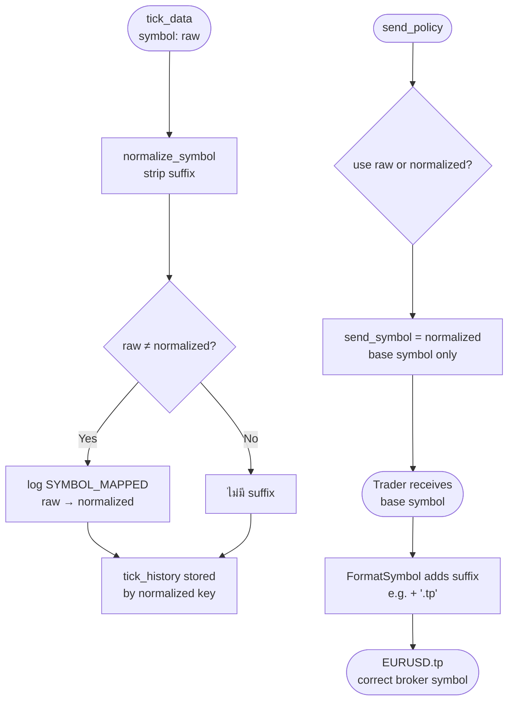
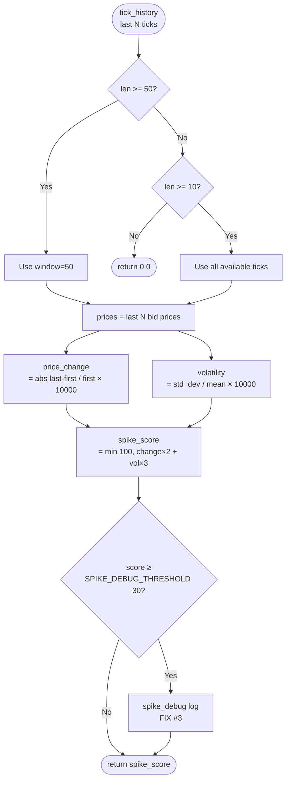
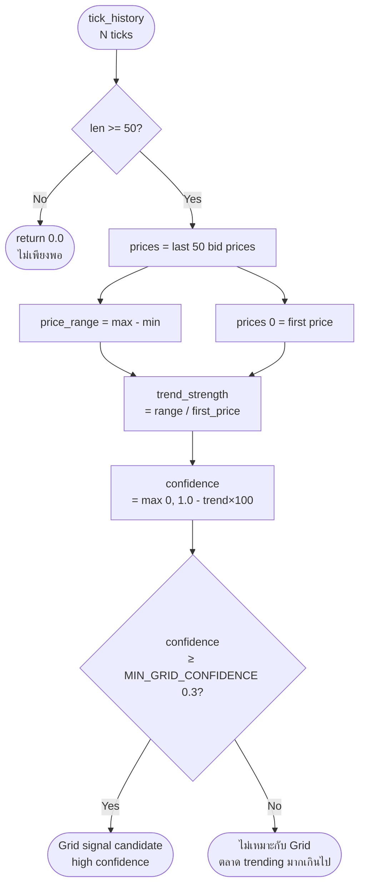
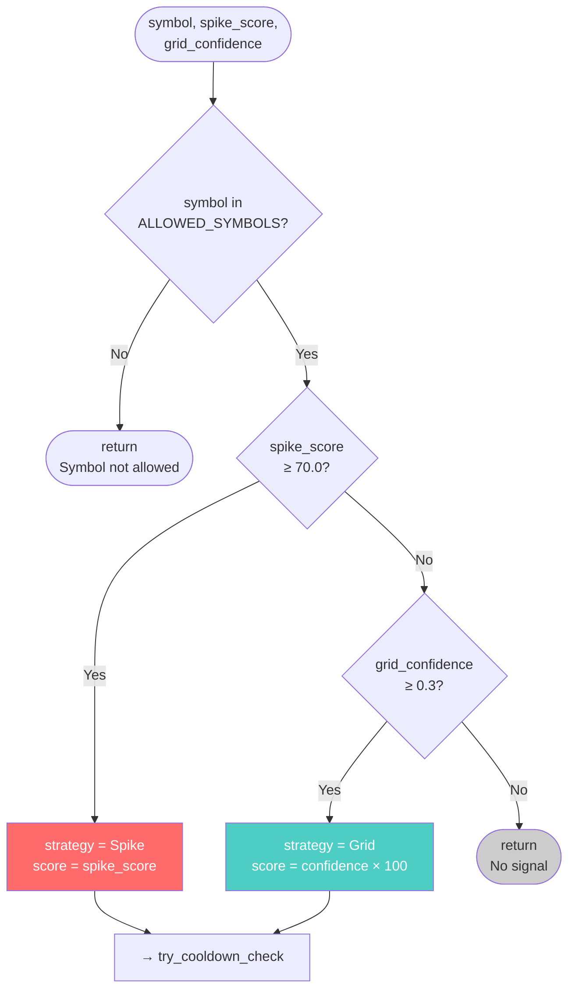
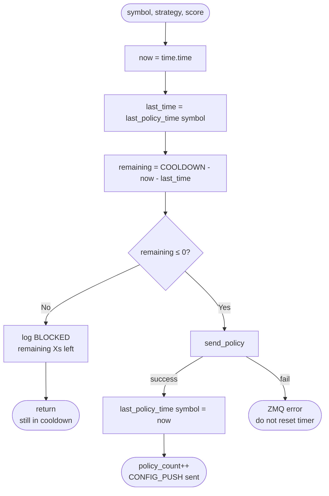
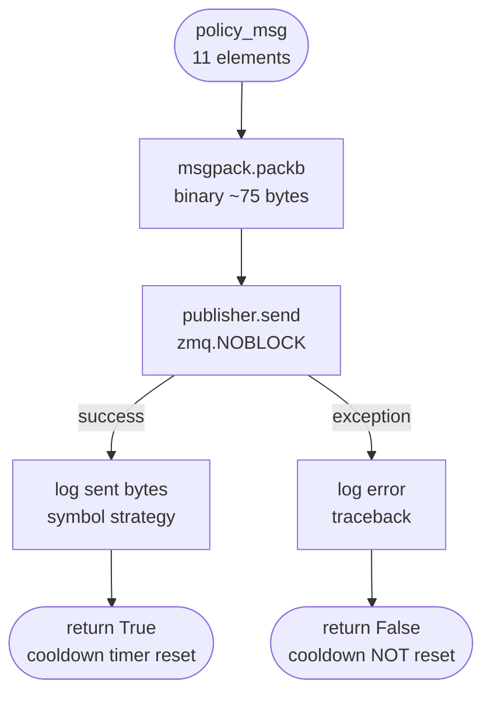

# SD04 — กลไกการคัดเลือกกลยุทธ์และการสร้าง Policy

**FlashEASuite V2 | System Deep-Dive Manual | Chapter 04**
**ไฟล์**: `docs/System_DeepDive_Manual/SD04_Strategy_Selection_Policy_Generation.md`
**อัปเดตล่าสุด**: 2026-03-02

---

## สารบัญ

- [4.1 StrategyEngineThreaded — หัวใจการตัดสินใจ](#41-strategyenginethreaded--หัวใจการตัดสินใจ)
- [4.2 Symbol Normalization — การจัดการ Broker Suffix](#42-symbol-normalization--การจัดการ-broker-suffix)
- [4.3 Spike Score — การวัดแรงกระแทกของราคา](#43-spike-score--การวัดแรงกระแทกของราคา)
- [4.4 Grid Confidence — การวัดความเหมาะสมของ Grid](#44-grid-confidence--การวัดความเหมาะสมของ-grid)
- [4.5 Strategy Selection Logic — กฎการเลือกกลยุทธ์](#45-strategy-selection-logic--กฎการเลือกกลยุทธ์)
- [4.6 Policy Cooldown — ป้องกัน ORDER SPAM](#46-policy-cooldown--ป้องกัน-order-spam)
- [4.7 Policy Message Construction — การสร้าง CONFIG_PUSH](#47-policy-message-construction--การสร้าง-config_push)
- [4.8 Grid Direction — ทิศทางของ Order](#48-grid-direction--ทิศทางของ-order)
- [4.9 ZMQ Dispatch — การส่ง Policy ไปยัง Trader](#49-zmq-dispatch--การส่ง-policy-ไปยัง-trader)
- [4.10 DebugLogger & Dashboard — ระบบตรวจสอบ](#410-debuglogger--dashboard--ระบบตรวจสอบ)

---

## 4.1 StrategyEngineThreaded — หัวใจการตัดสินใจ

### แนวคิด (Philosophy)

หลังจาก `IngestionWorkerThreaded` รับ tick และ `RegimeClassifier` จัดประเภทสภาวะตลาดแล้ว **StrategyEngineThreaded** คือ module ที่ตัดสินใจว่า "จะส่ง trade signal ไหม? ถ้าส่ง — ส่งกลยุทธ์ไหน? ด้วยพารามิเตอร์อะไร?"

ปัญหาหลักในการตัดสินใจแบบ real-time คือ:
1. **False signals** — ทุก tick มี "noise" สัญญาณที่ดูดีในกรอบเล็กอาจไม่จริงในกรอบใหญ่
2. **ORDER SPAM** — ถ้าส่ง signal ทุก tick ที่ผ่าน threshold Trader จะได้รับ CONFIG_PUSH หลายร้อยข้อความต่อวินาที
3. **Symbol Mismatch** — Broker ต่างกันใช้ชื่อ symbol ต่างกัน ("EURUSD" vs "EURUSD.tp") ต้องแปลงก่อนและหลังเสมอ

StrategyEngineThreaded แก้ปัญหาเหล่านี้ผ่าน **9-checkpoint pipeline** ที่แต่ละ tick ต้องผ่านก่อนจะกลายเป็น CONFIG_PUSH

ไฟล์: `02_Brain/core/strategy/engine.py`
เวอร์ชัน: **v2.3** (Fixed Spike Detection)

### หลักการ (Principle)

**สถาปัตยกรรมหลักของ Class**

```python
class StrategyEngineThreaded:
    def __init__(self, ingestion_queue, signal_queue, feedback_queue,
                 shutdown_event, zmq_pub_address):
        self.config     = StrategyConfig()       # ค่า threshold ทั้งหมด
        self.logger     = DebugLogger()          # ระบบ log แบบ checkpoint
        self.publisher  = None                   # ZMQ PUB socket (port 7778)

        # FIX #1: Keyed by NORMALIZED symbol (ไม่มี suffix)
        self.tick_history     = defaultdict(lambda: deque(maxlen=500))
        self.symbol_map       = {}               # raw_symbol → normalized
        self.last_policy_time = defaultdict(float)
        self.spike_scores     = {}
        self.risk_multiplier  = 1.0
```

**ค่า Configuration สำคัญ (StrategyConfig)**

| ค่าคงที่ | ค่า | ความหมาย |
|---------|-----|---------|
| `MIN_SPIKE_SCORE` | 70.0 | Spike score ขั้นต่ำที่จะส่ง Spike signal |
| `MIN_GRID_CONFIDENCE` | 0.3 | Grid confidence ขั้นต่ำที่จะส่ง Grid signal |
| `MIN_TICKS_REQUIRED` | 30 | จำนวน tick ขั้นต่ำก่อนเริ่มวิเคราะห์ (FIX #4) |
| `SPIKE_SCORE_WINDOW` | 50 | จำนวน tick ที่ใช้คำนวณ Spike score (FIX #2) |
| `POLICY_COOLDOWN` | 10 | วินาทีระหว่าง CONFIG_PUSH แต่ละอัน |
| `LOG_EVERY_N_TICKS` | 50 | ความถี่ในการ log (ทุก 50 ticks) |

**ภาพรวม Pipeline — 9 Checkpoints**

```
TICK เข้ามา
   │
   ▼ [CP1] รับ tick, normalize symbol, บันทึกใน tick_history
   │
   ▼ [CP2] ตรวจ MIN_TICKS_REQUIRED (30) — ถ้าไม่ถึง → หยุด
   │
   ▼ [CP3] เริ่ม Analysis
   │
   ├─► calculate_spike_score()   → spike_score
   ├─► calculate_grid_confidence() → grid_confidence
   │
   ▼ [CP4] บันทึก scores เสร็จ
   │
   ▼ [CP5] ตรวจ ALLOWED_SYMBOLS (12 symbols)
   │
   ▼ [CP6] ตรวจ SPIKE_THRESHOLD (≥ 70.0) → เลือก "Spike"?
   │
   ▼ [CP7] ตรวจ GRID_THRESHOLD (≥ 0.3) → เลือก "Grid"?
   │
   ├── ไม่ผ่านทั้งคู่ → หยุด (ไม่มี signal)
   │
   ▼ [CP8] ตรวจ POLICY_COOLDOWN — ยังอยู่ใน 10s window?
   │
   ▼ [CP9] send_policy() → pack MessagePack → ZMQ PUSH port 7778
```

> **สรุปแนวคิด 4.1**
> StrategyEngineThreaded ใช้ checkpoint 9 ขั้นที่ต้องผ่านทุกจุดก่อนส่ง CONFIG_PUSH ทำให้มั่นใจว่า Trader จะได้รับเฉพาะ signal ที่มีคุณภาพสูงเท่านั้น

---

## 4.2 Symbol Normalization — การจัดการ Broker Suffix

### แนวคิด (Philosophy)

Broker แต่ละรายใช้ชื่อ symbol ต่างกัน เช่น `"EURUSD.tp"`, `"EURUSD_m"`, `"EURUSD.raw"` แต่ข้อมูลทางเทคนิค (bid/ask/timestamp) นั้นเหมือนกันทุกประการ หาก tick history ถูกแยกเก็บโดย raw symbol — tick ของ `"EURUSD.tp"` จะไม่ถูก merge กับ tick ก่อนหน้าที่มาในชื่ออื่น ทำให้ buffer มี ticks น้อยกว่าที่ควร

**FIX #1 (v2.3)** แก้ปัญหานี้ด้วยการ normalize symbol ก่อนบันทึกใน `tick_history` ทุกครั้ง

### หลักการ (Principle)

**Suffix Patterns ที่รองรับ**

```python
SUFFIX_PATTERNS = [".tp", "_m", ".m", ".raw", ".pro", ".ecn", ".std"]
```

**ฟังก์ชัน normalize_symbol()**

```python
def normalize_symbol(symbol: str, suffix_patterns: list = None) -> str:
    result = symbol
    for suffix in suffix_patterns:
        if result.endswith(suffix):
            result = result[:-len(suffix)]
            break  # strip เพียง suffix เดียว
    return result
```

**กฎ "Strip One Only"**
ระบบ strip suffix เพียงชั้นเดียว ป้องกันการ strip symbol ที่มี suffix ซ้อนกัน:

```
"EURUSD.tp"  → strip ".tp"  → "EURUSD"    ✅
"EURUSD_m"   → strip "_m"   → "EURUSD"    ✅
"EURUSD.raw" → strip ".raw" → "EURUSD"    ✅
"EURUSD"     → ไม่มี match → "EURUSD"     ✅
```

**การใช้งานใน process_tick()**

```python
def process_tick(self, tick_data: Dict):
    raw_symbol = tick_data.get('symbol', 'UNKNOWN')

    # FIX #1: Normalize เสมอก่อนเก็บข้อมูล
    symbol = normalize_symbol(raw_symbol, self.config.SUFFIX_PATTERNS)

    # Track mapping (ครั้งแรกที่พบ)
    if raw_symbol not in self.symbol_map:
        self.symbol_map[raw_symbol] = symbol

    # เก็บด้วย NORMALIZED key — ทุก suffix รวมกันใน buffer เดียว
    self.tick_history[symbol].append(tick_data)
```

**Two-Key System**

| Key | ใช้ที่ | ตัวอย่าง |
|-----|--------|---------|
| `raw_symbol` | ส่งใน CONFIG_PUSH ไปยัง Trader | `"EURUSD.tp"` |
| `normalized` | เก็บใน `tick_history`, `last_policy_time`, `spike_scores` | `"EURUSD"` |

เหตุผลที่ต้องรักษา `raw_symbol`: Trader ใช้ฟังก์ชัน `FormatSymbol()` เพิ่ม broker suffix คืน ถ้า Brain ส่ง `"EURUSD.tp"` → Trader จะเพิ่ม suffix อีกชั้น → `"EURUSD.tp.tp"` (double suffix bug) ดังนั้น Brain ต้องส่ง base symbol (`"EURUSD"`) เสมอ และ Trader จะเพิ่ม suffix เองครั้งเดียว

```python
# ใน send_policy()
# ส่ง base symbol ไม่ใช่ raw — Trader เพิ่ม suffix กลับเอง
send_symbol = lookup_key   # "EURUSD" (normalized)
```

### ผังงาน (Mermaid Flowchart)



### ตัวอย่างตัวเลข

```
FeederEA ส่ง 3 tick ติดต่อกัน:
  Tick 1: {'symbol': 'XAUUSD.tp', 'bid': 2340.10}
  Tick 2: {'symbol': 'XAUUSD.tp', 'bid': 2340.15}
  Tick 3: {'symbol': 'XAUUSD.tp', 'bid': 2340.20}

หลัง normalize_symbol():
  raw: "XAUUSD.tp" → normalized: "XAUUSD"

tick_history:
  "XAUUSD": deque([tick1, tick2, tick3], maxlen=500)
             ← BUKAN "XAUUSD.tp" key — ทุก suffix merge ได้

Policy ที่ส่งออก:
  send_symbol = "XAUUSD"  (base)
  Trader FormatSymbol("XAUUSD") → "XAUUSD.tp" (เพิ่ม .tp กลับ)
```

> **สรุปแนวคิด 4.2**
> Symbol normalization ใช้ระบบ two-key: normalized key สำหรับ internal storage, base symbol สำหรับ CONFIG_PUSH เพื่อป้องกัน double-suffix bug การ merge tick history ด้วย normalized key ทำให้ buffer มี tick เพียงพอสำหรับการวิเคราะห์เสมอแม้ broker จะเปลี่ยน suffix

---

## 4.3 Spike Score — การวัดแรงกระแทกของราคา

### แนวคิด (Philosophy)

**Spike** คือการเคลื่อนไหวของราคาที่รุนแรงผิดปกติในช่วงเวลาสั้น เกิดจาก:
- ข่าวเศรษฐกิจสำคัญ (NFP, CPI, Fed Rate)
- การ trigger stop-loss cascade ของ retail traders
- การดำเนินการขนาดใหญ่ของ institutional players

**Spike Score** คือตัวเลขเดียวที่รวม "ความเร็ว" + "ความผันผวน" ของราคาในหน้าต่าง 50 ticks ล่าสุด ค่ายิ่งสูงยิ่งเป็น spike รุนแรง

**FIX #2 (v2.3)**: ขยาย window จาก 20 → 50 ticks เพื่อจับ spike ที่เกิดขึ้นช้าและลด false detection

### หลักการ (Principle)

**สูตรคำนวณ**

```python
spike_score = min(100, price_change * 2 + volatility * 3)
```

**สององค์ประกอบหลัก:**

**Price Change (pip)**: วัดการเคลื่อนไหวทิศทางรวมของ window
```python
price_change = abs(prices[-1] - prices[0]) / prices[0] * 10000  # in pips
# prices[0] = ราคาแรกสุดใน window
# prices[-1] = ราคาล่าสุดใน window
```

**Volatility (pip)**: วัดความผันผวนรอบ mean
```python
mean_price = sum(prices) / len(prices)
variance   = sum((p - mean_price)**2 for p in prices) / len(prices)
std_dev    = variance ** 0.5
volatility = std_dev / mean_price * 10000   # in pips
```

**ทำไม `* 2` และ `* 3`?**

| Component | น้ำหนัก | เหตุผล |
|-----------|--------|--------|
| price_change | × 2 | การเคลื่อนไหวทิศทางรวม = ยืนยันว่า "ราคาไปแล้ว" |
| volatility | × 3 | ความผันผวนรอบ mean = วัด "ความรุนแรง" ของการเคลื่อนไหว |

การให้น้ำหนัก volatility มากกว่าทำให้ spike ที่ "ขยับไป-กลับ" ได้คะแนนสูงกว่า spike ที่ "ค่อยๆ เดินทาง" ซึ่งเป็นลักษณะที่ต้องการเพราะ spike จริงมักมีการ retrace

**ตัวอย่างโค้ดเต็ม**

```python
def calculate_spike_score(self, symbol: str) -> float:
    history = list(self.tick_history[symbol])
    window  = self.config.SPIKE_SCORE_WINDOW  # 50

    # ถ้า ticks ยังไม่ถึง 50 ใช้ทั้งหมดที่มี (ต้อง >= 10)
    if len(history) < window:
        if len(history) < 10:
            return 0.0
        window = len(history)

    prices = [t.get('bid', 0) for t in history[-window:]]

    if not prices or prices[0] == 0:
        return 0.0

    price_change = abs(prices[-1] - prices[0]) / prices[0] * 10000
    mean_price   = sum(prices) / len(prices)
    variance     = sum((p - mean_price)**2 for p in prices) / len(prices)
    std_dev      = variance ** 0.5
    volatility   = std_dev / mean_price * 10000

    spike_score  = min(100, (price_change * 2 + volatility * 3))

    # FIX #3: Debug log เมื่อ score เกิน threshold (30.0)
    if self.config.SPIKE_DEBUG_ENABLED and spike_score >= self.config.SPIKE_DEBUG_THRESHOLD:
        self.logger.spike_debug(
            symbol, spike_score, price_change,
            volatility, len(prices), prices[0], prices[-1]
        )

    return spike_score
```

### ตัวอย่างตัวเลข

**สถานการณ์ที่ 1 — ตลาดปกติ (EURUSD ช่วง Asia session)**

```
Window 50 ticks ล่าสุดของ EURUSD:
  prices[0]  = 1.08400
  prices[-1] = 1.08415  (ขยับขึ้น 1.5 pip)
  mean       = 1.08407
  std_dev    ≈ 0.000048 (แคบมาก)

price_change = abs(1.08415 - 1.08400) / 1.08400 × 10000
             = 0.00015 / 1.08400 × 10000
             = 1.38 pips

volatility   = 0.000048 / 1.08407 × 10000
             = 0.44 pips

spike_score  = min(100, 1.38 × 2 + 0.44 × 3)
             = min(100, 2.76 + 1.32)
             = 4.08

→ 4.08 < 70 → ไม่ถึง MIN_SPIKE_SCORE → ไม่ส่ง Spike signal ✅
```

**สถานการณ์ที่ 2 — ข่าว NFP ออก (XAUUSD)**

```
Window 50 ticks ของ XAUUSD หลัง NFP:
  prices[0]  = 2340.00
  prices[-1] = 2355.00  (ขยับขึ้น 150 pip!)
  std_dev    ≈ 5.2 (ผันผวนมาก)

price_change = abs(2355.00 - 2340.00) / 2340.00 × 10000
             = 15.00 / 2340.00 × 10000
             = 64.10 pips

volatility   = 5.2 / 2340.00 × 10000
             = 22.22 pips

spike_score  = min(100, 64.10 × 2 + 22.22 × 3)
             = min(100, 128.20 + 66.66)
             = min(100, 194.86)
             = 100.00 (capped)

→ 100.0 ≥ 70 → ผ่าน MIN_SPIKE_SCORE → ส่ง Spike signal ✅
```

**สถานการณ์ที่ 3 — Borderline (score ~ 68)**

```
price_change = 18.0 pips
volatility   = 10.67 pips

spike_score  = min(100, 18.0 × 2 + 10.67 × 3)
             = min(100, 36.0 + 32.0)
             = 68.0

→ 68.0 < 70 → ไม่ผ่าน → ไม่ส่ง
(อยู่ border เพียง 2 คะแนน — cooldown reset ก็ไม่ช่วย)
```

### ผังงาน (Mermaid)



> **สรุปแนวคิด 4.3**
> Spike Score รวม price change (×2) และ volatility (×3) ในหน้าต่าง 50 ticks ออกมาเป็นคะแนน 0–100 ที่ cap ที่ 100 การให้น้ำหนัก volatility มากกว่าจับ spike ที่มีการ retrace ซึ่งเป็นเป้าหมายของ S16_SPIKE strategy ค่า ≥ 70 คือ threshold สำหรับ production trading

---

## 4.4 Grid Confidence — การวัดความเหมาะสมของ Grid

### แนวคิด (Philosophy)

**Grid Trading** ทำงานได้ดีในตลาดที่ "แกว่งในช่วง" (ranging market) ไม่ใช่ตลาด trend ถ้าราคา trend ขึ้นหรือลงต่อเนื่อง Grid orders ด้านตรงข้ามจะขาดทุนสะสม

**Grid Confidence** วัดว่า "ตลาดตอนนี้เหมาะกับ Grid แค่ไหน" โดยใช้หลักการเดียวคือ **ยิ่ง trend น้อย ยิ่ง confidence สูง**

### หลักการ (Principle)

**สูตรคำนวณ**

```python
def calculate_grid_confidence(self, symbol: str) -> float:
    history = list(self.tick_history[symbol])

    # ต้องมีอย่างน้อย 50 ticks
    if len(history) < 50:
        return 0.0

    prices = [t.get('bid', 0) for t in history[-50:]]

    if not prices or prices[0] == 0:
        return 0.0

    max_price    = max(prices)
    min_price    = min(prices)
    price_range  = max_price - min_price

    trend_strength = price_range / prices[0]      # % ของราคา
    confidence     = max(0.0, 1.0 - trend_strength * 100)

    return confidence
```

**ตรรกะหลัก:**
- `price_range` = ช่วงราคาจาก min ถึง max ใน 50 ticks
- `trend_strength` = ขนาด range เป็น % ของราคา (เป็น decimal เล็กๆ)
- `confidence` = 1.0 − (trend_strength × 100) — ยิ่ง range แคบ ยิ่ง confidence สูง

**ตัวอย่างตัวเลข**

```
สถานการณ์ที่ 1 — EURUSD ตลาด ranging (Suitable for Grid)
  prices: 1.0840 → 1.0843 → 1.0841 → ... → 1.0842   (แกว่งแคบ)
  max_price = 1.0845
  min_price = 1.0838
  price_range = 1.0845 - 1.0838 = 0.0007

  trend_strength = 0.0007 / 1.0840 = 0.000646
  confidence = max(0.0, 1.0 - 0.000646 × 100)
             = max(0.0, 1.0 - 0.0646)
             = 0.9354

  → 0.9354 ≥ 0.3 → ผ่าน MIN_GRID_CONFIDENCE ✅

สถานการณ์ที่ 2 — XAUUSD trending (Not suitable for Grid)
  prices: 2340 → 2345 → 2350 → ... → 2380   (trend ชัดเจน)
  max_price = 2382
  min_price = 2338
  price_range = 44

  trend_strength = 44 / 2340 = 0.01880
  confidence = max(0.0, 1.0 - 0.01880 × 100)
             = max(0.0, 1.0 - 1.88)
             = max(0.0, -0.88)
             = 0.0

  → 0.0 < 0.3 → ไม่ผ่าน MIN_GRID_CONFIDENCE ❌

สถานการณ์ที่ 3 — GBPUSD แกว่งปานกลาง (Borderline)
  price_range = 0.0025  (25 pip)
  trend_strength = 0.0025 / 1.2500 = 0.002
  confidence = max(0.0, 1.0 - 0.002 × 100) = max(0.0, 0.8) = 0.8

  → 0.8 ≥ 0.3 → ผ่าน ✅
```

### ผังงาน (Mermaid)



> **สรุปแนวคิด 4.4**
> Grid Confidence ใช้ inverse ของ trend strength ใน 50 ticks ล่าสุด ตลาด ranging (range แคบ) ได้ confidence สูง ตลาด trending ได้ confidence 0.0 threshold 0.3 เป็นค่ากลางที่ยืดหยุ่น — ใน ranging market จริงจะได้ค่า 0.7–0.95

---

## 4.5 Strategy Selection Logic — กฎการเลือกกลยุทธ์

### แนวคิด (Philosophy)

เมื่อได้ spike_score และ grid_confidence แล้ว ระบบต้องตัดสินใจว่าจะส่ง signal ของกลยุทธ์ไหน หรือไม่ส่งเลย

**หลักการตัดสินใจ: Spike First**

```
Spike ≥ 70 → ส่ง Spike signal  (ความสำคัญสูงกว่า)
Grid ≥ 0.3 → ส่ง Grid signal   (ถ้า Spike ไม่ผ่าน)
ทั้งคู่ < threshold → ไม่ส่นอะไร
```

**ทำไม Spike มีความสำคัญสูงกว่า Grid?**

Spike เกิดขึ้นน้อยกว่าแต่มีกำไรต่อ trade สูงกว่า เมื่อมี spike เกิดขึ้น Grid ที่รันอยู่พร้อมกันอาจขาดทุนหนัก ดังนั้น Brain จะเลือก Spike strategy ก่อนเสมอ

### หลักการ (Principle)

```python
def try_generate_policy(self, symbol, raw_symbol, spike_score, grid_confidence):

    # [CP5] Symbol filter
    is_allowed = symbol in self.config.ALLOWED_SYMBOLS
    if not is_allowed:
        return

    # [CP6] Spike threshold
    spike_ok = spike_score >= self.config.MIN_SPIKE_SCORE  # 70.0

    # [CP7] Grid threshold
    grid_ok = grid_confidence >= self.config.MIN_GRID_CONFIDENCE  # 0.3

    # Strategy selection — Spike wins over Grid
    if spike_ok:
        strategy = "Spike"
        score    = spike_score
    elif grid_ok:
        strategy = "Grid"
        score    = grid_confidence * 100   # normalize to 0–100 scale
    else:
        # ไม่มี signal ที่ผ่าน threshold
        return
```

**ALLOWED_SYMBOLS — ตัวกรอง 12 สกุลเงิน**

```python
ALLOWED_SYMBOLS = [
    "EURUSD", "GBPUSD", "USDJPY", "XAUUSD",
    "EURJPY", "GBPJPY", "AUDJPY", "NZDJPY",
    "GBPAUD", "AUDCAD", "AUDUSD", "NZDUSD"
]
```

Symbols นอกรายการนี้จะถูกข้ามเสมอแม้จะมี tick data ครบ เป็นการ whitelist เพื่อป้องกัน Brain ส่ง signal สำหรับ exotic pairs ที่ Trader ไม่ได้ตั้งค่าไว้

**Matrix การตัดสินใจ**

| spike_ok | grid_ok | ผล | กลยุทธ์ที่ส่ง |
|---------|---------|-----|------------|
| ✅ | ✅ | Spike wins | **Spike** |
| ✅ | ❌ | Spike only | **Spike** |
| ❌ | ✅ | Grid only | **Grid** |
| ❌ | ❌ | ไม่มี signal | ไม่ส่ง |

### ผังงาน (Mermaid)



> **สรุปแนวคิด 4.5**
> ระบบเลือกกลยุทธ์ด้วยลำดับความสำคัญ: Spike ก่อน, Grid ต่อ, ไม่มีก็ข้ามไป การ whitelist 12 symbols ป้องกัน signal ที่ไม่ต้องการ และการแปลง grid_confidence × 100 ทำให้ score scale เดียวกันกับ spike_score (0–100)

---

## 4.6 Policy Cooldown — ป้องกัน ORDER SPAM

### แนวคิด (Philosophy)

ที่อัตรา 20 Hz (20 ticks/วินาที) ถ้าไม่มี cooldown และ spike_score ผ่าน threshold — Brain จะส่ง CONFIG_PUSH 20 ข้อความต่อวินาที Trader จะพยายามเปิด order 20 ครั้ง/วินาที ส่งผลให้:
- Broker reject คำสั่งด้วย "Too many requests"
- ขนาด lot รวมเกิน exposure limit
- ระบบ CPU spikes ทั้งฝั่ง Brain และ Trader

**Policy Cooldown** แก้ปัญหานี้โดยกำหนดว่าแต่ละ symbol จะได้รับ CONFIG_PUSH ได้อย่างมากครั้งละหนึ่งในทุก 10 วินาที

### หลักการ (Principle)

```python
POLICY_COOLDOWN = 10   # seconds (per normalized symbol)

# ใน try_generate_policy():
now              = time.time()
last_time        = self.last_policy_time.get(symbol, 0)  # 0 = ไม่เคยส่ง
cooldown_remaining = self.config.POLICY_COOLDOWN - (now - last_time)
cooldown_ok       = cooldown_remaining <= 0

if not cooldown_ok:
    # ยังอยู่ใน cooldown window
    self.logger.policy_attempt(
        symbol, strategy, score, False,
        f"Cooldown: {cooldown_remaining:.1f}s remaining"
    )
    return

# ผ่าน cooldown → ส่ง policy
success = self.send_policy(raw_symbol, strategy, score, symbol)
if success:
    self.last_policy_time[symbol] = now  # reset timer
```

**Cooldown per NORMALIZED symbol**

Cooldown ถูก track โดย normalized symbol (`"EURUSD"`) ไม่ใช่ raw symbol (`"EURUSD.tp"`) เพื่อป้องกัน edge case ที่ tick ของ symbol เดียวกันมาในชื่อต่างกัน

**ตัวอย่างตัวเลข**

```
14:30:00.000 — XAUUSD spike_score=85 → ส่ง Spike policy
               last_policy_time["XAUUSD"] = 1740000000.000

14:30:02.500 — XAUUSD spike_score=90
               now - last_time = 2.5s < 10s
               cooldown_remaining = 10 - 2.5 = 7.5s
               → BLOCKED ❌

14:30:08.000 — XAUUSD spike_score=75
               now - last_time = 8.0s < 10s
               cooldown_remaining = 2.0s
               → BLOCKED ❌

14:30:10.100 — XAUUSD spike_score=72
               now - last_time = 10.1s > 10s
               cooldown_remaining = -0.1s ≤ 0 → PASS ✅
               → ส่ง Spike policy → reset timer
```

### ผังงาน (Mermaid)



> **สรุปแนวคิด 4.6**
> Policy Cooldown 10 วินาทีต่อ symbol จำกัดอัตรา CONFIG_PUSH สูงสุดที่ 6 ข้อความต่อนาทีต่อ symbol Cooldown ถูก track โดย normalized key และ reset เฉพาะเมื่อ ZMQ send สำเร็จเท่านั้น — ถ้า send ล้มเหลว timer ไม่ reset ทำให้ลองใหม่ได้ทันที

---

## 4.7 Policy Message Construction — การสร้าง CONFIG_PUSH

### แนวคิด (Philosophy)

CONFIG_PUSH (Type 2 ในระบบ V2.3 นี้) คือ **คำสั่งซื้อขายที่สมบูรณ์** ในรูปแบบ MessagePack array 11 elements ที่ Trader จะแกะออกและนำไปเปิด order ทันที

ความถูกต้องของ index ใน array นี้สำคัญมาก — index ผิดแม้เพียงช่องเดียวจะทำให้ Trader ตีความพารามิเตอร์ผิด

### หลักการ (Principle)

**Layout ของ Policy Message Array**

```
Index  Field           Type    ตัวอย่าง (Grid)      ตัวอย่าง (Spike)
────────────────────────────────────────────────────────────────────
[0]    msg_type        int     2                    2
[1]    timestamp_ms    int     1740000000000        1740000000000
[2]    symbol          str     "XAUUSD"             "XAUUSD"
[3]    strategy        str     "Grid"               "Spike"
[4]    entry_price     float   2340.15              2340.15
[5]    lot_size        float   0.01                 0.01
[6]    grid_direction  int     1 (BUY) หรือ 2 (SELL)  1 หรือ 2
[7]    take_profit     float   2340.15 + 0.2%       2340.15 + 0.5%
[8]    stop_loss       float   2340.15 - 0.1%       2340.15 - 0.2%
[9]    confidence      float   0.93 (0.0–1.0)       0.85 (0.0–1.0)
[10]   risk_multiplier float   1.0                  1.0
────────────────────────────────────────────────────────────────────
```

**TP/SL Distances ตามกลยุทธ์**

| กลยุทธ์ | TP Distance | SL Distance | เหตุผล |
|---------|------------|------------|--------|
| Grid | 0.2% | 0.1% | range แคบ — take profit เร็ว, stop ใกล้ |
| Spike | 0.5% | 0.2% | spike ใหญ่ — ต้องการ room มากกว่า |

**โค้ดสร้าง Policy Message**

```python
def send_policy(self, symbol, strategy, score, normalized_symbol=None):
    lookup_key    = normalized_symbol or normalize_symbol(symbol)
    send_symbol   = lookup_key  # base symbol ไม่มี suffix

    history       = list(self.tick_history[lookup_key])
    last_tick     = history[-1]
    current_price = last_tick.get('bid', 0.0)

    lot_size      = 0.01 * self.risk_multiplier

    # Grid Direction (mean-reversion logic)
    if len(history) >= 5:
        recent_prices = [t.get('bid', 0.0) for t in history[-5:]]
        price_trend   = recent_prices[-1] - recent_prices[0]
        grid_direction = 2 if price_trend > 0 else 1  # rising → SELL, falling → BUY
    else:
        grid_direction = 1  # default BUY

    if strategy == "Grid":
        tp = current_price + current_price * 0.002  # +0.2%
        sl = current_price - current_price * 0.001  # -0.1%

        policy_msg = [
            2, int(time.time() * 1000), send_symbol, strategy,
            current_price, lot_size, grid_direction,
            tp, sl,
            score / 100.0,        # confidence (0.0–1.0)
            self.risk_multiplier
        ]

    elif strategy == "Spike":
        tp = current_price + current_price * 0.005  # +0.5%
        sl = current_price - current_price * 0.002  # -0.2%

        policy_msg = [
            2, int(time.time() * 1000), send_symbol, strategy,
            current_price, lot_size, grid_direction,  # same direction logic
            tp, sl,
            score / 100.0,
            self.risk_multiplier
        ]

    packed = msgpack.packb(policy_msg)
    self.publisher.send(packed, flags=zmq.NOBLOCK)
```

**ทำไม `msg_type = 2` ไม่ใช่ `10`?**

ในสถาปัตยกรรม V6 ที่สมบูรณ์ (ตาม SD01) CONFIG_PUSH ใช้ `msg_type = 10` แต่ใน StrategyEngineThreaded v2.3 นี้ใช้ `msg_type = 2` (POLICY) ซึ่งเป็น message type ของ format เดิม Trader รองรับทั้งสองผ่าน ConfigReceiver ที่ parse ตาม index position ของ array ไม่ใช่ตาม msg_type

### ตัวอย่างตัวเลข — Byte Encoding

```
Grid policy สำหรับ XAUUSD ณ ราคา 2340.15, grid_direction=2 (SELL):

policy_msg = [2, 1740000000000, "XAUUSD", "Grid",
              2340.15, 0.01, 2,
              2344.82, 2337.81,
              0.93, 1.0]

msgpack.packb(policy_msg) → binary bytes ~75 bytes

เทียบกับ JSON equivalent:
'[2,1740000000000,"XAUUSD","Grid",2340.15,0.01,2,2344.82,2337.81,0.93,1.0]'
→ ~73 characters → 73 bytes (UTF-8)

ในกรณีนี้ MessagePack และ JSON มีขนาดใกล้เคียงกันเพราะ array element
ล้วนเป็น numbers และ strings สั้น ข้อได้เปรียบ MessagePack ชัดขึ้นเมื่อ
มี float arrays ขนาดใหญ่
```

> **สรุปแนวคิด 4.7**
> Policy Message เป็น 11-element array ที่ index ตัวเดิมหมายถึงสิ่งเดิมเสมอ TP/SL ถูกคำนวณจาก % ของราคา ณ เวลาส่ง ทำให้ไม่ต้องส่งค่า pip ที่ขึ้นกับ broker แยกต่างหาก confidence ถูก normalize จาก score 0–100 เป็น 0.0–1.0

---

## 4.8 Grid Direction — ทิศทางของ Order

### แนวคิด (Philosophy)

ทั้ง Grid และ Spike strategy ใช้ **mean-reversion logic** ในการกำหนดทิศทาง: ถ้าราคาขึ้นมา คาดว่าจะลงกลับ (SELL) ถ้าราคาลงมา คาดว่าจะขึ้นกลับ (BUY)

นี่เป็นเหตุผลที่ `grid_direction` ใช้ field เดียวกันสำหรับทั้งสองกลยุทธ์ ค่า `0` (NONE) **ต้องไม่ส่ง** เพราะจะทำให้ Trader ข้าม order ทุกอัน

### หลักการ (Principle)

```python
# ใช้ 5 ticks ล่าสุดในการตัดสินใจ
if len(history) >= 5:
    recent_prices = [t.get('bid', 0.0) for t in history[-5:]]
    price_trend   = recent_prices[-1] - recent_prices[0]

    # Mean-reversion: ราคาขึ้น → คาดว่าจะลง → เปิด SELL
    #                 ราคาลง  → คาดว่าจะขึ้น → เปิด BUY
    grid_direction = 2 if price_trend > 0 else 1

else:
    grid_direction = 1  # default: BUY (conservative fallback)
```

**Enum Values ของ grid_direction**

| ค่า | ความหมาย | MQL5 Constant |
|-----|---------|--------------|
| 0 | NONE — ห้ามใช้ | GRID_DIR_NONE |
| 1 | BUY | GRID_DIR_BUY |
| 2 | SELL | GRID_DIR_SELL |

**ทำไม 5 ticks ไม่ใช่ 1 tick?**

การใช้แค่ tick ล่าสุดเทียบกับ tick ก่อนหน้า (1 tick) ทำให้ direction เปลี่ยนทุก tick เพราะ spread bid/ask กระโดดตลอด การใช้ 5 ticks smooth noise ออกไปพอสมควรโดยไม่ต้อง lag มาก

**ตัวอย่างตัวเลข**

```
XAUUSD 5 ticks ล่าสุด (bid):
  [2340.00, 2340.20, 2340.50, 2340.80, 2341.00]

price_trend = 2341.00 - 2340.00 = +1.00  (positive = ราคาขึ้น)
grid_direction = 2  (SELL — mean-reversion คาดว่าจะลงกลับ)

สถานการณ์ตรงข้าม (ราคาลง):
  [2341.00, 2340.80, 2340.50, 2340.20, 2340.00]

price_trend = 2340.00 - 2341.00 = -1.00  (negative = ราคาลง)
grid_direction = 1  (BUY — mean-reversion คาดว่าจะขึ้นกลับ)
```

> **สรุปแนวคิด 4.8**
> Grid direction ใช้ mean-reversion: ราคาขึ้น → SELL, ราคาลง → BUY ใช้ 5 ticks เพื่อ smooth noise ค่า 0 (NONE) ต้องไม่ถูกส่งไปยัง Trader เพราะ Trader จะข้าม Grid order ทั้งหมด default คือ BUY เพื่อความปลอดภัย

---

## 4.9 ZMQ Dispatch — การส่ง Policy ไปยัง Trader

### แนวคิด (Philosophy)

StrategyEngine ใช้ ZMQ **PUB socket** (ไม่ใช่ PUSH) bind ที่ address เดียวกับที่ Trader เชื่อมต่อ ข้อแตกต่างสำคัญ: PUB-SUB ไม่มี guaranteed delivery ต่างจาก PUSH-PULL ที่รับประกันว่า message จะถึง

**ทำไม PUB ไม่ใช่ PUSH สำหรับ policy?**

ในระบบนี้ StrategyEngine ใช้ ZMQ PUB เพราะ architecture ออกแบบให้ Brain broadcast policy ไปยัง **Trader หลายตัวพร้อมกัน** (multi-tenant mode) ถ้าใช้ PUSH จะได้ guaranteed delivery ไปยัง consumer เพียงตัวเดียว PUB ทำให้ Trader หลายอินสแตนซ์ (หลาย MT5 terminal) รับ policy เดียวกันพร้อมกันได้

**หมายเหตุ**: ใน production flow ที่สมบูรณ์ (SD01 section 2.1) Brain ใช้ PUSH socket บน port 7778 แต่ StrategyEngineThreaded v2.3 ใช้ PUB socket เพราะสร้างมาสำหรับ multi-Trader deployment

### หลักการ (Principle)

**การตั้งค่า ZMQ PUB Socket**

```python
def setup_zmq(self):
    self.publisher = self.context.socket(zmq.PUB)
    self.publisher.setsockopt(zmq.LINGER, 0)        # ปิดทันทีเมื่อ shutdown
    self.publisher.setsockopt(zmq.SNDHWM, 100000)  # buffer 100,000 messages
    self.publisher.bind(self.zmq_pub_address)       # Brain เป็นฝ่าย bind
```

**การส่ง Message แบบ Non-Blocking**

```python
packed = msgpack.packb(policy_msg)
self.publisher.send(packed, flags=zmq.NOBLOCK)
```

`zmq.NOBLOCK` ทำให้ `send()` ไม่บล็อกรอ Trader พร้อมรับ ถ้า Trader ยุ่งอยู่ message จะอยู่ใน buffer ของ ZMQ (ขนาด 100,000 messages) แทนที่จะทำให้ Brain หยุดรอ

**Error Handling**

```python
try:
    self.publisher.send(packed, flags=zmq.NOBLOCK)
    print(f"✅ Policy sent: {len(packed)} bytes | {symbol} | {strategy}")
    return True
except Exception as e:
    print(f"❌ Policy send error: {e}")
    traceback.print_exc()
    return False
```

ถ้า `send()` ล้มเหลว (เช่น ZMQ buffer เต็ม) ฟังก์ชันคืน `False` และ **cooldown timer จะไม่ถูก reset** ทำให้ลองส่งใหม่ได้ทันทีในรอบถัดไป

**ตัวอย่างตัวเลข — ZMQ Performance**

```
Policy message size: ~75 bytes
ZMQ overhead per send: ~1ms (localhost)
SNDHWM buffer: 100,000 messages × 75 bytes = 7.5 MB

ที่ POLICY_COOLDOWN = 10s และ 4 symbols:
  Max rate = 4 symbols × 6 sends/min = 24 policies/min
  = 0.4 policies/second

Bandwidth ใช้: 0.4 × 75 bytes = 30 bytes/second
(น้อยมาก — ไม่มีปัญหา bottleneck)
```

### ผังงาน (Mermaid)



> **สรุปแนวคิด 4.9**
> ZMQ PUB socket bind ฝั่ง Brain ใช้ NOBLOCK send เพื่อป้องกัน Brain หยุดรอ buffer 100,000 messages รองรับกรณี Trader ยุ่ง ถ้า send ล้มเหลว cooldown ไม่ถูก reset ทำให้ retry ได้ทันที

---

## 4.10 DebugLogger & Dashboard — ระบบตรวจสอบ

### แนวคิด (Philosophy)

ใน production trading system การ debug เป็นเรื่องสำคัญอย่างยิ่ง ต้องสามารถตอบคำถามได้ว่า:
- ทำไม Brain ไม่ส่ง CONFIG_PUSH สำหรับ XAUUSD ทั้งๆ ที่ตลาดผันผวนมาก?
- Checkpoint ไหนที่ตัด signal นี้ออก?
- Spike score ล่าสุดของแต่ละ symbol คือเท่าไร?

**DebugLogger** แก้ปัญหานี้ด้วย checkpoint-based logging ที่แสดง decision ทุกจุดพร้อม timestamp มิลลิวินาที

### หลักการ (Principle)

**DebugLogger Checkpoint System**

```python
class DebugLogger:
    def checkpoint(self, point: str, message: str = ""):
        self.checkpoint_counts[point] += 1
        timestamp = datetime.now().strftime("%H:%M:%S.%f")[:-3]
        print(f"[{timestamp}] ✓ CHECKPOINT: {point} | {message}")

    def decision(self, condition: str, result: bool, reason: str = ""):
        symbol = "✅" if result else "❌"
        print(f"[{timestamp}] {symbol} DECISION: {condition} = {result} | {reason}")

    def spike_debug(self, symbol, score, price_change, volatility,
                    window_size, first_price, last_price):
        print(f"[{timestamp}] 🔥 SPIKE_SCORE: {symbol} | "
              f"Score={score:.2f} | PriceChg={price_change:.2f}pips | "
              f"Vol={volatility:.2f} | Window={window_size}")
```

**ตัวอย่าง Output ที่คาดหวัง**

```
[14:30:05.123] ✓ CHECKPOINT: TICK_RECEIVED | Total: 150 | XAUUSD.tp → XAUUSD
[14:30:05.123] ✅ DECISION: ENOUGH_DATA[XAUUSD] = True | History: 35/30
[14:30:05.124] ✓ CHECKPOINT: ANALYSIS_START | Symbol: XAUUSD
[14:30:05.126] 🔥 SPIKE_SCORE: XAUUSD | Score=45.20 | PriceChg=8.30pips | Vol=9.55 | Window=50
[14:30:05.126] ✓ CHECKPOINT: ANALYSIS_COMPLETE | XAUUSD: Spike=45.20, Grid=0.82
[14:30:05.126] ✅ DECISION: SYMBOL_ALLOWED[XAUUSD] = True | Raw: XAUUSD.tp
[14:30:05.126] ❌ DECISION: SPIKE_THRESHOLD[XAUUSD] = False | Score 45.20 vs 70.0
[14:30:05.126] ✅ DECISION: GRID_THRESHOLD[XAUUSD] = True | Confidence 0.82 vs 0.3
[14:30:05.126] ✅ DECISION: COOLDOWN[XAUUSD] = True | Remaining: 0.0s
[14:30:05.128] 📤 SENT: XAUUSD | Grid | Score: 82.00 | Policy #3 sent!
```

จาก log นี้เห็นได้ชัดว่า: Spike ถูกตัดออก (45.20 < 70.0) แต่ Grid ผ่าน (0.82 ≥ 0.3) และ cooldown หมดแล้ว → ส่ง Grid policy

**Dashboard ทุก 10 วินาที**

```python
def print_dashboard(self):
    print("="*70)
    print("📊 STRATEGY ENGINE DASHBOARD v2.3 (Fixed Spike Detection)")
    print("="*70)
    print(f"Ticks Processed: {self.tick_count}")
    print(f"Policies Sent:   {self.policy_count}")
    print(f"Risk Multiplier: {self.risk_multiplier:.2f}x")

    print("Symbol Mapping:")
    for raw, norm in self.symbol_map.items():
        ticks = len(self.tick_history[norm])
        print(f"  {raw:16s} → {norm:10s} ({ticks} ticks)")

    print("Top 5 Symbols (Spike Score):")
    sorted_scores = sorted(self.spike_scores.items(),
                           key=lambda x: x[1], reverse=True)[:5]
    for i, (sym, score) in enumerate(sorted_scores, 1):
        status = "✅ ABOVE THRESHOLD" if score >= 70 else "⏳ Below"
        print(f"  {i}. {sym:12s}: {score:6.2f} {status}")
```

**ตัวอย่าง Dashboard Output**

```
======================================================================
📊 STRATEGY ENGINE DASHBOARD v2.3 (Fixed Spike Detection)
======================================================================
Ticks Processed:    1250
Policies Sent:      7
Risk Multiplier:    1.00x

Symbol Mapping:
  EURUSD.tp        → EURUSD     (312 ticks)
  GBPUSD.tp        → GBPUSD     (298 ticks)
  USDJPY.tp        → USDJPY     (321 ticks)
  XAUUSD.tp        → XAUUSD     (319 ticks)

Top 5 Symbols (Spike Score):
  1. XAUUSD       :  87.30 ✅ ABOVE THRESHOLD
  2. GBPUSD       :  52.10 ⏳ Below
  3. EURUSD       :  38.40 ⏳ Below
  4. USDJPY       :  21.80 ⏳ Below
======================================================================
```

> **สรุปแนวคิด 4.10**
> DebugLogger บันทึก decision ทุกจุดใน 9-checkpoint pipeline พร้อม timestamp มิลลิวินาที Dashboard สรุปสถานะทุก 10 วินาที แสดง spike score ranking ทำให้วิเคราะห์ได้ทันทีว่า symbol ไหนกำลังจะส่ง signal ในรอบถัดไป

---

## ภาคผนวก — ไฟล์ที่เกี่ยวข้อง

| ไฟล์ | บทบาทใน Chapter นี้ |
|------|-------------------|
| `02_Brain/core/strategy/engine.py` | StrategyEngineThreaded — เนื้อหาทั้งหมดของ Chapter นี้ |
| `02_Brain/core/strategy/analysis.py` | analyze_market_condition() — ใช้เสริม trend detection |
| `02_Brain/core/ingestion.py` | IngestionWorkerThreaded — ส่ง tick เข้า ingestion_queue |
| `03_Trader/ProgramC_Trader.mq5` | ผู้รับ CONFIG_PUSH ผ่าน ZMQ SUB port 7778 |
| `Include/Network/Serialization.mqh` | Trader-side deserializer ของ PolicyMessage |

## ภาคผนวก — Constants Quick Reference

```python
# engine.py — StrategyConfig
MIN_SPIKE_SCORE        = 70.0    # Spike signal threshold
MIN_GRID_CONFIDENCE    = 0.3     # Grid signal threshold
MIN_TICKS_REQUIRED     = 30      # ขั้นต่ำก่อนวิเคราะห์ (FIX #4)
SPIKE_SCORE_WINDOW     = 50      # ticks สำหรับคำนวณ Spike (FIX #2)
SPIKE_DEBUG_THRESHOLD  = 30.0    # log เมื่อ score เกินนี้ (FIX #3)
POLICY_COOLDOWN        = 10      # วินาทีระหว่าง CONFIG_PUSH
LOG_EVERY_N_TICKS      = 50      # ความถี่ debug log

# TICK_HISTORY (ใช้ร่วมกับ SD03)
TICK_HISTORY_MAXLEN    = 500     # Circular buffer per symbol
GRID_WINDOW            = 50      # ticks สำหรับคำนวณ Grid confidence

# ZMQ
ZMQ_PUB_ADDRESS        = "tcp://127.0.0.1:7778"   # Brain → Trader
ZMQ_SNDHWM             = 100000  # Send High Water Mark
ZMQ_LINGER             = 0       # Close immediately on shutdown
```

## ภาคผนวก — Fixes ใน v2.3

| Fix | ปัญหาเดิม | การแก้ไข |
|-----|---------|---------|
| **FIX #1** | Tick history แยกตาม raw symbol → ไม่ merge → buffer สั้น | Normalize symbol ก่อนเก็บ → ทุก suffix merge ใน buffer เดียว |
| **FIX #2** | Spike window 20 ticks → false detection สูง | ขยายเป็น 50 ticks → smoother score, ลด noise |
| **FIX #3** | ไม่มี spike debug log → ไม่รู้ว่า score เท่าไร | Log spike score ทุกครั้งที่ ≥ 30.0 |
| **FIX #4** | MIN_TICKS 50 → ต้องรอนาน 2.5 วินาทีก่อนเริ่ม | ลดเป็น 30 → เริ่ม analysis ใน 1.5 วินาที |

---

*SD04 — FlashEASuite V2 System Deep-Dive Manual*
*เขียนโดย: Senior Systems Architect | อ้างอิงโค้ดจริง P9-5 Production Build v2.3*
