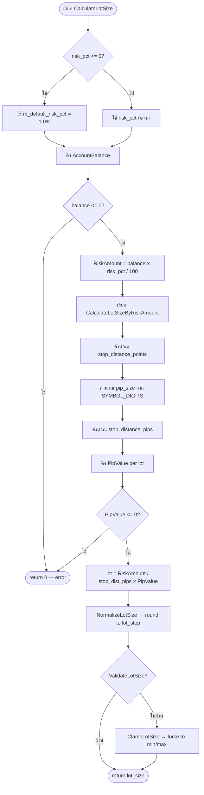
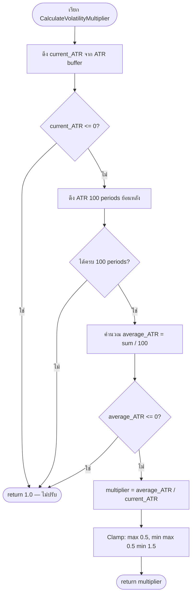
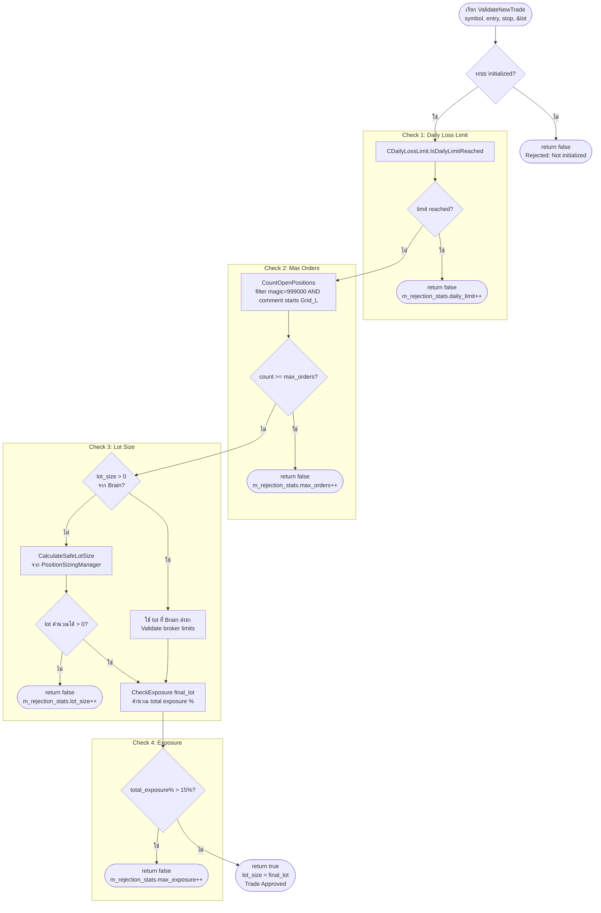
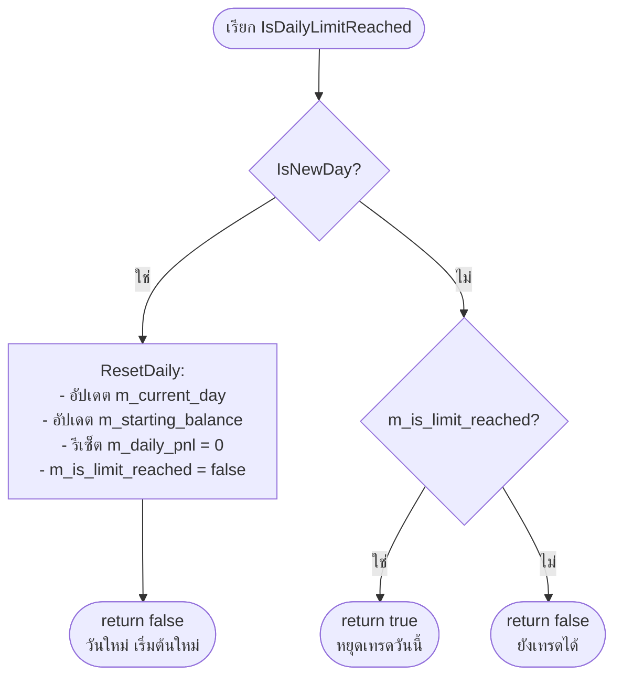
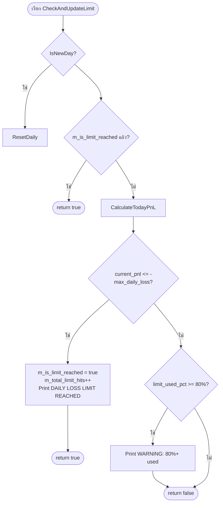
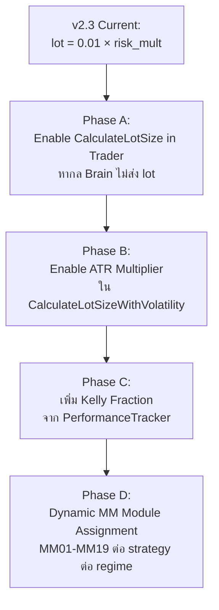

# SD05 — Dynamic Money Management (MM) และ Risk Policy
## FlashEASuite V2 | Complete Technical Deep-Dive Manual
### Prepared: 2026-03-02 | Phase P9-5 | Jimmi Deep-Dive Edition

---

## บทนำ: ทำไม Money Management ถึงสำคัญที่สุด

ใน FlashEASuite V2 ไม่ว่ากลยุทธ์จะดีเพียงใด ไม่ว่า Brain จะทำนายทิศทางได้แม่นแค่ไหน ถ้าระบบ **Money Management (MM)** ล้มเหลว — ทุกอย่างก็พังได้ในคืนเดียว

ระบบ MM ใน V2 ออกแบบบนหลักการที่เรียกว่า **"Protect Capital First, Grow Second"** (ปกป้องทุนก่อน เพิ่มทุนทีหลัง) โดยมีสามชั้นป้องกัน:

1. **CPositionSizingManager** — คำนวณขนาด Lot ที่ถูกต้องตามสูตร 1% Risk Rule
2. **CDailyLossLimit** — หยุดการเทรดเมื่อขาดทุนรายวันถึงเพดาน
3. **CRiskGuardian** — ประตูตรวจสอบ 4 ขั้นตอนก่อนทุก Order

บทนี้จะเจาะลึกระบบทั้งสามนี้จากระดับปรัชญาจนถึงระดับโค้ดจริง

---

## 5.1 แนวคิด Money Management ใน FlashEASuite V2

### 5.1.1 Philosophy — ปรัชญาของ MM ระบบ

**แนวคิดหลัก**: ระบบ MM ของ FlashEASuite V2 ไม่ใช่แค่ "คำนวณขนาด Lot" แต่คือ **กลไกควบคุมความเสี่ยงแบบ Dynamic** ที่ปรับตัวตามสภาวะตลาด ผลลัพธ์ย้อนหลัง และพฤติกรรมของกลยุทธ์แต่ละตัว

ใน FlashEASuite V2 มี **19 MM Module** (MM01–MM19) แต่ละ module ออกแบบมาเพื่อจับคู่กับกลยุทธ์เฉพาะและ regime ตลาดเฉพาะ:

| หมวด MM | MM Modules | เหมาะกับ |
|---------|------------|----------|
| Fixed Risk | MM01, MM02 | กลยุทธ์ทั่วไป, ตลาดเสถียร |
| Volatility-Adaptive | MM03, MM04, MM05 | ตลาด VOLATILE, กลยุทธ์ ATR-based |
| Kelly-Based | MM06, MM07, MM08 | กลยุทธ์ที่มีข้อมูล win rate สูง |
| Grid-Specific | MM09, MM10, MM11 | กลยุทธ์ S15_GRID เท่านั้น |
| Mean-Reversion | MM12, MM13 | ตลาด RANGING |
| Trend-Following | MM14, MM15, MM16 | ตลาด TRENDING |
| Hybrid/ML | MM17, MM18, MM19 | กลยุทธ์ ML, S02_ML_ENSEMBLE |

**หลักการจับคู่ Strategy ↔ MM Module**:
- กลยุทธ์แต่ละตัว (S01–S16) มี MM module ที่เหมาะสมที่สุดกำหนดไว้ใน Brain
- Brain สามารถ dynamic-assign MM module ตาม regime ปัจจุบัน
- ตัวอย่าง: S15_GRID ในตลาด RANGING → ใช้ MM09 (Grid-Fixed Lot)
- ตัวอย่าง: S06_KAMA ในตลาด TRENDING → ใช้ MM14 (Trend-Momentum Sizing)

### 5.1.2 สถานะปัจจุบัน v2.3 — Critical Audit

> **หมายเหตุสำคัญ**: ในเวอร์ชัน v2.3 (Production), Brain ยังส่งค่า `lot_size = 0.01 × risk_multiplier` แบบ simplified ไม่ใช่การใช้ MM module เต็มรูปแบบ

| ระดับ | สถานะ | คำอธิบาย |
|-------|--------|----------|
| v2.3 (ปัจจุบัน) | Simplified | `lot = 0.01 × risk_multiplier` จาก Brain |
| Full MM (แนะนำ) | ออกแบบแล้ว แต่ยังไม่ deploy เต็ม | `CalculateLotSize() × risk_multiplier + Kelly` |
| MM01–MM19 | ออกแบบสมบูรณ์ | พร้อม integrate เมื่อต้องการ |

---

> **สรุปแนวคิด 5.1**
>
> ระบบ MM ใน FlashEASuite V2 ประกอบด้วย 19 module ที่ออกแบบให้จับคู่กับกลยุทธ์แต่ละตัวในแต่ละ regime อย่างไรก็ตาม ในเวอร์ชัน v2.3 ที่ deploy ใน production ปัจจุบัน Brain ยังใช้วิธี simplified คือส่ง `lot = 0.01 × risk_multiplier` ซึ่งเป็น approximation ที่ปลอดภัยสำหรับการเริ่มต้น ส่วน full dynamic MM system จะเปิดใช้ในเวอร์ชันถัดไป

---

## 5.2 CPositionSizingManager — Core Lot Calculator

### 5.2.1 Philosophy — ปรัชญาของ Position Sizing

**แนวคิด**: ขนาด Lot ที่ถูกต้องคือขนาดที่ทำให้ **ความเสี่ยงต่อ Trade** คงที่เป็นเปอร์เซ็นต์ของ Balance ไม่ว่าจะเทรดคู่ไหน ในราคาเท่าไหร่ หรือ Stop Loss ห่างแค่ไหน

กฎ **1% Risk Rule** หมายความว่า: ถ้า Trade นี้ถึง Stop Loss, จะขาดทุนไม่เกิน 1% ของ Balance เสมอ

**ไฟล์**: `Include/Risk/PositionSizingManager.mqh`

### 5.2.2 สูตรหลัก

```
Lot = RiskAmount / (StopDistance_pips × PipValue)

โดยที่:
  RiskAmount        = AccountBalance × risk_pct / 100
  StopDistance_pips = |entry_price - stop_loss| / pip_size
  PipValue          = pip value per lot (in account currency)
```

### 5.2.3 ผังงาน — CalculateLotSize()



### 5.2.4 การพัฒนาโค้ด — CalculateLotSizeByRiskAmount()

```mql5
// File: Include/Risk/PositionSizingManager.mqh

double CPositionSizingManager::CalculateLotSizeByRiskAmount(double risk_amount,
                                                            double entry_price,
                                                            double stop_loss)
{
    // ขั้นที่ 1: ตรวจสอบ inputs ว่าถูกต้อง
    if(risk_amount <= 0) return 0;
    if(entry_price <= 0 || stop_loss <= 0) return 0;
    if(MathAbs(entry_price - stop_loss) < SymbolInfoDouble(m_symbol, SYMBOL_POINT))
        return 0;  // SL ใกล้เกินไป

    // ขั้นที่ 2: คำนวณระยะ Stop Distance เป็น points
    double point = SymbolInfoDouble(m_symbol, SYMBOL_POINT);
    double stop_distance_points = MathAbs(entry_price - stop_loss) / point;

    // ขั้นที่ 3: แปลง points → pips
    // 5-digit broker: 1 pip = 10 points | 4-digit broker: 1 pip = 1 point
    double digits = (int)SymbolInfoInteger(m_symbol, SYMBOL_DIGITS);
    double pip_size = (digits == 5 || digits == 3) ? 10.0 : 1.0;
    double stop_distance_pips = stop_distance_points / pip_size;

    // ขั้นที่ 4: ดึงค่า pip value per lot
    double pip_value = GetPipValue(1.0);
    if(pip_value <= 0) return 0;

    // ขั้นที่ 5: สูตรหลัก
    // Lot = Risk Amount / (Stop Distance in pips × Pip Value per Lot)
    double lot_size = risk_amount / (stop_distance_pips * pip_value);

    // ขั้นที่ 6: Normalize และ Validate
    lot_size = NormalizeLotSize(lot_size);
    if(!ValidateLotSize(lot_size))
        lot_size = ClampLotSize(lot_size);

    return lot_size;
}
```

### 5.2.5 ตัวอย่างเชิงตัวเลข — EURUSD Standard Account

**โจทย์**: เทรด EURUSD, Balance = $10,000, Risk = 1%, Entry = 1.08500, Stop Loss = 1.08000

**ขั้นที่ 1 — คำนวณ RiskAmount**:
```
RiskAmount = $10,000 × 1% / 100 = $100
```

**ขั้นที่ 2 — คำนวณ StopDistance**:
```
stop_distance_points = |1.08500 - 1.08000| / 0.00001 = 0.00500 / 0.00001 = 500 points
pip_size = 10 (เพราะ EURUSD มี 5 digits)
stop_distance_pips = 500 / 10 = 50 pips
```

**ขั้นที่ 3 — ดึง PipValue** (EURUSD Standard: 1 pip per 1 lot = $10):
```
pip_value = $10.00 per lot
```

**ขั้นที่ 4 — คำนวณ Lot**:
```
Lot = $100 / (50 pips × $10) = $100 / $500 = 0.20 lots
```

**ผล**: Trade นี้ใช้ lot = 0.20 ซึ่งถ้า SL โดน จะขาดทุน 50 pips × $10 × 0.20 = $100 = 1% ของ Balance พอดี

---

### 5.2.6 ตัวอย่างเชิงตัวเลข — XAUUSD (Gold)

**โจทย์**: เทรด XAUUSD, Balance = $10,000, Risk = 1%, Entry = 2650.00, Stop Loss = 2640.00

**ขั้นที่ 1**:
```
RiskAmount = $10,000 × 1% = $100
```

**ขั้นที่ 2**:
```
stop_distance_points = |2650.00 - 2640.00| / 0.01 = 10.00 / 0.01 = 1000 points
pip_size = 10 (XAUUSD มี 2 digits → ไม่ตรงกับ 5/3 → pip_size = 1.0)
หมายเหตุ: XAUUSD บางโบรกเกอร์มี 2 digits → pip_size = 1.0
stop_distance_pips = 1000 / 1.0 = 1000 pips
```

**ขั้นที่ 3 — PipValue XAUUSD** (ประมาณ $0.01 per lot per pip):
```
pip_value ≈ $0.01 per lot
```

**ขั้นที่ 4**:
```
Lot = $100 / (1000 × $0.01) = $100 / $10 = 10.0 lots
```

> **หมายเหตุ**: ค่า pip_value ของ XAUUSD ขึ้นอยู่กับโบรกเกอร์และ contract size จริง ค่าในตัวอย่างเป็นค่าประมาณเพื่อแสดงหลักการ ระบบจะดึงค่าจริงจาก `SymbolInfoDouble(m_symbol, SYMBOL_TRADE_TICK_VALUE)` เสมอ

### 5.2.7 พารามิเตอร์หลัก

| ตัวแปร | ค่า Default | ความหมาย |
|--------|------------|---------|
| `m_default_risk_pct` | 1.0 | ความเสี่ยง default 1% ต่อ trade |
| `m_min_lot` | จาก broker | ขนาด lot ขั้นต่ำ (เช่น 0.01) |
| `m_max_lot` | จาก broker | ขนาด lot สูงสุด |
| `m_lot_step` | จาก broker | ขั้นต่ำในการเพิ่ม/ลด lot (เช่น 0.01) |
| `m_atr_period` | 14 | Period สำหรับ ATR indicator |
| `m_use_volatility_adj` | true | เปิดใช้ ATR adjustment |

---

> **สรุปแนวคิด 5.2**
>
> `CPositionSizingManager` ใช้สูตร `Lot = RiskAmount / (StopDistance_pips × PipValue)` ซึ่งเป็น Gold Standard ของ position sizing ในโลกการเทรด สูตรนี้รับประกันว่าไม่ว่าจะเทรด instrument ไหน ระยะ SL ไกลแค่ไหน ความเสี่ยงต่อ trade จะคงที่ที่ 1% ของ Balance เสมอ ระบบยังรองรับ ATR-based volatility adjustment ซึ่งจะอธิบายในหัวข้อ 5.3

---

## 5.3 Volatility Adjustment — ATR Multiplier

### 5.3.1 Philosophy — ปรัชญา ATR Adjustment

**แนวคิด**: ในตลาดที่ volatile สูง (ATR สูง) ราคาแกว่งรุนแรง — การใช้ lot เต็มอาจทำให้ SL โดนบ่อยโดยไม่จำเป็น ในทางกลับกัน ในตลาดที่ calm (ATR ต่ำ) เป็นโอกาสที่จะใช้ lot ใหญ่ขึ้นเพื่อเก็บกำไรให้มากขึ้น

ATR Multiplier คือ **ตัวปรับ lot size อัตโนมัติ** ที่ทำให้ระบบเทรดอย่างฉลาดตามสภาวะตลาด

### 5.3.2 สูตร ATR Multiplier

```
volatility_multiplier = average_ATR / current_ATR

โดยที่:
  current_ATR  = ค่า ATR ปัจจุบัน (1 bar ล่าสุด)
  average_ATR  = ค่าเฉลี่ย ATR 100 periods ย้อนหลัง
  multiplier   = clamp ไว้ที่ [0.5, 1.5]

จากนั้น:
  adjusted_lot = base_lot × volatility_multiplier
```

**หลักการ**:
- ถ้า `current_ATR > average_ATR` (ตลาด volatile) → `multiplier < 1.0` → lot เล็กลง
- ถ้า `current_ATR < average_ATR` (ตลาด calm) → `multiplier > 1.0` → lot ใหญ่ขึ้น
- Clamp ไว้ที่ [0.5, 1.5] เพื่อป้องกัน extreme values

### 5.3.3 ผังงาน — CalculateVolatilityMultiplier()



### 5.3.4 การพัฒนาโค้ด — CalculateVolatilityMultiplier()

```mql5
// File: Include/Risk/PositionSizingManager.mqh

double CPositionSizingManager::CalculateVolatilityMultiplier(void)
{
    // ดึง ATR ปัจจุบัน
    double current_atr = GetATR();
    if(current_atr <= 0) return 1.0;  // ไม่ปรับถ้า ATR ไม่พร้อม

    // ดึงข้อมูล ATR 100 periods
    double atr_buffer[];
    ArraySetAsSeries(atr_buffer, true);
    if(CopyBuffer(m_atr_handle, 0, 0, 100, atr_buffer) < 100)
        return 1.0;

    // คำนวณ Average ATR
    double atr_sum = 0;
    for(int i = 0; i < 100; i++)
        atr_sum += atr_buffer[i];
    double average_atr = atr_sum / 100.0;
    if(average_atr <= 0) return 1.0;

    // สูตรหลัก: ตลาด volatile (ATR สูง) → lot เล็กลง
    double multiplier = average_atr / current_atr;

    // Clamp ไว้ที่ [0.5, 1.5]
    multiplier = MathMax(0.5, MathMin(1.5, multiplier));

    return multiplier;
}

double CPositionSizingManager::CalculateLotSizeWithVolatility(double entry_price,
                                                              double stop_loss,
                                                              double risk_pct=0)
{
    // คำนวณ base lot ก่อน
    double base_lot = CalculateLotSize(entry_price, stop_loss, risk_pct);
    if(!m_use_volatility_adj || base_lot <= 0) return base_lot;

    // ปรับด้วย volatility multiplier
    double vol_multiplier = CalculateVolatilityMultiplier();
    double adjusted_lot = base_lot * vol_multiplier;

    // Normalize และ Validate
    adjusted_lot = NormalizeLotSize(adjusted_lot);
    if(!ValidateLotSize(adjusted_lot))
        adjusted_lot = ClampLotSize(adjusted_lot);

    Print("Volatility Adjustment: Base:", base_lot,
          " x ", vol_multiplier, " = ", adjusted_lot);

    return adjusted_lot;
}
```

### 5.3.5 ตัวอย่างเชิงตัวเลข — ATR Adjustment

**สถานการณ์ที่ 1 — ตลาด Volatile**:

```
base_lot      = 0.20 (คำนวณจาก 1% risk rule)
current_ATR   = 0.0050 (ตลาดแกว่งแรง)
average_ATR   = 0.0040 (ค่าเฉลี่ยปกติ)

multiplier = 0.0040 / 0.0050 = 0.80

adjusted_lot = 0.20 × 0.80 = 0.16
```

**ผล**: ระบบลด lot จาก 0.20 → 0.16 เพราะตลาด volatile กว่าปกติ

---

**สถานการณ์ที่ 2 — ตลาด Calm**:

```
base_lot      = 0.20
current_ATR   = 0.0025 (ตลาดนิ่ง)
average_ATR   = 0.0040

multiplier = 0.0040 / 0.0025 = 1.60 → clamp → 1.50

adjusted_lot = 0.20 × 1.50 = 0.30
```

**ผล**: ระบบเพิ่ม lot จาก 0.20 → 0.30 เพราะตลาดสงบกว่าปกติ (แต่ไม่เกิน 1.5x)

---

**ตารางสรุป ATR Multiplier**:

| current_ATR | average_ATR | Multiplier (raw) | Multiplier (clamped) | ผล |
|-------------|-------------|-----------------|---------------------|-----|
| 0.0020 | 0.0040 | 2.00 | 1.50 | +50% lot |
| 0.0030 | 0.0040 | 1.33 | 1.33 | +33% lot |
| 0.0040 | 0.0040 | 1.00 | 1.00 | ไม่เปลี่ยน |
| 0.0050 | 0.0040 | 0.80 | 0.80 | -20% lot |
| 0.0080 | 0.0040 | 0.50 | 0.50 | -50% lot (min) |
| 0.0100 | 0.0040 | 0.40 | 0.50 | -50% lot (clamped) |

---

> **สรุปแนวคิด 5.3**
>
> ATR Multiplier เป็นกลไก "smart scaling" ที่ทำให้ lot size ปรับตามความ volatile ของตลาดโดยอัตโนมัติ ในตลาดที่ซัดแรง (high ATR) ระบบจะลด lot ลงเพื่อป้องกันการ stop out ที่ไม่จำเป็น ในตลาดที่นิ่ง (low ATR) ระบบจะเพิ่ม lot เพื่อใช้ประโยชน์จากสภาวะที่เอื้ออำนวย ขอบเขต [0.5, 1.5] ป้องกันไม่ให้ lot เล็กหรือใหญ่เกินไปจนออกนอกกรอบ risk management

---

## 5.4 CRiskGuardian — 4-Check Validation Pipeline

### 5.4.1 Philosophy — ปรัชญาของ Risk Guardian

**แนวคิด**: `CRiskGuardian` คือ **"ประตูรักษาความปลอดภัยสุดท้าย"** ก่อนที่ทุก Order จะถูกส่งออกไปที่ Broker ไม่ว่า Brain จะส่ง signal มาอย่างไร ไม่ว่า Strategy จะตัดสินใจอย่างไร — ต้องผ่านประตูนี้ทุกครั้ง

**ไฟล์**: `Include/Risk/RiskGuardian.mqh`

**สถาปัตยกรรม**: RiskGuardian บรรจุ (owns) สองส่วนย่อย:
- `CPositionSizingManager* m_position_sizing` — คำนวณ lot size
- `CDailyLossLimit* m_daily_limit` — ตรวจสอบ daily loss limit

### 5.4.2 การ Initialize — ค่า Default

```mql5
// ค่า default ที่ใช้ใน ProgramC_Trader.mq5:
g_risk_guardian.Initialize(
    10,    // max_orders       = 10 positions สูงสุด
    2.0,   // max_risk%        = max 2% risk per trade
    15.0,  // max_exposure%    = max 15% total exposure
    2.0    // daily_limit%     = หยุดเมื่อขาดทุน 2% ต่อวัน
)
```

> **หมายเหตุ**: Default ใน constructor ของ RiskGuardian คือ `max_orders=5, max_risk=2.0%, max_exposure=15.0%, daily_limit=4.0%` แต่ ProgramC_Trader.mq5 override ด้วย `max_orders=10, daily_limit=2.0%`

### 5.4.3 ผังงาน — ValidateNewTrade() — 4 Checks



### 5.4.4 การพัฒนาโค้ด — ValidateNewTrade()

```mql5
// File: Include/Risk/RiskGuardian.mqh

bool CRiskGuardian::ValidateNewTrade(string symbol,
                                     double entry_price,
                                     double stop_loss,
                                     double &lot_size)  // pass by reference
{
    m_validation_count++;
    m_last_check_time = TimeCurrent();

    if(!m_is_initialized)
    {
        m_rejection_stats.other++;
        return false;
    }

    // ===== CHECK 1: Daily Loss Limit =====
    if(m_daily_limit.IsDailyLimitReached())
    {
        m_rejection_stats.daily_limit++;
        return false;  // หยุดทั้งวัน
    }

    // ===== CHECK 2: Max Orders =====
    if(!CanOpenNewPosition())
    {
        m_rejection_stats.max_orders++;
        return false;
    }

    // ===== CHECK 3: Lot Size =====
    double final_lot;
    if(lot_size > 0)
    {
        // Brain ส่ง lot มาให้ → ใช้เลย (เช่น Spike Strategy)
        final_lot = lot_size;
        if(!m_position_sizing.ValidateLotSize(final_lot))
            final_lot = m_position_sizing.NormalizeLotSize(final_lot);
    }
    else
    {
        // คำนวณ lot เอง (เช่น Grid/Standalone)
        final_lot = CalculateSafeLotSize(symbol, entry_price, stop_loss);
        if(final_lot <= 0)
        {
            m_rejection_stats.lot_size++;
            return false;
        }
    }

    // ===== CHECK 4: Exposure =====
    if(!CheckExposure(final_lot))
    {
        m_rejection_stats.max_exposure++;
        return false;
    }

    // ทุก Check ผ่าน → อนุมัติ
    lot_size = final_lot;  // update lot_size ผ่าน reference
    return true;
}
```

### 5.4.5 CountOpenPositions() — การนับ Order อย่างถูกต้อง

```mql5
// File: Include/Risk/RiskGuardian.mqh

int CRiskGuardian::CountOpenPositions(void)
{
    // นับเฉพาะ Grid positions ของ ProgramC_Trader เท่านั้น
    // กรองด้วย: magic = 999000 AND comment starts with "Grid_L"
    // เหตุผล: positions อื่นในบัญชีไม่ควรนับรวม

    int count = 0;
    for(int i = PositionsTotal() - 1; i >= 0; i--)
    {
        ulong ticket = PositionGetTicket(i);
        if(ticket == 0) continue;

        // กรอง magic number
        if(PositionGetInteger(POSITION_MAGIC) != 999000) continue;

        // กรอง comment prefix
        string comment = PositionGetString(POSITION_COMMENT);
        if(StringFind(comment, "Grid_L") == 0)  // starts at index 0
            count++;
    }
    return count;
}
```

**เหตุผลสำคัญที่ต้องกรองสองชั้น**:
- Magic number 999000 → ระบุว่าเป็น Grid EA
- Comment prefix "Grid_L" → กรอง positions เก่าที่มี comment ต่างกัน (เช่น "TransferToGrid_DRAWDOWN") ซึ่งไม่ควรนับ

### 5.4.6 CheckExposure() — ตรวจสอบ Total Exposure

```mql5
// File: Include/Risk/RiskGuardian.mqh

double CRiskGuardian::CalculateCurrentExposure(void)
{
    // นับเฉพาะ Grid positions (magic=999000, comment starts "Grid_L")
    double total_exposure = 0;

    for(int i = PositionsTotal() - 1; i >= 0; i--)
    {
        ulong ticket = PositionGetTicket(i);
        if(ticket == 0) continue;
        if(PositionGetInteger(POSITION_MAGIC) != 999000) continue;
        string comment = PositionGetString(POSITION_COMMENT);
        if(StringFind(comment, "Grid_L") != 0) continue;

        double lots = PositionGetDouble(POSITION_VOLUME);
        double open_price = PositionGetDouble(POSITION_PRICE_OPEN);
        total_exposure += lots * open_price;  // notional value
    }

    return total_exposure;
}
```

### 5.4.7 สถิติการปฏิเสธ (Rejection Statistics)

```mql5
// struct ติดตามเหตุผลการปฏิเสธ
struct RejectionStats
{
    int daily_limit;   // ถูกปฏิเสธเพราะถึง daily loss limit
    int max_orders;    // ถูกปฏิเสธเพราะ orders เต็ม
    int max_exposure;  // ถูกปฏิเสธเพราะ exposure สูงเกิน
    int lot_size;      // ถูกปฏิเสธเพราะคำนวณ lot ไม่ได้
    int other;         // สาเหตุอื่นๆ
} m_rejection_stats;
```

**วิธีดูสถิติ**:
```mql5
g_risk_guardian.PrintRejectionStats();
// Output ตัวอย่าง:
// === REJECTION STATISTICS ===
// Total: 15
// Daily Limit: 3 (20.0%)
// Max Orders: 8 (53.3%)
// Max Exposure: 2 (13.3%)
// Lot Size: 1 (6.7%)
// Other: 1 (6.7%)
```

### 5.4.8 ตัวอย่างเชิงตัวเลข — Validation Pipeline

**สถานการณ์**: ได้รับ CONFIG_PUSH สำหรับ XAUUSD

| Check | ข้อมูล | ผลการตรวจสอบ |
|-------|--------|-------------|
| Check 1 | daily_pnl = -$150 จากเริ่ม Balance $10,000 = -1.5% | ผ่าน (limit = 2%) |
| Check 2 | open Grid positions = 6 | ผ่าน (max = 10) |
| Check 3 | lot_size จาก Brain = 0.01 | ผ่าน (Brain ส่งมา valid) |
| Check 4 | current_exposure = 3,000, additional = 265, total = 3,265 / 10,000 = 3.27% | ผ่าน (limit = 15%) |
| **ผลสุดท้าย** | **APPROVED** | **lot_size = 0.01** |

---

> **สรุปแนวคิด 5.4**
>
> `CRiskGuardian` คือ "ประตูสุดท้าย" ที่ทำหน้าที่ตรวจสอบ 4 ชั้นก่อนทุก Trade: Daily Loss Limit, Max Orders, Lot Size Calculation, และ Exposure Limit เมื่อตัวใดตัวหนึ่งล้มเหลว Trade จะถูกปฏิเสธทันที และสถิติการปฏิเสธจะถูกบันทึกเพื่อการ diagnosis ในภายหลัง

---

## 5.5 CDailyLossLimit — ระบบหยุดขาดทุนรายวัน

### 5.5.1 Philosophy — ปรัชญาของ Daily Loss Limit

**แนวคิด**: ทุกระบบเทรดต้องมีกลไก "หยุดฉุกเฉิน" รายวัน ถ้าวันนี้ขาดทุนเกิน 4% ของ Balance — หยุดทั้งวัน ไม่มีข้อยกเว้น นี่คือหลักการป้องกันที่เรียกว่า **"Living to Fight Another Day"**

**ไฟล์**: `Include/Risk/DailyLossLimit.mqh`

### 5.5.2 วิธีคำนวณ Daily P&L

```mql5
// File: Include/Risk/DailyLossLimit.mqh

double CDailyLossLimit::CalculateTodayPnL(void)
{
    double current_equity  = AccountInfoDouble(ACCOUNT_EQUITY);
    double starting_balance = m_starting_balance;  // Balance ตอนเริ่มต้นวัน

    // ใช้ Equity (ไม่ใช่ Balance) เพื่อรวม floating P&L ของ positions ที่เปิดอยู่
    double pnl = current_equity - starting_balance;
    return pnl;
}
```

**หมายเหตุสำคัญ**: ใช้ `ACCOUNT_EQUITY` ไม่ใช่ `ACCOUNT_BALANCE` เพราะต้องการรวม floating P&L ของ positions ที่ยังเปิดอยู่ ถ้า Grid มี 5 positions ที่ขาดทุน floating อยู่ 300 ดอลลาร์ — ระบบจะนับว่าขาดทุน 300 ดอลลาร์ทันที

### 5.5.3 ผังงาน — IsDailyLimitReached() และ Auto-Reset



### 5.5.4 ผังงาน — CheckAndUpdateLimit()



### 5.5.5 การพัฒนาโค้ด — การ Initialize

```mql5
// File: Include/Risk/DailyLossLimit.mqh

bool CDailyLossLimit::Initialize(double daily_limit_pct = 4.0)
{
    m_daily_limit_pct  = daily_limit_pct;
    m_starting_balance = AccountInfoDouble(ACCOUNT_BALANCE);
    m_max_daily_loss   = m_starting_balance * (m_daily_limit_pct / 100.0);
    m_current_day      = GetDayStart();  // เวลาเที่ยงคืน
    m_last_reset_time  = TimeCurrent();

    ResetDaily();  // รีเซ็ต counters ทั้งหมด

    return true;
}

// กำหนด "เริ่มต้นวัน" ที่เวลา 00:00:00
datetime CDailyLossLimit::GetDayStart(void)
{
    MqlDateTime dt;
    TimeToStruct(TimeCurrent(), dt);
    dt.hour = 0;
    dt.min  = 0;
    dt.sec  = 0;
    return StructToTime(dt);
}
```

### 5.5.6 ตัวอย่างเชิงตัวเลข — Daily Loss Tracking

**สถานการณ์**: Balance เริ่มต้น = $10,000, daily_limit = 4%

```
max_daily_loss = $10,000 × 4% = $400

วัน 1:
  08:00 — Trade 1 ปิด: -$80  → daily_pnl = -$80  (2% ใช้ไป)
  10:00 — Trade 2 ปิด: -$120 → daily_pnl = -$200 (ใช้ไป 50%)
  12:00 — Trade 3 ปิด: -$150 → daily_pnl = -$350 (WARNING: 87.5% ใช้ไป)
  14:00 — Trade 4 ปิด: -$60  → daily_pnl = -$410 → LIMIT REACHED!
           m_is_limit_reached = true → ไม่รับ trade ใหม่

  00:00 วันถัดไป → ResetDaily():
    m_starting_balance ← Balance จริงตอนนั้น ($9,590)
    max_daily_loss ← $9,590 × 4% = $383.60
    m_is_limit_reached ← false → เทรดได้ใหม่
```

### 5.5.7 UpdateTrade() — บันทึกผลการเทรด

```mql5
// File: Include/Risk/DailyLossLimit.mqh

void CDailyLossLimit::UpdateTrade(double pnl, bool is_win)
{
    // ส่งต่อไปยัง UpdateDailyPnL
    UpdateDailyPnL(pnl);
    CheckAndUpdateLimit();
}

void CDailyLossLimit::UpdateDailyPnL(double trade_pnl)
{
    if(IsNewDay()) ResetDaily();

    m_daily_pnl += trade_pnl;

    if(trade_pnl > 0)
    {
        m_daily_wins += trade_pnl;
        m_daily_wins_count++;
    }
    else
    {
        m_daily_losses += trade_pnl;  // ค่า negative
        m_daily_losses_count++;
    }

    m_daily_trades++;
}
```

### 5.5.8 Warning ที่ 80% — Early Warning System

```mql5
// ในฟังก์ชัน CheckAndUpdateLimit()
double limit_used_pct = (-current_pnl / m_max_daily_loss) * 100.0;
if(limit_used_pct >= 80.0)
{
    Print("WARNING: Daily limit ", DoubleToString(limit_used_pct, 1), "% used");
    Print("P&L: $", DoubleToString(current_pnl, 2),
          " / $", DoubleToString(-m_max_daily_loss, 2));
}
```

**ความหมาย**: เมื่อใช้ไป 80% ของ limit แล้ว ระบบจะ Print warning แต่ยังเทรดต่อได้ จนกว่าจะถึง 100%

---

> **สรุปแนวคิด 5.5**
>
> `CDailyLossLimit` ใช้ Equity (ไม่ใช่ Balance) เพื่อวัด P&L รายวัน ซึ่งทำให้ระบบรับรู้ floating loss ของ positions ที่เปิดอยู่ทันที มีระบบ warning ที่ 80% และ auto-reset เมื่อเริ่มวันใหม่ (00:00:00) โดย starting balance จะถูกอัปเดตให้เป็น Balance จริงของวันใหม่ ทำให้ daily limit ปรับตาม equity ที่เปลี่ยนแปลงในแต่ละวันโดยอัตโนมัติ

---

## 5.6 MM Variables ใน CONFIG_PUSH

### 5.6.1 โครงสร้าง CONFIG_PUSH

Brain ส่ง CONFIG_PUSH มาเป็น array 11 ตัวเลข:

```python
# Brain: 02_Brain/core/strategy/policy.py
CONFIG_PUSH = [
    type,         # [0]  = 10 (message type identifier)
    timestamp,    # [1]  = Unix timestamp (float)
    symbol,       # [2]  = "XAUUSD"
    strategy,     # [3]  = "GRID"
    entry_price,  # [4]  = 2650.00
    lot_size,     # [5]  = 0.01
    direction,    # [6]  = 1 (BUY) หรือ 2 (SELL)
    take_profit,  # [7]  = 2680.00
    stop_loss,    # [8]  = 2630.00
    confidence,   # [9]  = 0.65
    risk_mult,    # [10] = 1.0  ← risk_multiplier
]
```

### 5.6.2 Risk Multiplier ใน v2.3 (สถานะปัจจุบัน)

ในเวอร์ชัน v2.3 ที่ใช้งาน production:

```python
# Brain: 02_Brain/core/strategy/policy.py (simplified v2.3)
lot_size = 0.01 * risk_multiplier

# ตัวอย่าง:
# risk_multiplier = 1.0 → lot = 0.01
# risk_multiplier = 1.5 → lot = 0.015 → round to 0.01 (min_lot)
# risk_multiplier = 2.0 → lot = 0.02
```

**ข้อดี**: เรียบง่าย, คาดเดาได้, ไม่ขึ้นกับ account size

**ข้อเสีย**: ไม่ "dynamic" จริงๆ ในแง่ที่ไม่ปรับตาม account balance, volatility, หรือ stop distance

### 5.6.3 Full Dynamic MM (แนะนำสำหรับอนาคต)

สูตรที่แนะนำสำหรับ full implementation:

```mql5
// แนะนำสำหรับ ProgramC_Trader.mq5 — Full Dynamic Sizing

// ขั้นที่ 1: ดึง Kelly Fraction จาก PerformanceTracker
// Kelly formula: f* = W - (1-W)/R
// W = win_rate (e.g., 0.60 = 60%)
// R = reward_to_risk_ratio (e.g., 2.0 = 2:1 RR)
// f* = 0.60 - (1-0.60)/2.0 = 0.60 - 0.20 = 0.40 → clamp to [0.05, 0.25]
double kelly_fraction = MathMax(0.05, MathMin(0.25, win_rate - (1 - win_rate) / reward_risk));

// ขั้นที่ 2: คำนวณ lot ด้วย full formula
double balance   = AccountInfoDouble(ACCOUNT_BALANCE);
double stop_pips = MathAbs(entry_price - stop_loss) / (point * pip_size);
double pip_val   = GetPipValue(1.0);

double lot = (balance * kelly_fraction * risk_multiplier) / (stop_pips * pip_val);

// ขั้นที่ 3: Clamp ด้วย ATR multiplier
double vol_mult = CalculateVolatilityMultiplier();
lot = lot * vol_mult;

// ขั้นที่ 4: Normalize
lot = NormalizeLotSize(lot);
```

### 5.6.4 ตัวอย่างเชิงตัวเลข — Full Dynamic MM

**โจทย์**: Balance = $10,000, win_rate = 0.60, RR = 2.0, stop_pips = 50, pip_value = $10, risk_multiplier = 1.2, vol_mult = 0.85

```
kelly_fraction = 0.60 - (0.40/2.0) = 0.60 - 0.20 = 0.40 → clamp → 0.25

lot_base = ($10,000 × 0.25 × 1.2) / (50 × $10)
         = $3,000 / $500
         = 6.00 lots

lot_final = 6.00 × 0.85 (ATR adjustment)
          = 5.10 lots → normalize → 5.10
```

**เปรียบเทียบกับ v2.3**:
```
v2.3: lot = 0.01 × 1.2 = 0.012 → normalize → 0.01
Full: lot = 5.10 (ปรับตาม balance จริง)
```

---

> **สรุปแนวคิด 5.6**
>
> ในเวอร์ชัน v2.3, Brain ส่ง `lot = 0.01 × risk_multiplier` ซึ่งเป็น simplified approach ที่ปลอดภัยสำหรับการเริ่มต้น Full Dynamic MM ที่แนะนำ ประกอบด้วย Kelly Fraction + ATR Multiplier + Stop Distance ทำให้ lot size ปรับตาม balance จริง performance ที่ผ่านมา และสภาวะตลาดปัจจุบัน สูตรนี้พร้อมสำหรับ upgrade เมื่อต้องการเพิ่ม performance

---

## 5.7 Critical Audit — สถานะ MM ในระบบปัจจุบัน

### 5.7.1 Gap Analysis: v2.3 vs Full MM

| หัวข้อ | v2.3 (ปัจจุบัน) | Full MM (แนะนำ) | Gap |
|--------|----------------|-----------------|-----|
| Lot Calculation | `0.01 × risk_mult` | `PositionSizingManager + Kelly` | ใหญ่มาก |
| ATR Adjustment | ไม่ได้ใช้ | `CalculateVolatilityMultiplier()` | ใหญ่ |
| Kelly Fraction | ไม่ได้ใช้ | จาก PerformanceTracker | ใหญ่ |
| Daily Loss | 4% hard limit | 4% + dynamic adjustment | เล็กน้อย |
| Exposure Check | 15% hard limit | 15% + per-strategy | เล็กน้อย |
| MM Module | ไม่ได้ใช้ MM01-MM19 | Dynamic per strategy per regime | ใหญ่มาก |

### 5.7.2 แผนการ Upgrade (Recommended)



### 5.7.3 ความเสี่ยงที่ต้องระวัง

**ความเสี่ยงของ v2.3 (Fixed 0.01 lot)**:
- ถ้า account ใหญ่ขึ้น (เช่น $100,000) lot = 0.01 คือ **0.001% risk** — เล็กเกินไปมาก
- ถ้า risk_multiplier สูง (เช่น 5.0) lot = 0.05 — อาจมากเกินไปสำหรับ account เล็ก

**คำแนะนำ**: Implement `CPositionSizingManager.CalculateLotSize()` ใน Trader โดยใช้ lot จาก Brain เป็น "override" และคำนวณ lot จาก balance จริงเมื่อ Brain ส่ง lot_size = 0

```mql5
// แนะนำใน ExecutePolicy() ของ ProgramC_Trader.mq5:
double lot_size = policy.position_size;

if(lot_size <= 0.0)
{
    // Brain ไม่ได้ส่ง lot → คำนวณจาก balance
    lot_size = g_risk_guardian.CalculateSafeLotSize(
        policy.symbol,
        policy.entry_price,
        policy.stop_loss,
        1.0  // 1% risk
    );
}
else
{
    // Brain ส่ง lot มา → ใช้แต่ scale ด้วย balance ratio
    // (ยังไม่ implement ใน v2.3)
    lot_size = lot_size;  // use as-is for now
}
```

---

> **สรุปแนวคิด 5.7**
>
> Critical Audit เปิดเผยว่าระบบ MM ใน FlashEASuite V2 มีโครงสร้าง infrastructure ที่สมบูรณ์ (`CPositionSizingManager`, `CDailyLossLimit`, `CRiskGuardian`) แต่ Brain ยังส่ง lot แบบ simplified (`0.01 × risk_mult`) ซึ่งไม่ใช้ infrastructure ดังกล่าวอย่างเต็มที่ การ upgrade ในอนาคตควรทำเป็น phase เพื่อลดความเสี่ยงจากการเปลี่ยนแปลงขนาดใหญ่ใน production

---

## บทสรุป Chapter 5

| ส่วนประกอบ | ไฟล์ | หน้าที่ | สถานะ |
|-----------|------|---------|-------|
| `CPositionSizingManager` | `Include/Risk/PositionSizingManager.mqh` | คำนวณ lot จาก 1% risk rule | Active (ใช้ใน CalculateSafeLotSize) |
| `CDailyLossLimit` | `Include/Risk/DailyLossLimit.mqh` | หยุดเทรดเมื่อขาดทุนรายวัน | Active (Check 1 ของ RiskGuardian) |
| `CRiskGuardian` | `Include/Risk/RiskGuardian.mqh` | ประตู 4 checks ก่อนทุก order | Active (ใช้ใน ExecutePolicy) |
| ATR Volatility Adj. | `PositionSizingManager.mqh` | ปรับ lot ตาม volatility | Active (ถ้า use_volatility=true) |
| MM01–MM19 | Design docs | Dynamic MM modules ต่อ strategy | Designed, pending integration |
| Kelly Fraction | `PerformanceTracker` (Brain) | Optimal f* calculation | Calculated แต่ยังไม่ใช้ใน lot sizing |

**กฎ Golden Rule ของ MM ใน FlashEASuite V2**:
1. ทุก Trade ต้องผ่าน `ValidateNewTrade()` — ไม่มีข้อยกเว้น
2. Daily Loss Limit = ระบบ emergency brake สุดท้าย
3. Lot size ต้อง normalize ตาม broker's `SYMBOL_VOLUME_STEP` เสมอ
4. ATR Multiplier คือ dynamic adjustment ที่ทำให้ระบบฉลาดขึ้น
5. Kelly Fraction = เป้าหมายในอนาคตสำหรับ optimal position sizing

---

*SD05 — Dynamic Money Management | FlashEASuite V2 | Phase P9-5 | 2026-03-02*
