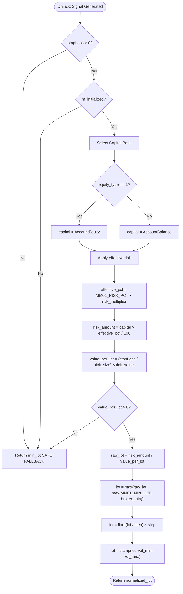
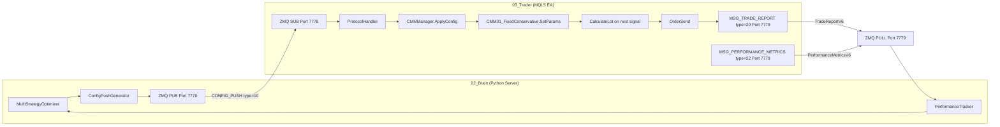

# MM01 — Fixed Fractional Conservative
## FlashEASuite V2 | Money Management Deep Dive Manual
### Generated: P9-6 | 2026-02-26

---

## 1. Overview

| Field             | Value                                                                 |
|-------------------|-----------------------------------------------------------------------|
| **ID**            | MM01                                                                  |
| **Name**          | Fixed Fractional Conservative                                         |
| **Type**          | Fixed Fraction Position Sizing                                        |
| **Risk Level**    | Low (1 star out of 5)                                                 |
| **Mode**          | Standalone + Server                                                   |
| **MQL5 Class**    | `CMM01_FixedConservative`                                             |
| **Source File**   | `Include/Logic/MM/MM01_FixedConservative.mqh`                         |
| **MM Enum ID**    | `MM_ID_FIXED_CONSERVATIVE = 1`                                        |
| **Best For**      | All strategies; beginners; prop-firm challenges; risk-averse accounts |
| **Default MM of** | S07 (MeanRev), S08 (Intermarket), S09 (SessionBrk), S11-S13, S16 (Spike) |

---

## 2. Philosophy & Rationale (The "Why")

### 2.1 The Concept

MM01 implements the classic **Fixed Fractional Position Sizing** method at a conservative risk level of 1% per trade. The core idea is deceptively simple: never risk more than a fixed percentage of your account on any single trade, regardless of how confident the strategy signal is.

This concept was formalized by Ralph Vince in *Portfolio Management Formulas* (1990) and has been independently adopted by professional trading firms worldwide — including Bridgewater Associates, where fixed-fraction capital allocation underpins their All-Weather portfolio theory. The percentage is fixed, but the absolute dollar amount scales up or down with the account balance, creating natural **geometric compounding** on winning runs and automatic **lot size reduction** when the account is under stress.

At 1% risk per trade with a 50% win rate and 1:1.5 R:R, the account grows at approximately 0.25% per trade on average — slow but geometrically stable. After 100 trades the compound effect becomes meaningful, and the worst-case drawdown from any single losing streak is statistically bounded.

In the context of FlashEASuite V2, MM01 serves a second equally important role: it is the **universal fallback**. When the server is unreachable, when the Kelly history is insufficient, when the regime is too uncertain for an adaptive method — the system falls back to MM01. Every other MM method that the system uses must ultimately be compared against MM01 as the baseline.

### 2.2 Pros & Cons

**Pros**

- **Mathematically proven**: Fixed fraction is the most studied position-sizing method in quantitative finance. The Kelly Criterion itself reduces to fixed fraction sizing when the edge is constant.
- **Automatic drawdown protection**: As the account shrinks, so does the lot size in exact proportion. A 20% drawdown results in a 20% reduction in lot size, creating a natural circuit breaker.
- **Geometric compounding**: As the account grows, lot sizes grow proportionally — no manual adjustment needed.
- **Predictability**: Risk per trade is always exactly 1% of current equity (or balance). This makes performance forecasting straightforward.
- **Universal compatibility**: Works with any strategy, any timeframe, any symbol. This is why it is the Standalone default for all strategies.
- **Broker-compliant**: Lot normalization via `MMNormalizeLot()` ensures output always fits broker volume step and min/max rules.
- **Prop firm-safe**: 1% risk per trade is standard for most prop firm challenge rules.

**Cons**

- **Slower growth than aggressive methods**: 1% risk means a 10-trade losing streak causes only ~10% account reduction, but it also means a 10-trade winning streak at 1:1.5 R:R yields only ~15% gain.
- **Does not adapt to volatility**: The same 1% is used whether the market is calm or in a news spike. MM03 (ATR-Based) solves this.
- **Does not use trade history**: Winning streaks and losing streaks are not reflected in lot size. MM15 (AdaptiveWinStreak) solves this.
- **Sub-optimal for high-edge strategies**: If a strategy has a 70%+ win rate and 2:1 R:R, Kelly Criterion (MM04) would suggest risking 2-3× more. MM01 leaves this edge partially unexploited.

### 2.3 Selection Criteria

MM01 is selected by the `CMMManager` under the following conditions:

1. **Standalone Mode is active** (`is_standalone = true`): All 16 strategies use MM01 regardless of their default preference. This is because server-driven data (Kelly history, regime classification, ATR feeds) are unavailable.
2. **Strategy default is MM01**: S07, S08, S09, S11, S12, S13, S16 use MM01 as their default in the selection matrix.
3. **Drawdown is below DD tier 1 (10%)**: For the strategies above, no regime or DD condition triggers a switch.
4. **Kelly history is insufficient** (`total_trades < MM04_MIN_TRADES`): MM04 falls back to MM01 automatically via `m_fallback_risk_pct = 1.0`.
5. **Server CONFIG_PUSH sets `mm_method = "MM01"`**: Explicit server override.
6. **Emergency command**: Server broadcasts `MSG_COMMAND` with `"SWITCH_STANDALONE"` — `CMMManager::SetStandaloneMode(true)` forces MM01 on all strategies.

Account size is not a hard criterion, but 1% risk works best for accounts above $1,000 (below that, minimum lot constraints may prevent exact 1% sizing on some symbols). For accounts above $100,000, the lot sizes become large and the trader should consider whether MM04 or a tiered approach is appropriate.

---

## 3. Risk & Reward Architecture

### 3.1 Drawdown Control

MM01's drawdown control is **proportional and automatic**. Because the lot is always calculated from the current equity or balance, the system self-corrects without any additional logic:

- If account starts at $10,000 and suffers a 10% drawdown to $9,000, the next lot is calculated on $9,000 — effectively 10% smaller than at peak.
- At $8,000 (20% drawdown), lot is 20% smaller than at peak.
- This prevents the catastrophic "averaging down with constant lots" failure mode.

The `m_equity_type` parameter controls whether Equity or Balance is used as the base:

- `equity_type = 1` (default, Equity): Responds to floating P/L. If there are open losing positions, the equity shrinks and the next new trade uses a smaller lot. This is more conservative — the system accounts for unrealized losses.
- `equity_type = 0` (Balance): Ignores open positions. More aggressive intraday — lot stays constant while trades are open.

For most use cases, Equity mode (default) provides tighter drawdown control.

Additionally, the `CMMManager` includes a hard DD circuit breaker at three tiers:

- DD > 10% → switches to MM10 (Drawdown-Based) for affected strategies
- DD > 15% → additional restriction via MM10 parameters
- DD > 20% → stops new trades entirely (`MMGR_DD_STOP_PCT`)

MM01 operates within this framework but does not itself enforce the 10% tier switch. The `CMMManager::SelectMM()` method handles the tier logic and will override MM01 with MM10 if drawdown exceeds threshold.

### 3.2 Profit Maximization

MM01's profit maximization is **passive and geometric**. There is no active compounding mechanism — the compounding emerges naturally because lot sizes scale with the growing account.

Example with $10,000 account, 1% risk, 30-pip SL, assuming each winning trade earns 1.5:1:

| Trade # | Balance   | Risk Amount | Lot (approx) |
|---------|-----------|-------------|--------------|
| 1       | $10,000   | $100        | 0.33         |
| 10      | $11,500   | $115        | 0.38         |
| 50      | $16,400   | $164        | 0.55         |
| 100     | $26,900   | $269        | 0.90         |

The lot has nearly tripled after 100 trades — purely through the compound effect of fixed-fraction sizing. No manual lot adjustment is needed.

To accelerate gains while staying in the fixed-fraction framework, the `m_risk_multiplier` (set by the Server via CONFIG_PUSH) can increase effective risk. A multiplier of 1.5 effectively turns MM01 into a 1.5% risk method dynamically. This is the primary server lever for MM01 performance tuning.

### 3.3 Mathematical Formula

The full lot calculation as implemented in `CMM01_FixedConservative::CalculateLot()`:

```
// Step 1: Choose capital base
capital = (equity_type == 1) ? account_equity : account_balance

// Step 2: Apply risk percentage with server multiplier
effective_risk_pct = MM01_RISK_PCT × m_risk_multiplier
risk_amount = capital × (effective_risk_pct / 100.0)

// Step 3: Convert SL distance to value per lot
// (from IMoneyManager utility MMCalcLotFromRisk)
tick_value = SYMBOL_TRADE_TICK_VALUE      // value of 1 tick in account currency
tick_size  = SYMBOL_TRADE_TICK_SIZE       // price distance of 1 tick

value_per_lot = (stopLoss / tick_size) × tick_value

// Step 4: Calculate raw lot
raw_lot = risk_amount / value_per_lot

// Step 5: Enforce minimum lot
broker_min = SYMBOL_VOLUME_MIN
lot = max(raw_lot, max(MM01_MIN_LOT, broker_min))

// Step 6: Normalize to broker volume step
step = SYMBOL_VOLUME_STEP
lot = floor(lot / step) × step
lot = clamp(lot, SYMBOL_VOLUME_MIN, SYMBOL_VOLUME_MAX)
lot = NormalizeDouble(lot, 2)
```

**Concrete example** (XAUUSD, $10,000 account, 1% risk, SL = 2.0 price units):

```
capital         = $10,000
risk_amount     = $10,000 × 1% = $100
tick_value      = $1.00 per tick (typical XAUUSD, micro-lot broker)
tick_size       = 0.01
value_per_lot   = (2.0 / 0.01) × $1.00 = $200
raw_lot         = $100 / $200 = 0.50
normalized_lot  = 0.50 (if step=0.01, this is already normalized)
```

**Guard conditions:**
- If `stopLoss <= 0.0`: returns `min_lot` (safe fallback — never divide by zero)
- If `m_initialized == false`: returns `min_lot` (Setup() not called)
- If `capital <= 0.0`: uses balance as fallback

---

## 4. Operational Modes: Standalone vs Server

### 4.1 Standalone Mode

In Standalone Mode, `CMM01_FixedConservative` operates entirely from local data. No server connection is required.

**Initialization sequence:**
```
CMM01_FixedConservative mm;
mm.Setup("XAUUSD");                        // Reads broker min lot
mm.SetParams(1.0, 1, 0.01);               // risk=1%, equity-based, min_lot=0.01
```

**Per-trade calculation:**
```
double sl_distance = entry_price - stop_loss;   // in price units
double lot = mm.CalculateLot(balance, equity, sl_distance, "XAUUSD");
```

**After trade close:**
```
mm.UpdateTradeResult(was_profit, actual_rr);   // Updates m_state for diagnostics
```

In Standalone Mode, `m_risk_multiplier` remains at its default of 1.0 (set in `IMoneyManager` constructor). The effective risk is exactly `MM01_RISK_PCT = 1.0%`. This is intentional — conservative defaults when the server's regime intelligence is absent.

The config file `02_Brain/config/` and `standalone_config` block from `ConfigPushGenerator` explicitly sets:
```json
"standalone_config": {
    "enabled_strategies": ["S01","S06","S07","S10","S14","S15","S16"],
    "default_mm": "MM01",
    "risk_multiplier": 0.5
}
```
Note that the standalone `risk_multiplier` is **0.5** — meaning standalone effective risk = 1.0% × 0.5 = **0.5%** per trade. This is an extra safety margin for when the Brain server is offline.

### 4.2 Server Mode (Multi-tenant)

When the Brain server is active, MM01's behavior is enhanced through CONFIG_PUSH (MSG_CONFIG_PUSH, type=10, port 7778).

**What CONFIG_PUSH can override for MM01:**

| CONFIG_PUSH Key        | Effect on MM01                           | Range       |
|------------------------|------------------------------------------|-------------|
| `MM01_RISK_PCT`        | Override base risk percentage            | [0.5, 3.0]  |
| `MM01_EQUITY_TYPE`     | Switch Equity (1) vs Balance (0)         | {0, 1}      |
| `MM01_MIN_LOT`         | Override minimum lot                     | [0.01, 1.0] |
| `risk_multiplier`      | Scale all risk (applied in CalculateLot) | [0.1, 2.0]  |
| `mm_method`            | Force switch away from MM01              | "MM01"-"MM19"|
| `enabled`              | Enable/disable strategy entirely         | true/false  |

**Example CONFIG_PUSH payload for MM01:**
```json
{
    "type": 10,
    "version": 2,
    "regime": "RANGING",
    "symbol_configs": [{
        "symbol": "XAUUSD",
        "strategies": [{
            "id": "S07",
            "mm_method": "MM01",
            "mm_parameters": {
                "MM01_RISK_PCT": 1.5,
                "MM01_EQUITY_TYPE": 1,
                "risk_multiplier": 1.2
            }
        }]
    }]
}
```

This would result in effective risk = 1.5% × 1.2 = **1.8%** for S07 on XAUUSD.

**Feedback loop — how MQL5 reports back to Server:**

After every trade close, the MQL5 EA sends `MSG_TRADE_REPORT` (type=20) to port 7779:
```json
{
    "msg_type": 20,
    "client_id": "ACCT_12345",
    "symbol": "XAUUSD",
    "strategy_id": "S07",
    "lots": 0.50,
    "profit": 125.00,
    "margin_used": 500.00
}
```

Periodically, `MSG_PERFORMANCE_METRICS` (type=22) reports:
```json
{
    "msg_type": 22,
    "balance": 10500.00,
    "equity": 10450.00,
    "margin_level": 2100.0,
    "win_rate": 0.62,
    "max_drawdown": 3.2
}
```

The Brain server's `PerformanceTracker` receives these reports, updates win rate and drawdown metrics, and uses them in the next optimization cycle to determine whether to increase or decrease `MM01_RISK_PCT` in the next CONFIG_PUSH.

---

## 5. Mermaid Lot Calculation Workflow



---

## 6. Dataflow: Parameter Updates from Server to Tenant



**Step-by-step flow:**
1. `MultiStrategyOptimizer` runs optimization cycle, determines new `MM01_RISK_PCT` and `risk_multiplier`.
2. `ConfigPushGenerator.generate()` packs parameters into CONFIG_PUSH V2 dict (type=10).
3. Brain publishes via ZMQ PUB on port 7778.
4. MQL5 EA receives via ZMQ SUB, `ProtocolHandler` parses JSON/msgpack.
5. `CMMManager::ApplyConfig()` receives new mm_id and calls `CMM01_FixedConservative::SetParams()`.
6. New `m_risk_pct` and `m_risk_multiplier` take effect on the **next** `CalculateLot()` call.
7. After trade closes, EA sends `TradeReportV6` back to Brain on port 7779.
8. Brain's `PerformanceTracker` updates metrics, feeds into next optimization.

---

## 7. Parameter Reference

| Parameter         | Default | Range        | CONFIG_PUSH Key       | Type   | Description                              |
|-------------------|---------|--------------|-----------------------|--------|------------------------------------------|
| `MM01_RISK_PCT`   | 1.0     | [0.5, 3.0]   | `MM01_RISK_PCT`       | double | Base risk % per trade                    |
| `MM01_EQUITY_TYPE`| 1       | {0, 1}       | `MM01_EQUITY_TYPE`    | int    | 1=Use Equity, 0=Use Balance              |
| `MM01_MIN_LOT`    | 0.01    | [0.01, 1.0]  | `MM01_MIN_LOT`        | double | Minimum lot size override                |
| `risk_multiplier` | 1.0     | [0.1, 2.0]   | `risk_multiplier`     | double | Server scaling factor (applied in calc)  |

**Validation bounds in `SetParams()`:**
- `m_risk_pct`: clamped to `[0.1, 10.0]` — server values outside [0.5, 3.0] are acceptable but unusual
- `m_equity_type`: any value != 0 is treated as 1 (equity)
- `m_min_lot`: enforced to minimum 0.01

**Broker override:**
`Setup(symbol)` reads `SYMBOL_VOLUME_MIN` from the broker and updates `m_min_lot` to the larger of the stored value and the broker minimum. This ensures MM01 always produces a valid lot even on unusual broker configurations.

---

## 8. Optimization Guide

### Standalone Optimization

For standalone use, the only tunable parameter is `MM01_RISK_PCT`. Guidelines:

| Account Size     | Recommended Risk% | Notes                                    |
|------------------|-------------------|------------------------------------------|
| Under $1,000     | 0.5%              | Min lot constraints limit accuracy       |
| $1,000 - $5,000  | 1.0%              | Standard. Minimum lot still visible      |
| $5,000 - $25,000 | 1.0 - 1.5%        | Good balance of growth and protection    |
| $25,000+         | 1.0 - 2.0%        | Consider MM04 Kelly for extra efficiency |

For `MM01_EQUITY_TYPE`:
- Use `1` (Equity) for intraday strategies where open trades matter.
- Use `0` (Balance) for end-of-day strategies where all trades close at the session end.

### Server-Side Optimization

The Brain server optimizes `MM01_RISK_PCT` dynamically based on:

1. **Win rate**: If win rate > 65% and 3+ month history, risk can be raised to 1.5%.
2. **Drawdown**: If current DD > 7%, risk_multiplier should be reduced to 0.7 or lower.
3. **Regime**: In RANGING regimes, MM01 is appropriate. In VOLATILE or TRENDING, consider switching to MM03 or MM17 via mm_method override.
4. **Strategy confidence**: If the strategy's confidence score from `MultiStrategyOptimizer` drops below 0.5, reduce `risk_multiplier` to 0.8 or lower.

**Optimization constraint**: Do not set `MM01_RISK_PCT > 3.0%` in production. Even at 3%, a 5-trade losing streak risks 14.3% of account. Combined with open position drawdown, this can approach the 20% stop-trading threshold rapidly.

---

## 9. Performance Characteristics

| Characteristic         | Assessment                                                     |
|------------------------|----------------------------------------------------------------|
| **Best market condition** | All conditions — this is the universal baseline              |
| **Weakest condition**    | Strong trending markets where Kelly (MM04) would size more aggressively |
| **Expected monthly return** | Varies by strategy; MM01 itself adds ~0 alpha — it is neutral |
| **Max single-trade loss** | Exactly MM01_RISK_PCT% of current equity                      |
| **Drawdown behavior**    | Linear proportional — shrinks lots as account shrinks         |
| **Compounding**          | Geometric — lot grows with account, no manual adjustment       |
| **Consecutive losses**   | After N losses at 1%: account = initial × (0.99^N)            |
|                          | N=10: -9.6%, N=20: -18.2%, N=50: -39.5%                      |
| **Margin safety**        | Safe — 1% risk usually uses < 5% margin on typical FX/Gold   |
| **Prop firm compatible** | Yes — 1% is within all known prop firm daily loss rules       |

**Compatibility in MMManager selection matrix:**

| Strategy | Condition      | MM Used  |
|----------|----------------|----------|
| S07      | Normal         | MM01     |
| S07      | Volatile       | MM07     |
| S07      | DD > 10%       | MM10     |
| S08      | All conditions | MM01     |
| S16      | All conditions | MM01     |
| Any      | Standalone     | MM01     |
| MM04     | < 30 trades    | MM01 (fallback) |

---
*MM01 Manual — FlashEASuite V2 | Phase P9-6 | Generated 2026-02-26*
