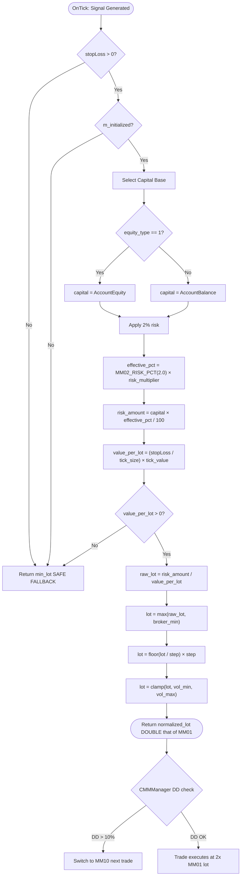
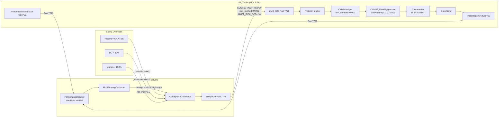

# MM02 — Fixed Fractional Aggressive
## FlashEASuite V2 | Money Management Deep Dive Manual
### Generated: P9-6 | 2026-02-26

---

## 1. Overview

| Field             | Value                                                                    |
|-------------------|--------------------------------------------------------------------------|
| **ID**            | MM02                                                                     |
| **Name**          | Fixed Fractional Aggressive                                              |
| **Type**          | Fixed Fraction Position Sizing (High Risk Variant)                       |
| **Risk Level**    | High (3 stars out of 5)                                                  |
| **Mode**          | Standalone + Server                                                      |
| **MQL5 Class**    | `CMM02_FixedAggressive`                                                  |
| **Source File**   | `Include/Logic/MM/MM02_FixedAggressive.mqh`                              |
| **MM Enum ID**    | `MM_ID_FIXED_AGGRESSIVE = 2`                                             |
| **Best For**      | High win-rate strategies (>65%), trending markets, experienced traders   |
| **Suitable Strategies** | S09 (Session Breakout), S10 (Turtle), S14 (BB Squeeze)             |

---

## 2. Philosophy & Rationale (The "Why")

### 2.1 The Concept

MM02 is the higher-risk sibling of MM01. The core algorithm is identical — Fixed Fractional position sizing based on a risk percentage of account equity or balance — but the **default risk percentage is doubled** from 1% to 2%. This seemingly simple change has non-linear consequences for both the growth rate and the risk of ruin.

The rationale for MM02 stems from a fundamental insight in trading mathematics: **the optimal risk percentage is not the same for all strategies**. A strategy that wins 70% of the time with a 1.5:1 R:R has a Kelly-optimal risk of approximately 26% (Full Kelly), which in practice is dangerous. Half-Kelly would suggest ~13%, which is still high. Even at a conservative 2%, such a strategy generates dramatically better compounding than at 1%.

MM02 is designed for strategies that have **demonstrable edge superiority** — strategies where extensive backtesting and forward-testing evidence supports risk tolerance above the conservative 1% baseline. In the FlashEASuite V2 context, this means:

- **S09 Session Breakout**: Breakout strategies during the London/New York open have historically shown 60-70%+ win rates with tight, well-defined stop-losses.
- **S10 Turtle**: The classic Donchian channel trend-following system is known for high R:R ratios (sometimes 3:1 or better) on trending instruments.
- **S14 BB Squeeze**: Bollinger Band squeeze setups fire infrequently but tend to capture significant directional moves, resulting in high per-trade profitability.

For these strategies, the additional 1% risk substantially accelerates account growth while keeping the absolute risk within the range most risk managers consider manageable. The 2% threshold is historically significant: most professional prop traders and systematic funds operate between 1% and 2% per trade, with 2% representing the upper boundary of "moderate" risk.

### 2.2 Pros & Cons

**Pros**

- **Faster compounding**: At 2% risk versus 1%, assuming equivalent win rates and R:R, account growth rate approximately doubles. After 100 trades at 65% win rate and 1.5:1 R:R, the compounding advantage is substantial.
- **Better capital efficiency**: Higher risk per trade means more of the account's earning potential is engaged. For high-confidence strategy signals, leaving capital idle (as 1% risk often does) is a hidden opportunity cost.
- **Same simplicity as MM01**: No additional parameters, no ATR lookups, no trade history requirements. The formula is clean and fully predictable.
- **Shared codebase with MM01**: `CMM02_FixedAggressive` is a near-identical class to `CMM01_FixedConservative` with a different default. This means zero additional bugs, zero additional maintenance.
- **Still bounded risk**: 2% is still much less than the Kelly-optimal for strong strategies. It represents a significant safety margin below mathematically dangerous territory.

**Cons**

- **2x drawdown speed**: A 10-trade losing streak at 2% risk reduces the account by 18.3% (vs 9.6% at 1%). Combined with open position floating losses, this can threaten the DD stop threshold faster.
- **Amplifies strategy weakness**: If MM02 is applied to a strategy that was only marginally profitable, the 2% risk can quickly turn marginal losses into meaningful account damage.
- **Not suitable for low win-rate strategies**: Strategies with win rates below 50% (even with high R:R) are better served by MM01 or MM04 Kelly which can compute a lower optimal fraction.
- **Not suitable for volatile markets**: When ATR spikes (news events, volatility shocks), the stop-loss distance widens but MM02 does not automatically reduce lot size the way MM03 does. This can result in unexpectedly large losses.
- **Prop firm risk**: At 2% risk, 3 consecutive losses = ~5.9% drawdown. Most prop firms have 5% daily drawdown rules. MM02 with a bad morning can breach this limit.

### 2.3 Selection Criteria

MM02 is **not** in the default MMManager selection matrix as a default for any strategy. It must be explicitly assigned:

1. **Direct server CONFIG_PUSH**: The Brain server sets `"mm_method": "MM02"` for a specific strategy, typically after the strategy demonstrates consistent high win rate over a sufficient trade history.
2. **Manual assignment**: Trader manually sets MM02 in EA input parameters.
3. **User configuration**: During setup, trader designates MM02 as the preferred method for a specific strategy.

The Brain server's `MultiStrategyOptimizer` considers assigning MM02 when:
- Strategy win rate (rolling 50-trade window) > 65%
- Strategy average R:R > 1.3
- Current drawdown < 5% (well within safe territory)
- Market regime is TRENDING or RANGING (not VOLATILE)

Account size guidance:
- Below $5,000: Exercise caution — minimum lot constraints may cause MM02 to overshoot the 2% target.
- $5,000 to $50,000: Appropriate range for MM02.
- Above $50,000: MM04 (Kelly) is more mathematically appropriate as it continuously recalibrates.

---

## 3. Risk & Reward Architecture

### 3.1 Drawdown Control

MM02 uses the same proportional drawdown protection as MM01 — lot size scales down with the account. However, because the base risk is 2%, drawdowns accumulate at twice the speed:

| Consecutive Losses | MM01 (1%) Account Remaining | MM02 (2%) Account Remaining |
|--------------------|------------------------------|-----------------------------|
| 5                  | 95.1%                        | 90.4%                        |
| 10                 | 90.4%                        | 81.7%                        |
| 15                 | 86.0%                        | 73.9%                        |
| 20                 | 81.8%                        | 66.8%                        |

The `CMMManager` DD tier logic applies identically to MM02:
- If drawdown reaches 10%, `SelectMM()` overrides MM02 with MM10 (DrawdownBased).
- If drawdown reaches 20%, trading halts entirely.

For MM02, reaching 10% drawdown from a starting point requires only 5-6 consecutive losses (compared to 10-11 for MM01). This means the DD safety net is more likely to trigger during normal operation. This is by design — MM02 is more aggressive, and the protection mechanism appropriately activates sooner.

The `m_equity_type` parameter (default=1, Equity) ensures that floating losses from open positions reduce the base for the next trade. This is especially important at 2% risk: if there is 1% floating loss from an open position, the next trade's lot will be calculated on a reduced equity, resulting in a slightly smaller lot. Over many trades, this creates a mild self-protective effect.

### 3.2 Profit Maximization

The compounding acceleration of MM02 over MM01 is meaningful in real terms:

**Scenario: $10,000 account, 65% win rate, 1.5:1 R:R, 100 trades**
```
MM01 (1% risk):  Expected final balance ≈ $12,800 (+28%)
MM02 (2% risk):  Expected final balance ≈ $16,400 (+64%)
```

**Scenario: $10,000 account, 55% win rate, 1.2:1 R:R, 100 trades (marginal strategy)**
```
MM01 (1% risk):  Expected final balance ≈ $10,200 (+2%)
MM02 (2% risk):  Expected final balance ≈ $10,400 (+4%)
Downside risk:
MM01 worst case (1-sigma bad run): -12%
MM02 worst case (1-sigma bad run): -22%
```

For a marginal strategy, the extra gain from MM02 is small but the extra downside is doubled. This illustrates why MM02 should only be used with demonstrably high-edge strategies.

The `m_risk_multiplier` from the server provides fine-grained tuning. Setting `risk_multiplier = 0.75` effectively makes MM02 behave like 1.5% risk — useful for transitioning strategies that are above the 1% threshold but not fully validated at 2%.

### 3.3 Mathematical Formula

The calculation in `CMM02_FixedAggressive::CalculateLot()` is structurally identical to MM01 with a 2% default:

```
// Step 1: Choose capital base
capital = (equity_type == 1) ? account_equity : account_balance

// Step 2: Apply risk with server multiplier
effective_risk_pct = MM02_RISK_PCT × m_risk_multiplier    // default 2.0 × 1.0 = 2.0
risk_amount = capital × (effective_risk_pct / 100.0)

// Step 3: Convert SL distance to value per lot
tick_value = SYMBOL_TRADE_TICK_VALUE
tick_size  = SYMBOL_TRADE_TICK_SIZE
value_per_lot = (stopLoss / tick_size) × tick_value

// Step 4: Calculate raw lot
raw_lot = risk_amount / value_per_lot

// Step 5: Enforce minimum lot
broker_min = SYMBOL_VOLUME_MIN
lot = max(raw_lot, max(MM02_MIN_LOT, broker_min))

// Step 6: Normalize
step = SYMBOL_VOLUME_STEP
lot = floor(lot / step) × step
lot = clamp(lot, vol_min, vol_max)
lot = NormalizeDouble(lot, 2)
```

**Concrete example** (XAUUSD, $10,000 account, 2% risk, SL = 2.0 price units):

```
capital         = $10,000
risk_amount     = $10,000 × 2% = $200
tick_value      = $1.00 per tick (typical XAUUSD micro-lot)
tick_size       = 0.01
value_per_lot   = (2.0 / 0.01) × $1.00 = $200
raw_lot         = $200 / $200 = 1.00
normalized_lot  = 1.00
```

Note: Identical SL distance as the MM01 example yields exactly double the lot size.

**At what R:R does MM02 become dangerous?**

The risk of ruin increases significantly if a strategy has a win rate below its break-even R:R threshold. For MM02 at 2%:
- With 40% win rate, full Kelly suggests 0% risk — MM02 would be slowly destroying the account.
- The `_CalcKellyRisk()` check in MM04 catches this, but MM02 has no such safeguard. Users must validate strategy edge before applying MM02.

---

## 4. Operational Modes: Standalone vs Server

### 4.1 Standalone Mode

In Standalone Mode, MM02 runs with its constructor defaults:

```
CMM02_FixedAggressive mm;
mm.Setup("XAUUSD");                        // Reads broker min lot
mm.SetParams(2.0, 1, 0.01);               // risk=2%, equity-based, min_lot=0.01
```

Without server connection, `m_risk_multiplier = 1.0` (base class default). Effective risk = 2.0%.

**Important**: MM02 is **not** included in the `standalone_config` enabled strategies list by default. The Brain server's `ConfigPushGenerator` sets:
```json
"standalone_config": {
    "default_mm": "MM01",
    "risk_multiplier": 0.5
}
```

This means that when the system falls back to Standalone mode (server disconnected), all strategies switch to MM01 — MM02 is not preserved in standalone mode. This is intentional: the Brain server's regime intelligence is what justifies the higher 2% risk. Without it, the system falls back to conservative defaults.

If a trader manually forces MM02 in standalone mode, the system will use it, but there is no automatic protection from the server's regime filtering or strategy confidence scoring.

### 4.2 Server Mode (Multi-tenant)

In Server Mode, the Brain can assign MM02 to specific strategies on specific symbols based on performance data.

**What CONFIG_PUSH can override for MM02:**

| CONFIG_PUSH Key        | Effect on MM02                           | Range        |
|------------------------|------------------------------------------|--------------|
| `MM02_RISK_PCT`        | Override base risk percentage            | [1.0, 5.0]   |
| `MM01_EQUITY_TYPE`     | Switch Equity (1) vs Balance (0)         | {0, 1}       |
| `risk_multiplier`      | Scale effective risk                     | [0.1, 2.0]   |
| `mm_method`            | Force switch away from MM02              | "MM01"-"MM19" |

Note that `MM02_RISK_PCT` range in the server is `[1.0, 5.0]` — broader than the conservative MM01 range. The Brain server may push up to 3.0% during exceptional strategy performance periods, always respecting the upper bound.

**Server safety override behavior:**
- If Brain detects `regime = VOLATILE` or `SQUEEZE`, it will change `mm_method` from MM02 to MM07 (PctVolatility) or MM17 (RegimeBased) for affected strategies.
- If `dd_current > 10%`, Brain's `ConfigPushGenerator` includes MM10 override regardless of active MM.
- If `margin_level` (from `MSG_PERFORMANCE_METRICS`) drops below 150%, Brain may reduce `risk_multiplier` to 0.5 for all strategies.

**Feedback loop:**

The `TradeReportV6` (type=20) sent by the MQL5 EA after each MM02 trade includes `lots` and `profit` fields. The Brain's `PerformanceTracker` stores these against the strategy ID. After the rolling window fills (30-50 trades), the optimizer can decide whether MM02 is still appropriate or should be scaled back.

```
MQL5 sends (after trade close):
    strategy_id = "S09"
    lots = 1.00        ← reflects 2% risk at $10,000
    profit = +$180.00
    close_price = ...

Brain receives → PerformanceTracker.record():
    S09 win_rate rolling += 1 win
    S09 avg_rr = 180 / 200 = 0.9  ← below 1:1, consider reducing MM02_RISK_PCT
```

---

## 5. Mermaid Lot Calculation Workflow



---

## 6. Dataflow: Parameter Updates from Server to Tenant



---

## 7. Parameter Reference

| Parameter         | Default | Range        | CONFIG_PUSH Key       | Type   | Description                               |
|-------------------|---------|--------------|-----------------------|--------|-------------------------------------------|
| `MM02_RISK_PCT`   | 2.0     | [1.0, 5.0]   | `MM02_RISK_PCT`       | double | Base risk % per trade (2x MM01 default)   |
| `MM01_EQUITY_TYPE`| 1       | {0, 1}       | `MM01_EQUITY_TYPE`    | int    | 1=Use Equity, 0=Use Balance               |
| `MM02_MIN_LOT`    | 0.01    | [0.01, 1.0]  | `MM02_MIN_LOT`        | double | Minimum lot size override                 |
| `risk_multiplier` | 1.0     | [0.1, 2.0]   | `risk_multiplier`     | double | Server scaling (0.5 = effectively 1% risk)|

**Note on shared parameter key**: The class internally uses `m_equity_type` same as MM01. The CONFIG_PUSH key is `MM01_EQUITY_TYPE` for backward compatibility with the parameter repository schema.

**Effective risk at various multiplier settings:**

| `MM02_RISK_PCT` | `risk_multiplier` | Effective Risk % |
|-----------------|-------------------|------------------|
| 2.0             | 1.0               | 2.0%             |
| 2.0             | 0.75              | 1.5%             |
| 2.0             | 0.5               | 1.0% (= MM01)    |
| 2.0             | 1.5               | 3.0%             |
| 3.0             | 1.0               | 3.0%             |

---

## 8. Optimization Guide

### When to Use MM02

Apply MM02 only when **all three conditions** are met:

1. Strategy has completed at least 50 forward-test trades (not backtest).
2. Rolling 50-trade win rate > 60% (minimum), preferably > 65%.
3. Rolling 50-trade average R:R > 1.2.

If any condition is not met, use MM01 (1%) as the safer choice while collecting more data.

### Parameter Optimization for Standalone Use

```
# Run optimization test: vary risk_pct, compare Sharpe and Max Drawdown
for risk_pct in [1.0, 1.5, 2.0, 2.5, 3.0]:
    simulate(strategy, mm02_risk=risk_pct)
    record(sharpe, max_dd, cagr)

# Choose risk_pct where:
#   Sharpe ratio is highest
#   AND max_dd < 20%
#   AND CAGR/MaxDD ratio > 1.5
```

### Server-Side Tuning

The Brain server should automatically reduce MM02 risk during:
- VOLATILE regime: reduce `risk_multiplier` to 0.5 or switch mm_method to MM07
- Win rate drop below 55% on rolling 20-trade window: reduce `MM02_RISK_PCT` to 1.5
- Drawdown exceeds 7%: reduce `risk_multiplier` to 0.7 (before DD tier 1 triggers MM10)

### Capital Protection Rule

A useful rule of thumb for MM02 sizing in a multi-strategy portfolio: ensure that no single day can lose more than 6% of account if all active strategies trigger stops simultaneously. With 3 active MM02 strategies and 2% each, a synchronized loss event = 6% drawdown. This is approaching danger territory for prop firms. Reduce to 1.5% (via risk_multiplier = 0.75) when running 4+ strategies concurrently.

---

## 9. Performance Characteristics

| Characteristic           | Assessment                                                     |
|--------------------------|----------------------------------------------------------------|
| **Best market condition** | Strong directional trends, session breakouts, low-volatility squeezes |
| **Worst condition**       | High-volatility news events, choppy markets, low win-rate strategy periods |
| **Compounding speed**     | Approximately 2x MM01 for equivalent strategy performance      |
| **Max single-trade loss** | Exactly 2% of current equity (before lot normalization)        |
| **Drawdown behavior**     | 2x faster accumulation vs MM01; same proportional self-correction |
| **Break-even requirement**| Strategy needs >2/3 × (1/(1+R:R)) win rate to avoid ruin at 2% |
| **Consecutive losses**    | N=5: -9.6%, N=10: -18.3%, N=15: -26.0%                        |
| **Margin usage**          | Approximately 2x MM01 margin; monitor `margin_level` via type=22 |
| **Prop firm safety**      | Marginal — 3 consecutive losses can approach 6% daily limit   |

**MM02 in the context of the full MM Suite:**

MM02 occupies the space between MM01 (1% safe baseline) and the adaptive methods (MM03, MM04). It is suitable for a trader who has validated their strategy's edge and wants more aggressive compounding, but prefers the simplicity of a fixed percentage over the complexity of Kelly or ATR-based sizing. Think of it as "MM01 with conviction."

---
*MM02 Manual — FlashEASuite V2 | Phase P9-6 | Generated 2026-02-26*
