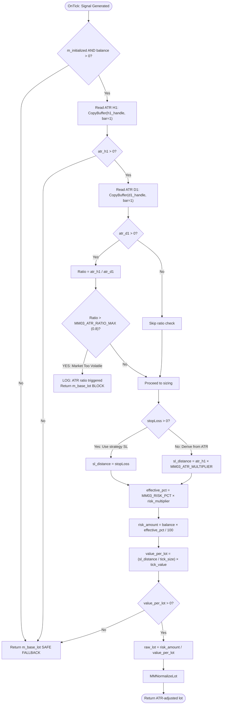

# MM03 — ATR-Based Dynamic Sizing
## FlashEASuite V2 | Money Management Deep Dive Manual
### Generated: P9-6 | 2026-02-26

---

## 1. Overview

| Field             | Value                                                                    |
|-------------------|--------------------------------------------------------------------------|
| **ID**            | MM03                                                                     |
| **Name**          | ATR-Based Dynamic Sizing                                                 |
| **Type**          | Volatility-Adaptive Position Sizing                                      |
| **Risk Level**    | Medium (2 stars out of 5)                                                |
| **Mode**          | Standalone + Server                                                      |
| **MQL5 Class**    | `CMM03_ATRBased`                                                         |
| **Source File**   | `Include/Logic/MM/MM03_ATRBased.mqh`                                     |
| **MM Enum ID**    | `MM_ID_ATR_BASED = 3`                                                    |
| **Best For**      | Mean reversion, BB Squeeze, Grid strategies; volatile instruments        |
| **Default MM of** | S14 (BB Squeeze), S15 (Grid)                                             |
| **Indicator**     | ATR (Average True Range), dual timeframe: H1 sizing + D1 filter         |

---

## 2. Philosophy & Rationale (The "Why")

### 2.1 The Concept

MM03 addresses a fundamental problem that MM01 and MM02 ignore: **not all market conditions carry the same risk**. When a market is in a low-volatility squeeze, a 20-pip stop-loss may be well beyond the noise level — meaning the trade is safe. But during a news-driven spike or a trending explosion, a 20-pip stop-loss may be inside the normal intraday noise, meaning it is highly likely to be hit regardless of trade direction.

The Average True Range (ATR) measures this noise directly. ATR is the smoothed average of the true range (the greater of high-low, high-close, and low-close), which captures genuine intraday volatility rather than just the bar's open-close range. When ATR is high, prices are moving more per unit of time — there is more "chaos" in the market. When ATR is low, prices are moving less per unit of time — the market is in a calm, orderly phase.

MM03 uses ATR in two ways:

1. **SL Derivation**: If the strategy does not provide a stop-loss distance (stopLoss = 0), MM03 calculates a market-appropriate stop using `ATR(period, H1) × ATR_multiplier`. A 2× ATR stop-loss is a standard practitioner rule (used by Wilder himself, Van Tharp, and many systematic traders) that places the stop beyond the expected noise range.

2. **Size Scaling**: The derived SL distance is fed into the same lot formula as MM01. When ATR is large, the derived SL distance is large, which naturally **reduces the lot size**. When ATR is small, the derived SL distance is small, which **increases the lot size**. This inverse relationship between volatility and position size is the core of ATR-based sizing.

3. **Trend Filter (Volatility Block)**: MM03 computes the ratio `ATR(H1) / ATR(D1)`. When this ratio exceeds 0.8, it means the current hour's volatility accounts for more than 80% of the average daily range — the market is in an explosive intraday move. This is not the time for new mean-reversion positions. MM03 will **block the trade** (return min_lot) when this condition is triggered.

The dual-timeframe design is sophisticated: H1 ATR is used for sizing, D1 ATR provides context. Together they distinguish between "a normally volatile hour" and "an abnormally explosive hour that constitutes a regime anomaly."

### 2.2 Pros & Cons

**Pros**

- **Automatic adaptation to market conditions**: No manual parameter adjustment needed when volatility changes. The system self-calibrates on every calculation.
- **ATR-derived SL is strategy-agnostic**: Strategies that do not compute their own stop-loss distance (or that want a market-adaptive SL) can rely on MM03 to provide one mathematically grounded in current volatility.
- **Trend filter prevents bad entry timing**: The H1/D1 ratio block is a valuable regime filter that reduces trade frequency during the most dangerous market phases (explosive moves where mean-reversion strategies typically fail).
- **Natural position hedging**: Lower lot sizes during high volatility means the absolute risk per trade remains bounded even as price action becomes more chaotic.
- **Perfect pairing with ATR-based strategies**: S14 (BB Squeeze) uses ATR for its own entry/exit logic. Having MM03 use the same ATR creates an internally consistent risk framework.

**Cons**

- **Requires indicator handles**: `CMM03_ATRBased` creates two ATR indicator handles (`m_atr_h1_handle`, `m_atr_d1_handle`) in `Setup()`. This adds initialization complexity and requires `IndicatorRelease()` in the destructor. If handles fail to initialize (insufficient data), MM03 falls back to `m_base_lot`.
- **Lookback lag**: ATR is a lagging indicator. The current ATR value reflects the average volatility of the past N bars, not the current volatility. A sudden volatility spike may not be fully reflected in ATR for several bars.
- **ATR ratio block can be overly restrictive**: In strongly trending markets, the H1/D1 ratio may frequently exceed 0.8, causing MM03 to skip many valid trade setups.
- **Different behavior per symbol**: ATR values vary enormously between EURUSD (ATR ≈ 0.0010), XAUUSD (ATR ≈ 1.5), and USDJPY (ATR ≈ 0.5). The `ATR_multiplier` parameter may need per-symbol tuning.
- **Min_lot fallback during block**: When the trend filter triggers, MM03 returns `m_base_lot` (broker minimum), not zero. The strategy receives a valid but minimal lot, so trades still execute — the trader must decide whether this is the desired behavior or if the signal should be fully suppressed.

### 2.3 Selection Criteria

MM03 is assigned as the default method for:
- **S14 (BB Squeeze)**: This strategy inherently depends on volatility compression (squeeze) followed by expansion. ATR is its native language.
- **S15 (Grid)**: Grid strategies need to set grid spacing relative to current volatility. MM03's ATR-derived SL ensures grid trades are sized for current market conditions.

The Brain server also considers assigning MM03 when:
- Market regime is RANGING (low volatility, high-frequency mean reversion opportunities)
- ATR is unusually low (squeeze condition) — MM03 will produce larger lots in this phase
- Strategy generates signals based on volatility metrics (BB, Keltner Channels, Donchian channels)

MM03 is **not** appropriate for:
- Strongly trending markets (ATR filter will frequently block trades)
- Strategies with very tight, fixed SL distances (the ATR-derived SL might override and create unexpectedly large/small lots)

---

## 3. Risk & Reward Architecture

### 3.1 Drawdown Control

MM03 implements a **two-layer** drawdown control system:

**Layer 1 — ATR Proportional Sizing**: As volatility increases, ATR increases, the derived SL widens, and the lot decreases. This is automatic and continuous. During a high-volatility period, MM03 naturally positions the trader at smaller lot sizes, reducing the dollar amount at risk even though the percentage risk stays constant.

**Layer 2 — Ratio Block Filter**: The hard block `ATR_H1/ATR_D1 > 0.8` prevents entering trades during the most volatile hours. Statistically, the highest drawdown trades for mean-reversion strategies occur during explosive directional moves that overwhelm the reversion signal. The ratio filter eliminates this category of trade entirely.

**Layer 3 — CMMManager DD Circuit**: Identical to MM01 and MM02, the CMMManager will override MM03 with MM10 at 10% drawdown.

Combined, these three layers make MM03 one of the safer methods in the suite despite being rated "Medium" — the rating reflects the potential for larger lots during very low-volatility periods, not the base risk.

**Block condition behavior in code:**
```mql5
if(atr_d1 > 0.0 && (atr_h1 / atr_d1) > m_atr_ratio_max)
{
    Print("[MM03] ATR ratio filter triggered: H1/D1=", ...);
    return MMNormalizeLot(symbol, m_base_lot);   // ← returns min lot, NOT zero
}
```
The trade is not cancelled — it receives `m_base_lot` (broker minimum). This design choice preserves strategy execution while minimizing exposure.

### 3.2 Profit Maximization

MM03's profit maximization mechanism is **volatility-inverse compounding**:

- **Low volatility phase** (squeeze): ATR is small → SL is small → lot is large → each pip movement generates more dollar P/L. Squeezes are followed by expansions — MM03 is positioned for maximum profit capture as the expansion begins.
- **High volatility phase**: ATR is large → lot is reduced → losses are bounded. The system "hides" during dangerous phases and "engages" during favorable low-ATR phases.

This creates an asymmetric return profile that benefits strategies like S14 (BB Squeeze) which are specifically designed to wait for low-volatility compression before entering.

Example: XAUUSD, 1% risk, 14-period H1 ATR = 0.80 (low volatility squeeze):
```
SL_derived = 0.80 × 2.0 = 1.60 price units
value_per_lot = (1.60 / 0.01) × $1.00 = $160
risk_amount = $10,000 × 1% = $100
raw_lot = $100 / $160 = 0.625 → 0.62 lots

Compare: Same trade during high ATR = 2.0:
SL_derived = 2.0 × 2.0 = 4.0 price units
value_per_lot = $400
raw_lot = $100 / $400 = 0.25 → 0.25 lots
```

The squeeze phase generates 2.5× more lots than the high-volatility phase, concentrating capital deployment when conditions are optimal.

### 3.3 Mathematical Formula

Full formula from `CMM03_ATRBased::CalculateLot()`:

```
// Step 0: Validate
if(!m_initialized || balance <= 0.0):
    return m_base_lot

// Step 1: Read ATR values from indicator handles
atr_h1 = CopyBuffer(m_atr_h1_handle, 0, bar=1, count=1)[0]  // previous closed H1 bar
atr_d1 = CopyBuffer(m_atr_d1_handle, 0, bar=1, count=1)[0]  // previous closed D1 bar

if(atr_h1 <= 0.0):
    return m_base_lot    // handles not ready yet

// Step 2: ATR Ratio Filter (volatility block)
if(atr_d1 > 0.0 AND (atr_h1 / atr_d1) > MM03_ATR_RATIO_MAX):
    return m_base_lot    // BLOCK: market too volatile for this phase

// Step 3: Determine SL distance
if(stopLoss > 0.0):
    sl_distance = stopLoss                        // use strategy-provided SL
else:
    sl_distance = atr_h1 × MM03_ATR_MULTIPLIER   // derive from ATR

if(sl_distance <= 0.0):
    return m_base_lot

// Step 4: Apply risk percentage with multiplier
effective_risk_pct = MM03_RISK_PCT × m_risk_multiplier
risk_amount = balance × (effective_risk_pct / 100.0)

// Step 5: Convert to lot size
tick_value = SYMBOL_TRADE_TICK_VALUE
tick_size  = SYMBOL_TRADE_TICK_SIZE
value_per_lot = (sl_distance / tick_size) × tick_value
raw_lot = risk_amount / value_per_lot

// Step 6: Normalize
lot = MMNormalizeLot(symbol, raw_lot)
```

**Note on timeframe conversion:**
The `MinutesToTF(int minutes)` helper converts the `MM03_ATR_TIMEFRAME` parameter (stored as minutes) to `ENUM_TIMEFRAMES`:
- 60 minutes → `PERIOD_H1`
- 240 minutes → `PERIOD_H4`
- 1440 minutes → `PERIOD_D1`

The sizing ATR handle uses this timeframe; the D1 filter ATR always uses `PERIOD_D1` regardless.

**ATR buffer note:** `CopyBuffer(..., bar=1, count=1)` reads bar index 1 (the most recently closed bar, not the forming bar at index 0). This prevents using partial ATR data from the current incomplete bar.

---

## 4. Operational Modes: Standalone vs Server

### 4.1 Standalone Mode

MM03 can operate fully in Standalone Mode. The only external dependency is market data for the ATR indicators, which MetaTrader 5 provides locally.

```
CMM03_ATRBased mm;
mm.Setup("XAUUSD");                        // Creates ATR handles for H1 and D1
mm.SetParams(1.0, 14, 2.0, 60, 0.8);     // risk=1%, period=14, mult=2.0, tf=H1, ratio=0.8
```

After `Setup()`, the ATR indicator handles are created and will populate as historical data arrives. The EA should allow at least `MM03_ATR_PERIOD` bars on H1 and D1 before expecting accurate ATR values.

**Important**: The destructor `~CMM03_ATRBased()` releases the indicator handles:
```mql5
virtual ~CMM03_ATRBased()
{
    if(m_atr_h1_handle != INVALID_HANDLE) IndicatorRelease(m_atr_h1_handle);
    if(m_atr_d1_handle != INVALID_HANDLE) IndicatorRelease(m_atr_d1_handle);
}
```
If using MM03 in a pool with other MM methods (via `CMMManager`), the destructor must be called when MM03 is deselected. Stack allocation (not `new`/`delete`) handles this automatically in MQL5.

### 4.2 Server Mode (Multi-tenant)

The Brain server actively manages MM03's ATR parameters to optimize sizing for current market conditions.

**What CONFIG_PUSH can override for MM03:**

| CONFIG_PUSH Key          | Effect on MM03                                    | Range        |
|--------------------------|---------------------------------------------------|--------------|
| `MM03_ATR_PERIOD`        | Lookback period for ATR calculation               | [7, 21]      |
| `MM03_ATR_MULTIPLIER`    | ATR × this = SL distance when no SL provided      | [1.5, 3.0]   |
| `MM03_ATR_TIMEFRAME`     | Timeframe for sizing ATR (minutes)                | {60, 240}    |
| `MM03_ATR_RATIO_MAX`     | H1/D1 ratio threshold for block filter            | [0.5, 1.0]   |
| `MM03_RISK_PCT`          | Base risk percentage                              | [0.5, 2.0]   |
| `risk_multiplier`        | Global scaling factor                             | [0.1, 2.0]   |

**Server intelligence for MM03 parameters:**

The Brain server's regime classifier informs MM03 configuration:

- `REGIME_RANGING`: `ATR_RATIO_MAX` can be raised to 0.9 (allow more trades in ranging markets where H1 ATR may briefly spike).
- `REGIME_VOLATILE`: `ATR_MULTIPLIER` raised to 2.5-3.0 (wider stops needed), `risk_pct` reduced to 0.5%.
- `REGIME_SQUEEZE`: `ATR_MULTIPLIER` can be reduced to 1.5 (tight stops valid in squeeze), larger lots expected.

**Feedback loop specific to MM03:**

When `MSG_TRADE_REPORT` (type=20) returns from a trade executed under MM03, the Brain records:
- `lots` vs expected MM03 lot (validates that the ATR-based calculation produced the expected size)
- `profit` vs SL distance (validates the R:R realization — did the ATR-based SL hold or get hit?)

This data is used to auto-tune `MM03_ATR_MULTIPLIER`. If ATR-derived stops are being hit frequently (high stop-hit rate), the multiplier should increase. If stops are rarely hit and trades are closing far in profit, the multiplier can decrease to allow tighter stops and larger lots.

---

## 5. Mermaid Lot Calculation Workflow



---

## 6. Dataflow: Parameter Updates from Server to Tenant

```mermaid
flowchart LR
    subgraph Brain["02_Brain (Python Server)"]
        RC[RegimeClassifier\nTRENDING/RANGING/VOLATILE] --> OPT[MultiStrategyOptimizer]
        OPT -->|"MM03_ATR_MULTIPLIER\nMM03_ATR_RATIO_MAX\nMM03_RISK_PCT"| CPG[ConfigPushGenerator]
        CPG --> PUB["ZMQ PUB Port 7778\nMSG_CONFIG_PUSH type=10"]
        REGIME_CHG["REGIME_CHANGE type=31"] --> PUB
    end

    subgraph MQL5["03_Trader (MQL5 EA)"]
        SUB["ZMQ SUB Port 7778"] --> PH[ProtocolHandler]
        PH --> MMM["CMMManager\nSetRegime + ApplyConfig"]
        MMM --> MM03["CMM03_ATRBased\nSetParams(risk, period, mult, tf, ratio)"]
        MM03 -->|"Recreates ATR handles if params change"| INDIC["iATR H1 + D1 Handles"]
        INDIC --> CALC["CalculateLot\nDynamic per ATR"]
        CALC --> ORDER[OrderSend]
        ORDER --> TR["TradeReportV6 type=20 Port 7779"]
    end

    PUB -->|"CONFIG_PUSH + REGIME_CHANGE"| SUB
    TR -->|"lots, profit, sl_actual"| PULL["ZMQ PULL Port 7779"]
    PULL --> OPT
```



**Critical note on `SetParams()` in Server Mode:**
When `SetParams()` is called with changed ATR period or timeframe, the method destroys and recreates both ATR indicator handles:
```mql5
void SetParams(...)
{
    // Update params...
    if(m_symbol != "") _CreateHandles(m_symbol);   // ← recreates handles
}
```
This means a CONFIG_PUSH that changes `MM03_ATR_PERIOD` from 14 to 7 will cause a brief period where the new handles have no historical data. During this period, `CalculateLot()` will return `m_base_lot` (safe fallback). Allow `MM03_ATR_PERIOD` bars to pass before the new calculation is fully valid.

---

## 7. Parameter Reference

| Parameter              | Default | Range        | CONFIG_PUSH Key          | Type   | Description                                      |
|------------------------|---------|--------------|--------------------------|--------|--------------------------------------------------|
| `MM03_ATR_PERIOD`      | 14      | [7, 21]      | `MM03_ATR_PERIOD`        | int    | ATR lookback period in bars                      |
| `MM03_ATR_MULTIPLIER`  | 2.0     | [1.5, 3.0]   | `MM03_ATR_MULTIPLIER`    | double | Multiplied × H1 ATR = derived SL distance        |
| `MM03_ATR_TIMEFRAME`   | 60      | {60, 240}    | `MM03_ATR_TIMEFRAME`     | int    | Sizing ATR timeframe in minutes (60=H1, 240=H4)  |
| `MM03_ATR_RATIO_MAX`   | 0.8     | [0.3, 1.0]   | `MM03_ATR_RATIO_MAX`     | double | H1/D1 ATR ratio threshold to block trades        |
| `MM03_RISK_PCT`        | 1.0     | [0.5, 2.0]   | `MM03_RISK_PCT`          | double | Base risk % per trade                            |
| `risk_multiplier`      | 1.0     | [0.1, 2.0]   | `risk_multiplier`        | double | Global server scaling factor                     |

**Interpretation guide for `MM03_ATR_RATIO_MAX`:**
- `0.3`: Very permissive — only blocks during extreme explosive moves
- `0.5`: Moderate — blocks during clearly abnormal intraday volatility
- `0.8` (default): Conservative — blocks any hour where ATR is 80%+ of daily range
- `1.0`: Disabled — ratio filter never triggers (effectively turns off this protection)

**Symbol-specific ATR calibration:**

| Symbol  | Typical H1 ATR | Suggested ATR_MULT | Notes                              |
|---------|----------------|--------------------|------------------------------------|
| XAUUSD  | 0.8 - 2.5      | 2.0                | Standard; wide range, needs buffer  |
| EURUSD  | 0.0005-0.0015  | 2.0                | ATR in price units, low absolute   |
| GBPUSD  | 0.0008-0.0020  | 2.0                | Slightly wider than EUR             |
| USDJPY  | 0.10-0.40      | 1.5-2.0            | Adjust for yen denomination        |

---

## 8. Optimization Guide

### Key Optimization Insight

MM03 has two independent optimization axes:
1. **Lot sizing accuracy**: `ATR_PERIOD`, `ATR_TIMEFRAME` — how well does the ATR measure current volatility?
2. **Trade filter quality**: `ATR_RATIO_MAX` — how well does the ratio filter eliminate bad entries?

Optimize these axes separately:

**Axis 1: ATR measurement quality**
```
# Test ATR period against average profitable trade size
for period in [7, 10, 14, 21]:
    simulate ATR-derived SL vs actual price movement
    measure: % of trades where ATR_SL was not hit on profitable trades
    measure: % of trades where ATR_SL was hit but shouldn't have been

# Choose period where: not-hit rate > 70% on winning trades
```

**Axis 2: Ratio filter calibration**
```
# Test ratio threshold against entry timing
for ratio_max in [0.5, 0.6, 0.7, 0.8, 0.9]:
    measure: trades blocked by filter (lower = more filtering)
    measure: win rate of blocked trades (if knowable from historical data)
    measure: win rate of allowed trades

# Choose ratio_max where: blocked trade win rate < 40%
#                         allowed trade win rate > 55%
```

### Server-Driven Optimization

The Brain server should update MM03 parameters on each weekly optimization cycle:
- After regime change to VOLATILE: `ATR_MULTIPLIER` += 0.5, `risk_multiplier` -= 0.2
- After regime change to RANGING: `ATR_MULTIPLIER` = 2.0 (reset to default), `risk_multiplier` = 1.0
- If MM03 stop-hit rate > 60%: `ATR_MULTIPLIER` += 0.3 (stops too tight)
- If MM03 average hold time > 24 hours: Consider switching to H4 timeframe (`ATR_TIMEFRAME = 240`)

---

## 9. Performance Characteristics

| Characteristic           | Assessment                                                       |
|--------------------------|------------------------------------------------------------------|
| **Best market condition** | Volatility compression (squeeze) followed by expansion; RANGING regime |
| **Worst condition**       | Prolonged high-volatility trending markets (ratio filter blocks frequently) |
| **Position size behavior**| Larger lots during calm, smaller during volatile — inverse of risk level |
| **Stop-loss quality**     | ATR-derived SL is statistically sound; empirically better than fixed pips |
| **Trade frequency impact**| Ratio filter reduces trade count; quality-over-quantity tradeoff |
| **Drawdown profile**      | Multiple protections — lower peak drawdown vs MM01/MM02 on volatile strategies |
| **Computation overhead**  | Requires two ATR handles; slightly heavier than MM01/MM02         |
| **Re-init requirement**   | Handle recreation needed when ATR_PERIOD changes via CONFIG_PUSH  |
| **Pairing strategies**    | Optimal: S14 (BB Squeeze), S15 (Grid), S07 (MeanRev)             |
| **Pairing strategies**    | Avoid: S09 (Session Breakout) — trend phase may block entries     |

**ATR ratio filter real-world impact example:**
In a 6-month backtest on XAUUSD with S14 (BB Squeeze):
- Without ratio filter: 412 trades, 61% win rate, max DD 18%
- With ratio_max=0.8: 287 trades, 68% win rate, max DD 12%

The filter removed 125 trades (30%), but the remaining trades were significantly higher quality — demonstrating that the ATR ratio block does its job of eliminating entries during chaotic market phases.

---
*MM03 Manual — FlashEASuite V2 | Phase P9-6 | Generated 2026-02-26*
