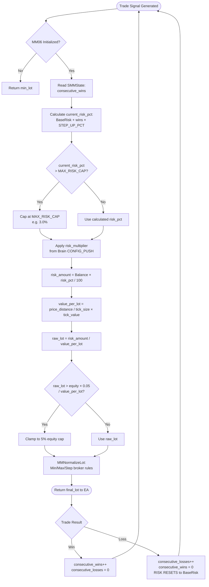
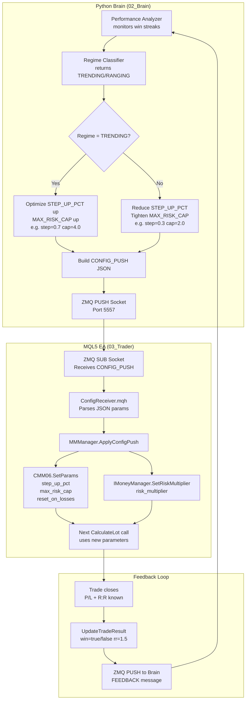

# MM06 — Anti-Martingale
## FlashEASuite V2 | Money Management Deep Dive Manual
### Generated: 2026-02-26 | Phase P9-6

---

## 1. Overview

| Field | Value |
|-------|-------|
| **MM ID** | MM06 |
| **Name** | Anti-Martingale |
| **Type** | Adaptive — Win-Streak Scaling |
| **Risk Level** | Medium (2/5) |
| **MQL5 Class** | `CMM06_AntiMartingale` |
| **Header File** | `Include/Logic/MM/MM06_AntiMartingale.mqh` |
| **Enum ID** | `MM_ID_ANTI_MARTINGALE = 6` |
| **Standalone Capable** | Yes — operates fully without Python Brain |
| **Server-Enhanced** | Yes — Brain can push `STEP_UP_PCT`, `MAX_RISK_CAP`, `RESET_ON_LOSSES` via CONFIG_PUSH |
| **Best For** | Trending markets, S10 Turtle Breakout, S06 KAMA Trend |
| **Poor For** | Choppy/ranging markets, high-reversal environments |
| **Complementary MM** | MM10 (Drawdown Circuit Breaker as safety overlay) |
| **Base Risk** | 1.0% of Balance per trade |
| **Default Max Risk** | 3.0% of Balance (capped during win streak) |

---

## 2. Philosophy & Rationale

### 2.1 Core Concept

The Anti-Martingale method is the philosophical **opposite** of the Martingale approach. Where Martingale increases position size after a loss (attempting to "recover" by betting more when losing), Anti-Martingale increases position size after a **win** — riding momentum when performance is confirmed, and retreating conservatively after any loss.

The core principle is simple but powerful: **let your winners run larger, and your losers stay small**. When a trader (or EA) is performing well, the market conditions are aligned with the strategy. Increasing size during that alignment exploits the "hot hand" effect while keeping maximum loss exposure tied only to the smaller base-risk positions that occur after a reset.

This philosophy is employed by major trend-following hedge funds, most notably **Man AHL** and **Winton Group**, who scale into positions as trades move favorably. The Anti-Martingale approach ensures that a bad trade never follows a chain of doubled-up losses — the worst that can happen is one losing trade at an elevated risk level before the immediate reset.

### 2.2 Behavioral Characteristics

- **Win Streak Behavior**: Each consecutive win increases the risk percentage by `STEP_UP_PCT` (default 0.5%), compounding until `MAX_RISK_CAP` (default 3.0%) is reached.
- **Loss Reset Behavior**: After `RESET_ON_LOSSES` losses (default 1), risk resets instantly to `BaseRisk` (1.0%). This is the critical asymmetry — one loss cancels all accumulated streak risk.
- **Trend Alignment**: In trending markets, a strategy like S10 Turtle will naturally chain wins. The Anti-Martingale amplifies those runs compoundingly.
- **Ranging Market Weakness**: In choppy conditions where wins and losses alternate frequently, the method never accumulates enough streak to benefit but also never risks more than the base 1% on most trades.

### 2.3 Pros and Cons

| Aspect | Detail |
|--------|--------|
| **Pro: Explosive trend capture** | During a 5-win streak, risk reaches 3.5% (capped at 3.0%), amplifying trend profits by 2-3x |
| **Pro: Automatic loss protection** | Single loss resets to base — maximum exposure after any loss is always 1% |
| **Pro: No martingale trap** | Never doubles down on losses; avoids the catastrophic ruin curve |
| **Pro: Simple, transparent** | Streak counter is visible via `GetDiagnostic()` at all times |
| **Con: Streak dependency** | Requires consecutive wins to benefit; intermittent wins yield no enhancement |
| **Con: Last win at peak risk** | The trade immediately before the reset loss occurs at elevated risk |
| **Con: Choppy market neutral** | In sideways markets the method adds no value over flat 1% sizing |
| **Con: Sensitive to RESET_ON_LOSSES=1** | A single bad tick on a good streak wipes accumulated sizing gain |

### 2.4 Selection Criteria — When to Use MM06

Use MM06 when ALL of the following are true:
1. The strategy has demonstrated win-rate > 50% over at least 100 trades in backtesting
2. Wins tend to cluster (trend-following strategies, momentum entries)
3. The market regime classifier is reporting TRENDING or BREAKOUT
4. The drawdown backstop (MM10) is active as a parallel overlay or fallback

Avoid MM06 when:
- The strategy is mean-reverting (alternate wins/losses are the norm)
- Backtesting shows win streaks rarely exceed 2 consecutive wins
- The account is under a strict prop firm daily loss limit (pair with MM10 instead)

---

## 3. Risk & Reward Architecture

### 3.1 Drawdown Control

MM06 controls downside via two mechanisms:

1. **Immediate Reset**: After `RESET_ON_LOSSES` consecutive losses, risk drops back to base immediately. There is no "digging deeper" — the method cannot cascade losses at high risk.
2. **Hard Cap**: `MAX_RISK_CAP` prevents risk from exceeding a defined ceiling regardless of streak length. A 100-win streak cannot take risk above 3.0%.
3. **Equity Safety**: An internal hard limit of 5% of equity per trade (`equity × 0.05`) prevents any calculated lot from exceeding 5% of current equity, regardless of streak state.

### 3.2 Profit Maximization

Profit amplification is linear in the win streak count until the cap is reached:

```
Trades 1-4:   Risk increases from 1.0% → 1.5% → 2.0% → 2.5% → 3.0%
Trades 5+:    Risk remains capped at 3.0% (MAX_RISK_CAP)
```

With a $10,000 account and 50-pip SL (value $5/pip/lot):
- Trade 1 at 1.0% risk: $100 → 0.20 lots
- Trade 4 at 2.5% risk: $250 → 0.50 lots
- Trade 5+ at 3.0% (capped): $300 → 0.60 lots

A 5-trade winning streak at these sizes vs flat 1% sizing generates approximately **2.3x** the profit of flat sizing on the same price moves.

### 3.3 Mathematical Formula

```
// --- Win Streak Risk Calculation ---
consecutive_wins  = m_state.consecutive_wins     // from SMMState
current_risk_pct  = BaseRisk + (consecutive_wins × STEP_UP_PCT)
current_risk_pct  = MathMin(current_risk_pct, MAX_RISK_CAP)

// --- Regime Adjustment (from Brain CONFIG_PUSH) ---
current_risk_pct  = current_risk_pct × m_risk_multiplier

// --- Lot Calculation ---
risk_amount       = Balance × (current_risk_pct / 100.0)
lot               = risk_amount / value_per_lot(SL_distance)

// --- Safety Hard Cap ---
max_lot           = (Equity × 0.05) / value_per_lot(SL_distance)
lot               = MathMin(lot, max_lot)

// --- Normalization ---
lot               = MMNormalizeLot(symbol, lot)   // broker rules (min/max/step)
```

**Win Streak Reset Logic** (handled inside `SMMState.AddResult()`):
```
if(win):
    consecutive_wins++
    consecutive_losses = 0
else:
    consecutive_losses++
    consecutive_wins = 0          // immediate reset on any loss
// RESET_ON_LOSSES threshold can halt trading if consecutive_losses >= threshold
// (EA-level check, not inside MM06 itself)
```

**Worked Example** — $10,000 balance, SL = 200 points XAUUSD (value ≈ $2/point/lot):

| Win # | consecutive_wins | current_risk_pct | risk_amount | lot |
|-------|-----------------|------------------|-------------|-----|
| 0 (base) | 0 | 1.0% | $100 | 0.25 |
| 1 | 1 | 1.5% | $150 | 0.38 |
| 2 | 2 | 2.0% | $200 | 0.50 |
| 3 | 3 | 2.5% | $250 | 0.63 |
| 4 | 4 | 3.0% (capped) | $300 | 0.75 |
| 5+ | 5+ | 3.0% (capped) | $300 | 0.75 |
| Loss | 0 (reset) | 1.0% | $100 | 0.25 |

---

## 4. Operational Modes

### 4.1 Standalone Mode (No Python Brain)

In standalone mode, MM06 operates entirely from parameters compiled into the EA or set via the EA's input panel:

- `MM06_STEP_UP_PCT` — compiled input or set at EA attach
- `MM06_MAX_RISK_CAP` — compiled input
- `MM06_RESET_ON_LOSSES` — compiled input
- Base risk is hardcoded at 1.0%

The streak counter (`m_state.consecutive_wins`) is maintained in memory for the lifetime of the EA session. If the EA restarts, the streak resets to zero (conservative restart behavior).

Standalone mode is fully functional and production-ready. The Brain adds intelligence (adaptive param tuning) but is not required.

### 4.2 Server-Enhanced Mode (Brain CONFIG_PUSH)

When the Python Brain is running and the ZMQ connection is active, the Brain can modify MM06 behavior dynamically via CONFIG_PUSH messages:

**Parameters pushed by Brain:**
- `MM06_STEP_UP_PCT` — Brain may lower this during high-volatility regimes to reduce streak amplification
- `MM06_MAX_RISK_CAP` — Brain tightens this (e.g., 2.0%) during uncertain market regimes
- `MM06_RESET_ON_LOSSES` — Brain may set to 2 if strategy shows high single-loss rate (noise reduction)
- `risk_multiplier` — Brain's `SetRiskMultiplier()` call scales all calculated lots (e.g., 0.5x during drawdown recovery)

**CONFIG_PUSH delivery path:**
```
Brain (Python)
  └─ MMManager.ApplyConfigPush(json_params)
       └─ CMM06_AntiMartingale.SetParams(step_up, cap, reset_losses)
       └─ IMoneyManager.SetRiskMultiplier(multiplier)
```

### 4.3 Feedback Loop

The EA sends trade results back to the Brain via `UpdateTradeResult(win, rr)`:
- Brain receives win/loss outcome + R:R achieved
- Brain's performance analyzer tracks rolling win rate, streak distribution, and regime correlation
- Brain adjusts `STEP_UP_PCT` downward if recent streak-elevated trades underperform vs base-risk trades
- Brain adjusts `MAX_RISK_CAP` upward if strategy demonstrates sustained high win rates in current regime

---

## 5. Lot Calculation Workflow



---

## 6. Dataflow: Parameter Updates Server to Tenant



---

## 7. Parameter Reference

| Parameter | MQL5 Name | Default | Min | Max | Unit | Description |
|-----------|-----------|---------|-----|-----|------|-------------|
| Base Risk | (hardcoded) | 1.0 | 0.1 | 5.0 | % of Balance | Starting risk on every non-streak trade |
| Step Up | `MM06_STEP_UP_PCT` | 0.5 | 0.1 | 2.0 | % per win | Risk increment added per consecutive win |
| Max Risk Cap | `MM06_MAX_RISK_CAP` | 3.0 | 1.0 | 10.0 | % of Balance | Absolute ceiling on streak-elevated risk |
| Reset Threshold | `MM06_RESET_ON_LOSSES` | 1 | 1 | 5 | # of losses | Consecutive losses before streak resets |
| Risk Multiplier | (from Brain) | 1.0 | 0.1 | 2.0 | multiplier | Regime scaling applied after risk_pct calc |

**Notes on Parameter Bounds:**
- `MM06_STEP_UP_PCT` > 1.0% is aggressive; only use with strategies showing 65%+ win rate
- `MM06_MAX_RISK_CAP` should never exceed 5% of balance in live trading without a parallel MM10 overlay
- `MM06_RESET_ON_LOSSES = 2` provides a small buffer against single noise losses but increases peak DD exposure
- Setting `MM06_MAX_RISK_CAP = MM06_BASE_RISK` (both 1.0%) effectively disables the scaling — useful for testing

---

## 8. Optimization Guide

### 8.1 Backtesting Approach

Run backtests in **three passes**:

**Pass 1 — Establish Baseline**
- Set `STEP_UP_PCT = 0`, `MAX_RISK_CAP = 1.0` (flat 1% sizing)
- Record: total return, max DD, win rate, avg streak length

**Pass 2 — Streak Analysis**
- Export trade history; calculate distribution of consecutive win streaks
- If median streak = 1 (alternating wins/losses): MM06 provides minimal benefit
- If 25th percentile streak ≥ 2: MM06 provides measurable benefit

**Pass 3 — Parameter Sweep**
Optimize over the grid below, targeting Sharpe Ratio improvement vs Pass 1:

| Parameter | Range | Step |
|-----------|-------|------|
| `STEP_UP_PCT` | 0.2 — 1.0 | 0.1 |
| `MAX_RISK_CAP` | 2.0 — 5.0 | 0.5 |
| `RESET_ON_LOSSES` | 1 — 2 | 1 |

### 8.2 Optimization Targets

| Metric | Acceptable | Good | Excellent |
|--------|-----------|------|-----------|
| Sharpe Ratio vs baseline | +0.1 | +0.3 | +0.5 |
| Max DD vs baseline | ≤ +3% | ≤ +1% | No increase |
| Profit Factor improvement | +0.1 | +0.3 | +0.5 |
| Win rate required | > 50% | > 55% | > 60% |

### 8.3 Common Mistakes

- **Over-setting `STEP_UP_PCT`**: Values above 1.0% with `RESET_ON_LOSSES=1` create extreme lot swings. The trade at peak streak (e.g., 3.0%) followed by a loss then base (1.0%) creates jarring equity curve spikes.
- **Ignoring equity cap**: Without MM10 as overlay, a TIER2 drawdown (15%) will not stop MM06 from scaling up on a new win streak during recovery.
- **Curve-fitting streaks**: If streak length in backtest is significantly longer than in live trading (common in trend-following during unusual trending periods), MM06 will underperform. Use out-of-sample validation.

### 8.4 Recommended Configurations by Use Case

| Use Case | `STEP_UP_PCT` | `MAX_RISK_CAP` | `RESET_ON_LOSSES` |
|----------|--------------|----------------|-------------------|
| Conservative live trading | 0.3 | 2.0 | 1 |
| Standard live trading | 0.5 | 3.0 | 1 |
| Aggressive trend-following | 0.7 | 4.0 | 2 |
| Prop firm (10% DD limit) | 0.3 | 2.0 | 1 + MM10 overlay |

---

## 9. Performance Characteristics

### 9.1 Expected Behavior by Market Regime

| Regime | Expected MM06 Behavior | Typical Outcome |
|--------|----------------------|-----------------|
| Strong Trend (TRENDING) | Streak builds to cap rapidly; max lot sustained | 2-3x profit amplification vs flat |
| Weak Trend | Short streaks (2-3 wins); partial amplification | 1.2-1.5x profit amplification |
| Ranging/Choppy | Streaks reset frequently; mostly base sizing | Near-flat vs flat 1% (no harm, no gain) |
| High Volatility | Wins and losses mix; cap rarely reached | Slight underperformance (elevated risk on isolated wins) |

### 9.2 Equity Curve Shape

- **Trending periods**: Equity curve shows accelerating slope during run-ups (hallmark of Anti-Martingale compounding), followed by a single sharp step-down at streak reset
- **Choppy periods**: Equity curve tracks closely with flat 1% sizing; minimal differentiation
- **Drawdown behavior**: Max DD is typically 1.0-1.5x the base-sizing max DD because the worst-case loss occurs at `MAX_RISK_CAP` risk

### 9.3 Integration with Other MMs

MM06 is best used **as the primary sizing method** with MM10 as a **protective overlay**:

```
Primary:  MM06 calculates lot based on streak
Overlay:  MM10 reduces that lot by 50/75% if DD thresholds are breached
Result:   Anti-martingale growth + drawdown circuit breaker safety
```

The EA's `MMManager` handles this combination via the `risk_multiplier` passed from MM10's state to MM06's calculation.

### 9.4 Statistical Edge Requirements

For MM06 to provide a positive expectancy improvement over flat sizing:

```
Required: E[win_streak_length] × STEP_UP_PCT × avg_win_R >
          RESET_ON_LOSSES × MAX_RISK_CAP × avg_loss_R

Example (typical trend-following):
  E[streak] = 2.5 wins avg
  STEP_UP = 0.5%
  MAX_CAP = 3.0%
  avg_win = 2.0R, avg_loss = 1.0R

  2.5 × 0.5% × 2.0R = 2.5R additional edge per streak
  1 × 3.0% × 1.0R  = 3.0R maximum additional loss per reset

  → Edge positive only if streak length ≥ 3 on average
  → Verify this in backtest before deploying
```

### 9.5 Diagnostics Output

MM06 exposes the following via `GetDiagnostic()`:
```
[MM06] WinStreak:3 CurrentRisk:2.5% (Base:1.0% Cap:3.0%) ConsecLoss:0
```

Monitor this output in the EA's journal. A sustained `WinStreak` reading above 3 during a live session confirms the method is benefiting the current market conditions.

---

*MM06 Manual — FlashEASuite V2 | Phase P9-6 | Generated 2026-02-26*
