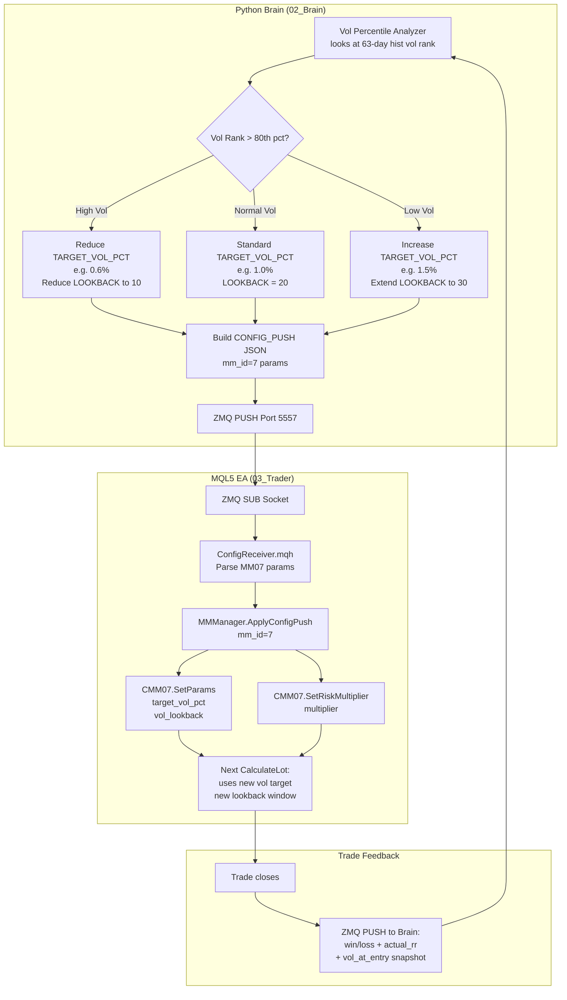

# MM07 — Percent Volatility
## FlashEASuite V2 | Money Management Deep Dive Manual
### Generated: 2026-02-26 | Phase P9-6

---

## 1. Overview

| Field | Value |
|-------|-------|
| **MM ID** | MM07 |
| **Name** | Percent Volatility (Volatility Targeting) |
| **Type** | Adaptive — Market Volatility Normalized |
| **Risk Level** | Medium (2/5) |
| **MQL5 Class** | `CMM07_PctVolatility` |
| **Header File** | `Include/Logic/MM/MM07_PctVolatility.mqh` |
| **Enum ID** | `MM_ID_PCT_VOLATILITY = 7` |
| **Standalone Capable** | Yes — computes realized volatility from live price data |
| **Server-Enhanced** | Yes — Brain can push `TARGET_VOL_PCT`, `VOL_LOOKBACK` via CONFIG_PUSH |
| **Best For** | Any strategy; most effective with S07 Mean Reversion, S14 BB Squeeze |
| **Poor For** | Extreme low-volatility environments (vol approaches zero → lot approaches infinity; safety cap prevents runaway) |
| **Complementary MM** | MM03 (ATR-Based) as conceptual sibling; MM10 as protective overlay |
| **Base Fallback** | Falls back to min_lot if realized vol calculation fails |
| **Hard Safety Cap** | 5% of equity maximum regardless of vol calculation |

---

## 2. Philosophy & Rationale

### 2.1 Core Concept

Percent Volatility sizing answers a fundamentally different question than standard fixed-fractional methods. Instead of asking "how much of my balance am I willing to lose on this trade?", it asks: **"how large must my position be so that one unit of market volatility equals exactly my target risk exposure?"**

The method ensures that position size is always **inversely proportional to current market volatility**. When the market is quiet (low volatility), positions are larger because each price move is small and poses less dollar risk per unit. When the market is volatile, positions automatically shrink because each price move is larger and poses more dollar risk per unit.

This is the institutional standard approach, used by:
- **Bridgewater Associates** (Ray Dalio's All Weather portfolio — constant volatility contribution per asset)
- **AQR Capital Management** (volatility-scaled factor portfolios)
- **Man AHL** (volatility parity across trading systems)

The result is an equity curve with more **consistent volatility of returns** — large drawdowns caused by "entering at the wrong time into a volatile spike" are reduced because the method automatically sizes down in precisely those conditions.

### 2.2 Realized Volatility Definition

MM07 uses **realized volatility** computed as the standard deviation of absolute price changes over the last `VOL_LOOKBACK` bars:

```
returns[i] = |Close[i] - Close[i-1]|   for i in 0..N-1
mean   = sum(returns) / N
var    = sum(returns² ) / N  -  mean²
stddev = sqrt(var)     [if var > 0, else use mean as proxy]
```

This is a **price-unit volatility** measure (not percentage-based), directly comparable to the stop-loss distance parameter used in `MMCalcLotFromRisk()`. The calculation uses the same units as the `stopLoss` parameter, making the formula dimensionally consistent.

### 2.3 Pros and Cons

| Aspect | Detail |
|--------|--------|
| **Pro: Market-adaptive sizing** | Lot automatically adjusts to current market conditions without any manual intervention |
| **Pro: Consistent risk exposure** | The dollar volatility impact per trade remains close to `TARGET_VOL_PCT%` of balance |
| **Pro: Spike protection** | High-volatility spikes (news events, flash crashes) reduce lot automatically |
| **Pro: Quiet market amplification** | In low-volatility consolidation, positions are larger — good for breakout entries |
| **Pro: Regime-agnostic** | Works with any strategy type; no streak or win-rate dependency |
| **Con: Near-zero vol risk** | Extremely low volatility can produce abnormally large lots (mitigated by 5% equity cap) |
| **Con: Lookback lag** | Uses historical vol (20 bars default); sudden volatility spike is not reflected until the next bar |
| **Con: No SL integration** | Unlike fixed-fractional (which uses actual SL), this uses statistical vol as the risk proxy |
| **Con: Vol regime shifts** | During regime transitions (e.g., from trending to ranging), realized vol lags regime change |

### 2.4 Selection Criteria — When to Use MM07

MM07 excels when:
1. The strategy does not use a fixed stop-loss (or the SL varies significantly trade-to-trade)
2. The market is known to undergo volatility cycles (ranging → spike → ranging)
3. You want dollar-consistent risk contribution regardless of market phase
4. The strategy is active across multiple instruments with different volatility profiles (MM07 normalizes them)

Consider alternatives when:
- The strategy uses a precise, fixed-pip SL (use MM01 or MM03 instead)
- Historical volatility is persistently near-zero (instruments with artificial stability)
- Real-time bar data quality is poor (vol calculation degrades)

---

## 3. Risk & Reward Architecture

### 3.1 Drawdown Control

MM07's drawdown control is inherent in its volatility-scaling mechanism:
- **Pre-spike protection**: When volatility surges (as measured over the lookback window), lot size decreases proportionally before the next trade entry
- **Post-spike lag**: The 20-bar lookback means that a sudden single-bar spike takes 20 bars to fully wash out of the vol calculation — this is intentional, acting as an extended protective buffer
- **Hard equity cap**: `max_lot = equity × 0.05 / value_per_lot(realized_vol)` ensures no single trade risks more than 5% of equity, regardless of how small vol becomes

### 3.2 Profit Maximization

In low-volatility consolidation phases:
- `realized_vol` decreases → lot size increases
- This amplifies profits when the eventual breakout occurs, as the larger position was entered during the quiet setup period
- This is the **setup-to-breakout amplification** characteristic that makes MM07 pair especially well with BB Squeeze (S14) and Mean Reversion (S07) strategies

In high-volatility trending phases:
- `realized_vol` increases → lot size decreases
- This protects capital during chaotic trending conditions while still capturing directional moves

### 3.3 Mathematical Formula

```
// --- Step 1: Compute Realized Volatility ---
// (executed inside _CalcRealizedVol(symbol))
N = MM07_VOL_LOOKBACK                        // default 20
CopyClose(symbol, PERIOD_CURRENT, 0, N+1, closes[])
returns[i] = |closes[i] - closes[i+1]|      // absolute bar-to-bar change
mean   = sum(returns[0..N-1]) / N
var    = sum(returns[i]²) / N  -  mean²
realized_vol = sqrt(var)                     // price units (e.g. 0.00035 for EURUSD)
if realized_vol == 0: realized_vol = stopLoss  // fallback to explicit SL

// --- Step 2: Target Risk Amount ---
effective_vol_pct = MM07_TARGET_VOL_PCT × m_risk_multiplier   // Brain scaling
target_risk       = Balance × (effective_vol_pct / 100.0)

// --- Step 3: Lot from Volatility Risk ---
value_per_lot = (realized_vol / tick_size) × tick_value      // currency per lot
lot           = target_risk / value_per_lot

// --- Step 4: Safety Cap ---
max_lot = (Equity × 0.05) / value_per_lot
lot     = MathMin(lot, max_lot)

// --- Step 5: Normalize ---
lot = MMNormalizeLot(symbol, lot)
```

**Worked Example** — EURUSD, $10,000 balance:
- Tick size = 0.00001, Tick value = $1.00/lot
- Realized vol over 20 bars = 0.00050 (5 pips of typical bar-to-bar move)
- value_per_lot(vol) = (0.00050 / 0.00001) × $1.00 = $50.00/lot
- target_risk = $10,000 × 1.0% = $100
- lot = $100 / $50 = 2.00 lots

If volatility doubles to 0.00100 (10 pips):
- value_per_lot = $100/lot
- lot = $100 / $100 = 1.00 lot  (automatically halved)

If volatility halves to 0.00025 (2.5 pips):
- value_per_lot = $25/lot
- raw lot = $100 / $25 = 4.00 lots
- capped at 5% equity: ($10,000 × 5%) / $25 = 2.00 lots (safety prevents 4.0)

---

## 4. Operational Modes

### 4.1 Standalone Mode (No Python Brain)

In standalone mode, MM07 computes realized volatility entirely from live MT5 bar data using `CopyClose()`. No external data or Brain connection is required.

Initialization:
```mql5
CMM07_PctVolatility mm07;
mm07.Setup("EURUSD");
mm07.SetParams(1.0, 20);   // TARGET_VOL_PCT=1.0, LOOKBACK=20
```

At each trade signal:
```mql5
double lot = mm07.CalculateLot(balance, equity, stopLoss, symbol);
```

The `stopLoss` parameter is used only as a fallback if realized vol calculation fails (insufficient bars). In normal operation, vol is computed independently of SL.

Standalone limitations:
- `TARGET_VOL_PCT` and `VOL_LOOKBACK` are fixed for the session
- No regime-adaptive scaling (risk_multiplier stays at 1.0)
- Fallback to `stopLoss`-based sizing when fewer than `VOL_LOOKBACK + 1` bars are available

### 4.2 Server-Enhanced Mode (Brain CONFIG_PUSH)

The Brain enhances MM07 by:
1. **Volatility Regime Detection**: Brain computes longer-term vol percentile (e.g., 63-day historical vol rank). If current vol is at 90th percentile (very high), Brain reduces `TARGET_VOL_PCT` further (e.g., 0.5%) to provide additional safety margin beyond what the 20-bar window already provides.
2. **Lookback Adaptation**: In fast-moving markets, Brain may reduce `VOL_LOOKBACK` from 20 to 10 for more responsive sizing. In slow markets, it may extend to 40 for smoother, less reactive sizing.
3. **Cross-Symbol Normalization**: If the EA trades multiple symbols, Brain ensures volatility targets are consistent across instruments.

**CONFIG_PUSH parameters for MM07:**
```json
{
  "mm_id": 7,
  "MM07_TARGET_VOL_PCT": 0.8,
  "MM07_VOL_LOOKBACK": 15,
  "risk_multiplier": 0.9
}
```

### 4.3 Feedback Loop

After each trade closes:
- EA sends `(win, realized_rr)` to Brain via ZMQ
- Brain computes whether the realized vol at entry time was a good predictor of actual trade risk
- If actual trade risk (P/L variance) exceeds `TARGET_VOL_PCT` consistently, Brain increases lookback to capture more history
- If realized vol understates actual risk in specific sessions (e.g., overnight gaps), Brain adds a gap-risk multiplier to `risk_multiplier`

---

## 5. Lot Calculation Workflow

```mermaid
flowchart TD
    A([Trade Signal]) --> B{MM07 Initialized?\nBars >= VOL_LOOKBACK+1?}
    B -- No --> C[Return min_lot\nfallback]
    B -- Yes --> D[CopyClose: last N+1 bars]

    D --> E[Compute returns[]:\nreturns_i = |Close_i - Close_i+1|]
    E --> F[Compute mean, variance, stddev\nover N returns]
    F --> G{stddev > 0?}
    G -- No / zero vol --> H[Use stopLoss as vol proxy]
    G -- Yes --> I[realized_vol = stddev\nin price units]
    H --> J
    I --> J[value_per_lot =\nrealized_vol / tick_size × tick_value]

    J --> K[effective_pct = TARGET_VOL_PCT\n× risk_multiplier from Brain]
    K --> L[target_risk = Balance × effective_pct / 100]
    L --> M[raw_lot = target_risk / value_per_lot]

    M --> N{raw_lot > equity × 0.05\n/ value_per_lot?}
    N -- Yes --> O[Clamp to 5% equity cap]
    N -- No --> P[Use raw_lot]
    O --> Q[MMNormalizeLot:\nMin/Max/Step broker rules]
    P --> Q

    Q --> R([Return final_lot to EA])
    R --> S{Trade Closes}
    S -- Win --> T[UpdateTradeResult\nwin=true, rr=actual]
    S -- Loss --> T
    T --> U[Feedback to Brain\nvia ZMQ PUSH]
    U --> A
```

---

## 6. Dataflow: Parameter Updates Server to Tenant



---

## 7. Parameter Reference

| Parameter | MQL5 Name | Default | Min | Max | Unit | Description |
|-----------|-----------|---------|-----|-----|------|-------------|
| Vol Target | `MM07_TARGET_VOL_PCT` | 1.0 | 0.1 | 5.0 | % of Balance | Target volatility risk contribution per trade |
| Lookback | `MM07_VOL_LOOKBACK` | 20 | 5 | 200 | bars | Number of bars for realized vol calculation |
| Risk Multiplier | (from Brain) | 1.0 | 0.1 | 2.0 | multiplier | Regime-based global scaling applied after vol calc |
| Safety Cap | (hardcoded) | 5.0 | — | — | % of Equity | Hard upper limit regardless of vol calculation |

**Key Parameter Relationships:**
- `TARGET_VOL_PCT = 1.0%` means: "Size the position so that if the market moves one realized-vol unit against me, I lose 1% of balance"
- Increasing `VOL_LOOKBACK` makes sizing **smoother and slower to react** to vol changes
- Decreasing `VOL_LOOKBACK` makes sizing **more reactive** — useful in fast-moving intraday sessions
- `VOL_LOOKBACK < 10` risks sizing instability from individual large-move outliers contaminating the stddev

**Bounds Rationale:**
- `TARGET_VOL_PCT` capped at 5.0: beyond this, even with the 5% equity hard cap, rapid vol spikes could create extreme lot oscillations
- `VOL_LOOKBACK` minimum of 5: fewer than 5 bars produces statistically unreliable stddev estimates
- `VOL_LOOKBACK` maximum of 200: beyond 200 bars, short-term regime changes are undetected (vol estimation too stale)

---

## 8. Optimization Guide

### 8.1 Framework

MM07 has two primary parameters. Optimize in this sequence:

**Step 1 — Baseline Volatility Profile**
Before optimizing, chart the realized volatility of your target symbol over 6 months using the same lookback as MM07. Identify:
- Median vol (normal trading): this determines your default lot sizing
- 90th percentile vol (high vol events): verify the safety cap activates appropriately
- 10th percentile vol (quiet periods): verify lot does not exceed reasonable size

**Step 2 — Lookback Optimization**
Test `VOL_LOOKBACK` values from 10 to 40 in steps of 5. Evaluate on:
- Consistency of lot size (low variance of lot across trades = good)
- Lag at vol regime transitions (shorter lookback = faster response = better near transitions)
- Sharpe Ratio per lookback value

**Step 3 — Target PCT Optimization**
With lookback fixed, sweep `TARGET_VOL_PCT` from 0.5% to 2.0%:

| `TARGET_VOL_PCT` | Position Size Behavior | Expected Max DD |
|-----------------|----------------------|----------------|
| 0.5% | Very conservative; lot changes are small | < 5% |
| 1.0% | Standard; consistent with 1% fixed-fractional | 5-10% |
| 1.5% | Moderate; amplifies quiet-period positions | 8-15% |
| 2.0% | Aggressive; suitable only with MM10 overlay | 10-20% |

### 8.2 Symbol-Specific Calibration

Different instruments have very different volatility profiles:

| Symbol | Typical 20-bar StdDev | Recommended TARGET_VOL_PCT |
|--------|----------------------|---------------------------|
| EURUSD | 0.00030-0.00080 | 1.0% |
| XAUUSD | 0.50-2.50 | 0.8% (wider natural range) |
| USDJPY | 0.030-0.120 | 1.0% |
| GBPUSD | 0.00050-0.00150 | 0.8% (higher natural vol) |
| BTCUSD | 150-800 | 0.5% (extremely wide range) |

### 8.3 Walk-Forward Validation

MM07 is inherently adaptive (vol changes the lot automatically), but the target and lookback parameters can still be overfit to specific historical vol regimes. Always validate with a walk-forward test:
- Train window: 12 months
- Test window: 3 months (rolling forward)
- Acceptance criterion: test Sharpe ≥ 80% of train Sharpe across all windows

### 8.4 Out-of-Sample Red Flags

Stop using MM07 (or recalibrate) if you observe:
- Lot size consistently hitting the 5% equity hard cap (vol too low; raise TARGET_VOL_PCT minimum threshold)
- Lot size frequently reverting to min_lot (vol calculation failing; check bar availability)
- Actual trade P/L variance is 2x or more the expected vol-targeted variance (model mismatch; increase lookback)

---

## 9. Performance Characteristics

### 9.1 Equity Curve Properties

- **Constant volatility of returns**: The equity curve drawn on a percentage basis will show consistent oscillation amplitude across different market regimes
- **Vol-spike dips are shallower**: During high-vol events, smaller positions mean individual losses are smaller in dollar terms
- **Low-vol gains are larger**: During consolidation, larger positions amplify eventual breakout profits

### 9.2 Comparison vs Fixed-Fractional (MM01)

| Metric | MM07 (Vol Target 1%) | MM01 (Fixed 1%) |
|--------|---------------------|-----------------|
| Max DD (trending) | Lower (auto-reduces in high vol) | Higher (full size in vol spikes) |
| Max DD (ranging) | Similar | Similar |
| Profit (trending) | Similar | Similar |
| Profit (breakout from squeeze) | Higher (larger lot in pre-breakout quiet) | Lower |
| Implementation complexity | Higher (vol calc) | Low |
| Parameter sensitivity | Moderate | Low |

### 9.3 Stress Scenarios

| Scenario | MM07 Response | Expected Impact |
|----------|--------------|----------------|
| Flash crash (vol × 5 in 1 bar) | Lot reduces on NEXT trade (lag) | One trade at normal size during spike; subsequent trades at 1/5 size |
| NFP release (sudden vol spike) | Lot sized at pre-NFP vol; danger window | Pair with spread filter or time filter to avoid trading during NFP |
| Extended flat market (vol → 0) | Lot grows to 5% equity cap | Safety cap activates; lot does not become infinite |
| Vol squeeze before breakout | Lot grows progressively | Larger position captured at optimal time |

### 9.4 Diagnostics Output

MM07 exposes via `GetDiagnostic()`:
```
[MM07] TargetVol:1.0% RealizedVol:0.00045 Lookback:20
```

Key interpretations:
- `RealizedVol` near zero: check if bar data is available; verify symbol is actively trading
- `RealizedVol` extremely high: a recent spike bar is in the lookback window; lot will be small this trade — expected behavior
- `RealizedVol` stable across calls: vol regime is stable; sizing will be consistent

### 9.5 Best Pairing Strategies

| Strategy | Why MM07 Works Well |
|----------|-------------------|
| S07 Mean Reversion | Enters during quiet vol; exits when vol expands — MM07 sizes up at entry, naturally sizes down near exit when vol has expanded |
| S14 BB Squeeze | Squeeze = low vol → large lot; expansion = high vol → natural position reduction on re-entry |
| S01 StatArb | Spread vol directly analogous to realized price vol; MM07 normalizes spread risk |
| S10 Turtle | Breakout happens into expanding vol; MM07 may undersize the breakout entry itself, but protects during volatile trend development |

---

*MM07 Manual — FlashEASuite V2 | Phase P9-6 | Generated 2026-02-26*
