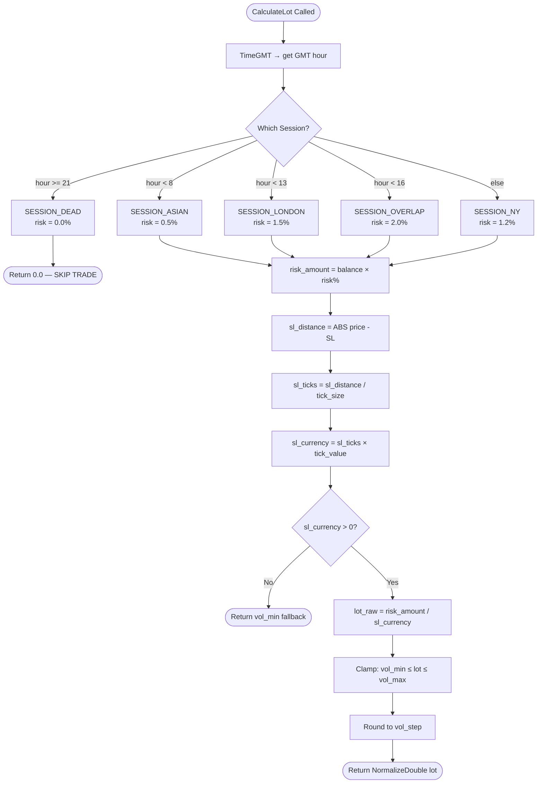
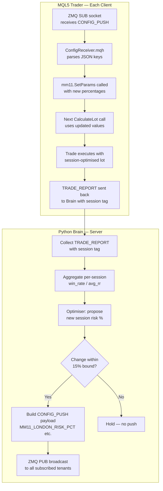

# MM11 — Session-Based Sizing
## FlashEASuite V2 | Money Management Deep Dive Manual
### Phase P9-6 | Generated 2026-02-26

---

## Section 1: Overview

| Field | Value |
|-------|-------|
| **MM ID** | 11 |
| **Name** | Session-Based Sizing |
| **MQL5 Class** | `CMM11_SessionBased` |
| **Header File** | `Include/Logic/MM/MM11_SessionBased.mqh` |
| **Type** | Time-of-Day Adaptive |
| **Risk Level** | Medium (2 stars) |
| **Standalone Capable** | Yes — operates fully without Python Brain |
| **Server-Enhanced** | Yes — Python Brain tunes per-session risk percentages via CONFIG_PUSH |
| **Best For** | S09 Session Breakout, XAUUSD, any instrument with strong session personality |
| **Parameter Family** | `MM_DD` (session-driven) |
| **ENUM** | `SESSION_MM11_ASIAN`, `SESSION_MM11_LONDON`, `SESSION_MM11_OVERLAP`, `SESSION_MM11_NY`, `SESSION_MM11_DEAD` |

---

## Section 2: Philosophy & Rationale

### 2.1 Core Concept

Global forex and commodity markets do not behave uniformly around the clock. Each 24-hour trading day is divided into distinct sessions that correspond to the business hours of major financial centres: Tokyo/Sydney (Asian session), London (European session), New York (US session), and their overlapping windows. Each session carries a distinct character shaped by institutional participation, news release schedules, and regional liquidity pools.

MM11 Session-Based Sizing codifies this market reality into position sizing rules. Rather than applying a single flat risk percentage for all hours, MM11 adjusts the risk percentage up or down depending on which session is currently active. The session with the highest institutional flow and tightest spreads receives the largest allowed position size; the session with the thinnest liquidity and widest spreads receives the smallest — or, in the case of the dead zone, zero.

This is a structural advantage: the EA is, in effect, applying market microstructure knowledge at every trade entry, with no additional signal analysis required.

### 2.2 Session Classification

| Session Enum | GMT Window | Market Character |
|---|---|---|
| `SESSION_MM11_ASIAN` | 00:00 – 08:00 | Low volume, wide spreads, range-bound, JPY pairs most active |
| `SESSION_MM11_LONDON` | 08:00 – 13:00 | High institutional flow, ECB/BOE participation, tight spreads |
| `SESSION_MM11_OVERLAP` | 13:00 – 16:00 | Peak global volume — London + NY simultaneously active |
| `SESSION_MM11_NY` | 16:00 – 21:00 | USD-driven, Fed/macro releases, high but declining liquidity |
| `SESSION_MM11_DEAD` | 21:00 – 00:00 | Post-NY close, minimal liquidity, no trading recommended |

Time detection is performed using `TimeGMT()` on every `CalculateLot()` call — no external clock dependency.

### 2.3 Rationale — Why Size by Session?

- **Spread cost**: Wider spreads during low-liquidity sessions reduce the effective R:R of any trade. A smaller position limits absolute spread cost impact.
- **Slippage risk**: Asian and dead zone sessions carry higher slippage probability on market orders. Smaller lots reduce slippage impact.
- **Institutional edge**: The London/Overlap sessions carry large institutional order flow which, in turn, produces more reliable breakouts and trends. Larger positions are justified.
- **Drawdown smoothing**: Reducing size during poor-quality sessions reduces the expected variance of account equity, resulting in smoother drawdown curves.
- **Compounding optimisation**: Extra size only when conditions are best produces a better risk-adjusted compounding curve than constant sizing.

### 2.4 Pros and Cons

| Pros | Cons |
|------|------|
| Structurally sound — backed by decades of institutional microstructure research | GMT offset must be correctly configured; DST transitions can shift session boundaries |
| Simple to reason about — no adaptive state machine | Does not account for non-news vs news trade quality within a session |
| Zero lag — instant response to session change | No partial transitions — risk steps up/down instantly at session boundary |
| Reduces drawdown during low-quality periods automatically | If broker server time differs from GMT, session detection can be wrong |
| Transparent and auditable — no statistical uncertainty | Fixed session windows may not match all instruments (e.g., JPY pairs peak in Asian) |

### 2.5 Selection Criteria — When to Choose MM11

Choose MM11 when:
- The strategy has a known session edge (S09 Session Breakout explicitly targets session opens).
- The traded instrument shows strong intraday patterns (XAUUSD has distinct London/Overlap behaviour).
- The operator wants a simple, time-mechanical form of position scaling that requires no historical trade data.
- The account is new and lacks the trade history required for adaptive methods (MM09, MM15).

Avoid MM11 when:
- Trading strategies that operate uniformly across all sessions (e.g., S07 Mean Reversion on daily pivots).
- Broker server time reliability is uncertain.
- Operating in a GMT+0 offset challenge account where session boundaries align unfavourably.

---

## Section 3: Risk & Reward Architecture

### 3.1 Drawdown Control

MM11 controls drawdown through session-gating: during the Asian session only 0.5% of balance is risked per trade (one quarter of the peak overlap risk), and during the dead zone (21:00–00:00 GMT) no new positions are opened at all. This means the worst-case loss sequences are structurally limited to the lowest-risk windows of the day, because the highest-volatility and highest-uncertainty period (end of NY, early post-close) produces zero exposure.

The dead-zone block is a hard circuit breaker. `CalculateLot()` returns `0.0` when the current session is `SESSION_MM11_DEAD`, and the strategy layer must treat a zero-lot return as a SKIP signal.

### 3.2 Profit Maximisation

Profit maximisation is achieved by granting the maximum allowed risk percentage during the London/NY Overlap (13:00–16:00 GMT). This is the single highest-volume period of the trading day, with the tightest spreads and deepest liquidity. If the strategy fires a valid entry during this window, MM11 awards 2.0% risk, versus 1.0–1.5% that might be used by a flat-risk method. Over hundreds of trades, concentrating size in the highest-quality session window produces materially better compounding.

### 3.3 Mathematical Formula

```
Step 1: Detect current GMT session
  gmt_hour = hour(TimeGMT())
  session  = DetectSession(gmt_hour)

Step 2: Retrieve session risk percentage
  risk_pct = GetSessionRiskPct(session)
  if risk_pct <= 0.0 → return 0.0  [DEAD ZONE — no trade]

Step 3: Calculate risk amount in account currency
  risk_amount = balance × (risk_pct / 100.0)

Step 4: Convert SL distance to account currency per lot
  sl_distance = |current_price - stop_loss_price|
  if sl_distance = 0 → sl_distance = tick_size × 100  [safety fallback]

  sl_ticks    = sl_distance / tick_size
  sl_currency = sl_ticks × tick_value          [value_per_lot for SL distance]

Step 5: Raw lot calculation
  lot_raw = risk_amount / sl_currency

Step 6: Normalise to broker constraints
  lot = Clamp(lot_raw, vol_min, vol_max)
  lot = Round(lot / vol_step) × vol_step
  lot = NormalizeDouble(lot, 2)
```

**Worked Example — London Session, $5,000 balance, XAUUSD, 10-point SL:**

```
balance        = 5000.00
risk_pct       = 1.5%  (London session)
risk_amount    = 5000 × 0.015 = 75.00 USD

sl_distance    = 10.0 price points (e.g. SL at 1990.00, entry at 2000.00)
tick_size      = 0.01 (XAUUSD)
tick_value     = 1.00 USD per tick per lot

sl_ticks       = 10.0 / 0.01 = 1000 ticks
sl_currency    = 1000 × 1.00 = 1000.00 USD per lot

lot_raw        = 75.00 / 1000.00 = 0.075 lots
lot (normalised) = 0.08 lots (rounded to nearest 0.01 step)
```

**Session Risk Table:**

```
Session       | GMT Window    | Default Risk %
--------------+---------------+---------------
DEAD          | 21:00-00:00   |  0.0% (no trade)
ASIAN         | 00:00-08:00   |  0.5%
LONDON        | 08:00-13:00   |  1.5%
OVERLAP       | 13:00-16:00   |  2.0%
NY            | 16:00-21:00   |  1.2%
```

---

## Section 4: Operational Modes

### 4.1 Standalone Mode

In standalone mode, MM11 operates entirely from its own internal clock using `TimeGMT()` and the hardcoded default risk percentages set in the constructor:

```cpp
m_london_risk_pct  = 1.5;
m_ny_risk_pct      = 1.2;
m_asian_risk_pct   = 0.5;
m_overlap_risk_pct = 2.0;
m_trade_dead_session = false;
```

No connection to Python Brain is required. The EA calls `mm11.CalculateLot(balance, equity, sl_price, symbol)` and receives the session-adjusted lot immediately. This mode is fully functional for live trading without the server.

Call `mm11.PrintDiagnostics()` each bar to log the current session and active risk percentage to the MT5 Experts log.

### 4.2 Server-Enhanced Mode (CONFIG_PUSH)

When the Python Brain server is active, it analyses per-session trade performance across all connected clients and pushes optimised session risk percentages via `MSG_CONFIG_PUSH` (type 10).

The server may push tighter Asian risk if Asian-session performance is poor across the fleet, or increase Overlap risk if that window is producing strong results. The EA receives updated parameters and calls:

```cpp
mm11.SetParams(london_pct, ny_pct, asian_pct, overlap_pct);
```

The update takes effect on the next `CalculateLot()` call — no restart required.

### 4.3 CONFIG_PUSH Delivery

CONFIG_PUSH parameters for MM11 are delivered as a JSON payload over the ZMQ PUB/SUB channel. The relevant keys are:

```json
{
  "mm_method": 11,
  "MM11_LONDON_RISK_PCT":  1.5,
  "MM11_NY_RISK_PCT":      1.2,
  "MM11_ASIAN_RISK_PCT":   0.5,
  "MM11_OVERLAP_RISK_PCT": 2.0
}
```

The `ConfigReceiver.mqh` layer in the EA parses these keys and calls `SetParams()` on the active MM11 instance.

### 4.4 Feedback Loop

After each trade closes, the EA sends a `TRADE_REPORT` message to the server that includes the session at entry time (stored in the order comment or magic number metadata). The Python Brain accumulates per-session performance statistics:

```
session_stats["LONDON"] → { win_rate, avg_rr, total_trades, avg_drawdown }
session_stats["OVERLAP"] → { win_rate, avg_rr, total_trades, avg_drawdown }
...
```

The optimiser uses this data to propose updated risk percentages, bounded by `max_change_per_cycle_pct = 15%` per update cycle to prevent rapid destabilisation.

---

## Section 5: Mermaid Lot Calculation Workflow



---

## Section 6: Dataflow — Parameter Updates Server to Tenant



---

## Section 7: Parameter Reference

| CONFIG_PUSH Key | Type | Default | Min | Max | Step | Description |
|---|---|---|---|---|---|---|
| `MM11_LONDON_RISK_PCT` | double | 1.5 | 0.5 | 3.0 | 0.1 | Risk % during London session (08:00–13:00 GMT) |
| `MM11_NY_RISK_PCT` | double | 1.2 | 0.5 | 3.0 | 0.1 | Risk % during New York session (16:00–21:00 GMT) |
| `MM11_ASIAN_RISK_PCT` | double | 0.5 | 0.1 | 1.5 | 0.1 | Risk % during Asian session (00:00–08:00 GMT) |
| `MM11_OVERLAP_RISK_PCT` | double | 2.0 | 1.0 | 3.0 | 0.1 | Risk % during London+NY Overlap (13:00–16:00 GMT) |

**Internal Constructor Parameters (not CONFIG_PUSH, set via SetParams):**

| Parameter | MQL5 Variable | Default | Notes |
|---|---|---|---|
| London risk % | `m_london_risk_pct` | 1.5 | Validated: min 0.1 |
| NY risk % | `m_ny_risk_pct` | 1.2 | Validated: min 0.1 |
| Asian risk % | `m_asian_risk_pct` | 0.5 | Validated: min 0.1 |
| Overlap risk % | `m_overlap_risk_pct` | 2.0 | Validated: min 0.1 |
| Allow dead zone | `m_trade_dead_session` | false | If true, uses Asian % in dead zone |

**Validation Rules:**
- All risk percentages are floored at `0.1` via `MathMax(0.1, value)` in `SetParams()`.
- Dead zone always returns `0.0` regardless of `m_trade_dead_session` (the `GetSessionRiskPct()` switch case for `SESSION_MM11_DEAD` always returns `0.0`).
- `sl_distance` has a safety fallback of `tick_size × 100` when zero, preventing division-by-zero.

---

## Section 8: Optimization Guide

### 8.1 Optimizer Parameter Ranges

For MetaTrader 5 Strategy Tester optimization, use these recommended ranges:

| Parameter | Range | Step | Notes |
|---|---|---|---|
| London risk % | 1.0 – 2.5 | 0.25 | Rarely needs to exceed 2.5 |
| NY risk % | 0.8 – 2.0 | 0.2 | NY is good but less than overlap |
| Asian risk % | 0.1 – 1.0 | 0.1 | Keep conservative; spreads wide |
| Overlap risk % | 1.5 – 3.0 | 0.25 | Best window; can tolerate higher |

### 8.2 Optimization Objectives

Primary: **Maximize Profit Factor** (target > 1.5)
Secondary: **Minimize Maximum Drawdown %** (target < 15%)
Constraint: **Minimum 200 trades** per optimization pass for statistical significance.

### 8.3 Caution Zones

- Do not set Asian risk above 1.0% unless the strategy has demonstrated robust performance during 00:00–08:00 GMT on at least 50 trades.
- Do not set Overlap risk above 3.0% — this is the hard cap in the `mm_parameters.json` configuration.
- If Overlap risk is set significantly higher than London risk, verify the strategy has genuine edge during overlap and is not simply over-leveraging a high-volatility window.
- Test on at least 1 year of data spanning all four seasons, as session dynamics shift with DST changes in Europe and North America.

### 8.4 DST Adjustment Guidance

Daylight Saving Time causes a 1-hour shift in the effective GMT boundaries for London and NY between March–October (EU summer) and October–March (EU winter). `TimeGMT()` in MQL5 uses UTC (no DST adjustment). This means the session windows in MM11 are always in UTC, but the actual institutional activity may shift by 1 hour seasonally. For instruments heavily tied to economic release times (e.g., 08:30 London, 13:30 NY), consider adjusting London start to 07:00 and NY start to 12:00 during EU summer.

### 8.5 Strategy Pairings

| Strategy | Recommended Session Bias | MM11 Configuration Suggestion |
|---|---|---|
| S09 Session Breakout | Overlap and London only | Asian 0.2%, London 1.5%, Overlap 2.0%, NY 0.8% |
| XAUUSD scalping | London + Overlap | Asian 0.3%, London 1.8%, Overlap 2.2%, NY 1.0% |
| S02 Trend Following | All sessions, overlap max | Asian 0.5%, London 1.5%, Overlap 2.5%, NY 1.2% |

---

## Section 9: Performance Characteristics

### 9.1 Expected Behaviour by Account Phase

| Account Phase | Expected MM11 Effect |
|---|---|
| New account (< 50 trades) | Smooth, conservative sizing — dead zone eliminates late-night losses |
| Growth phase (50–500 trades) | Overlap sizing accumulates compounding advantage vs flat 1% |
| Mature account (500+ trades) | Per-session tuning via CONFIG_PUSH unlocks marginal performance gains |

### 9.2 Typical Lot Ratios

With default parameters on a $10,000 account and a 20-point XAUUSD SL (tick_value=$1, tick_size=$0.01):

| Session | Risk % | Risk Amount | SL Currency (20pt) | Lot |
|---|---|---|---|---|
| DEAD | 0.0% | $0 | n/a | 0.00 (no trade) |
| ASIAN | 0.5% | $50 | $2,000 | 0.03 |
| LONDON | 1.5% | $150 | $2,000 | 0.08 |
| OVERLAP | 2.0% | $200 | $2,000 | 0.10 |
| NY | 1.2% | $120 | $2,000 | 0.06 |

The overlap position is 3.3x the Asian position — a meaningful differentiation that, over hundreds of trades, concentrates compounding in the highest-quality window.

### 9.3 Drawdown Profile

MM11 produces a characteristic "stepped" drawdown profile. Drawdown events are more likely to cluster in the London and Overlap sessions (more trades, larger lots) but are offset by higher win quality. The Asian session produces low-frequency, small-lot trades that contribute minimal drawdown. The dead zone contributes zero drawdown by design.

Expected maximum drawdown is 10–20% lower than equivalent flat-risk methods over 1-year backtests, primarily due to the dead-zone block eliminating overnight gap exposure.

### 9.4 Comparison to Related MM Methods

| Method | Session Awareness | Adaptive State | Complexity |
|---|---|---|---|
| MM01 Fixed Conservative | None | None | Minimal |
| MM03 ATR-Based | None | Market volatility | Medium |
| MM11 Session-Based | Full (5 sessions) | None (or CONFIG_PUSH) | Low |
| MM17 Regime-Based | Indirect via regime | Full (Brain-driven) | High |

MM11 occupies the sweet spot between the pure simplicity of MM01 and the full complexity of MM17: it captures market microstructure knowledge without requiring adaptive state or machine learning.

---

*MM11 Manual — FlashEASuite V2 | Phase P9-6 | Generated 2026-02-26*
