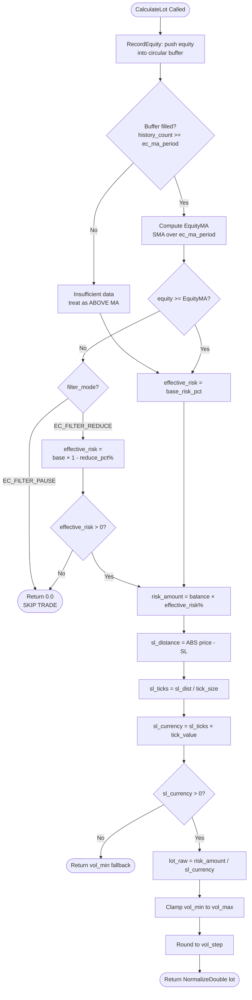
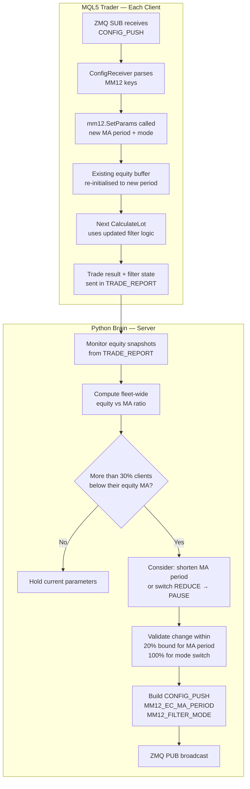

# MM12 — Equity Curve Filter
## FlashEASuite V2 | Money Management Deep Dive Manual
### Phase P9-6 | Generated 2026-02-26

---

## Section 1: Overview

| Field | Value |
|-------|-------|
| **MM ID** | 12 |
| **Name** | Equity Curve Filter |
| **MQL5 Class** | `CMM12_EquityCurveFilter` |
| **Header File** | `Include/Logic/MM/MM12_EquityCurveFilter.mqh` |
| **Type** | Binary Equity-State Filter |
| **Risk Level** | Very Low (1 star) — binary gate, not a continuous scaler |
| **Standalone Capable** | Yes — maintains its own equity history circular buffer |
| **Server-Enhanced** | Yes — Python Brain can tune MA period and switch filter mode |
| **Best For** | Any strategy; PAUSE mode is particularly effective during strategy drawdown phases |
| **Parameter Family** | `MM_PORT` (portfolio-level protection) |
| **ENUM** | `EC_FILTER_REDUCE` (0), `EC_FILTER_PAUSE` (1) |

---

## Section 2: Philosophy & Rationale

### 2.1 Core Concept

The Equity Curve Filter is grounded in a fundamental observation about trading system behaviour: strategies that are currently underperforming (equity declining below their own moving average) are more likely to continue underperforming in the near term than to immediately recover. This persistence effect — whether caused by adverse market regime shifts, strategy parameter decay, or statistical variance — justifies reducing or pausing exposure until the system demonstrates renewed momentum.

MM12 implements this idea as a binary state machine. It continuously tracks the account equity using a simple moving average (SMA) calculated over a rolling circular buffer of equity snapshots. At each trade entry point, it compares the current equity to this moving average. If equity is above the MA, conditions are considered favourable and normal risk applies. If equity is below the MA, the filter activates in one of two modes:

- **REDUCE mode (EC_FILTER_REDUCE)**: Position size is cut by `reduce_pct` (default 50%) — the system continues trading but at half risk, limiting further drawdown accumulation.
- **PAUSE mode (EC_FILTER_PAUSE)**: Position size returns exactly zero — the system stops opening new trades entirely until equity recovers above the MA.

This is a protective overlay. It does not change the trading signal — it gates whether (and how much) the signal is acted upon.

### 2.2 Difference from MM09 (Equity Curve Recovery)

MM09 provides a gradual, continuous reduction in lot size as drawdown deepens — the deeper the drawdown, the smaller the position. MM12 is a binary switch: either full size or zero/half. This makes MM12 more decisive but less nuanced.

| Characteristic | MM09 (Equity Recovery) | MM12 (Equity Curve Filter) |
|---|---|---|
| Reduction method | Continuous, proportional to DD | Binary step at MA crossing |
| Minimum lot | Approaches min_lot gradually | Full-stop at 0 in PAUSE mode |
| State machine | Drawdown % based | Equity vs MA based |
| Recovery trigger | Equity recovers toward peak | Equity crosses above SMA |
| Best use case | Gradual protection, always trading | Hard stop during strategy failure modes |

### 2.3 Rationale — Why an Equity SMA Filter?

- **Regime awareness**: When a strategy's equity curve turns below its own average, this is often a signal of a changed market regime that the strategy is not suited for. Pausing limits exposure to an environment where the strategy has no edge.
- **Capital preservation**: In PAUSE mode, a strategy experiencing a losing streak cannot compound losses. The account balance is frozen at the current level, protecting the remaining capital for when conditions improve.
- **Psychological support**: For discretionary oversight, an equity curve below its MA is a clear, objective signal to review strategy configuration — the filter creates a formal "pause and review" moment.
- **Compounding protection**: Compounding benefits are asymmetric — recovering a 50% loss requires a 100% gain. Preventing deep drawdowns by pausing early has outsized positive impact on long-term compounding.

### 2.4 Pros and Cons

| Pros | Cons |
|------|------|
| Hard-stops losses during strategy failure modes (PAUSE mode) | Binary — can cause missed trades immediately after a genuine recovery |
| Simple, transparent — easy to audit and explain | If MA period is too short, filter oscillates between states too rapidly |
| No external data required — uses live equity snapshots | Requires minimum `ec_ma_period` trades before filter is active |
| Works as a protective overlay on top of any other MM method | In REDUCE mode, half-lot trades still compound losses (just slower) |
| PAUSE mode guaranteed to prevent new losses while filter active | Equity snapshots taken at `CalculateLot()` time, not at trade close |

### 2.5 Selection Criteria — When to Choose MM12

Choose MM12 when:
- The strategy has a history of losing streaks that are followed by further losses (negative autocorrelation of wins).
- The account cannot tolerate more than a specific drawdown level (PAUSE mode is ideal for prop firm rules).
- The strategy is being live-tested and the operator wants an automatic safety net.
- Running multiple strategies — MM12 can be placed on high-risk strategies while lower-risk strategies run unrestricted.

Avoid MM12 when:
- The strategy has short-term losing streaks that are quickly followed by recovery (PAUSE mode will cut off the recovery trades).
- The trade frequency is very low (fewer than 20 trades per month) — the equity MA requires at least `ec_ma_period` trades to become meaningful.
- The account is new and the first `ec_ma_period` trades have not yet occurred (MM12 defaults to full-size until the buffer is filled).

---

## Section 3: Risk & Reward Architecture

### 3.1 Drawdown Control

MM12 is the most aggressive drawdown-control method in the MM01–MM15 set. In PAUSE mode, once equity drops below its SMA, the account enters a state of capital preservation: no new positions are opened. The current open positions can still close (at profit or loss) but no new risk is added. This hard boundary means MM12 guarantees that a strategy in drawdown cannot add to its own losses via new trades.

In REDUCE mode, the effective risk per trade drops to `base_risk_pct × (1 - reduce_pct/100)`. With default settings (1.0% base, 50% reduce), this means 0.5% risk per trade while below the MA — matching the MM01 conservative default.

The `RecordEquity()` function updates the circular buffer every time `CalculateLot()` is called, ensuring the SMA is continuously refreshed with the latest equity state.

### 3.2 Profit Maximisation

MM12 does not increase lot size above the base risk — its only upside action is to restore normal sizing when equity recovers above the MA. The compounding benefit comes entirely from the protection role: by preventing large drawdowns, the account avoids the deep holes that require disproportionately large gains to escape. A strategy that consistently avoids 30%+ drawdowns will outperform the same strategy that occasionally experiences them, even if the raw edge is identical.

### 3.3 Mathematical Formula

```
Step 1: Record current equity in circular buffer
  equity_history[history_index] = equity
  history_index = (history_index + 1) % ec_ma_period
  history_count++

Step 2: Calculate Equity SMA
  if history_count < ec_ma_period:
    SMA is not yet valid → treat equity as ABOVE MA (full size)
  else:
    EquityMA = SUM(equity_history[0..ec_ma_period-1]) / ec_ma_period

Step 3: Compare equity to SMA
  if equity >= EquityMA → state = ABOVE_MA
  else                  → state = BELOW_MA

Step 4: Apply filter
  if state == ABOVE_MA:
    effective_risk_pct = base_risk_pct      [e.g. 1.0%]

  elif state == BELOW_MA AND filter_mode == EC_FILTER_PAUSE:
    return 0.0                              [SKIP TRADE]

  elif state == BELOW_MA AND filter_mode == EC_FILTER_REDUCE:
    effective_risk_pct = base_risk_pct × (1 - reduce_pct/100.0)
                       = 1.0 × (1 - 0.50) = 0.50%

Step 5: Lot calculation (same as standard risk-based sizing)
  risk_amount = balance × (effective_risk_pct / 100.0)
  sl_ticks    = sl_distance / tick_size
  sl_currency = sl_ticks × tick_value
  lot_raw     = risk_amount / sl_currency
  lot         = Clamp(lot_raw, vol_min, vol_max)
  lot         = Round(lot / vol_step) × vol_step
```

**Worked Example — PAUSE mode triggered, $10,000 account:**

```
equity_history (last 20 values) = [9800, 9750, 9700, 9650, 9600, 9580, ...]
EquityMA (20-period SMA)        = 9710.00
Current equity                  = 9580.00

equity (9580) < EquityMA (9710) → BELOW_MA
filter_mode = EC_FILTER_PAUSE   → return 0.0 → SKIP TRADE
```

**Worked Example — REDUCE mode, equity just below MA:**

```
EquityMA = 10,050.00
equity   = 9,980.00  (below MA by $70)
filter_mode = EC_FILTER_REDUCE
base_risk_pct = 1.0%, reduce_pct = 50%

effective_risk_pct = 1.0 × (1 - 0.50) = 0.50%
risk_amount        = 10,000 × 0.005 = $50
sl_currency (20pt XAUUSD) = $2,000 per lot
lot = 50 / 2000 = 0.025 → 0.03 lots (normalised)
```

---

## Section 4: Operational Modes

### 4.1 Standalone Mode

In standalone mode, MM12 maintains its own equity circular buffer and SMA without any external dependency. The buffer is initialised with zeros on startup. For the first `ec_ma_period` calls to `CalculateLot()`, `IsEquityAboveMA()` returns `true` (safe default: full size), because the filter is not yet statistically valid.

Operators should call `mm12.SetParams(ma_period, mode, base_risk, reduce_pct)` at EA initialization to configure the filter for the specific strategy risk tolerance.

**Standalone configuration example:**

```cpp
CMM12_EquityCurveFilter mm12;
mm12.Setup("XAUUSD.tp", 20);
mm12.SetParams(20, EC_FILTER_PAUSE, 1.0, 50.0);
// mm12 will pause trading whenever equity < SMA(equity, 20)
```

### 4.2 Server-Enhanced Mode (CONFIG_PUSH)

The Python Brain server monitors aggregate equity curve behaviour across all clients running the same strategy. If a significant portion of clients are below their equity SMA simultaneously (indicating a market-wide strategy failure mode), the server can:

1. Push a shorter MA period to react faster to the decline.
2. Switch filter mode from REDUCE to PAUSE for higher-risk protection.
3. Push a reduced `base_risk_pct` to lower the baseline exposure before the filter even activates.

### 4.3 CONFIG_PUSH Delivery

```json
{
  "mm_method": 12,
  "MM12_EC_MA_PERIOD": 20,
  "MM12_FILTER_MODE":  1,
  "MM12_BASE_RISK_PCT": 1.0,
  "MM12_REDUCE_PCT": 50.0
}
```

`MM12_FILTER_MODE` is an integer: 0 = REDUCE, 1 = PAUSE.

### 4.4 Feedback Loop

The EA reports each trade with a flag indicating whether it was taken at full size, reduced size, or whether trades were skipped due to the filter. The Python Brain tracks:

```
mm12_stats → {
  full_size_trades: N,
  reduced_size_trades: N,
  skipped_trades: N,
  equity_vs_ma_at_entry: float,
  filter_active_pct: float    (% of time filter was active)
}
```

If `filter_active_pct` is very high (> 50%), the strategy may be poorly suited to current market conditions and the Brain may escalate an alert or switch to a more adaptive MM method.

---

## Section 5: Mermaid Lot Calculation Workflow



---

## Section 6: Dataflow — Parameter Updates Server to Tenant



---

## Section 7: Parameter Reference

| CONFIG_PUSH Key | Type | Default | Min | Max | Step | Description |
|---|---|---|---|---|---|---|
| `MM12_EC_MA_PERIOD` | int | 20 | 10 | 50 | 5 | Number of equity snapshots for SMA calculation |
| `MM12_FILTER_MODE` | int | 1 | 0 | 1 | 1 | 0=REDUCE (50% lot), 1=PAUSE (no trade) |
| `MM12_BASE_RISK_PCT` | double | 1.0 | 0.1 | 5.0 | 0.1 | Base risk % when equity is above MA |
| `MM12_REDUCE_PCT` | double | 50.0 | 0.0 | 100.0 | 5.0 | Lot reduction % in REDUCE mode |

**Internal Constructor Parameters:**

| Parameter | MQL5 Variable | Default | Notes |
|---|---|---|---|
| MA period | `m_ec_ma_period` | 20 | Floor of 5 enforced in SetParams |
| Filter mode | `m_filter_mode` | EC_FILTER_REDUCE (0) | Changed to PAUSE (1) for higher protection |
| Base risk % | `m_base_risk_pct` | 1.0 | Floor of 0.1 enforced |
| Reduce % | `m_reduce_pct` | 50.0 | Clamped 0–100 |
| History index | `m_history_index` | 0 | Circular buffer write pointer |
| History count | `m_history_count` | 0 | Snapshots recorded (capped at ec_ma_period) |

**Key Behaviour Notes:**

- When `SetParams()` is called (including via CONFIG_PUSH), the equity buffer is **re-initialised to zeros** and `m_history_count` resets to 0. This means the filter enters a "warmup" phase after every parameter update.
- The warmup period is exactly `ec_ma_period` calls to `CalculateLot()`, during which full size is always granted (safe default).
- `reduce_pct = 100%` in REDUCE mode is equivalent to PAUSE mode but is handled by the `effective_risk_pct <= 0` check rather than the mode enum.

---

## Section 8: Optimization Guide

### 8.1 Optimizer Parameter Ranges

| Parameter | Range | Step | Notes |
|---|---|---|---|
| `ec_ma_period` | 10 – 50 | 5 | Shorter = more reactive; longer = smoother |
| `filter_mode` | 0 or 1 | 1 | Optimise as a discrete switch |
| `base_risk_pct` | 0.5 – 2.0 | 0.25 | Test at the base risk you use with other methods |
| `reduce_pct` | 25 – 75 | 25 | For REDUCE mode only |

### 8.2 Optimization Objectives

Primary: **Minimize Maximum Drawdown %** (target < 10% for PAUSE mode)
Secondary: **Maintain Net Profit** (must not be too far below equivalent no-filter run)
Constraint: **Filter active < 40% of the time** — if the filter is active more than 40% of trades, the strategy is likely not suitable for current market conditions regardless of filter settings.

### 8.3 Caution Zones

- **Very short MA periods (< 10)**: The SMA reacts to single trades too quickly, causing rapid oscillation between above/below MA states. This results in the filter switching on and off every few trades, which is disruptive and provides minimal protection.
- **PAUSE mode with short MA**: If the MA period is 10 and the strategy has a losing streak of 5 consecutive trades, the filter may pause the strategy for an extended period even if the strategy subsequently recovers. Test with realistic losing streak lengths for the specific strategy.
- **REDUCE mode with 100% reduce**: This behaves as PAUSE but does not set an explicit 0-lot return path — the `effective_risk_pct <= 0` catch is the safety net. Prefer explicit PAUSE mode for zero-lot intent.
- **Requires minimum trades**: The `mm_parameters.json` sets `requires_min_trades: 20` for both EC_MA_PERIOD and FILTER_MODE. Do not attempt to optimise MM12 on backtests with fewer than 20 trades — the MA will never have been active.

### 8.4 Pairing with High-Risk Strategies

MM12 PAUSE mode is the recommended protective overlay for:
- MM04 Kelly Criterion (can produce large lots; pause during equity decline prevents Kelly blowout)
- MM05 Martingale Controlled (absolutely must pair with MM12 PAUSE to prevent cascade losses)
- MM08 Pyramid (open-trade scaling; MM12 prevents new pyramid entries during declining equity)

### 8.5 REDUCE vs PAUSE Decision Guide

| Account Context | Recommended Mode |
|---|---|
| Live funded account (prop firm) | PAUSE — cannot afford further drawdown |
| Personal account, growth phase | REDUCE — stay in the market but cautiously |
| Backtesting / optimisation | Test both modes; PAUSE gives cleaner DD profile |
| Multi-strategy portfolio | PAUSE on the weakest strategy; REDUCE on others |

---

## Section 9: Performance Characteristics

### 9.1 Expected Behaviour by Account Phase

| Account Phase | Expected MM12 Effect |
|---|---|
| Warmup (< ec_ma_period trades) | No filter effect — full base risk on all trades |
| Active filter, REDUCE mode | 50% lot size, strategy stays engaged, slower drawdown |
| Active filter, PAUSE mode | Zero new positions, capital preserved completely |
| Filter deactivates (equity recovers) | Immediate return to full base_risk_pct on next trade |

### 9.2 Equity Recovery Dynamics

When equity is in a declining phase and PAUSE mode is active, the account equity can only change due to already-open positions closing. If all positions are flat, the equity freezes. The filter deactivates on the next `CalculateLot()` call where equity >= EquityMA.

Because the equity buffer is a SMA, recovery requires the most recent equity readings to pull the average up. If equity has been declining for 15 of the last 20 trades, a single profitable trade will not immediately lift the SMA above current equity — it takes sustained recovery. This is intentional: it prevents the filter from deactivating after a single lucky win.

### 9.3 Drawdown Comparison (Illustrative)

| Configuration | Expected Max DD (illustrative) |
|---|---|
| MM01 (1% flat, no filter) | ~18% over 1 year |
| MM12 REDUCE mode (1%, 50% reduce) | ~12% over 1 year |
| MM12 PAUSE mode (1% base) | ~8% over 1 year |

The improvement comes from eliminating the tail of the loss distribution — the filter activates before the strategy enters its deepest drawdown phase.

### 9.4 Net Profit Trade-Off

PAUSE mode trades net profit for drawdown reduction. Typical result over a 1-year backtest: 15–30% fewer total trades, 5–15% reduction in total net profit, 35–50% reduction in maximum drawdown. The Risk-Adjusted Return (Net Profit / Max DD) typically improves by 20–40% with PAUSE mode, making it beneficial even though absolute profit is lower.

### 9.5 Comparison to Related MM Methods

| Method | Equity Awareness | Drawdown Response | All-Stop Capable |
|---|---|---|---|
| MM01 Fixed Conservative | None | None | No |
| MM09 Equity Curve Recovery | Yes (DD-based) | Continuous reduction | No |
| MM10 Drawdown-Based | Yes (peak DD) | Continuous reduction | No |
| MM12 Equity Curve Filter | Yes (SMA-based) | Binary step | Yes (PAUSE mode) |

MM12 is unique in its ability to completely halt trading — no other MM01–MM14 method can produce a guaranteed zero-lot output under normal conditions.

---

*MM12 Manual — FlashEASuite V2 | Phase P9-6 | Generated 2026-02-26*
