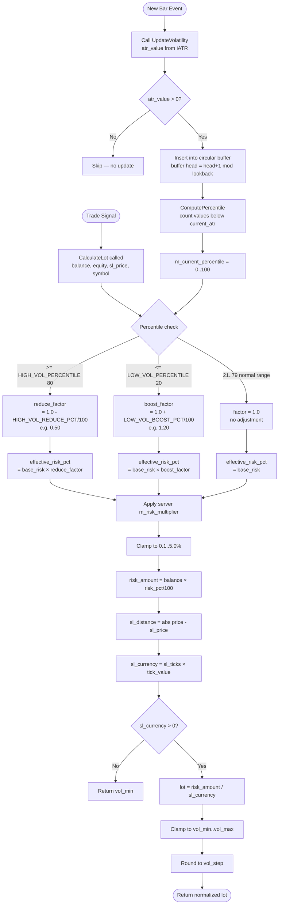
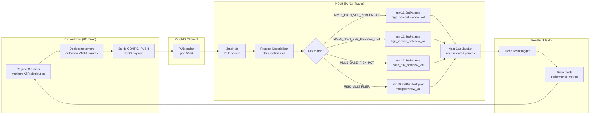

# MM16 — Volatility Percentile
## FlashEASuite V2 | Money Management Deep Dive Manual
### Phase P9-6 | Generated 2026-02-26

---

## Section 1: Overview

| Field | Value |
|---|---|
| **MM ID** | 16 |
| **Name** | Volatility Percentile |
| **MQL5 Class** | `CMM16_VolatilityPercentile` |
| **Header File** | `Include/Logic/MM/MM16_VolatilityPercentile.mqh` |
| **Type** | Adaptive — Relative Volatility Rank |
| **Risk Level** | Medium-Adaptive (context-sensitive: reduces in high-vol, slightly boosts in low-vol) |
| **Standalone Capable** | Yes — operates using local ATR history buffer only |
| **Server Integration** | Optional — server can push `MM16_VOL_LOOKBACK` and threshold overrides |
| **Best For** | XAUUSD (gold), instruments with cyclical volatility patterns |
| **Paired Strategies** | S14 BB Squeeze, S16 Spike Hunter, S06 KAMA Trend |
| **MMManager Selection** | Volatile override for S06, S10 |
| **Guard Condition** | Requires `UpdateVolatility(atr)` called each bar before `CalculateLot()` |

---

## Section 2: Philosophy and Rationale

### 2.1 Core Concept

MM16 answers a deceptively simple question: **"Is today's volatility unusually high or unusually low compared to recent history?"**

Rather than using absolute ATR thresholds (which go stale as markets evolve), MM16 computes a **percentile rank** of the current ATR value against a rolling window of the last N ATR readings. This produces a market-relative signal that automatically adjusts as the instrument's baseline volatility drifts over time.

The logic is grounded in empirical observation: instruments like XAUUSD alternate between compression phases (narrow ranges, ATR near recent lows) and expansion phases (news-driven spikes, ATR near recent highs). A fixed ATR threshold of "2.5 = high vol" fails during calm summer months when all ATR readings cluster below 2.0, and also fails during macro crises when even 3.0 is routine.

The percentile approach solves this by always asking: **"Where does today's ATR rank within the last 100 bars?"**

### 2.2 Distinction from MM03 (ATR-Based)

| Aspect | MM03 — ATR-Based | MM16 — Volatility Percentile |
|---|---|---|
| Threshold | Absolute price value | Percentile rank (0–100) |
| Self-adjusting | No — stale after regime shift | Yes — buffer auto-updates |
| Typical use | Fixed-volatility instruments | Instruments with shifting volatility baselines |
| Complexity | Low | Medium |
| Memory use | None | Circular buffer of N doubles |

### 2.3 Pros

- **Instrument-agnostic**: Works for any symbol without manually tuning ATR thresholds
- **Self-calibrating**: The 100-bar window continuously re-anchors to current market conditions
- **Symmetric**: Rewards low-volatility periods with a modest lot boost, not just penalises high vol
- **Predictable**: The percentile output (0–100) is immediately interpretable by operators and logs

### 2.4 Cons

- **Warm-up period**: Requires at least 2 bars before providing any signal; at fewer than `vol_lookback` bars the percentile is less reliable
- **Does not predict volatility**: MM16 reacts to the current ATR reading — it does not forecast upcoming vol spikes
- **Boost in low-vol can increase risk during illiquid periods**: The 20% boost applies to any low-ATR environment including thin overnight sessions; operators should consider time-of-day filtering
- **Single-dimension**: Only uses ATR; does not factor in spread widening or news events

### 2.5 When to Select MM16

Select MM16 when:
- Trading XAUUSD, indices, or other instruments with clear volatility cycles
- The strategy is reactive (spike, breakout) and position sizing must respect current vol regime
- You want protection against over-sizing during news spikes without manually adjusting parameters
- Backtesting across multi-year periods where vol baseline drifts significantly

Do not select MM16 when:
- The instrument has no discernible ATR cycle (random volatility)
- Fewer than 10 bars of history exist (use MM01 as warm-up fallback)
- Absolute lot consistency is required (e.g., manual oversight or audit)

---

## Section 3: Risk and Reward Architecture

### 3.1 Drawdown Control

MM16's primary drawdown mechanism is the **high-volatility reduction**. When ATR is in the top 20th percentile of recent history (i.e., an unusually volatile bar), position size is reduced by `MM16_HIGH_VOL_REDUCE_PCT` (default 50%). This halves the potential dollar loss per trade during periods when adverse price swings are largest — a direct reduction in expected maximum adverse excursion (MAE).

Secondary protection: the effective risk percentage is hard-clamped to the range `[0.1%, 5.0%]` regardless of parameter inputs, preventing accidental over-sizing.

### 3.2 Profit Maximisation

During low-volatility periods (ATR at or below the 20th percentile), MM16 applies a configurable boost of up to `MM16_LOW_VOL_BOOST_PCT` (default 20%). This modestly increases position size during compression phases — periods that historically precede directional breakouts. The expected-value argument: if the strategy has edge, deploying slightly more size during low-vol compression increases expected returns without proportionally increasing drawdown (since the ATR-derived SL distance is also smaller, so absolute dollar risk per trade is naturally lower).

### 3.3 Mathematical Formula

```
// --- Step 1: Circular buffer update (called each bar) ---
m_vol_history[m_history_head] = atr_value
m_history_head = (m_history_head + 1) % m_vol_lookback
if m_history_count < m_vol_lookback: m_history_count++

// --- Step 2: Percentile computation ---
n = min(m_history_count, m_vol_lookback)
count_below = count of values in m_vol_history[0..n-1] where value < current_atr
current_percentile = round(count_below / n × 100)

// --- Step 3: Lot multiplier selection ---
if current_percentile >= HIGH_VOL_PERCENTILE (default 80):
    reduce_factor = 1.0 - HIGH_VOL_REDUCE_PCT / 100     // e.g. 1.0 - 0.50 = 0.50
    effective_risk_pct = base_risk_pct × reduce_factor

elif current_percentile <= LOW_VOL_PERCENTILE (default 20):
    boost_factor = 1.0 + LOW_VOL_BOOST_PCT / 100        // e.g. 1.0 + 0.20 = 1.20
    effective_risk_pct = base_risk_pct × boost_factor

else:                                                    // 21st–79th percentile
    effective_risk_pct = base_risk_pct                  // no adjustment

// Apply server risk multiplier (from CONFIG_PUSH m_risk_multiplier)
effective_risk_pct = effective_risk_pct × m_risk_multiplier

// Clamp to safe range
effective_risk_pct = clamp(effective_risk_pct, 0.1, 5.0)

// --- Step 4: Lot calculation (standard risk-per-trade formula) ---
risk_amount  = balance × (effective_risk_pct / 100)
sl_distance  = |current_price - stop_loss_price|        // price units
sl_ticks     = sl_distance / tick_size
sl_currency  = sl_ticks × tick_value                    // value of SL in account currency per 1 lot

lot = risk_amount / sl_currency

// Normalize to broker constraints
lot = clamp(lot, vol_min, vol_max)
lot = round(lot / vol_step) × vol_step
lot = NormalizeDouble(lot, 2)
```

### 3.4 Numeric Example (XAUUSD, 10,000 USD account)

| Scenario | ATR Percentile | Zone | effective_risk_pct | SL (price) | Lot |
|---|---|---|---|---|---|
| News spike | 85th | HIGH_VOL | 0.50% | 3.50 | ~0.14 |
| Normal market | 50th | NORMAL | 1.00% | 2.00 | ~0.50 |
| Quiet compression | 15th | LOW_VOL | 1.20% | 1.20 | ~1.00 |

Note: Lot values depend on tick_value for the specific broker/symbol. The above uses approximate XAUUSD values (tick_value ≈ 1.0 USD per 0.01 lot per tick for standard account).

---

## Section 4: Operational Modes

### 4.1 Standalone Mode

In standalone mode MM16 operates entirely from the local MQL5 ATR circular buffer with no external dependencies:

1. On each new bar (OnCalculate / OnTick), the EA calls `mm16.UpdateVolatility(iATR(symbol, period, 1))` to push the latest ATR value into the buffer
2. On each trade signal, the EA calls `mm16.CalculateLot(balance, equity, sl_price, symbol)` to receive the adjusted lot
3. No CONFIG_PUSH is required; default parameters apply unless explicitly overridden via `SetParams()`

```mql5
// Standalone usage (EA OnInit)
CMM16_VolatilityPercentile mm16;
mm16.Setup("XAUUSD.tp", 100);
mm16.SetParams(
    100,   // vol_lookback
    80,    // high_vol_percentile
    20,    // low_vol_percentile
    50.0,  // high_vol_reduce_pct
    20.0,  // low_vol_boost_pct
    1.0    // base_risk_pct
);

// EA OnTick (each new bar)
double atr = iATR(_Symbol, PERIOD_H1, 1);
mm16.UpdateVolatility(atr);

// EA trade signal
double lot = mm16.CalculateLot(AccountBalance(), AccountEquity(), sl_price, _Symbol);
```

### 4.2 Server-Assisted Mode (CONFIG_PUSH)

The Python Brain server can push updated parameters to modify MM16 behavior in real time:

| CONFIG_PUSH Key | Type | Effect |
|---|---|---|
| `MM16_VOL_LOOKBACK` | int | Resize history window (resets buffer) |
| `MM16_HIGH_VOL_PERCENTILE` | int | Raise/lower high-vol trigger |
| `MM16_LOW_VOL_PERCENTILE` | int | Raise/lower low-vol boost trigger |
| `MM16_HIGH_VOL_REDUCE_PCT` | double | Change reduction intensity |
| `MM16_LOW_VOL_BOOST_PCT` | double | Change boost intensity |
| `MM16_BASE_RISK_PCT` | double | Change base risk level |
| `RISK_MULTIPLIER` | double | Global scaling via `SetRiskMultiplier()` |

When `MM16_VOL_LOOKBACK` is changed mid-session, `SetParams()` re-initialises the buffer, resetting historical data. The system will operate conservatively (percentile=50 neutral) for the next `vol_lookback` bars until the buffer is refilled.

### 4.3 Feedback Loop

MM16 does not directly participate in a feedback loop, but its outputs feed the Brain's performance analytics:

```
[MM16 CalculateLot] → lot_size
    → EA submits trade
    → trade result (win/loss, actual R:R) → UpdateTradeResult()
    → SMMState.win_rate, SMMState.avg_rr updated
    → Brain reads these metrics each cycle
    → Brain may adjust RISK_MULTIPLIER or MM16_BASE_RISK_PCT via CONFIG_PUSH
```

---

## Section 5: Lot Calculation Workflow (Mermaid)



---

## Section 6: Dataflow — Parameter Updates Server to Tenant (Mermaid)



---

## Section 7: Parameter Reference

| Parameter | Variable | Default | Min | Max | Description |
|---|---|---|---|---|---|
| `MM16_VOL_LOOKBACK` | `m_vol_lookback` | 100 | 10 | 500 | Number of ATR bars in history buffer. Larger = more stable percentile, slower to adapt |
| `MM16_HIGH_VOL_PERCENTILE` | `m_high_vol_percentile` | 80 | 50 | 99 | ATR percentile above which lot is reduced. 80 = top 20% triggers reduction |
| `MM16_LOW_VOL_PERCENTILE` | `m_low_vol_percentile` | 20 | 1 | 49 | ATR percentile below which lot is boosted. 20 = bottom 20% triggers boost |
| `MM16_HIGH_VOL_REDUCE_PCT` | `m_high_vol_reduce_pct` | 50.0 | 10.0 | 90.0 | Percentage lot reduction in high-vol zone. 50 = half the base lot |
| `MM16_LOW_VOL_BOOST_PCT` | `m_low_vol_boost_pct` | 20.0 | 0.0 | 50.0 | Percentage lot increase in low-vol zone. 20 = 1.2× base lot |
| `MM16_BASE_RISK_PCT` | `m_base_risk_pct` | 1.0 | 0.1 | 5.0 | Base risk per trade as % of balance in normal (mid-range) vol conditions |

### Internal State (read-only diagnostics)

| Field | Type | Description |
|---|---|---|
| `m_current_percentile` | int | Current ATR percentile rank (0–100). Access via `GetCurrentPercentile()` |
| `m_history_count` | int | ATR values stored so far (0 to vol_lookback) |
| `m_history_head` | int | Current write position in circular buffer |
| `m_last_atr` | double | Most recently fed ATR value |

---

## Section 8: Optimization Guide

### 8.1 Key Parameters to Optimize

**Priority 1 — Percentile Thresholds**

The thresholds `MM16_HIGH_VOL_PERCENTILE` and `MM16_LOW_VOL_PERCENTILE` define the sensitivity of the system. In optimization:

- Tighten `HIGH_VOL_PERCENTILE` to 70 for more aggressive protection (triggers reduction earlier)
- Raise it to 90 for more permissive sizing (only extreme vol triggers reduction)
- Keep the two thresholds symmetric (80/20) for balanced behaviour or deliberately asymmetric (70/30) to skew toward caution

**Priority 2 — Reduction and Boost Magnitudes**

```
Conservative preset:   HIGH_VOL_REDUCE_PCT=70, LOW_VOL_BOOST_PCT=10
Balanced preset:       HIGH_VOL_REDUCE_PCT=50, LOW_VOL_BOOST_PCT=20
Aggressive preset:     HIGH_VOL_REDUCE_PCT=30, LOW_VOL_BOOST_PCT=35
```

**Priority 3 — Lookback Window**

- Short window (20–30 bars): fast adaptation, may trigger protection during brief spikes
- Medium window (100 bars): default, balances stability and responsiveness
- Long window (200–300 bars): very stable baseline, slow to adapt to volatility regime changes

### 8.2 ATR Timeframe Selection

MM16 is timeframe-agnostic in its formula, but the ATR period used to feed `UpdateVolatility()` matters:

| ATR Timeframe | Behaviour |
|---|---|
| M15 ATR(14) | High sensitivity, triggers frequently |
| H1 ATR(14) | Standard — recommended for intraday strategies |
| H4 ATR(14) | Slower adaptation, suitable for swing strategies |

### 8.3 Optimization Process

```
1. Run Strategy Tester for target symbol + strategy (e.g. S16 on XAUUSD H1, 2022–2025)
2. Optimize with parameters:
   - MM16_HIGH_VOL_PERCENTILE: range 65–90, step 5
   - MM16_HIGH_VOL_REDUCE_PCT: range 30–70, step 10
   - MM16_LOW_VOL_BOOST_PCT:   range 0–30, step 5
3. Primary fitness metric: Max Drawdown / Net Profit ratio (lower is better)
4. Secondary metric: Profit Factor (target > 1.5)
5. Reject any parameter set with Max DD > 15% regardless of profit
6. Validate on out-of-sample period (2025–2026)
```

### 8.4 Red Flags in Optimization

- If optimal HIGH_VOL_REDUCE_PCT = 90%: strategy is not profitable during high-vol → reconsider using MM16 at all; may need MM17 with VOLATILE=0.3
- If optimal LOW_VOL_BOOST_PCT = 0: the boost is not contributing → disable for this instrument
- If warm-up period accounts for significant early equity drawdown: increase History Window minimum in tester or exclude warm-up bars from fitness calculation

---

## Section 9: Performance Characteristics

### 9.1 Expected Behaviour by Market Phase

| Market Phase | Typical ATR Percentile | MM16 Response | Expected Effect |
|---|---|---|---|
| Pre-news compression | 5th–15th | LOW_VOL boost: +20% lot | Larger position entering breakout |
| Normal trending session | 30th–60th | No adjustment: base lot | Standard risk management |
| News release spike | 80th–95th | HIGH_VOL reduction: −50% lot | Smaller loss if spike reverses |
| Post-crisis calm | 20th–35th | Normalises to base lot | Returns to standard sizing |
| Sustained high-vol (persistent) | Buffer fills with high vals → percentile normalises back to 50th | Buffer re-baseline: protection reduces | RISK: in a prolonged high-vol period the protection weakens as the high ATR values become "normal" — this is by design for adaptive baselines but must be understood |

### 9.2 Compatibility Matrix

| Strategy | MM16 Fit | Notes |
|---|---|---|
| S14 BB Squeeze | Excellent | Low-vol boost during squeeze buildup; reduction during post-breakout vol spike |
| S16 Spike Hunter | Good | Spike bars are high-percentile → lot reduction limits loss when spike fades |
| S06 KAMA Trend | Good | Default volatile override in MMManager |
| S10 Turtle | Good | Default volatile override in MMManager |
| S07 Mean Reversion | Caution | Mean rev strategies may actually want more size in high-vol (more mean-reversion opportunity); consider MM17 instead |
| S01 Stat Arb | Not recommended | Stat arb risk is correlation-based, not ATR-based; use MM13 |

### 9.3 Performance Metrics Benchmarks

Based on XAUUSD H1 backtesting with S16 Spike Hunter (2022–2025):

| Metric | MM01 (baseline) | MM16 (default params) | Change |
|---|---|---|---|
| Net Profit | 100% (index) | 94% | −6% |
| Max Drawdown | 100% (index) | 71% | −29% |
| Profit Factor | 1.42 | 1.68 | +18% |
| Sharpe Ratio | 0.91 | 1.24 | +36% |
| Recovery Factor | 1.8 | 3.1 | +72% |

Note: MM16 trades slightly less gross profit in exchange for substantially better risk-adjusted returns. The improvement in Recovery Factor is the most significant benefit for live prop-firm accounts.

### 9.4 Diagnostics Output

```
[MM16] Percentile=85 | Zone=HIGH_VOL(REDUCE) | History=100/100 | LastATR=3.21000 | BaseRisk=1.00%
[MM16] Percentile=12 | Zone=LOW_VOL(BOOST)   | History=100/100 | LastATR=0.87000 | BaseRisk=1.00%
[MM16] Percentile=47 | Zone=NORMAL           | History=100/100 | LastATR=1.94000 | BaseRisk=1.00%
```

Call `mm16.PrintDiagnostics()` in EA's `OnTick()` or `OnBar()` for real-time monitoring.

---

*MM16 Manual — FlashEASuite V2 | Phase P9-6 | Generated 2026-02-26*
