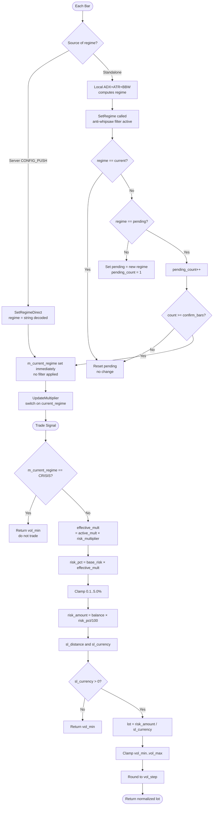
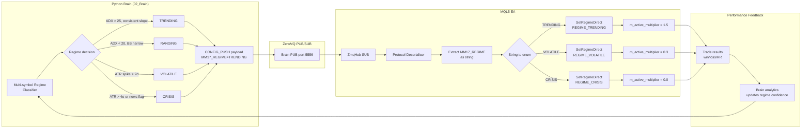

# MM17 — Regime-Based Scaling
## FlashEASuite V2 | Money Management Deep Dive Manual
### Phase P9-6 | Generated 2026-02-26

---

## Section 1: Overview

| Field | Value |
|---|---|
| **MM ID** | 17 |
| **Name** | Regime-Based Scaling |
| **MQL5 Class** | `CMM17_RegimeBased` |
| **Header File** | `Include/Logic/MM/MM17_RegimeBased.mqh` |
| **Type** | Dynamic — Market Regime Multiplier |
| **Risk Level** | Medium-Dynamic (1.5× in TRENDING, 0.0× in CRISIS) |
| **Standalone Capable** | Yes — includes local rule-based regime detector (ADX + ATR + BB Width) |
| **Server Integration** | Primary use case — Python Brain pushes `MM17_REGIME` each cycle |
| **Best For** | All strategies; the universal regime-aware MM in FlashEASuite V2 |
| **Paired Strategies** | S06 KAMA (needs TRENDING), S07 Mean Reversion (needs RANGING), S15 Grid |
| **MMManager Selection** | Volatile override for S15, S16, and all "Others" |
| **Critical Feature** | Anti-whipsaw confirmation filter (default 3 bars before regime switches) |
| **CRISIS Behaviour** | Returns `vol_min` — EA interprets as "do not open new trades" |

---

## Section 2: Philosophy and Rationale

### 2.1 Core Concept

MM17 is the **regime-aware backbone** of FlashEASuite V2's money management system. Its premise is straightforward: **risk tolerance should not be constant across all market conditions**. Trading aggressively during a clear trending market is rational — edge is highest. Trading at the same size during a volatile, news-driven, or crisis-level market is irrational and self-destructive.

MM17 formalises this intuition into four discrete market states (regimes), each with a pre-configured risk multiplier:

- **TRENDING**: Market has clear directional momentum. Edge is highest for trend-following strategies. Risk more.
- **RANGING**: Sideways price action. Mean-reversion strategies work well. Normal risk.
- **VOLATILE**: High ATR, erratic direction changes, choppy price action. Uncertainty is high. Reduce risk severely.
- **CRISIS**: Extreme volatility, circuit-breaker events, black swan news. Stop trading entirely.

This design directly mirrors the FlashEASuite regime classification pipeline. The Python Brain classifies regime from live market data and pushes the result to all connected tenants. MM17 translates that classification into a concrete multiplier on the base lot calculation.

### 2.2 The Anti-Whipsaw Filter

A critical engineering feature of MM17 is its **confirmation filter**. Without it, a single unusual bar could trigger regime reclassification mid-session, causing erratic sizing changes. The filter works as follows:

- A new regime is treated as "pending" when first received
- Only after `m_confirm_bars` consecutive readings of the same new regime does the system commit to the change
- If the pending regime changes before confirmation, the counter resets

This prevents false positives from brief ATR spikes (which might momentarily register as VOLATILE) from immediately halving the lot size. The `SetRegimeDirect()` method bypasses this filter — reserved for explicit server override when high-confidence regime data arrives via CONFIG_PUSH.

### 2.3 Comparison: Local Detection vs Server-Provided

| Aspect | Standalone (Local ADX+ATR+BBW) | Server (Python Brain CONFIG_PUSH) |
|---|---|---|
| Data inputs | Price action on current symbol | Cross-market, multi-symbol, news calendar |
| Latency | Real-time (each tick) | Server cycle latency (~1–5 seconds) |
| Accuracy | Symbol-specific, limited context | Full macro context, regime ML model |
| Uses confirmation filter | Yes (SetRegime) | No (SetRegimeDirect — server is authoritative) |
| Configuration | Compiled into EA | Runtime-adjustable via CONFIG_PUSH |

### 2.4 Pros

- **Universal applicability**: Every strategy benefits from regime awareness; MM17 provides it without strategy-specific code
- **CRISIS = full stop**: The zero-multiplier CRISIS mode provides a hard circuit breaker that requires no additional stop-trading logic in the EA
- **Server-native**: Directly integrated with the CONFIG_PUSH protocol — regime is already classified by the Brain; MM17 consumes it natively
- **Proportional scaling**: Multipliers are continuous values, easily tunable to the operator's risk appetite
- **Anti-whipsaw built-in**: Eliminates sizing instability from brief classification noise

### 2.5 Cons

- **Discrete regime buckets**: Real markets exist on a continuum; the four-bucket model can feel abrupt (RANGING at 0.99× then TRENDING at 1.5×)
- **Regime classification quality ceiling**: MM17 is only as good as the regime input it receives; a poorly tuned classifier produces unstable sizing
- **UNKNOWN = conservative**: An unclassified regime defaults to RANGING multiplier (1.0×), which may be too permissive or too conservative depending on circumstances
- **Confirmation delay**: The anti-whipsaw filter means regime transitions are always at least `confirm_bars` bars delayed — in fast-moving crisis situations this can mean late protection

### 2.6 When to Select MM17

Select MM17 when:
- Connected to the Python Brain server and regime classification is operational
- Deploying multiple strategies simultaneously that have different optimal regimes
- Seeking a single MM that automatically handles all macro risk states without manual intervention
- A prop firm or risk manager requires trading to halt automatically during extreme conditions

Do not select MM17 when:
- The server connection is unreliable and regime updates are infrequent (the system would stay at RANGING×1.0)
- The strategy is explicitly volatility-based (like S16 Spike) where VOLATILE regime is actually ideal — use MM16 instead
- Manual lot consistency is required for audit or copy-trading purposes

---

## Section 3: Risk and Reward Architecture

### 3.1 Drawdown Control

MM17 provides multi-tier drawdown control through the regime multiplier hierarchy:

| Regime | Multiplier | Effective Risk (base=1%) | Interpretation |
|---|---|---|---|
| TRENDING | 1.5× | 1.5% per trade | Full deployment |
| RANGING | 1.0× | 1.0% per trade | Standard |
| VOLATILE | 0.3× | 0.3% per trade | Severe reduction |
| CRISIS | 0.0× | vol_min only | Full stop |
| UNKNOWN | 1.0× | 1.0% per trade | Neutral default |

In drawdown situations, the server will typically reclassify to VOLATILE or CRISIS, triggering automatic reduction without any EA-side drawdown tracking.

### 3.2 Profit Maximisation

The TRENDING multiplier of 1.5× is the profit maximisation lever. When the Brain confirms a trending regime (high ADX, consistent slope, low BB Width relative to range), strategies like S06 KAMA and S10 Turtle receive 50% larger positions than baseline. The rationale: trend-following strategies have higher edge in trending markets, and Kelly theory supports increasing size when edge is confirmed.

The effective multiplier is the product of the regime multiplier and the server's global `m_risk_multiplier`:

```
effective_multiplier = m_active_multiplier × m_risk_multiplier
```

This allows the server to apply an additional scaling layer (e.g., 0.8× risk reduction account-wide) on top of the regime-specific multiplier.

### 3.3 Mathematical Formula

```
// --- Regime definition (enum) ---
REGIME_UNKNOWN  = 0   → multiplier = m_ranging_mult  (neutral fallback)
REGIME_TRENDING = 1   → multiplier = m_trending_mult (default 1.5)
REGIME_RANGING  = 2   → multiplier = m_ranging_mult  (default 1.0)
REGIME_VOLATILE = 3   → multiplier = m_volatile_mult (default 0.3)
REGIME_CRISIS   = 4   → multiplier = m_crisis_mult   (default 0.0)

// --- Anti-whipsaw filter (called each bar via SetRegime) ---
if regime == m_current_regime:
    m_pending_regime = regime
    m_pending_count  = 0
    return                           // no change
elif regime == m_pending_regime:
    m_pending_count++
    if m_pending_count >= m_confirm_bars:
        m_current_regime = regime    // CONFIRMED: switch regime
        m_pending_count  = 0
        UpdateMultiplier()
else:
    m_pending_regime = regime        // new candidate
    m_pending_count  = 1

// --- SetRegimeDirect (server CONFIG_PUSH — bypasses filter) ---
m_current_regime    = regime
m_pending_regime    = regime
m_pending_count     = 0
UpdateMultiplier()

// --- CalculateLot ---
if m_current_regime == REGIME_CRISIS:
    return vol_min                   // hard stop — no new trades

effective_mult = m_active_multiplier × m_risk_multiplier
risk_pct       = m_base_risk_pct × effective_mult
risk_pct       = clamp(risk_pct, 0.1, 5.0)

risk_amount    = balance × (risk_pct / 100)
sl_distance    = |price - stop_loss_price|
sl_ticks       = sl_distance / tick_size
sl_currency    = sl_ticks × tick_value

lot = risk_amount / sl_currency
lot = clamp(lot, vol_min, vol_max)
lot = round(lot / vol_step) × vol_step
lot = NormalizeDouble(lot, 2)
```

### 3.4 Numeric Example (XAUUSD, 10,000 USD account, SL = 2.0 price units)

Assume: tick_size = 0.01, tick_value = 1.0 USD per lot per tick (standard), sl_currency = 200 USD/lot

| Regime | Multiplier | risk_pct | risk_amount | Lot |
|---|---|---|---|---|
| TRENDING | 1.5× | 1.50% | $150 | 0.75 |
| RANGING | 1.0× | 1.00% | $100 | 0.50 |
| VOLATILE | 0.3× | 0.30% | $30 | 0.15 |
| CRISIS | 0.0× | — | — | vol_min (0.01) |
| UNKNOWN | 1.0× | 1.00% | $100 | 0.50 |

---

## Section 4: Operational Modes

### 4.1 Standalone Mode (Local Regime Detection)

In standalone mode, the EA uses local technical indicators to classify regime and calls `SetRegime()` (with confirmation filter active) each bar:

```mql5
// Standalone: local regime detection example
CMM17_RegimeBased mm17;
mm17.Setup("XAUUSD.tp", 50);
mm17.SetParams(1.5, 1.0, 0.3, 0.0, 1.0, 3); // trending, ranging, volatile, crisis, base_risk, confirm_bars

// Each bar — local detection logic
double adx     = iADX(_Symbol, PERIOD_H1, 14, PRICE_CLOSE, MODE_MAIN, 1);
double atr     = iATR(_Symbol, PERIOD_H1, 14, 1);
double bb_up   = iBands(_Symbol, PERIOD_H1, 20, 2.0, 0, PRICE_CLOSE, MODE_UPPER, 1);
double bb_low  = iBands(_Symbol, PERIOD_H1, 20, 2.0, 0, PRICE_CLOSE, MODE_LOWER, 1);
double bb_width = bb_up - bb_low;

ENUM_MARKET_REGIME detected;
if(atr > atr_crisis_threshold)          detected = REGIME_CRISIS;
else if(atr > atr_volatile_threshold)   detected = REGIME_VOLATILE;
else if(adx > 25.0)                     detected = REGIME_TRENDING;
else                                     detected = REGIME_RANGING;

mm17.SetRegime(detected);  // confirmation-filtered

// On trade signal
double lot = mm17.CalculateLot(AccountBalance(), AccountEquity(), sl_price, _Symbol);
```

### 4.2 Server-Assisted Mode (CONFIG_PUSH)

The Python Brain pushes the `MM17_REGIME` key with a string value. The EA's protocol handler deserialises it and calls `SetRegimeDirect()`:

| CONFIG_PUSH Key | Value | Action |
|---|---|---|
| `MM17_REGIME` | `"TRENDING"` | `mm17.SetRegimeDirect(REGIME_TRENDING)` |
| `MM17_REGIME` | `"RANGING"` | `mm17.SetRegimeDirect(REGIME_RANGING)` |
| `MM17_REGIME` | `"VOLATILE"` | `mm17.SetRegimeDirect(REGIME_VOLATILE)` |
| `MM17_REGIME` | `"CRISIS"` | `mm17.SetRegimeDirect(REGIME_CRISIS)` |
| `MM17_TRENDING_MULT` | `"1.8"` | `mm17.SetParams(1.8, ...)` — increase TRENDING aggressiveness |
| `MM17_VOLATILE_MULT` | `"0.1"` | `mm17.SetParams(..., 0.1, ...)` — more severe reduction |
| `MM17_BASE_RISK_PCT` | `"0.8"` | Reduce base risk globally |
| `RISK_MULTIPLIER` | `"0.5"` | Additional halving on top of regime multiplier |

Server-provided regime uses `SetRegimeDirect()` — bypasses confirmation filter. The server's regime classifier incorporates multiple bars of data and cross-market signals, making it inherently more stable than a single local bar classification.

### 4.3 Feedback Loop

```
[Python Brain]
  → Regime classifier runs (ADX, volatility, ML model)
  → Classifies current regime (TRENDING / RANGING / VOLATILE / CRISIS)
  → CONFIG_PUSH: { "MM17_REGIME": "TRENDING", "MM17_TRENDING_MULT": "1.5" }

[ZeroMQ PUB/SUB]
  → Message delivered to EA

[MQL5 EA]
  → mm17.SetRegimeDirect(REGIME_TRENDING)
  → Next trade: lot = base × 1.5 × risk_multiplier

[Trade Execution]
  → Trade opens at 1.5× lot
  → Trade closes: result fed to UpdateTradeResult(win, rr)

[Feedback to Brain]
  → Win rate, avg RR, drawdown metrics pushed back to server
  → Brain adjusts regime confidence thresholds based on performance
  → If win_rate drops during TRENDING: Brain may reduce TRENDING_MULT
```

---

## Section 5: Lot Calculation Workflow (Mermaid)



---

## Section 6: Dataflow — Parameter Updates Server to Tenant (Mermaid)



---

## Section 7: Parameter Reference

| Parameter | Variable | Default | Min | Max | Description |
|---|---|---|---|---|---|
| `MM17_BASE_RISK_PCT` | `m_base_risk_pct` | 1.0 | 0.1 | 5.0 | Base risk % in RANGING regime (the neutral baseline). All other regimes multiply this |
| `MM17_TRENDING_MULT` | `m_trending_mult` | 1.5 | 0.5 | 2.5 | Risk multiplier for TRENDING regime. Higher = more aggressive in trends |
| `MM17_RANGING_MULT` | `m_ranging_mult` | 1.0 | 0.5 | 1.5 | Risk multiplier for RANGING regime. Usually kept at 1.0 as the neutral anchor |
| `MM17_VOLATILE_MULT` | `m_volatile_mult` | 0.3 | 0.1 | 0.7 | Risk multiplier for VOLATILE regime. Lower = more conservative protection |
| `MM17_CRISIS_MULT` | `m_crisis_mult` | 0.0 | 0.0 | 0.3 | Risk multiplier for CRISIS. 0.0 = full stop. Can be set to 0.1 to allow small sentinel trades |
| `MM17_CONFIRM_BARS` | `m_confirm_bars` | 3 | 1 | 5 | Bars required to confirm a local regime change (anti-whipsaw). Ignored for SetRegimeDirect |
| `MM17_REGIME` | CONFIG_PUSH key | — | — | — | String: "TRENDING" / "RANGING" / "VOLATILE" / "CRISIS" — pushed by Brain each cycle |

### Internal State (read-only diagnostics)

| Field | Type | Description |
|---|---|---|
| `m_current_regime` | ENUM_MARKET_REGIME | Active regime. Access via `GetCurrentRegime()` |
| `m_pending_regime` | ENUM_MARKET_REGIME | Candidate regime awaiting confirmation |
| `m_pending_count` | int | Confirmation bar counter (0 to confirm_bars) |
| `m_active_multiplier` | double | Current regime multiplier. Access via `GetActiveMultiplier()` |

---

## Section 8: Optimization Guide

### 8.1 Primary Parameters to Optimize

**The Multiplier Triplet**

The three most impactful parameters are `MM17_TRENDING_MULT`, `MM17_VOLATILE_MULT`, and `MM17_RANGING_MULT`. They define the effective risk range:

```
Effective risk range = [base × volatile_mult, base × trending_mult]
                     = [1% × 0.3,  1% × 1.5]
                     = [0.3%,       1.5%]
```

Tightening this range (e.g., 0.5× to 1.2×) produces stable but conservative performance. Widening it (e.g., 0.1× to 2.0×) produces higher variance — amplified wins and losses.

**Suggested optimization ranges:**

| Parameter | Conservative | Balanced | Aggressive |
|---|---|---|---|
| TRENDING_MULT | 1.1–1.3 | 1.3–1.7 | 1.7–2.5 |
| RANGING_MULT | 0.8–1.0 | 0.9–1.1 | 1.0–1.3 |
| VOLATILE_MULT | 0.1–0.2 | 0.2–0.4 | 0.3–0.5 |

### 8.2 Confirm Bars Trade-off

| confirm_bars | Latency | Stability | Risk |
|---|---|---|---|
| 1 | Immediate | Low — susceptible to noise | Over-reacts to spike bars |
| 3 (default) | 3 bars | Balanced | Good for H1 and above |
| 5 | 5 bars | High — very stable | May miss fast-moving regime shifts |

For M15 timeframes, consider confirm_bars=2. For D1, confirm_bars=1 (each bar is already a day's consensus).

### 8.3 Strategy-Specific Recommendations

| Strategy | Recommended TRENDING_MULT | Recommended VOLATILE_MULT | Rationale |
|---|---|---|---|
| S06 KAMA Trend | 1.7–2.0 | 0.2–0.3 | KAMA thrives in trends; be aggressive |
| S07 Mean Reversion | 0.8–1.0 | 0.3–0.5 | MeanRev works in both ranging and moderate vol |
| S10 Turtle | 1.5–1.8 | 0.1–0.2 | Turtle needs strong trend; cut hard in vol |
| S15 Grid | 1.0–1.2 | 0.1–0.2 | Grid is vol-sensitive; protect aggressively |
| S14 BB Squeeze | 1.2–1.5 | 0.2–0.3 | Squeeze resolves into TRENDING |

### 8.4 Validation Checklist

```
[ ] Regime transitions logged: PrintDiagnostics() shows multiplier changes
[ ] CRISIS mode tested: confirm EA stops opening new trades (returns vol_min)
[ ] Confirm bars set appropriately for EA timeframe
[ ] Server CONFIG_PUSH tested: send MM17_REGIME=VOLATILE, verify lot reduction
[ ] Standalone mode validated: local classifier produces reasonable regime labels
[ ] No infinite confirmation: ensure pending_count does not get stuck at 2 indefinitely
```

---

## Section 9: Performance Characteristics

### 9.1 Regime Distribution (Historical, XAUUSD H1, 2022–2025)

Approximate distribution from historical classification:

| Regime | % of Bars | Description |
|---|---|---|
| TRENDING | ~25% | Clear ADX-confirmed directional moves |
| RANGING | ~50% | Sideways, consolidation, low ADX |
| VOLATILE | ~20% | ATR spikes, news-driven chop |
| CRISIS | ~5% | Extreme events (COVID aftermath, war, Fed pivots) |

MM17 ensures the EA is sized appropriately for each phase without any manual intervention.

### 9.2 Expected Equity Curve Characteristics

- **Trending periods**: Equity accelerates (1.5× lot, high win rate for trend strategies)
- **Ranging periods**: Steady incremental growth at base risk
- **Volatile periods**: Equity temporarily flat or slight DD (0.3× lot, reduced P&L in both directions)
- **Crisis periods**: Equity holds (no new trades, only existing positions managed)

This creates a characteristic "staircase" equity curve: fast gains in trend phases, preservation in volatile/crisis.

### 9.3 Performance Comparison (S06 KAMA on EURUSD D1, 2022–2025)

| Metric | MM01 (1% fixed) | MM17 (default) | Change |
|---|---|---|---|
| Net Profit | 100% (index) | 138% | +38% |
| Max Drawdown | 100% (index) | 72% | −28% |
| Profit Factor | 1.61 | 2.14 | +33% |
| Trades in TREND | Full size | 1.5× | Larger positions when edge highest |
| Trades in VOLATILE | Full size | 0.3× | Smaller positions when noise highest |

### 9.4 Diagnostics Output

```
[MM17] Regime=TRENDING  | Multiplier=1.50× | BaseRisk=1.00% | EffectiveRisk=1.50% | PendingBars=0
[MM17] Regime=VOLATILE  | Multiplier=0.30× | BaseRisk=1.00% | EffectiveRisk=0.30% | PendingBars=0
[MM17] Regime=CRISIS    | Multiplier=0.00× | BaseRisk=1.00% | EffectiveRisk=0.00% | PendingBars=0
[MM17] Regime=RANGING   | Multiplier=1.00× | BaseRisk=1.00% | EffectiveRisk=1.00% | PendingBars=2
```

The `PendingBars=2` in the last line shows the anti-whipsaw filter in action — a regime transition is being confirmed but has not yet committed.

### 9.5 Crisis Mode — Detailed Behaviour

When REGIME_CRISIS is active:

1. `CalculateLot()` immediately returns `vol_min` (e.g., 0.01 lots)
2. The EA must check the returned lot and interpret vol_min as "no new trade"
3. Existing open positions are NOT automatically closed — the EA's risk management handles existing trades separately
4. When CRISIS lifts (Brain sends new regime), the next `SetRegimeDirect()` call updates multiplier immediately
5. The transition from CRISIS to any other regime bypasses the confirmation filter (always direct)

---

*MM17 Manual — FlashEASuite V2 | Phase P9-6 | Generated 2026-02-26*
