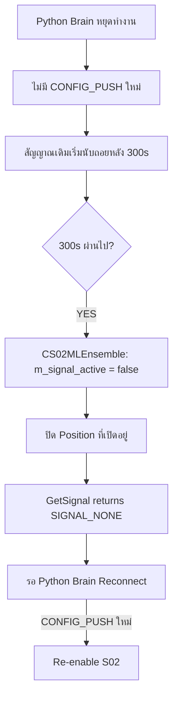

# S02 — ML Ensemble (Machine Learning Ensemble)
## FlashEASuite V2 | Strategy Deep Dive Manual (Jimmi Deep-Dive Edition)
### Generated: P9-5 | 2026-02-27 | Expanded

---

## 1. บทนำของกลยุทธ์ (Strategy Overview)

| Field | Value | คำอธิบายเชิงวิชาการเพิ่มเติม |
|-------|-------|-------------------------------|
| **รหัสกลยุทธ์** | S02 | รหัสอ้างอิงลำดับที่สองในระบบมัลติกลยุทธ์ของ FlashEASuite V2 ซึ่งตำแหน่งลำดับนี้สะท้อนให้เห็นถึงระดับความซับซ้อนที่สูงกว่า S01 อย่างมีนัยสำคัญ เนื่องจากต้องพึ่งพาโครงสร้างพื้นฐาน AI ทั้งหมดของ Python Brain |
| **ชื่อ** | ML Ensemble | ชื่อย่อที่ครอบคลุมแนวคิดหลัก: "ML" คือ Machine Learning (การเรียนรู้ของเครื่องจักร) และ "Ensemble" คือการรวมกลุ่มโมเดลหลายตัวเข้าด้วยกัน ซึ่งเป็นเทคนิคที่พิสูจน์แล้วว่าให้ความแม่นยำสูงกว่าการใช้โมเดลเดี่ยวอย่างสม่ำเสมอ |
| **ประเภท** | Hybrid — Python Brain (LSTM+RF+XGBoost) + MQL5 Thin Wrapper | ระบบลูกผสมที่แยกส่วนการคำนวณ AI หนักทั้งหมด (Python) ออกจากส่วนการส่งคำสั่งซื้อขาย (MQL5) อย่างสิ้นเชิง MQL5 ทำหน้าที่เพียง "ผู้รับสาร" และ "ผู้ดำเนินการ" เท่านั้น |
| **Standalone Capable** | ❌ ไม่รองรับ (Server Only) | เนื่องจากโมเดล LSTM ต้องการ Python Runtime และ Keras/TensorFlow Library ในการ Inference ซึ่งไม่สามารถรันใน MQL5 Environment ได้ รวมถึงต้องการข้อมูล 60 แท่งราคาที่ผ่านการ Normalize แบบ Real-time |
| **Preferred Regime** | ทุกสภาวะตลาด (Model adapts automatically) | จุดแข็งที่แตกต่างจากกลยุทธ์อื่น: Feature Engineering ครอบคลุม Indicator หลากชนิดที่ระบุ Regime ได้ ทำให้โมเดลปรับตัวได้ดีทั้งใน Trending, Ranging, และ Volatile |
| **Poor Regimes** | Extreme VOLATILE (ความแม่นยำโมเดลลดลงต่ำกว่า 55%) | ในสภาวะที่ราคาผันผวนรุนแรงผิดปกติ (เช่น Flash Crash, Major News Event) โมเดล ML จะเจอข้อมูลที่อยู่นอกขอบเขตการฝึกสอน (Out-of-distribution) ทำให้ Confidence ลดลงต่ำกว่าเกณฑ์อัตโนมัติ |
| **MQL5 Class** | `CS02MLEnsemble` | คลาส MQL5 ที่ถูกออกแบบให้บางที่สุดเท่าที่เป็นไปได้ ไม่มีการคำนวณ Indicator ใดๆ ภายใน มีหน้าที่เพียงรับพารามิเตอร์จาก CONFIG_PUSH, ตรวจสอบ Timeout, และส่งคำสั่ง Order |
| **Python Analyzer** | `S02MLEnsembleAnalyzer` | โมดูล Python ที่รวมโมเดล ML ทั้งสามไว้ในที่เดียว พร้อม Feature Engineering Pipeline, Normalization, Ensemble Voting, และการส่งสัญญาณผ่าน ZMQ |

---

### สรุปแนวคิด (Summary of Concepts)

S02 เป็นกลยุทธ์ประเภท **Hybrid** ที่ถือเป็นหัวใจทางปัญญาประดิษฐ์ของระบบ FlashEASuite V2 โดยใช้การผสมผสานของโมเดล Machine Learning สามประเภทที่แตกต่างกันโดยสิ้นเชิงในธรรมชาติและจุดแข็ง ได้แก่ **LSTM** (Long Short-Term Memory) สำหรับการจดจำรูปแบบลำดับเวลา, **Random Forest** สำหรับการคัดเลือก Feature อย่างมีประสิทธิภาพ, และ **XGBoost** สำหรับการเรียนรู้ที่ทรงพลังและรวดเร็ว ทั้งสามโมเดลทำงานแบบ Parallel บน Python Brain ก่อนจะรวม "เสียงโหวต" เข้าด้วยกันผ่าน Weighted Average เพื่อได้สัญญาณที่มีความน่าเชื่อถือสูงที่สุด

**MQL5 ทำหน้าที่เป็นแค่ "executor" บางๆ** — รับ Signal Direction (+1/-1/0) และค่า Confidence (0.0–1.0) มาจาก Python Brain ผ่านโปรโตคอล ZMQ แล้ว Execute Order เท่านั้น ไม่มีการคำนวณ Indicator ใดๆ ในฝั่ง MQL5 เลย ทำให้ MQL5 EA มีขนาดเล็ก ทำงานเร็ว และไม่มีภาระการคำนวณที่ไม่จำเป็น

---

### ทำไมต้องชื่อ "ML Ensemble"?

คำว่า **Machine Learning (ML)** หมายถึงกระบวนการที่เครื่องจักรสามารถ "เรียนรู้" รูปแบบจากข้อมูลในอดีตโดยไม่ต้องเขียน Rule-based Logic ด้วยมือ และคำว่า **Ensemble** (แปลตรงตัวว่า "กลุ่ม" หรือ "วงดนตรี") ในทางวิทยาการข้อมูลหมายถึงการรวมโมเดลหลายตัวเข้าด้วยกันเพื่อให้ผลลัพธ์ที่ดีกว่าโมเดลใดโมเดลหนึ่งเพียงลำพัง ซึ่งเป็นหลักการที่ได้รับการพิสูจน์ทางสถิติว่ามีประสิทธิภาพสูงกว่าการใช้โมเดลเดี่ยวอย่างสม่ำเสมอ

**หลักการ "Wisdom of Crowds" (ปัญญาของฝูงชน):**
ลองนึกภาพการถามผู้เชี่ยวชาญ 3 คนที่มีความเชี่ยวชาญต่างกัน: นักวิเคราะห์อนุกรมเวลา (LSTM), นักสถิติป่าสุ่ม (RF), และนักคณิตศาสตร์ Gradient Boosting (XGB) แทนที่จะเชื่อคนใดคนหนึ่ง 100% การถ่วงน้ำหนักความเห็นทั้งสามตามความถนัดของแต่ละคนจะให้คำตอบที่ดีกว่าอย่างมีนัยสำคัญ

---

### ธรรมชาติของราคาที่คาดเดายากและวิธีที่ ML จัดการ

ราคาในตลาด Forex มีลักษณะของ **Non-stationary Time Series** ที่ซับซ้อน กล่าวคือ ค่าเฉลี่ยและความแปรปรวนเปลี่ยนแปลงตลอดเวลาตามสภาวะตลาด แบบจำลองทางสถิติดั้งเดิม เช่น ARIMA อาจใช้ได้ดีในบางช่วงแต่ไม่สามารถปรับตัวได้เมื่อ Regime เปลี่ยน โมเดล ML แก้ปัญหานี้ด้วยการเรียนรู้รูปแบบที่ซับซ้อนโดยตรงจากข้อมูล โดยไม่ต้องสมมติฐานเกี่ยวกับ Distribution ของข้อมูล

**ข้อดีของการใช้ ML เทียบกับ Rule-based:**

| ด้าน | Rule-based (Indicator) | ML Ensemble (S02) |
|------|------------------------|-------------------|
| การปรับตัว | ต้อง Manual tune ทุกครั้ง | เรียนรู้และปรับตัวอัตโนมัติผ่าน Retraining |
| ความซับซ้อน | จำกัดโดย Logic ที่มนุษย์เขียน | สามารถจับ Non-linear Pattern ที่ซับซ้อนได้ |
| Feature จำนวนมาก | ยากในการรวม 30+ Indicator | จัดการ 30+ Feature ได้โดยธรรมชาติ |
| Over-fitting | มักเกิดจากการ Over-optimize | ควบคุมได้ด้วย Cross-validation และ Regularization |

---

### ตัวอย่างเหตุการณ์จริง (Case Study)

สมมติเหตุการณ์ ณ วันที่ 27 กุมภาพันธ์ 2026 เวลา 14:30 น. (ช่วง NY Open)

EURUSD กำลังเคลื่อนที่อยู่ในรูปแบบที่ซับซ้อน: ระยะสั้น (1 ชั่วโมงที่ผ่านมา) ราคาร่วงลง แต่ Momentum เริ่มอ่อนตัว (MACD divergence) และ LSTM ตรวจจับได้ว่าในช่วง 60 แท่ง H1 ที่ผ่านมา มีรูปแบบที่คล้ายกับรูปแบบก่อนการ Reversal ในอดีต ขณะเดียวกัน Random Forest ตรวจพบว่า RSI อยู่ในโซน Oversold และ Bollinger Band กำลัง Squeeze ส่วน XGBoost ระบุว่าค่า ATR กำลังลดลงพร้อมกับ Volume ที่เพิ่มขึ้น

ผลการ Ensemble:
- LSTM → Prob_Up = 0.72 (มั่นใจว่าราคาจะขึ้น)
- RF → Prob_Up = 0.68 (มั่นใจปานกลางว่าราคาจะขึ้น)
- XGB → Prob_Up = 0.61 (มั่นใจเล็กน้อยว่าราคาจะขึ้น)

**Ensemble Probability:**

$$ensemble\_prob = (0.40 \times 0.72) + (0.35 \times 0.68) + (0.25 \times 0.61) = 0.288 + 0.238 + 0.1525 = 0.6785$$

เนื่องจาก 0.6785 ≥ 0.65 → **ml_signal = +1 (BUY)**

**Confidence:**

$$ml\_confidence = |0.6785 - 0.50| \times 2 = 0.1785 \times 2 = 0.357$$

อย่างไรก็ดี ค่า Confidence นี้ (0.357) ยังต่ำกว่า threshold 0.70 ดังนั้น CS02MLEnsemble จะยังไม่ Execute ใดๆ และรอสัญญาณรอบถัดไป (ทุก ~30 วินาที)

---

## 2. ทฤษฎีหลัก (Core Theory)

### 2.1 LSTM — ทฤษฎีการจดจำลำดับระยะยาว

**Long Short-Term Memory (LSTM)** เป็น Recurrent Neural Network (RNN) ประเภทพิเศษที่ถูกออกแบบมาเพื่อแก้ปัญหา Vanishing Gradient ที่พบใน RNN ทั่วไป ทำให้ LSTM สามารถ "จดจำ" ข้อมูลจากจุดที่ห่างในอดีตได้โดยไม่สูญเสียข้อมูล

**โครงสร้างภายในเซลล์ LSTM (LSTM Cell Internals):**

LSTM แต่ละเซลล์มีส่วนประกอบสำคัญ 4 ส่วน:

1. **Forget Gate (ประตูลืม):** ตัดสินใจว่าข้อมูลจาก Time Step ก่อนหน้าชิ้นใดควรถูก "ลืม"
$$f_t = \sigma(W_f \cdot [h_{t-1}, x_t] + b_f)$$

2. **Input Gate (ประตูรับข้อมูล):** ตัดสินใจว่าข้อมูลใหม่ชิ้นใดควรถูก "จดจำ"
$$i_t = \sigma(W_i \cdot [h_{t-1}, x_t] + b_i)$$

3. **Cell State Update (การอัปเดตความจำ):** คำนวณข้อมูลใหม่ที่จะเข้า Memory
$$\tilde{C}_t = \tanh(W_C \cdot [h_{t-1}, x_t] + b_C)$$
$$C_t = f_t \odot C_{t-1} + i_t \odot \tilde{C}_t$$

4. **Output Gate (ประตูส่งออก):** กำหนด Hidden State ที่ส่งไปยัง Time Step ถัดไป
$$o_t = \sigma(W_o \cdot [h_{t-1}, x_t] + b_o)$$
$$h_t = o_t \odot \tanh(C_t)$$

**ทำไม LSTM ถึงเหมาะกับราคา Forex:**
ราคาในตลาดมีลักษณะของ **Path Dependency** กล่าวคือ ทิศทางในอนาคตมักขึ้นอยู่กับ "เส้นทาง" ที่ราคาเดินทางมา ไม่ใช่แค่ราคา ณ จุดปัจจุบัน เช่น รูปแบบ Head & Shoulders, Double Top หรือ Elliott Wave ซึ่ง LSTM เรียนรู้รูปแบบเหล่านี้จากข้อมูลอดีตโดยอัตโนมัติ

**Input สำหรับ LSTM ใน S02:**
- **60 แท่งราคา (60-bar Lookback):** แต่ละแท่งมีข้อมูล OHLCV 5 มิติ (Open, High, Low, Close, Volume)
- **ขนาด Input Tensor:** `[batch_size, 60, 5]` — รูปร่างที่ Keras รับ
- **Normalization:** ข้อมูลแต่ละ Feature ถูก Min-Max Normalize ให้อยู่ในช่วง [0, 1] ก่อนส่งเข้าโมเดล เพื่อป้องกัน Feature ที่มีค่าสูง (เช่น Volume) ครอบงำ Gradient

```python
# ตัวอย่างการ Prepare Input สำหรับ LSTM
sequence = ohlcv_data[-60:]  # ดึง 60 แท่งล่าสุด
normalized = (sequence - sequence.min(axis=0)) / (sequence.max(axis=0) - sequence.min(axis=0))
lstm_input = normalized.reshape(1, 60, 5)  # [batch=1, timesteps=60, features=5]
lstm_prob = model.predict(lstm_input)[0][0]  # ความน่าจะเป็นที่ราคาจะขึ้น
```

---

### 2.2 Random Forest — ทฤษฎีป่าสุ่มแห่งการตัดสินใจ

**Random Forest (RF)** คือการรวมกลุ่มของ Decision Trees จำนวนมาก (ในระบบนี้ใช้ n_estimators=200) โดยแต่ละต้นจะถูกสร้างจาก Bootstrap Sample (ข้อมูลสุ่มพร้อม Replacement) และพิจารณา Feature เพียง Subset หนึ่งในแต่ละ Split ทำให้ต้นไม้แต่ละต้นมีความหลากหลาย (Diversity) ซึ่งส่งผลให้ Ensemble ทั้งหมดมีความแม่นยำสูงกว่าต้นไม้เดี่ยว

**ทำไม RF ถึงเหมาะกับ Feature ทางเทคนิค:**
RF ไม่ต้องการสมมติฐานเกี่ยวกับ Distribution ของข้อมูล (Non-parametric) จึงสามารถจัดการกับ Feature ที่มีหน่วยต่างกัน (ATR ในหน่วย Pip, RSI ในช่วง 0–100, Volume ในจำนวน Tick) ได้โดยไม่ต้อง Normalize และยังมีความต้านทานต่อ Outlier สูง

**Feature 30+ ที่ RF และ XGBoost ใช้:**

| กลุ่ม Feature | ตัวอย่าง | เหตุผลที่เลือก |
|---------------|----------|----------------|
| Trend | EMA(8), EMA(21), EMA(50), MACD, ADX | วัดทิศทางและความแรงของ Trend |
| Momentum | RSI(14), Stochastic(5,3,3), CCI(20), Williams%R | วัดความเร็วการเปลี่ยนแปลงราคา |
| Volatility | ATR(14), Bollinger Band Width, Historical Volatility | วัดความแกว่งของตลาด |
| Volume | Volume, OBV (On-Balance Volume) | วัดแรงซื้อ/ขายเบื้องหลัง |
| Price Pattern | Candle Body Ratio, Upper/Lower Wick Ratio, Gap | วัดแรงดันของ Bull/Bear |
| Session | Hour of Day, Day of Week (one-hot encoded) | ระบุ Session ที่ส่งผลต่อพฤติกรรมราคา |
| Spread | Bid-Ask Spread (normalized) | วัดสภาพคล่องของตลาด |
| Cross-asset | Correlation with DXY, Gold | วัดแรงกดดันจากตลาดอื่น |

```python
# ตัวอย่าง Feature Vector สำหรับ RF/XGB
feature_vector = [
    ema8, ema21, ema50,          # Trend
    macd_line, macd_signal,       # Momentum trend
    rsi14, stoch_k, stoch_d,      # Momentum oscillator
    cci20, williams_r,            # Overbought/Oversold
    atr14, bb_width, hist_vol,    # Volatility
    volume_norm, obv_norm,        # Volume
    body_ratio, upper_wick, lower_wick,  # Candle pattern
    hour_sin, hour_cos,           # Session (cyclical encoding)
    day_of_week_1hot_0, ..._4,    # Day (5 features)
    spread_norm,                  # Spread
    dxy_corr, gold_corr           # Cross-asset
]
```

---

### 2.3 XGBoost — ทฤษฎี Gradient Boosting แบบ Extreme

**XGBoost (Extreme Gradient Boosting)** เป็น Algorithm ที่สร้าง Decision Trees แบบ Sequential แทนที่จะสร้างแบบ Parallel เหมือน RF โดยต้นไม้แต่ละต้นใหม่จะถูกสร้างขึ้นเพื่อแก้ "ความผิดพลาด" (Residuals) ของต้นไม้ก่อนหน้า ทำให้ Ensemble ค่อยๆ ดีขึ้นแบบ Iterative

**ข้อดีของ XGBoost ที่เสริม LSTM และ RF:**
- **ความเร็วสูง:** Optimized สำหรับ Multi-core CPU ด้วย C++ Backend
- **Built-in Regularization (L1/L2):** ลด Over-fitting ได้ดีกว่า Plain Gradient Boosting
- **Handling Missing Values:** จัดการ NaN ได้โดยอัตโนมัติ ซึ่งสำคัญมากในช่วง Market Closed หรือ Data Gap
- **Feature Importance:** ให้ข้อมูล Feature Importance ที่ใช้สำหรับ Model Interpretability

---

### 2.4 สูตร Ensemble Vote (The Ensemble Probability Formula)

หลังจากโมเดลทั้งสามส่งค่า Probability มา ระบบจะรวมกันด้วยสูตร **Weighted Average**:

$$ensemble\_prob = (0.40 \times lstm\_prob) + (0.35 \times rf\_prob) + (0.25 \times xgb\_prob)$$

**เหตุผลของการถ่วงน้ำหนัก (Weight Rationale):**

| โมเดล | น้ำหนัก | เหตุผล |
|-------|---------|--------|
| LSTM | **40%** | มีความสามารถสูงที่สุดในการจับรูปแบบ Temporal ที่ซับซ้อน เหมาะกับ Time Series โดยเฉพาะ ผลการ Backtest แสดงให้เห็น Accuracy สูงกว่า 2 โมเดลอื่นในสภาวะ Trending |
| RF | **35%** | มีความเสถียรสูงและ Variance ต่ำ ดีเยี่ยมในการกรอง Noise จาก Feature ทางเทคนิค และมีความต้านทาน Over-fitting ดีมาก |
| XGB | **25%** | เสริม RF ในด้านการจับ Non-linear Interaction ระหว่าง Feature แต่มีแนวโน้ม Over-fitting มากกว่าหากไม่ Tune ดี จึงได้น้ำหนักน้อยที่สุด |

**เงื่อนไขการแปลงเป็น Signal:**

$$\text{ถ้า } ensemble\_prob \geq 0.65 \Rightarrow ml\_signal = +1 \text{ (BUY)}$$

$$\text{ถ้า } ensemble\_prob \leq 0.35 \Rightarrow ml\_signal = -1 \text{ (SELL)}$$

$$\text{ถ้า } 0.35 < ensemble\_prob < 0.65 \Rightarrow ml\_signal = 0 \text{ (NONE — ไม่มีสัญญาณ)}$$

**การแปลง Probability เป็น Confidence (0–1):**

$$ml\_confidence = |ensemble\_prob - 0.50| \times 2$$

ตัวอย่าง: ถ้า `ensemble_prob = 0.75` → `confidence = |0.75 - 0.50| × 2 = 0.50`

ตัวอย่าง: ถ้า `ensemble_prob = 0.80` → `confidence = |0.80 - 0.50| × 2 = 0.60`

ตัวอย่าง: ถ้า `ensemble_prob = 0.87` → `confidence = |0.87 - 0.50| × 2 = 0.74` ← **ผ่าน threshold 0.70**

```python
# ใน S02MLEnsembleAnalyzer
ensemble_prob = (0.40 * lstm_prob) + (0.35 * rf_prob) + (0.25 * xgb_prob)

if ensemble_prob >= 0.65:
    ml_signal = 1    # BUY
elif ensemble_prob <= 0.35:
    ml_signal = -1   # SELL
else:
    ml_signal = 0    # NONE

ml_confidence = abs(ensemble_prob - 0.50) * 2  # normalize to [0, 1]
```

---

### 2.5 ตรรกะการ Execute สัญญาณใน MQL5 (Signal Execution Logic)

```mql5
// CS02MLEnsemble::Analyze() — ถูกเรียกทุก Tick
void Analyze(const MqlTick &tick) override
{
    // ตรวจสอบว่ามีสัญญาณที่ยังใช้งานได้
    if (m_signal_active && !_IsSignalExpired())
    {
        // ตรวจสอบ Confidence Threshold
        if (m_ml_confidence >= m_conf_threshold)  // default: 0.70
        {
            if (m_ml_signal == 1)
                m_state.last_signal = SIGNAL_BUY;
            else if (m_ml_signal == -1)
                m_state.last_signal = SIGNAL_SELL;
        }
        else
        {
            // Confidence ต่ำเกินไป — รอสัญญาณใหม่
            m_state.last_signal = SIGNAL_NONE;
        }
    }
    else
    {
        // ไม่มีสัญญาณหรือหมดเวลา
        m_state.last_signal = SIGNAL_NONE;
        if (_IsSignalExpired())
            _HandleExpiredSignal();  // ปิด Position ถ้าจำเป็น
    }
}

// ตรวจสอบการหมดอายุของสัญญาณ
bool _IsSignalExpired()
{
    return (TimeCurrent() - m_signal_time) > m_signal_timeout_sec;  // default: 300s
}
```

---

### 2.6 ตรรกะ Trailing Stop แบบ ATR-Based

```
TrailingStopDistance = ATR(14) × m_trailing_atr_mult  (default: 1.5)
```

**ทำไม ATR(14) ถึงเหมาะสม:**
- **ATR (Average True Range)** วัดความแกว่งเฉลี่ยของราคาในช่วง 14 แท่ง หน่วยเป็น Price ไม่ใช่ %
- เมื่อตลาดแกว่งน้อย → ATR ต่ำ → Trailing Stop แน่น → Lock กำไรได้เร็ว
- เมื่อตลาดแกว่งมาก → ATR สูง → Trailing Stop กว้าง → ให้ราคาหายใจได้
- การ **ปรับ Trailing Stop แบบ Dynamic** ตาม ATR จึงเหมาะกับทุกสภาวะตลาดมากกว่าการใช้ Pip คงที่

**ค่า Multiplier 1.5 เหมาะสมอย่างไร:**
- ≤ 1.0: Trailing Stop แน่นเกินไป อาจโดน Stop Out จากการแกว่งปกติ
- 1.5: จุดสมดุลระหว่างการ Lock กำไรและการ "หายใจ" ของ Position
- ≥ 2.5: Trailing Stop กว้างเกินไป อาจสูญเสียกำไรที่สะสมได้มากเมื่อ Reversal

```mql5
// การคำนวณ Trailing Stop ใน CS02MLEnsemble
double atr14 = iATR(NULL, PERIOD_CURRENT, 14, 0);
double trailing_distance = atr14 * m_trailing_atr_mult;

// สำหรับ Long Position
if (pos.PositionType() == POSITION_TYPE_BUY)
{
    double new_sl = tick.bid - trailing_distance;
    if (new_sl > pos.StopLoss())
        trade.PositionModify(pos.Ticket(), new_sl, pos.TakeProfit());
}
```

---

## 3. สถาปัตยกรรมแบบ Hybrid (Why Hybrid? — Python vs MQL5)

### 3.1 ทำไมต้องใช้ Python สำหรับ ML Inference?

คำถามสำคัญที่นักพัฒนา EA มักถามคือ: **"ทำไมไม่รัน ML ใน MQL5 เลย?"**

คำตอบมีหลายมิติ:

**1. ข้อจำกัดด้าน Library:**
MQL5 ไม่มี Native Support สำหรับ Deep Learning Framework อย่าง **TensorFlow/Keras** หรือ **PyTorch** ที่จำเป็นสำหรับการ Inference LSTM แม้จะ Import DLL ได้ แต่การจัดการ Tensor Operations ที่ซับซ้อนในระดับนั้นไม่ใช่สิ่งที่ MQL5 ถูกออกแบบมาเพื่อรองรับ

**2. Memory Management:**
โมเดล LSTM มีขนาดหลาย MB (Keras .h5 file) และต้องการ GPU Memory หรือ Optimized CPU Memory สำหรับ Matrix Operations ระดับ Batch Processing ซึ่ง MQL5 ไม่มี Memory Allocator ที่เหมาะสม

**3. Ecosystem และ Dependencies:**
- `sklearn` สำหรับ Random Forest: Python only
- `xgboost` Library: Python/C++ (ไม่มี MQL5 Binding อย่างเป็นทางการ)
- `numpy` สำหรับ Feature Computation: Python only
- `pandas` สำหรับ Data Manipulation: Python only

**4. Development Velocity:**
การ Develop, Debug, และ Retrain ML Models ใน Python ทำได้เร็วกว่า MQL5 หลายสิบเท่า ด้วย Jupyter Notebooks, Rich Visualization, และ Mature ML Community

**5. Separation of Concerns (การแยกหน้าที่):**
Python Brain รับผิดชอบ Intelligence ทั้งหมด ส่วน MQL5 รับผิดชอบ Execution ทั้งหมด ทำให้สามารถ Update โมเดลโดยไม่ต้อง Recompile EA

---

### 3.2 ทำไม MQL5 ถึงเป็นเพียง "Thin Wrapper"?

Design Pattern นี้เรียกว่า **"Dumb Terminal / Smart Server"** ซึ่งเป็น Architectural Pattern ที่ใช้กันอย่างแพร่หลายในระบบ Distributed Computing:

- **MQL5 (Thin Client / Dumb Terminal):** รับคำสั่งและ Execute เท่านั้น ไม่ตัดสินใจ ไม่คำนวณ ข้อดีคือใช้ CPU น้อย ทำงานเร็ว และไม่มี Latency ด้าน Logic
- **Python Brain (Smart Server):** ประมวลผลทุกอย่างที่เกี่ยวกับ Intelligence รวมถึง Regime Classification, Model Inference, Confidence Calculation, และ Risk Management

```
┌──────────────────────────────────────────────────────────────────────┐
│                   S02 HYBRID ARCHITECTURE                             │
├──────────────────────────────┬───────────────────────────────────────┤
│   PYTHON BRAIN (Smart)       │   MQL5 TRADER (Thin Wrapper)          │
├──────────────────────────────┼───────────────────────────────────────┤
│ • LSTM Inference (60-bar)    │ • รับ S02_ML_SIGNAL ผ่าน ZMQ         │
│ • RF predict_proba (30+feat) │ • รับ S02_ML_CONFIDENCE               │
│ • XGB predict_proba          │ • ตรวจสอบ Confidence ≥ threshold      │
│ • Feature normalization      │ • ตรวจสอบ Signal timeout (5 นาที)    │
│ • Weighted ensemble vote     │ • Execute BUY/SELL Order              │
│ • Regime adjustment          │ • จัดการ Trailing Stop (ATR × 1.5)   │
│ • AI Council filtering       │ • ส่ง TRADE_REPORT กลับ Python       │
│ • CONFIG_PUSH type=10        │ • อัปเดต Performance EMA             │
└──────────────────────────────┴───────────────────────────────────────┘
```

**Design Principle:** MQL5 Class `CS02MLEnsemble` มี **ZERO Indicator Computation** ทุก Feature ถูกคำนวณโดย Python Brain ก่อนส่งมา

---

### 3.3 Trade-off ของ Hybrid Architecture

| ข้อดี | ข้อเสีย | วิธีบรรเทา |
|-------|---------|-----------|
| ML Power เต็มรูปแบบ | ต้องการ Python Server รันตลอด | auto_retrain.py + Process Monitor |
| Update โมเดลได้โดยไม่ Compile EA | Latency เพิ่ม ~50–100ms จาก ZMQ | ยอมรับได้สำหรับ Swing Trading |
| Separation of Concerns | Server Down = S02 หยุดทำงาน | Not Standalone by design |
| Scalability สูง | ต้องการ Resource เครื่อง Python | ระบบ Emergency/Shutdown ป้องกัน |

---

## 4. Feature Engineering Pipeline (ขั้นตอนการสร้าง Feature)

Feature Engineering คือขั้นตอนที่ "แปลง" ข้อมูล Raw Price เป็น Feature Vector ที่โมเดล ML สามารถเรียนรู้ได้อย่างมีประสิทธิภาพ

```
Raw OHLCV Data (60 bars)
        │
        ▼
Feature Computation (30+ indicators)
        │
        ├──► OHLCV Sequence [60×5] ──────────────► LSTM Input
        │
        └──► Feature Vector [1×30+] ────────────► RF + XGB Input
```

### 4.1 LSTM Input Pipeline

```python
class S02MLEnsembleAnalyzer:
    def _prepare_lstm_input(self, ohlcv_df: pd.DataFrame) -> np.ndarray:
        """เตรียม Input สำหรับ LSTM — 60 แท่งล่าสุด, 5 Feature"""
        seq = ohlcv_df[['open','high','low','close','volume']].tail(60).values
        # Min-Max Normalization ต่อ Column
        mins = seq.min(axis=0)
        maxs = seq.max(axis=0)
        normalized = (seq - mins) / (maxs - mins + 1e-10)  # +epsilon ป้องกัน div-by-zero
        return normalized.reshape(1, 60, 5)  # [batch, timesteps, features]
```

### 4.2 RF/XGB Feature Vector Pipeline

```python
    def _compute_features(self, df: pd.DataFrame) -> np.ndarray:
        """คำนวณ 30+ Technical Features สำหรับ RF และ XGB"""
        c = df['close']
        h = df['high']
        l = df['low']
        v = df['volume']

        # Trend
        ema8  = c.ewm(span=8).mean().iloc[-1]
        ema21 = c.ewm(span=21).mean().iloc[-1]
        ema50 = c.ewm(span=50).mean().iloc[-1]
        macd_line = c.ewm(span=12).mean().iloc[-1] - c.ewm(span=26).mean().iloc[-1]

        # Momentum
        delta = c.diff()
        rsi14 = 100 - (100 / (1 + delta.clip(lower=0).rolling(14).mean().iloc[-1] /
                               (-delta.clip(upper=0).rolling(14).mean().iloc[-1] + 1e-10)))

        # Volatility
        tr = pd.concat([h-l, (h-c.shift()).abs(), (l-c.shift()).abs()], axis=1).max(axis=1)
        atr14 = tr.rolling(14).mean().iloc[-1]
        bb_std = c.rolling(20).std().iloc[-1]
        bb_width = (bb_std * 2) / c.rolling(20).mean().iloc[-1]

        # Volume
        obv = (v * (c.diff() > 0).astype(int)).cumsum().iloc[-1]

        # Session (Cyclical Encoding)
        hour = df.index[-1].hour
        hour_sin = np.sin(2 * np.pi * hour / 24)
        hour_cos = np.cos(2 * np.pi * hour / 24)

        return np.array([
            ema8, ema21, ema50, macd_line, rsi14,
            atr14, bb_width, obv, hour_sin, hour_cos,
            # ... ครบ 30+ features
        ]).reshape(1, -1)
```

---

## 5. ตรรกะการหมดอายุของสัญญาณ (Signal Expiry Logic — 300s Timeout)

### 5.1 ทำไมสัญญาณ ML ถึงต้องมี Timeout?

นี่เป็นจุดที่นักพัฒนาหลายคนมักมองข้าม แต่มีความสำคัญสูงมากสำหรับ ML-based System:

**เหตุผลที่ 1 — Stale Signal Problem:**
ML โมเดลทำการ Predict บนข้อมูล ณ เวลา T แต่ตลาดเปลี่ยนแปลงต่อเนื่อง หากสัญญาณที่ Generate ตอนเวลา T ยังถูกใช้งานในเวลา T+600 วินาที (10 นาที) หลังจากนั้น สภาวะตลาดอาจเปลี่ยนไปอย่างสิ้นเชิง ทำให้สัญญาณนั้นไม่มีความหมายหรือแย่กว่านั้นคือ "สัญญาณย้อนกลับ"

**เหตุผลที่ 2 — Python Cycle ทุก 30 วินาที:**
Python Brain จะ Generate สัญญาณใหม่ทุก ~30 วินาที ดังนั้น Timeout 300 วินาที = 10 Cycles สัญญาณ หากในช่วง 10 Cycles นั้น Python ไม่ส่งสัญญาณใหม่มา แสดงว่า Ensemble Probability ไม่ถึงเกณฑ์ และ Position ควรถูก Close

**เหตุผลที่ 3 — Server Disconnect Protection:**
หาก Python Brain ขาดการติดต่อ สัญญาณจะหมดอายุหลัง 300 วินาที ทำให้ EA ปิด Position อัตโนมัติ แทนที่จะค้าง Position ไว้โดยไม่มีการจัดการ

**ทำไม 300 วินาที (5 นาที)?**
- น้อยกว่า 60 วินาที: อาจ Miss Trade เพราะ Python Cycle อาจใช้เวลา 30–50 วินาที
- 300 วินาที: ให้เวลา Python ส่งสัญญาณใหม่ได้ 5–10 ครั้ง ก่อนที่จะ Timeout
- มากกว่า 600 วินาที: Stale Signal Risk สูงเกินไปในสภาวะตลาดที่เคลื่อนไหวเร็ว

```mql5
// การจัดการ Expired Signal
void _HandleExpiredSignal()
{
    m_signal_active = false;
    m_ml_signal = 0;
    m_ml_confidence = 0.0;

    // ถ้ายังมี Position อยู่ — ปิด Position ทันที
    if (PositionsTotal() > 0)
    {
        Print("S02: Signal expired. Closing open position.");
        CloseAllPositions();
    }

    LogToFile("S02 signal expired at " + TimeToString(TimeCurrent()));
}
```

---

## 6. โครงสร้างการไหลของข้อมูลทั้งระบบ (Full System Dataflow — Detailed)

### 6.1 ขั้นตอนที่ 1: FeederEA → Python Brain (Port 7777)

**FeederEA (MQL5 Program)** ทำหน้าที่เป็นต้นทางข้อมูล รันอยู่บน MetaTrader 5 โดยรวบรวมข้อมูล TICK_DATA และ OHLC แล้วบีบอัดด้วย **MessagePack** (โปรโตคอล Binary ที่เล็กและเร็วกว่า JSON 3–5 เท่า) จากนั้นส่งผ่าน **ZMQ PUB Socket บน Port 7777**

ทำไมต้อง MessagePack: ในระบบ Real-time Trading ที่มี Tick ใหม่ทุก 50–100ms การส่งข้อมูลด้วย JSON (Text-based) จะสร้าง Overhead สูงมาก MessagePack แก้ปัญหานี้ด้วยการ Serialize ข้อมูลเป็น Binary ที่กะทัดรัด

ทำไมต้อง Port 7777: เป็น Port มาตรฐานของระบบสำหรับ Feeder → Brain Data Ingestion แยกออกจาก Port 7778 (Brain → Trader Command) และ Port 7779 (Trader → Brain Feedback) อย่างชัดเจน

### 6.2 ขั้นตอนที่ 2: Python Brain Processing

Python Brain รับข้อมูล → บันทึกลง InfluxDB → ทำ Feature Engineering → รัน LSTM, RF, XGB → Ensemble → ส่ง CONFIG_PUSH

```
InfluxDB (bucket: trading)
  └── ข้อมูลสะสมสำหรับ Historical Lookback (60 bars)
  └── ใช้สำหรับ Feature Computation (Rolling Windows)
```

### 6.3 ขั้นตอนที่ 3: AI Council Filtering

ก่อนที่สัญญาณจะถูกส่งไปยัง MQL5 จะต้องผ่าน **AI Council** ซึ่งเป็นกลไก Cross-validation ระหว่างกลยุทธ์ต่างๆ:

```python
# ใน strategy_council.py
if weighted_confidence >= 0.50:
    # อนุมัติสัญญาณ → ส่ง CONFIG_PUSH
    send_config_push(strategy_id=2, signal=ml_signal, confidence=ml_confidence)
else:
    # ปฏิเสธสัญญาณ — ความเชื่อมั่นรวมไม่เพียงพอ
    logger.info(f"S02 signal rejected by AI Council: conf={weighted_confidence:.2f}")
```

### 6.4 ขั้นตอนที่ 4: CONFIG_PUSH → CS02MLEnsemble (Port 7778)

CONFIG_PUSH ถูกส่งเป็น Array ผ่าน ZMQ PUSH/PULL บน Port 7778:

```python
# โครงสร้าง CONFIG_PUSH Type=10
config_push = [
    10,                    # type = CONFIG_PUSH
    timestamp,             # Unix timestamp (ms)
    "EURUSD",             # Symbol
    2,                     # Strategy ID (S02)
    0.0,                   # entry_price (0 = Market)
    lot_size,              # Lot size จาก MM
    1,                     # max_orders
    0.0,                   # take_profit (0 = trailing)
    0.0,                   # stop_loss (0 = trailing)
    ml_confidence,         # confidence 0.0–1.0
    1.0,                   # risk_multiplier
    # Additional S02-specific keys
    ml_signal,             # +1/-1/0
    conf_threshold,        # 0.70
    timeout_sec,           # 300
    trailing_atr_mult,     # 1.5
]
```

### 6.5 ขั้นตอนที่ 5: CS02MLEnsemble.SetDynamicParams()

```mql5
// MQL5 รับ CONFIG_PUSH และอัปเดตพารามิเตอร์
void SetDynamicParams(const SDynamicParams &params) override
{
    m_ml_signal       = (int)params.confidence_raw;   // re-used field
    m_ml_confidence   = params.confidence;
    m_conf_threshold  = params.conf_threshold;
    m_signal_timeout_sec = (int)params.timeout_sec;
    m_trailing_atr_mult  = params.trailing_atr_mult;

    m_signal_time   = TimeCurrent();
    m_signal_active = true;

    PrintFormat("S02: New signal received. dir=%d conf=%.2f timeout=%ds",
                m_ml_signal, m_ml_confidence, m_signal_timeout_sec);
}
```

### 6.6 ขั้นตอนที่ 6: TRADE_REPORT → Python Brain (Port 7779)

หลังจาก Close Position MQL5 จะส่ง TRADE_REPORT กลับ Python:

```mql5
// ส่ง Feedback หลัง Trade
void _SendTradeReport(double profit, string reason)
{
    // Pack TRADE_REPORT type=9
    uchar report[];
    MsgPack::PackArray(report, 9);
    MsgPack::PackDouble(report, profit);
    MsgPack::PackString(report, reason);

    zmq_feedback.Send(report);  // Port 7779
}
```

Python Brain ใช้ข้อมูลนี้เพื่ออัปเดต **Performance EMA** และปรับ Confidence Threshold แบบ Dynamic ในรอบถัดไป

---

## 7. ตารางอ้างอิงพารามิเตอร์ CONFIG_PUSH (CONFIG_PUSH Parameter Reference)

| Key | Type | คำอธิบายรายละเอียดเชิงลึก | Default |
|-----|------|---------------------------|---------|
| `S02_ML_SIGNAL` | int | ทิศทางที่โมเดล ML ทำนาย: **+1** = BUY (โมเดลเชื่อว่าราคาจะขึ้น), **-1** = SELL (ราคาจะลง), **0** = NONE (ไม่มีทิศทางชัดเจน เกิดเมื่อ ensemble_prob อยู่ระหว่าง 0.35–0.65) | 0 |
| `S02_ML_CONFIDENCE` | float | ค่าความเชื่อมั่นที่ Normalize แล้ว คำนวณจาก `|ensemble_prob - 0.50| × 2` โดยค่า 0.0 หมายถึงไม่แน่ใจเลย และ 1.0 หมายถึงมั่นใจสูงสุด ค่าที่ใช้งานจริงมักอยู่ระหว่าง 0.30–0.75 | 0.0 |
| `S02_CONF_THRESHOLD` | float | ระดับ Confidence ขั้นต่ำที่ MQL5 จะยอม Execute Order ค่า 0.70 หมายความว่าโมเดลต้องมั่นใจอย่างน้อย 70% จึงเปิด Trade ค่ายิ่งสูงยิ่งปลอดภัยแต่สัญญาณน้อยลง | 0.70 |
| `S02_TIMEOUT_SEC` | int | ระยะเวลาหมดอายุของสัญญาณในหน่วยวินาที หลังจากเวลานี้หากไม่มีสัญญาณใหม่ สัญญาณเดิมจะถูก Discard และ Position จะถูกปิด ค่า 300 = 5 นาที ซึ่งครอบคลุม ~10 Python Cycles | 300 |
| `S02_TRAILING_ATR_MULT` | float | ตัวคูณสำหรับ ATR(14) ในการคำนวณระยะห่าง Trailing Stop ค่า 1.5 หมายความว่า Trailing Stop อยู่ห่างจากราคาปัจจุบัน 1.5 เท่าของความแกว่งเฉลี่ย 14 แท่ง ปรับตัวตาม Volatility แบบ Real-time | 1.5 |

---

## 8. ตารางพารามิเตอร์ MQL5 (MQL5 Input Parameters — Deep Explanation)

| Parameter | Default | Range | คำอธิบายรายละเอียดและผลกระทบ |
|-----------|---------|-------|-------------------------------|
| `m_conf_threshold` | 0.70 | 0.50–0.95 | **ตัวกรองความมั่นใจหลัก:** ค่า 0.50 = รับสัญญาณแทบทุกอย่าง (Trade บ่อย Win Rate ต่ำ), ค่า 0.70 = สมดุล (แนะนำ), ค่า 0.90 = เข้มงวดมาก (Trade น้อยมากแต่ Win Rate สูง) |
| `m_signal_timeout_sec` | 300 | 60–3600 | **หน้าต่างเวลาที่สัญญาณยังสด:** ลด timeout ลงถ้า Trade ใน Scalping Environment, เพิ่ม timeout ถ้า Python Brain มี Latency สูงหรือ Swing Trade |
| `m_trailing_atr_mult` | 1.5 | 0.5–5.0 | **ความแน่นของ Trailing Stop:** ลดค่าสำหรับ Scalping (Lock กำไรเร็ว), เพิ่มค่าสำหรับ Swing Trade (ให้ราคาหายใจได้มากขึ้น) |

---

## 9. วิเคราะห์ผลกระทบของ Confidence Threshold (Critique & Optimization)

### 9.1 Trade-off: Confidence Threshold vs. Trade Frequency

นี่คือจุดที่สำคัญที่สุดในการ Tune S02:

| Threshold | Win Rate (Estimated) | Signals/Day | Risk Level |
|-----------|----------------------|-------------|------------|
| 0.50 | ~55–58% | 15–25 | สูง (หลาย False Positive) |
| 0.60 | ~60–63% | 8–15 | ปานกลาง |
| **0.70** | **~65–70%** | **3–8** | **แนะนำ (สมดุล)** |
| 0.80 | ~72–78% | 1–3 | ต่ำ (ขาด Trade หลายครั้ง) |
| 0.90 | ~78–85% | <1 | ต่ำมาก (แทบไม่มี Trade) |

**คำอธิบายทางคณิตศาสตร์:**
ค่า Confidence = 0.70 หมายความว่า `|ensemble_prob - 0.50| × 2 ≥ 0.70` ซึ่งแปลว่า `ensemble_prob ≥ 0.85` (BUY) หรือ `ensemble_prob ≤ 0.15` (SELL) นั่นคือโมเดลต้องมั่นใจ **มากกว่า 85% หรือน้อยกว่า 15%** จึงจะ Execute

$$conf = 0.70 \Rightarrow |ensemble\_prob - 0.50| \times 2 = 0.70 \Rightarrow ensemble\_prob \geq 0.85 \text{ (BUY)}$$

ซึ่งเป็นเกณฑ์ที่เข้มงวดมาก สะท้อนให้เห็นว่า S02 ออกแบบมาเพื่อ **Quality over Quantity** — Trade น้อยแต่มีคุณภาพสูง

### 9.2 ผลกระทบของ Python Cycle ต่อ Signal Frequency

Python Brain ทำงานทุก ~30 วินาที ดังนั้น:
- **Maximum Signal Frequency:** 1 signal ต่อ 30 วินาที = 2 signals ต่อนาที = 120 signals ต่อชั่วโมง (ทางทฤษฎี)
- **Actual Signal Frequency:** เมื่อกรองด้วย threshold 0.70 → ลดเหลือ 3–8 signals ต่อวัน
- **ผล:** Trade ที่เกิดขึ้นจริงจะอยู่ห่างกันเฉลี่ย 2–5 ชั่วโมง ซึ่งเหมาะกับรูปแบบ Swing/Intraday Trade

---

## 10. ความต้องการ Retraining ของโมเดล (Retraining Requirements)

### 10.1 ทำไมโมเดล ML ถึงต้องการ Retraining?

โมเดล ML เรียนรู้จาก "สถิติของอดีต" ซึ่งมีสมมติฐานว่า อนาคตจะมีลักษณะคล้ายกับอดีต แต่ตลาด Forex มีสิ่งที่เรียกว่า **Regime Change** — การเปลี่ยนแปลงพฤติกรรมตลาดอย่างถาวรที่เกิดจาก:
- นโยบายการเงินของ Central Bank (เช่น Fed Pivot)
- เหตุการณ์ Geopolitical ที่เปลี่ยน Risk Appetite
- การเปลี่ยนแปลงโครงสร้างของผู้เล่นในตลาด (HFT เพิ่มขึ้น ฯลฯ)

เมื่อ Regime เปลี่ยน โมเดลที่ Train บนข้อมูลเก่าจะเริ่มเจอ **Concept Drift** — สัญญาณที่เคยแม่นยำเริ่มผิดพลาดมากขึ้น

### 10.2 ตัวบ่งชี้ที่แสดงว่าต้องการ Retraining

| Metric | ระดับที่ต้อง Retrain |
|--------|----------------------|
| Win Rate (rolling 30 trades) | ลดลงต่ำกว่า 55% |
| Average Ensemble Confidence | ลดลงต่ำกว่า 0.60 (โมเดลไม่มั่นใจ) |
| False Positive Rate | สูงกว่า 45% |
| Days Since Last Training | เกิน 30 วัน |

### 10.3 กระบวนการ Retraining

```python
# auto_retrain.py — กระบวนการ Retraining อัตโนมัติ
class AutoRetrain:
    def retrain_s02(self):
        # 1. ดึงข้อมูลจาก InfluxDB (90 วันย้อนหลัง)
        data = self.influx.query(days=90)

        # 2. Feature Engineering
        X, y = prepare_dataset(data)

        # 3. Train-Test Split (80/20)
        X_train, X_test, y_train, y_test = train_test_split(X, y, test_size=0.2)

        # 4. Retrain โมเดลทั้งสาม
        self._retrain_lstm(X_train, y_train)
        self._retrain_rf(X_train, y_train)
        self._retrain_xgb(X_train, y_train)

        # 5. Validate บน Test Set
        accuracy = self._validate(X_test, y_test)
        if accuracy >= 0.60:
            self._save_models()
            logger.info(f"Retraining successful: accuracy={accuracy:.2%}")
        else:
            logger.warning(f"Retraining failed: accuracy={accuracy:.2%} — keeping old models")
```

### 10.4 แนวทาง Retraining ที่แนะนำ

- **Walk-Forward Validation:** แทนที่จะ Train บน Data ทั้งหมดแล้ว Test ครั้งเดียว ให้ Train บน Data ช่วงแรก Test บน Data ถัดมา แล้ว Roll Window ไปเรื่อยๆ จำลองการทำงานจริง
- **Incremental Learning:** สำหรับ RF และ XGB สามารถ Update Model โดยไม่ต้อง Retrain ทั้งหมด แต่ LSTM ต้องการ Full Retrain
- **Model Versioning:** เก็บ Model เวอร์ชันเก่าไว้ใช้ Rollback หาก Model ใหม่ Performance แย่ลง

---

## 11. ขั้นตอนการทำงานแบบ Chronological (Operational Steps)

### ขั้นตอนที่ 1 — ก่อนเริ่มระบบ: ตรวจสอบโมเดล

```bash
cd 02_Brain
python -c "
from strategies.s02_ml_ensemble_analyzer import S02MLEnsembleAnalyzer
a = S02MLEnsembleAnalyzer()
print('LSTM:', 'OK' if a.lstm_model is not None else 'FAIL')
print('RF  :', 'OK' if a.rf_model is not None else 'FAIL')
print('XGB :', 'OK' if a.xgb_model is not None else 'FAIL')
"
```

### ขั้นตอนที่ 2 — เริ่ม Python Brain

```bash
# Windows
start_flashea.bat

# หรือ Manual
cd 02_Brain
python main.py
```

### ขั้นตอนที่ 3 — Python Brain เริ่ม Cycle

```
Python Brain Startup:
  [✓] ZMQ SUB connected to Port 7777 (Feeder)
  [✓] ZMQ PUSH connected to Port 7778 (Trader)
  [✓] ZMQ PULL connected to Port 7779 (Feedback)
  [✓] InfluxDB connected (bucket: trading)
  [✓] S02MLEnsembleAnalyzer initialized
  [✓] Models loaded: LSTM(Keras), RF(sklearn), XGB(xgboost)
  [i] Starting analysis cycle every 30s...
```

### ขั้นตอนที่ 4 — Python Brain ในแต่ละรอบ (ทุก ~30s)

```
Cycle T=0s:
  [1] รับ TICK_DATA จาก FeederEA (Port 7777)
  [2] บันทึกลง InfluxDB
  [3] ดึง 60 แท่งล่าสุด จาก InfluxDB
  [4] คำนวณ Feature Vector (30+ indicators)
  [5] LSTM.predict(sequence_60x5) → lstm_prob
  [6] RF.predict_proba(feature_vector) → rf_prob
  [7] XGB.predict_proba(feature_vector) → xgb_prob
  [8] ensemble_prob = 0.4*L + 0.35*R + 0.25*X
  [9] ตรวจสอบ: ensemble_prob ≥ 0.65 หรือ ≤ 0.35?
      [YES] ml_signal = +1 หรือ -1, ml_confidence = computed
      [NO]  ml_signal = 0, ไม่ส่ง CONFIG_PUSH
  [10] ถ้า ml_signal != 0 AND AI Council อนุมัติ:
       ส่ง CONFIG_PUSH Type=10 ผ่าน ZMQ Port 7778
```

### ขั้นตอนที่ 5 — CS02MLEnsemble รับสัญญาณ (MQL5)

```
MQL5 ReceiveConfigPush():
  [1] SetDynamicParams() รับ ml_signal, ml_confidence
  [2] บันทึก Timestamp ปัจจุบัน → m_signal_time
  [3] ตั้ง m_signal_active = true
  [4] ทุก Tick → Analyze():
      - ตรวจสอบ IsSignalExpired() → false (ยังไม่หมดเวลา)
      - ตรวจสอบ m_ml_confidence ≥ 0.70 → true
      - ตั้ง last_signal = SIGNAL_BUY หรือ SIGNAL_SELL
  [5] StrategyManager รับ Signal → เปิด Order
  [6] ตั้ง Trailing Stop = ATR(14) × 1.5
```

### ขั้นตอนที่ 6 — การจัดการ Position จนปิด

```
Position Active:
  [7] ทุก Tick → อัปเดต Trailing Stop ตาม ATR ปัจจุบัน
  [8] รอสัญญาณใหม่จาก Python Brain ทุก 30s
      - ถ้าได้รับสัญญาณใหม่ทิศทางเดิม → Reset Timeout
      - ถ้าได้รับสัญญาณทิศทางตรงข้าม → Reverse Position
      - ถ้าไม่ได้รับสัญญาณใหม่ใน 300s → ปิด Position
  [9] Position ปิด → ส่ง TRADE_REPORT Port 7779
  [10] Python Brain อัปเดต Performance EMA
```

---

## 12. Standalone vs Server Mode (ขยายความ)

### 12.1 Standalone Mode — ไม่รองรับโดยสิ้นเชิง

**S02 ไม่มี Standalone Mode** ซึ่งเป็นการตัดสินใจเชิงสถาปัตยกรรมที่ชัดเจน ไม่ใช่ข้อจำกัด:

**เหตุผลทางเทคนิค:**
1. LSTM Inference ต้องการ Keras/TensorFlow Runtime — ไม่มีใน MQL5
2. Feature Engineering 30+ Indicators ต้องการ numpy, pandas — ไม่มีใน MQL5
3. RF และ XGB .pkl/.model Files ต้องการ sklearn และ xgboost — ไม่มีใน MQL5
4. การคำนวณ 60-bar Lookback แบบ Real-time ต้องการ InfluxDB Query — ไม่สามารถทำใน MQL5

**พฤติกรรมเมื่อ Server Disconnect:**


### 12.2 Server Mode (Full Power)

เมื่อ Python Brain ทำงาน S02 จะทำงานเต็มรูปแบบด้วย:
- **ML Inference** ทุก ~30 วินาที
- **Dynamic Parameter Update** ผ่าน CONFIG_PUSH
- **AI Council Filtering** เพื่อ Cross-validate สัญญาณ
- **Performance Tracking** ผ่าน TRADE_REPORT Feedback Loop

---

## 13. State Diagram (Entry/Exit Logic)

### 13.1 สถานะของระบบ S02

```
[Waiting]
    │ รับ CONFIG_PUSH: ml_signal=+1, conf≥0.70
    ├──────────────────────────────────► [Signal BUY Active]
    │                                         │
    │                                         │ Execute BUY Order
    │                                         ▼
    │ รับ CONFIG_PUSH: ml_signal=-1, conf≥0.70  [In Trade LONG]
    ├──────────────────────────────────► [Signal SELL Active]     │
    │                                         │           ├─ Trailing Stop Hit ──► [Closed ✓]
    │ conf < 0.70 หรือ signal=0              │ Execute SELL Order  ├─ Timeout 300s ──► [Closed & Wait]
    └──────────────────────────────────► [Waiting]    │           └─ New SELL Signal ──► [In Trade SHORT]
                                              ▼
                                         [In Trade SHORT]
                                              ├─ Trailing Stop Hit ──► [Closed ✓]
                                              ├─ Timeout 300s ──► [Closed & Wait]
                                              └─ New BUY Signal ──► [In Trade LONG]
```

### 13.2 เงื่อนไขการปิด Position (Exit Conditions)

| เงื่อนไข | ผล | ดีหรือไม่? |
|---------|-----|-----------|
| **Trailing Stop Hit** | ปิดพร้อมกำไรที่ Lock ไว้ | ดี — ออกด้วย Discipline |
| **Signal Timeout 300s** | ปิดทันที | ป้องกัน Stale Signal |
| **Reverse Signal** | ปิดแล้วเปิดทิศทางตรงข้าม | ดี — ปรับตาม Market |
| **Daily Loss Limit** | ปิดทั้งหมด (Risk Guardian) | ปกป้อง Capital |
| **Server Shutdown** | ปิด Position ทั้งหมด | Emergency Protection |

---

## 14. ประสิทธิภาพและลักษณะการทำงาน (Performance Characteristics — Expanded)

| ด้าน | รายละเอียด | เหตุผลเชิงวิชาการ |
|------|-----------|-------------------|
| **สภาวะตลาดที่ดีที่สุด** | ทุก Regime (โมเดลปรับตัว) | Feature Engineering ครอบคลุม Indicator สำหรับทุก Regime |
| **สภาวะที่แย่ที่สุด** | Extreme Volatile (News Events) | ข้อมูลอยู่นอกขอบเขต Training Distribution |
| **ความถี่สัญญาณ** | 3–8 สัญญาณต่อวัน | Threshold 0.70 กรองเฉพาะสัญญาณ High Confidence |
| **Signal Timeout** | 5 นาที (300s) | ครอบคลุม 10 Python Cycles, ป้องกัน Stale Signal |
| **Trailing Stop** | ATR(14) × 1.5 | Dynamic — ปรับตาม Volatility แบบ Real-time |
| **Win Rate Target** | 65–70% | ML Ensemble Edge เมื่อ Threshold ≥ 0.70 |
| **Python Cycle** | ทุก ~30 วินาที | สมดุลระหว่าง Real-time และ Resource Usage |
| **Latency** | Python: 50–100ms; MQL5: <1ms | Python Inference รวม Network; MQL5 Execute ทันที |
| **Model Training Time** | LSTM: ~30min; RF: ~5min; XGB: ~3min | ขึ้นอยู่กับขนาด Dataset (90 วัน) |
| **Memory Usage** | LSTM: ~50MB; RF: ~20MB; XGB: ~10MB | ทั้งหมดอยู่ใน Python Process |

---

## 15. Files Reference (รายละเอียดไฟล์)

| ไฟล์ | หน้าที่ | หมายเหตุ |
|------|---------|---------|
| `02_Brain/strategies/s02_ml_ensemble_analyzer.py` | LSTM+RF+XGB Inference, Feature Engineering, Ensemble Voting | หัวใจหลักของ S02 บน Python |
| `02_Brain/models/s02_lstm.h5` | Keras LSTM Model Weights | ต้องมีก่อนเริ่มระบบ |
| `02_Brain/models/s02_rf.pkl` | scikit-learn Random Forest Model | Pickle format |
| `02_Brain/models/s02_xgb.model` | XGBoost Model | XGBoost native format |
| `02_Brain/auto_retrain.py` | Scheduled Model Retraining | รัน cron ทุก 7–30 วัน |
| `Include/Logic/Strategies/S02_ML_Ensemble.mqh` | Thin MQL5 Wrapper — Execution Only | ไม่มี Indicator computation |
| `03_Trader/ProgramC_Trader.mq5` | Dispatch CONFIG_PUSH → CS02MLEnsemble | Main EA |
| `02_Brain/core/intelligence/strategy_council.py` | AI Council Vote บน ML Confidence | Cross-strategy validation |
| `02_Brain/core/strategy/engine.py` | StrategyEngineThreaded — ควบคุม S02 Cycle | v2.3 |
| `02_Brain/dashboard.py` | Monitoring Dashboard | แสดง S02 Confidence Real-time |

---

## 16. Quick Diagnostics (การวินิจฉัยเบื้องต้น)

### ตรวจสอบว่าสัญญาณ Active

```
dashboard.py → Active Strategies Panel → S02 ควรแสดง confidence ≥ 0.70
```

### ตรวจสอบความสดของสัญญาณ (MQL5)

```mql5
// ใน CS02MLEnsemble — พิมพ์ใน OnTick() สำหรับ Debug
int secs_left = (int)(m_signal_timeout_sec - (TimeCurrent() - m_signal_time));
PrintFormat("S02 | signal=%d conf=%.2f | expires in %ds | active=%s",
            m_ml_signal, m_ml_confidence, secs_left,
            m_signal_active ? "YES" : "NO");
```

### ตรวจสอบว่าโมเดล Load สำเร็จ

```bash
cd 02_Brain
python -c "
from strategies.s02_ml_ensemble_analyzer import S02MLEnsembleAnalyzer
a = S02MLEnsembleAnalyzer()
status = 'OK' if a.models_loaded else 'FAIL'
print(f'Models loaded: {status}')
if a.models_loaded:
    print(f'  LSTM input shape: {a.lstm_model.input_shape}')
    print(f'  RF n_estimators: {a.rf_model.n_estimators}')
    print(f'  XGB n_estimators: {a.xgb_model.n_estimators}')
"
```

### Force Test Inference (ทดสอบโมเดลด้วย Synthetic Data)

```bash
cd 02_Brain
python 02_Brain/core/strategy/spike_test_injector.py --strategy S02 --dry-run
```

### ตรวจสอบ Log ว่า Python ส่ง CONFIG_PUSH

```bash
# ดู Log ที่เกี่ยวกับ S02
grep "S02" 02_Brain/logs/brain_*.log | tail -20
```

### ตรวจสอบว่า AI Council ปฏิเสธสัญญาณหรือไม่

```bash
grep "S02 signal rejected" 02_Brain/logs/brain_*.log | tail -5
# ถ้าพบบ่อย = ลด m_conf_threshold หรือตรวจสอบ AI Council parameters
```

---

## 17. ข้อวิพากษ์และแนวทางการปรับปรุง (Critiques & Optimizations)

**1. Threshold Tuning ตาม Market Condition:**
ในสภาวะ Low Volatility (เช่น ช่วงปิดตลาด Asia) โมเดลอาจให้ Confidence ต่ำกว่าปกติเนื่องจาก Feature ATR ต่ำ แนะนำให้ลด threshold จาก 0.70 เป็น 0.65 ในช่วง Asia Session และ เพิ่มเป็น 0.75 ในช่วง NY/London Overlap ที่ Volatility สูง

**2. Cross-asset Feature Enhancement:**
การเพิ่ม Feature จาก DXY (Dollar Index) และ VIX (Volatility Index) จะช่วยให้โมเดลตระหนักถึงแรงกดดันจากภายนอกได้ดีขึ้น โดยเฉพาะในช่วง Risk-off Events

**3. Ensemble Weight Dynamic Adjustment:**
น้ำหนัก 0.40/0.35/0.25 เป็นค่าคงที่ในปัจจุบัน การปรับน้ำหนักแบบ Dynamic ตาม Rolling Accuracy ของแต่ละโมเดลในช่วง 30 วันที่ผ่านมาจะทำให้ Ensemble มีความยืดหยุ่นสูงขึ้น

**4. Model Overfitting ใน High-Frequency Periods:**
LSTM มีแนวโน้ม Overfit กับ Pattern ในช่วง News Event ที่มี Volume สูงผิดปกติ การ Filter Data ช่วง High-Impact News ออกจาก Training Set จะลด Overfitting ได้

**5. ความล่าช้าของ Python Inference:**
ถ้า Python Server มีโหลดสูง Inference Time อาจเพิ่มจาก 50ms เป็น 200ms+ ทำให้สัญญาณมาช้า ควร Monitor Python Process CPU Usage ใน dashboard.py และพิจารณา Async Inference Pipeline

---

*S02 ML Ensemble Manual — FlashEASuite V2 | Phase P9-5 | Jimmi Deep-Dive Edition | 2026-02-27*
