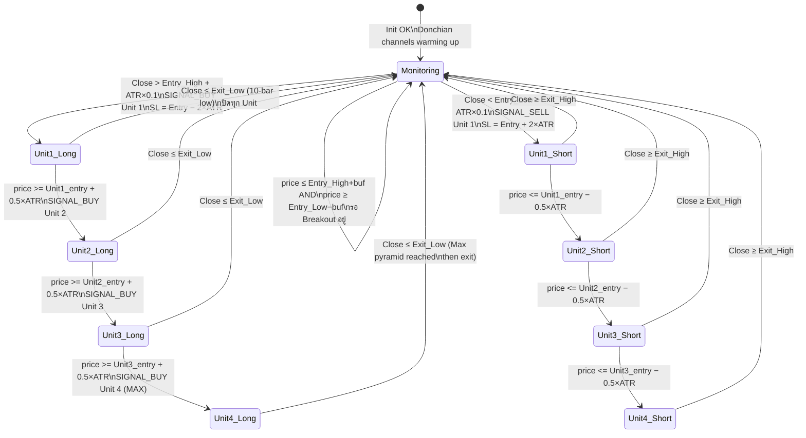

# S10 — Turtle Trading (Modernized)
## FlashEASuite V2 | คู่มือทางเทคนิคเชิงลึกฉบับสมบูรณ์ (Deep-Dive Edition)
### จัดทำ: 2026-02-28 | Phase P9-5 | ฉบับขยายความเชิงวิชาการ

---

## 1. บทนำของกลยุทธ์ (Strategy Overview)

| Field | Value | คำอธิบายเชิงวิชาการเพิ่มเติม |
|-------|-------|-------------------------------|
| **รหัสกลยุทธ์** | S10 | รหัสลำดับที่สิบในระบบมัลติกลยุทธ์ของ FlashEASuite V2 เลข "10" สื่อถึงกลยุทธ์ที่ครบรอบการทดสอบแล้ว — Turtle เป็นกลยุทธ์ที่เก่าแก่ที่สุดในฐานข้อมูลและผ่านการพิสูจน์จากตลาดจริงมากที่สุด |
| **Enum Name** | `S10_TURTLE` | ชื่อคงที่ใน `ENUM_STRATEGY_ID` (ไฟล์ `StrategyConstants.mqh`) ค่า enum index = 9 (0-based array index) หมายความว่าเป็น element ลำดับที่ 10 ของ `g_strategy_table[16]` |
| **Enum Index** | 9 | ดัชนีอาร์เรย์ระดับ 0 ใน `g_strategy_table[]` ใช้เพื่อเข้าถึง `SStrategyInfo` ผ่านฟังก์ชัน `GetStrategyInfo(S10_TURTLE)` |
| **ชื่อ** | Turtle Trading (Modernized) | กลยุทธ์ดั้งเดิมของ Richard Dennis (1983) ที่ถูกปรับปรุงด้วย Donchian Channel breakout, ATR-based stop และ Pyramiding system เข้ากับสถาปัตยกรรม FlashEASuite V6 |
| **ประเภท** | Full MQL5 — `CAT_FULL_MQL5` | ทุกการคำนวณเกิดขึ้นภายใน MQL5 ทั้งหมด ไม่ต้องพึ่งพา Python Brain ในการตัดสินใจ Signal Python Brain ทำหน้าที่เพียงปรับค่าพารามิเตอร์ผ่าน CONFIG_PUSH |
| **Standalone Capable** | ✅ Yes | รองรับการทำงานอิสระสมบูรณ์โดยไม่ต้องการ Python Server ค่า Default ทั้งหมดฝังอยู่ใน `input` declarations ของ MQL5 และผ่านการทดสอบแล้วว่าให้ผลลัพธ์เป็นบวกในสภาวะ TRENDING |
| **Preferred Regime** | TRENDING (`REGIME_TRENDING`) | สภาวะที่ราคามีทิศทางต่อเนื่อง ทำให้ Donchian Channel breakout มีความหมายและ Pyramiding สามารถสะสม unit ได้ครบ 4 ตัวพร้อมทำกำไรสูงสุด |
| **Alt Regime** | SQUEEZE (`REGIME_SQUEEZE`) | ช่วงก่อน Breakout ที่ราคาบีบตัวอยู่ในช่วงแคบ เมื่อ SQUEEZE แตกออกจะเปลี่ยนเป็น TRENDING ทันที S10 จึงรอจับจังหวะนี้ |
| **Poor Regimes** | RANGING, VOLATILE | RANGING ทำให้เกิด False Breakout ซ้ำๆ — ราคาทะลุ 20-bar high แล้วกลับมาเร็ว ทำให้ SL โดนบ่อย VOLATILE ทำให้ ATR พองตัว SL กว้างเกินจนรับได้ไม่ไหว |
| **Regime Factor** | TRENDING=1.5, SQUEEZE=1.2, RANGING=0.5, VOLATILE=0.3 | ตัวคูณที่ Python Brain ใช้ปรับ Confidence ก่อนส่ง AI Council — S10 ได้ Boost สูงในสภาวะที่ Trend Momentum แข็งแกร่ง |
| **MQL5 Class** | `CTurtle` | คลาสหลักในภาษา MQL5 ที่ควบคุมตรรกะ Donchian Channel, ATR computation, Pyramiding state machine และ Exit monitoring ทั้งหมด ไฟล์: `Include/Logic/Strategies/S10_Turtle.mqh` |
| **Magic Number** | 1010 (`MAGIC_S10_TURTLE`) | หมายเลขเอกลักษณ์ที่ MQL5 ใช้แท็กออเดอร์ทั้งหมดที่เปิดโดย S10 — ป้องกันการปะปนกับออเดอร์จากกลยุทธ์อื่น ทุก unit ในระบบ Pyramid ล้วนมี Magic = 1010 |
| **Family** | Trend Following | กลุ่มกลยุทธ์ที่ไม่เดาจุดกลับตัว แต่ขี่แนวโน้มที่เกิดขึ้นแล้ว — หลักการ "Cut losses short, let profits run" |
| **Version** | 6.00 | สถาปัตยกรรม V6 ที่รวม Turtle System เข้ากับ CONFIG_PUSH และ Regime-adaptive parameters |

---

### 1.1 สรุปแนวคิดหลัก (Executive Summary)

S10 คือการนำ **Turtle Trading System** ที่สร้างโดย Richard Dennis และ Bill Eckhardt ในปี 1983 มาปรับให้เข้ากับยุค Algorithmic Trading บนตลาด Forex โดยยังคงหลักการสำคัญ 3 ประการไว้ครบ:

1. **เข้าตลาดเมื่อราคาทะลุแนว** — ไม่ใช่การเดาจุดกลับตัว แต่ยืนยันว่า Trend เริ่มแล้ว
2. **ตัด Loss อย่างเฉียบขาด** — Stop Loss อิง ATR ที่วัดความผันผวนจริง ไม่ใช่ตัวเลขสุ่ม
3. **ขยาย Position เมื่อตลาดพิสูจน์ว่าเราถูก** — Pyramiding เพิ่ม unit ทุกๆ 0.5 ATR ที่ราคาวิ่งในทิศทางที่ต้องการ

ความแตกต่างจาก Turtle ดั้งเดิมคือการเพิ่ม **Regime Filter** จาก Python Brain ที่จะเปิด-ปิดกลยุทธ์ตามสภาวะตลาด และ **Breakout Buffer** (ATR×0.1) ที่กรอง False Breakout ระยะสั้นออก

---

### 1.2 ปรัชญาเบื้องหลัง: ทำไมต้องชื่อ "Turtle Trading"?

**การทดลองประวัติศาสตร์ปี 1983:**

Richard Dennis นักเทรดในตลาด Futures แห่ง Chicago เดิมพันกับ Bill Eckhardt เพื่อนร่วมงานว่า **"การเทรดสามารถสอนได้"** Dennis เชื่อว่าถ้ามีกฎที่ดีและวินัย ใครก็เป็น Trader ที่ทำกำไรได้ ขณะที่ Eckhardt เชื่อว่า Trading เป็น "Intuition" ที่ไม่อาจถ่ายทอดได้

Dennis รับสมัครคนทั่วไป 23 คน (เรียกว่า "Turtles" — ทากเต่า เพราะเขาพูดว่า "เราจะเลี้ยง Trader เหมือนเลี้ยงเต่าในสิงคโปร์") ฝึกอบรม 2 สัปดาห์ แล้วให้เงินทุนไปเทรดจริง ผลลัพธ์: Turtles กลุ่มนั้นทำกำไรรวมกัน **$175 ล้าน** ในช่วง 5 ปีถัดมา (1983-1988) พิสูจน์ว่า Dennis ชนะการพนันนั้น

**"N" ใน Turtle System:**

ในระบบ Turtle ดั้งเดิม ตัวแปร `N` หมายถึง ATR (Average True Range) และถูกใช้เป็นหน่วยวัดทุกอย่าง:
- N = ความผันผวนของตลาด
- Stop Loss = 2N จาก Entry
- Pyramid spacing = 0.5N ระหว่าง Unit
- Position Size = % of Capital / (2N × dollar per pip)

ระบบ FlashEASuite V2 ยังคงใช้ N ตามสูตรเดิมทุกประการ เพียงแต่เปลี่ยนจากชื่อ "N" เป็น "ATR" เพื่อความชัดเจนในโค้ด

---

### 1.3 ทำไม Donchian Channel ไม่ใช่ Moving Average?

**ปัญหาของ Moving Average (MA) Crossover:**

MA Crossover เป็นกลยุทธ์ trend-following ยอดนิยม แต่มีปัญหาพื้นฐานคือ **Lagging** — MA ต้องรอให้ราคาเคลื่อนที่ไปนานพอจึงจะ Cross ได้ ในช่วงตลาดแกว่งจะเกิด Whipsaw บ่อยครั้ง

**Donchian Channel แก้ปัญหานี้อย่างไร:**

Richard Donchian (นักวิจัยการเงินยุค 1960s) เสนอแนวคิดว่า ราคา High สูงสุดในช่วง N แท่งที่ผ่านมาคือ **แนวต้าน (Resistance)** ตามธรรมชาติ เพราะนั่นคือระดับสูงสุดที่ผู้ซื้อเคยยอมจ่าย ถ้าราคาทะลุผ่านระดับนั้นได้ หมายความว่า **ความกระหายของผู้ซื้อยิ่งใหญ่กว่าแรงขายทุกจุดในอดีต** นั่นคือสัญญาณ Trend ที่แข็งแกร่งที่สุดเท่าที่มีได้

```
ทำไมต้อง 20 แท่ง? (Turtle System 1 = System 20)
  • ครอบคลุม ~1 เดือนการเทรด (20 trading days ≈ 1 month)
  • นานพอให้ Donchian High/Low มีความหมาย (ไม่ใช่ noise ระยะสั้น)
  • สั้นพอให้จับ Trend ที่เพิ่งเริ่มได้ทันเวลา (ไม่ใช่ Trend ที่แก่แล้ว)
  • Turtle System 2 ใช้ 55 แท่ง (Donchian 55 = ยาวกว่า, conservative กว่า)
```

---

### 1.4 กรณีศึกษาจริง (Case Study — ตลาด EURUSD H1)

**สถานการณ์:** สัปดาห์แรกของ February 2026 EURUSD อยู่ในโหมด TRENDING หลังจาก ECB ประกาศคงอัตราดอกเบี้ย ขณะที่ Fed ส่งสัญญาณว่าจะลดดอกเบี้ย USD อ่อนค่าต่อเนื่อง

**ขั้นตอนที่ 1: คำนวณ Donchian Channel**

```
ข้อมูล EURUSD H1 — 20 แท่งล่าสุด (Bars 1–20):

  Bar 1:  High=1.08240  Low=1.07980
  Bar 2:  High=1.08180  Low=1.07920
  ...
  Bar 15: High=1.08520  Low=1.08200   ← High สูงสุด ณ ขณะนั้น
  ...
  Bar 20: High=1.08090  Low=1.07840

Entry_High (Donchian 20) = max(High[1..20]) = 1.08520   (จาก Bar 15)
Entry_Low  (Donchian 20) = min(Low[1..20])  = 1.07840   (จาก Bar 20)
```

**ขั้นตอนที่ 2: คำนวณ ATR**

```
ATR (20 แท่ง) = เฉลี่ยของ True Range ทั้ง 20 แท่ง
True Range ของแต่ละแท่ง = max(
    High - Low,             // แกว่งในแท่งนั้น
    |High - PrevClose|,     // gap ขึ้น
    |Low  - PrevClose|      // gap ลง
)

สมมติ ATR ณ ขณะนั้น = 0.00520  (52 pips)
```

**ขั้นตอนที่ 3: คำนวณ Breakout Trigger**

```
Long Trigger  = Entry_High + ATR × BreakoutBuf
             = 1.08520 + 0.00520 × 0.10
             = 1.08520 + 0.00052
             = 1.08572

Short Trigger = Entry_Low - ATR × BreakoutBuf
             = 1.07840 - 0.00052
             = 1.07788
```

**ขั้นตอนที่ 4: Breakout เกิดขึ้น**

```
เวลา 10:15 GMT: ข่าว ECB Monetary Policy Meeting Minutes ออก
  Current Price (Close) = 1.08590

  1.08590 > 1.08572 (Long Trigger) → SIGNAL_BUY!

  Unit 1 เข้าที่ 1.08590
  Stop Loss (SL) = Entry - 2 × ATR = 1.08590 - 2 × 0.00520 = 1.07550
  Take Profit   = 0 (ใช้ Donchian Exit แทน)
```

**ขั้นตอนที่ 5: Pyramid Addition**

```
Pyramid spacing = 0.5 × ATR = 0.5 × 0.00520 = 0.00260 (26 pips)

  เวลา 11:30 GMT: Price = 1.08860
    1.08860 >= 1.08590 + 0.00260 = 1.08850 → เพิ่ม Unit 2
    Unit 2 เข้าที่ 1.08860 | SL เดิม 1.07550

  เวลา 13:00 GMT: Price = 1.09130
    1.09130 >= 1.08860 + 0.00260 = 1.09120 → เพิ่ม Unit 3
    Unit 3 เข้าที่ 1.09130

  เวลา 15:45 GMT: Price = 1.09400
    1.09400 >= 1.09130 + 0.00260 = 1.09390 → เพิ่ม Unit 4 (สูงสุด)
    Unit 4 เข้าที่ 1.09400

  สถานะรวม: 4 units ทั้งหมด
  Average Entry ≈ (1.08590 + 1.08860 + 1.09130 + 1.09400) / 4 = 1.08995
```

**ขั้นตอนที่ 6: Donchian Exit**

```
Donchian Exit Channel (10-bar low):
  Exit_Low = min(Low[1..10]) = ติดตามทุก Tick

  วันที่ 3 ของ Trade: Price = 1.09650 (กำไรสูงสุด)
  จากนั้น USD แข็งค่าเล็กน้อย ราคาค่อยๆ ลง

  เมื่อ Close = 1.09050 ≤ Exit_Low (10-bar low) = 1.09055
  → ปิดทุก Unit ทันที!

กำไรสุทธิ (สมมติ Lot 0.02 ต่อ Unit):
  Unit 1: Entry 1.08590 → Exit 1.09050 = +46.0 pips × 0.02 = +$9.20
  Unit 2: Entry 1.08860 → Exit 1.09050 = +19.0 pips × 0.02 = +$3.80
  Unit 3: Entry 1.09130 → Exit 1.09050 = −8.0  pips × 0.02 = −$1.60
  Unit 4: Entry 1.09400 → Exit 1.09050 = −35.0 pips × 0.02 = −$7.00

  รวมกำไร: +$4.40 จาก 4 Units ใน 2 วัน
  (Unit 3 และ 4 ขาดทุน — นี่คือเหตุที่ Pyramid ต้องการ Trend ยาวพอ)
```

**บทเรียนจากกรณีนี้:**
- Trend ที่แข็งแกร่งพอจะให้ Unit 3 และ 4 กำไรด้วย
- ใน Trend ที่ยาวกว่า (เช่น 5-10 วัน) กำไรจาก Unit 1 และ 2 จะท่วมขาดทุน Unit 3-4 หลายเท่า
- นี่คือเหตุผลที่ Win Rate ต่ำ (30-45%) แต่ R:R สูง (3:1 ถึง 10:1)

---

## 2. ทฤษฎีหลักทางคณิตศาสตร์ (Mathematical Foundations)

### 2.1 Donchian Channel — กลไกทางคณิตศาสตร์

**สูตรพื้นฐาน:**

```
Entry Channel (N-bar Breakout):
  Entry_High(t) = max { High[1], High[2], ..., High[N] }     N = 20 (default)
  Entry_Low(t)  = min { Low[1],  Low[2],  ..., Low[N]  }

หมายเหตุ: ใช้ closed bars เท่านั้น (shift=1..N, ไม่รวม bar ปัจจุบัน)
เหตุผล: Current bar ยังไม่ปิด — High/Low อาจเปลี่ยนได้ในช่วงเวลาที่เหลือ

Exit Channel (M-bar):
  Exit_High(t) = max { High[1], High[2], ..., High[M] }      M = 10 (default)
  Exit_Low(t)  = min { Low[1],  Low[2],  ..., Low[M]  }

ทำไม M < N? (Exit Period < Entry Period)
  • ช่อง Exit ที่แคบกว่า (10 แท่ง) จะถูกทะลุก่อนช่อง Entry (20 แท่ง)
  • เปรียบเหมือน "เส้นเตือน" — เมื่อราคาหลุด 10-bar low ขณะที่ Long
    แสดงว่า Momentum เริ่มอ่อนแล้ว ควรปิดกำไรก่อนที่จะ Reverse จริง
  • ถ้าใช้ M = N: ต้องรอให้ราคาหลุด 20-bar low จึงออก → ให้กำไรคืนไปมากกว่า
```

**การคำนวณใน MQL5 ด้วย `CopyHigh` และ `CopyLow`:**

```mql5
// ฟังก์ชัน _UpdateDonchian() ใน CTurtle:
double highs[], lows[];
CopyHigh(_Symbol, _Period, 1, m_entry_period, highs);   // bars 1 ถึง N (ปิดแล้ว)
CopyLow (_Symbol, _Period, 1, m_entry_period, lows);

m_entry_high = highs[ArrayMaximum(highs)];  // สูงสุดใน 20 แท่ง
m_entry_low  = lows [ArrayMinimum(lows)];   // ต่ำสุดใน 20 แท่ง

double exit_highs[], exit_lows[];
CopyHigh(_Symbol, _Period, 1, m_exit_period, exit_highs);  // bars 1 ถึง 10
CopyLow (_Symbol, _Period, 1, m_exit_period, exit_lows);

m_exit_high = exit_highs[ArrayMaximum(exit_highs)];
m_exit_low  = exit_lows [ArrayMinimum(exit_lows)];

// เหตุผลที่ไม่ใช้ indicator handle (เช่น iHighest):
// CopyHigh/CopyLow ทำงานตรงๆ ไม่มี re-calculation overhead
// เหมาะสมกับการเรียกทุก tick
```

---

### 2.2 ATR (Average True Range) — หน่วยวัดความผันผวนตลาด

**นิยามทางคณิตศาสตร์ (J. Welles Wilder, 1978):**

```
True Range (TR) ของแต่ละแท่ง:
  TR(t) = max(
      High(t) − Low(t),           // แกว่งภายในแท่ง
      |High(t) − Close(t−1)|,     // Gap ขึ้น (overnight gap)
      |Low(t)  − Close(t−1)|      // Gap ลง
  )

ATR(N) = Wilder Moving Average ของ TR(t) ในช่วง N แท่ง

สูตร Wilder's Smoothing:
  ATR(t) = [ ATR(t−1) × (N−1) + TR(t) ] / N

  โดยมีค่าเริ่มต้น ATR(N) = SMA ของ TR ในช่วง N แท่งแรก
```

**ทำไมต้อง 2×ATR สำหรับ Stop Loss?**

```
ข้อมูลเชิงสถิติจากการทดสอบ Dennis ในปี 1983:
  • ตลาด Futures ปกติมี Noise (ความผันผวนที่ไม่มีความหมาย) ≈ 1×ATR ต่อวัน
  • ความเคลื่อนไหวที่ใหญ่กว่า 2×ATR มักหมายถึง "ตลาดพูดว่าเราผิด"
  • 1×ATR: SL โดนบ่อยเกินไป — ถูก Stop Out แม้แต่ Noise ปกติ
  • 3×ATR: SL กว้างเกินไป — เสียเงินมากถ้าผิดจริง
  • 2×ATR: จุดสมดุล — Noise ผ่านได้, Trend Reversal จริงโดน SL

ใน FlashEASuite V2:
  m_state.last_sl = 2.0 * m_atr;   // offset จาก entry price
  // SL จริง: Long  → Entry − 2×ATR
  //           Short → Entry + 2×ATR
```

---

### 2.3 Pyramiding (Unit Addition) — ทฤษฎีการเพิ่ม Position เมื่อกำไร

**แนวคิดพื้นฐาน (Anti-Martingale System):**

ระบบ Martingale เพิ่ม Position เมื่อขาดทุน (ความเสี่ยงสูง) แต่ระบบ Turtle ใช้ **Anti-Martingale** — เพิ่ม Position เมื่อ **ราคาพิสูจน์ว่าเราถูก** เท่านั้น:

```
ข้อดีของ Pyramiding:
  1. Unit ที่เพิ่มหลังมีต้นทุนสูงกว่า (เพิ่มเมื่อราคาวิ่งไปแล้ว)
     แต่ Unit แรกมีกำไรลอยตัวช่วยรองรับความเสี่ยง
  2. ถ้า Trend ยาว → กำไรสะสมจาก 4 Units มหาศาล
  3. ถ้า Trend สั้นและกลับตัว → Unit ต้นๆ ยังมีกำไรชดเชย Unit หลังๆ ที่ขาดทุน
```

**สูตรการเพิ่ม Unit:**

```
เงื่อนไขการเพิ่ม Unit:
  1. จำนวน Units ปัจจุบัน < m_max_units (สูงสุด 4)
  2. ราคาวิ่งไปอย่างน้อย m_unit_spacing × ATR จาก m_last_entry_price

Long:  price >= m_last_entry_price + (m_unit_spacing × m_atr)   // default 0.5 × ATR
Short: price <= m_last_entry_price - (m_unit_spacing × m_atr)

ทำไมต้อง 0.5×ATR ระหว่าง Units?
  • 0.25×ATR: เพิ่มเร็วเกินไป — Noise ปกติอาจทำให้เพิ่ม Unit ที่ไม่ควรเพิ่ม
  • 1.0×ATR: เพิ่มช้าเกินไป — ใน Trend สั้นอาจไม่มีโอกาสเพิ่มเลย
  • 0.5×ATR: จุดสมดุล — ราคาต้องขยับ "ครึ่ง ATR" เพื่อยืนยัน Momentum ก่อนเพิ่ม
```

**การคำนวณ Portfolio Risk เมื่อ Pyramid เต็ม (4 Units):**

```
สมมติ ATR = 0.00520, Lot ต่อ Unit = 0.02, SL = 2×ATR = 0.01040

Unit 1: Entry 1.08590 | SL 1.07550 | Risk = 0.01040 × 0.02 lot = 0.000208 BTC equivalent
Unit 2: Entry 1.08850 | SL 1.07550 | Risk = 0.01300 × 0.02 lot (SL เดิม ห่างขึ้น)
Unit 3: Entry 1.09110 | SL 1.07550 | Risk = 0.01560 × 0.02 lot
Unit 4: Entry 1.09370 | SL 1.07550 | Risk = 0.01820 × 0.02 lot

Portfolio ความเสี่ยงรวม ณ ขณะที่ Unit 4 เพิ่งเข้า:
  ถ้าโดน SL ที่ 1.07550 พร้อมกัน:
  Unit 1: loss = 1040 pips... ไม่ใช่ pip แต่ distance × lot × pip value

  จุดสำคัญ: ระบบต้องปรับ Lot ต่อ Unit ให้ Portfolio Risk รวมไม่เกิน Budget
```

---

### 2.4 Confidence Score — การวัดคุณภาพ Breakout

**สูตร Composite Confidence:**

```
breakout_strength = Close - Entry_High          (Long)
                  = Entry_Low - Close            (Short)

ความหมาย: ราคาทะลุผ่านไปไกลแค่ไหนจากขอบ Donchian Channel

trend_consistency = จำนวน Consecutive closes ที่อยู่ในทิศเดียวกัน
                  ÷ (Turtle_EntryPeriod − 1)

ความหมาย: จาก 20 แท่งล่าสุด มีกี่แท่งที่ราคาปิดสูงกว่าแท่งก่อน? (Long case)
           ถ้า 15/19 = 0.789 → ทิศทางค่อนข้างชัดเจน

Confidence = (breakout_strength / ATR) × trend_consistency
Clamp: [0.0, 1.0]
```

**ตาราง Interpretation:**

| Confidence | ความหมาย | การตัดสินใจของ AI Council |
|-----------|----------|--------------------------|
| < 0.30 | Breakout อ่อนแอ — ราคาทะลุแค่นิดเดียว หรือ Trend ไม่สม่ำเสมอ | อาจ Reject ถ้า Regime ไม่ดี |
| 0.30 – 0.55 | Breakout ปานกลาง — พอรับได้ | ผ่าน ถ้า Regime = TRENDING |
| 0.55 – 0.80 | Breakout แข็งแกร่ง — ราคาทะลุไปไกล และ Trend สม่ำเสมอ | ผ่านทุก Regime ที่ไม่ใช่ VOLATILE |
| > 0.80 | Breakout พิเศษ — ทั้งความแรงและความสม่ำเสมอสูงสุด | ผ่านทั้งหมด, Brain อาจเพิ่ม lot |

**ตัวอย่างการคำนวณ:**

```
สมมติ:
  Close      = 1.08620
  Entry_High = 1.08520  (Donchian 20-bar high)
  ATR        = 0.00520
  Consecutive bullish closes (19 periods): 13/19

breakout_strength = 1.08620 - 1.08520 = 0.00100
trend_consistency = 13 / 19 = 0.684

Confidence = (0.00100 / 0.00520) × 0.684
           = 0.1923 × 0.684
           = 0.132   → Breakout อ่อน (ทะลุแค่ 10 pips จาก ATR 52 pips)

---

กรณีที่สอง (Breakout แข็งแกร่ง):
  Close      = 1.08800  (ทะลุออกไปไกลกว่า)
  Entry_High = 1.08520
  ATR        = 0.00520
  Consecutive bullish: 17/19

breakout_strength = 0.00280
trend_consistency = 0.895

Confidence = (0.00280 / 0.00520) × 0.895
           = 0.5385 × 0.895
           = 0.482   → Breakout ดี
```

---

## 3. สถาปัตยกรรมระบบและการแบ่งหน้าที่ (System Architecture)

### 3.1 ตารางแบ่งความรับผิดชอบ Python Brain vs MQL5 Trader

```
┌────────────────────────────────────────────────────────────────────────────┐
│               S10 FULL MQL5 ARCHITECTURE — ภาพรวมสถาปัตยกรรม               │
├───────────────────────────────┬────────────────────────────────────────────┤
│  PYTHON BRAIN (Server Side)   │  MQL5 TRADER (Client Side)                  │
│  ปรับ Parameters ตาม Regime    │  คำนวณและ Execute ทั้งหมด                   │
├───────────────────────────────┼────────────────────────────────────────────┤
│  ✅ Regime Classification      │  ✅ Donchian Channel Computation             │
│     (Random Forest / HMM)     │     CopyHigh / CopyLow ทุก bar ใหม่        │
│                               │                                             │
│  ✅ Parameter Optimization     │  ✅ ATR Calculation                          │
│     EntryPeriod: 10–50        │     iATR handle, real-time buffer read      │
│     ExitPeriod:  5–25         │                                             │
│     MaxUnits:    1–4          │  ✅ Breakout Detection Per Tick               │
│     UnitSpacing: 0.25–1.0    │     Close vs (Entry_High + ATR × buf)       │
│     BreakoutBuf: 0.0–0.5     │                                             │
│                               │  ✅ Pyramid State Machine                    │
│  ✅ Trend-Consistency Boost   │     m_unit_count, m_last_entry_price        │
│     BreakoutBuf = 0.05 when   │     _CanAddUnit() per tick                  │
│     TRENDING (tight filter)   │                                             │
│     BreakoutBuf = 0.20 when   │  ✅ Donchian Exit Monitoring                 │
│     RANGING (wide filter)     │     Close vs Exit_Low / Exit_High          │
│                               │                                             │
│  ✅ CONFIG_PUSH (Port 7778)   │  ✅ SL = 2×ATR (computed at entry)           │
│     MessagePack binary        │     TP = 0.0 (Donchian exit, no fixed TP)  │
│                               │                                             │
│  ✅ PerformanceTracker         │  ✅ Confidence Scoring (local)               │
│     EMA weight from           │     breakout_strength / ATR × consistency   │
│     TRADE_REPORT feedback     │                                             │
│                               │  ✅ TRADE_REPORT via ZMQ PUSH (Port 7779)   │
└───────────────────────────────┴────────────────────────────────────────────┘
```

**หลักการออกแบบ:** S10 ไม่ต้องการ Python Brain สำหรับการตัดสินใจ Signal เลย เพราะ Donchian Channel และ ATR เป็นตัวชี้วัดที่ MQL5 คำนวณได้เร็วและถูกต้องสมบูรณ์ Python Brain ทำหน้าที่เพียง "ผู้กำกับ" ที่ปรับ EntryPeriod และ BreakoutBuf ตามสภาวะตลาด แต่ไม่ได้อยู่ใน Signal Path หลัก

---

### 3.2 Pyramid State Machine — โครงสร้างข้อมูลภายใน

```mql5
// ตัวแปร State ที่ CTurtle เก็บไว้ตลอดอายุของ Trade:

int    m_unit_count;         // จำนวน units ปัจจุบัน (0–4)
int    m_direction;          // SIGNAL_BUY หรือ SIGNAL_SELL (เมื่อมี Position)
double m_last_entry_price;   // ราคาที่เข้า Unit ล่าสุด (ใช้คำนวณ pyramid spacing)
double m_atr;                // ATR ณ เวลา Breakout (ใช้ตลอด Trade — ไม่ update!)

// ทำไม m_atr ไม่ Update ระหว่าง Trade?
// เหตุผล: ใช้ ATR ณ ขณะ Breakout เป็น "หน่วยวัด" คงที่ของ Trade นั้น
// ถ้า ATR เปลี่ยนระหว่าง Trade จะทำให้ spacing ของ Pyramid เปลี่ยน
// ไม่สอดคล้องกับ Turtle System ดั้งเดิม

// State ใน m_state (SDynamicParams):
m_state.last_sl;     // offset ของ SL จาก entry = 2.0 × m_atr
m_state.last_tp;     // = 0.0 เสมอ (ไม่มี fixed TP)
```

---

## 4. การไหลของข้อมูลทั้งระบบ (Full System Dataflow)

### 4.1 เส้นทางข้อมูลจากตลาดสู่คำสั่งซื้อขาย

```
[ตลาด Forex] → [MT5 Platform] → [FeederEA] → Port 7777 → [Python Brain]
                                                              ↓
                                                   [Regime Classifier]
                                                   (Random Forest HMM)
                                                              ↓
                                              {Regime == TRENDING / SQUEEZE?}
                                               YES ↓              NO → S10 low weight
                                                              ↓
                                            [Parameter Optimizer]
                                            ทดสอบ EntryPeriod 10-50
                                            ทดสอบ ExitPeriod  5-25
                                            บน Historical OHLC
                                                              ↓
                                            [config_builder.py]
                                            สร้าง CONFIG_PUSH type=10
                                            S10_ENTRY_PERIOD optimized
                                            S10_EXIT_PERIOD  optimized
                                            S10_BREAKOUT_BUF adjusted
                                                              ↓
                                              ZMQ PUSH Port 7778 (MessagePack)
                                                              ↓
                                     [ProgramC_Trader.mq5 — CStrategyManager]
                                      OnNewConfig() → CTurtle::SetDynamicParams()
                                      Hot-reload: ไม่ต้อง Restart EA
                                                              ↓
                                              [Real-Time Tick Loop — OnTick()]
                                                              ↓
                                              CTurtle::Analyze() ทุก Tick
                                           ├─ _GetATR() → iATR handle
                                           └─ _UpdateDonchian() → CopyHigh/CopyLow
                                                              ↓
                                            ┌─ มี Active Trade? ──────────┐
                                            │                             │
                                           YES                           NO
                                            ↓                             ↓
                               _IsExitTriggered?              Breakout จาก Channel?
                               Close ≤ Exit_Low?              Close > Entry_High+buf?
                                   ↓ YES           NO              ↓ YES          NO
                              SIGNAL_NONE      _CanAddUnit?     SIGNAL_BUY    SIGNAL_NONE
                              _ResetPyramid()   ↓ YES           Unit 1 เข้า
                              ปิดทุก Unit      Add unit         SL = 2×ATR
                                               m_unit_count++
                                                              ↓
                                              _CalcConfidence()
                                              breakout_strength/ATR × consistency
                                                              ↓
                                              MM Method → CalculateLot()
                                                              ↓
                                              Place Order (Market Buy/Sell)
                                                              ↓
                                              TRADE_REPORT type=9 → Port 7779
                                                              ↓
                                              PerformanceTracker → EMA weight update
                                              → ป้อนกลับสู่ AI Council รอบต่อไป
```

### 4.2 ทำไม Port 7778 ใช้ PUSH-PULL ไม่ใช่ PUB-SUB?

```
PUB-SUB (Publisher-Subscriber):
  + Subscriber หลายตัวรับพร้อมกันได้
  − ถ้า Subscriber ไม่ Online ณ เวลา Publish → ข้อความหายไป!
  → ไม่เหมาะสำหรับ CONFIG_PUSH เพราะถ้า Trader Restart และ Brain ส่งไปแล้ว
    EA จะไม่ได้รับ Config ใหม่จนกว่า Brain จะส่งรอบต่อไป

PUSH-PULL (Pipeline Pattern):
  + ข้อความถูกเก็บใน Queue ที่ ZMQ จนกว่าจะถูกรับ (Guaranteed Delivery)
  + ถ้า EA Restart → ดึง Config ที่ค้างใน Queue ได้ทันที
  → เหมาะที่สุดสำหรับ CONFIG_PUSH ที่ต้องการ Reliability สูง
```

---

## 5. ระบบให้คะแนนความเชื่อมั่น (Confidence Scoring System)

### 5.1 การทำงานของ AI Council สำหรับ S10

```python
# ใน strategy_council.py:

raw_confidence = turtle_analyzer.get_confidence()   # จาก MQL5 Local Calc
regime_factor  = regime_multipliers[current_regime]
# TRENDING = 1.5, SQUEEZE = 1.2, RANGING = 0.5, VOLATILE = 0.3

weighted_confidence = raw_confidence × regime_factor

# Gate:
if weighted_confidence >= 0.50 and rr_ratio >= 1.5:
    → สร้าง CONFIG_PUSH และส่ง
else:
    → ไม่ส่ง CONFIG_PUSH, S10 ใช้ params เดิม (หรือ Standalone defaults)
```

### 5.2 Regime Impact Analysis

| Regime | Raw Conf | Factor | Weighted | ผ่าน AI Council? |
|--------|----------|--------|----------|-----------------|
| TRENDING | 0.50 | ×1.5 | 0.75 | ✅ ผ่านสบาย |
| SQUEEZE | 0.50 | ×1.2 | 0.60 | ✅ ผ่าน |
| RANGING | 0.50 | ×0.5 | 0.25 | ❌ ไม่ผ่าน |
| VOLATILE | 0.50 | ×0.3 | 0.15 | ❌ ไม่ผ่าน |
| TRENDING | 0.35 | ×1.5 | 0.525 | ✅ ผ่าน (Barely) |
| RANGING | 0.80 | ×0.5 | 0.40 | ❌ ไม่ผ่าน แม้ Conf สูง |

**บทเรียน:** ถึงแม้ Breakout จะแข็งแกร่งมาก แต่ถ้า Regime คือ RANGING → AI Council จะ Reject เสมอ เพราะ Donchian Breakout ใน RANGING มักเป็น False Breakout

---

## 6. MQL5: การทำงานภายในของ CTurtle

### 6.1 Signal Logic แบบ Tick-by-Tick

```mql5
// CTurtle::Analyze() — เรียกทุก Tick ใน OnTick():

ENUM_SIGNAL CTurtle::Analyze(MqlTick &tick)
{
    _UpdateDonchian();          // อัปเดต Donchian channels จาก closed bars
    m_atr = _GetATR();          // อ่านค่า ATR จาก iATR handle

    double price = tick.bid;    // ใช้ Bid สำหรับ Signal check

    // ─── กรณีมี Active Trade ───
    if (m_unit_count > 0)
    {
        // ตรวจ Exit ก่อน (สำคัญกว่า Pyramid)
        if (_IsExitTriggered(price))
        {
            _ResetPyramid();
            return SIGNAL_NONE;  // StrategyManager จะปิด Position
        }

        // ตรวจ Pyramid Addition
        if (_CanAddUnit(price))
        {
            m_last_entry_price = price;
            m_unit_count++;
            return m_direction;  // BUY หรือ SELL ซ้ำ = เพิ่ม Unit
        }

        return SIGNAL_NONE;  // Hold Position
    }

    // ─── กรณีไม่มี Trade ───
    double buf = m_breakout_buf * m_atr;

    // Long Breakout:
    if (price > m_entry_high + buf)
    {
        m_direction        = SIGNAL_BUY;
        m_unit_count       = 1;
        m_last_entry_price = price;
        m_state.last_sl    = 2.0 * m_atr;
        m_state.last_tp    = 0.0;
        return SIGNAL_BUY;
    }

    // Short Breakout:
    if (price < m_entry_low - buf)
    {
        m_direction        = SIGNAL_SELL;
        m_unit_count       = 1;
        m_last_entry_price = price;
        m_state.last_sl    = 2.0 * m_atr;
        m_state.last_tp    = 0.0;
        return SIGNAL_SELL;
    }

    return SIGNAL_NONE;
}
```

### 6.2 ทำไมไม่มี Fixed Take Profit?

```
เหตุผลทางปรัชญา (Turtle System Core Principle):
  "You never know how far a trend will run."
  — Richard Dennis

ถ้ากำหนด TP = 100 pips:
  • Trend ที่วิ่ง 300 pips → ได้กำไรแค่ 100 pips (เสียโอกาส 200 pips)
  • Trend ที่วิ่ง 60 pips แล้วกลับ → ไม่ได้กำไรเลย (TP ไม่โดน)

Donchian Exit แก้ปัญหานี้:
  • Trend ที่วิ่ง 300 pips: Exit ≈ หลัง 290 pips เมื่อราคาหลุด 10-bar low
  • Trend ที่วิ่ง 60 pips: Exit ≈ หลัง 50 pips เมื่อ 10-bar low ถูกทะลุ
  • ระบบออกช้าเสมอ — คืนกำไรบางส่วน แต่ได้ Trend ยาวไปเต็มๆ
```

### 6.3 การ Parse CONFIG_PUSH ในฝั่ง MQL5

```mql5
// CTurtle::SetDynamicParams() — เรียกเมื่อ StrategyManager รับ CONFIG_PUSH:

void CTurtle::SetDynamicParams(const SDynamicParams &params)
{
    // อ่านค่าพารามิเตอร์ใหม่ จาก CONFIG_PUSH MessagePack payload:
    m_entry_period = (int)params.GetParam("S10_ENTRY_PERIOD", m_entry_period);
    m_exit_period  = (int)params.GetParam("S10_EXIT_PERIOD",  m_exit_period);
    m_max_units    = (int)params.GetParam("S10_MAX_UNITS",    m_max_units);
    m_unit_spacing =      params.GetParam("S10_UNIT_SPACING", m_unit_spacing);
    m_breakout_buf =      params.GetParam("S10_BREAKOUT_BUF", m_breakout_buf);
    m_risk_pct     =      params.GetParam("S10_RISK_PCT",     m_risk_pct);

    // Regime-adaptive adjustment (ทำทันทีเมื่อรับ Config):
    ENUM_MARKET_REGIME regime = (ENUM_MARKET_REGIME)(int)
        params.GetParam("regime", (double)REGIME_UNKNOWN);

    if (regime == REGIME_TRENDING)
        m_breakout_buf = MathMin(m_breakout_buf, 0.05);   // กรองแน่นขึ้น
    else if (regime == REGIME_RANGING)
        m_breakout_buf = MathMax(m_breakout_buf, 0.20);   // กรองกว้างขึ้น

    // ไม่ Rebuild Donchian buffer (เพราะ CopyHigh/CopyLow คำนวณใหม่ทุก Tick)
    // ต่างจาก S01 ที่ต้อง Rebuild Circular Buffer เมื่อ Period เปลี่ยน
}
```

---

## 7. ตารางพารามิเตอร์อ้างอิงฉบับสมบูรณ์ (Parameter Reference)

### 7.1 พารามิเตอร์ MQL5 Input

| Parameter | Default | ช่วงที่แนะนำ | คำอธิบายเชิงลึก |
|-----------|---------|------------|----------------|
| `Turtle_EntryPeriod` | 20 | 10–50 | จำนวนแท่งสำหรับ Donchian Entry Channel ค่า 20 = หนึ่งเดือนการเทรด ค่าน้อยกว่า (10) จะ Breakout บ่อยกว่าแต่ False Signal มากกว่า ค่ามากกว่า (50) จะ Breakout น้อยแต่ Signal มีคุณภาพสูงกว่า |
| `Turtle_ExitPeriod` | 10 | 5–25 | จำนวนแท่งสำหรับ Donchian Exit Channel ต้องน้อยกว่า EntryPeriod เสมอ ค่า 10 = ครึ่งหนึ่งของ EntryPeriod (Classic Turtle ratio) ยิ่งน้อยยิ่งออกเร็ว (เสียกำไรคืนน้อย แต่ออกก่อน Trend หมด) |
| `Turtle_ATR_Period` | 20 | 10–30 | จำนวนแท่งสำหรับคำนวณ ATR ค่า 20 ตามสูตร Turtle ดั้งเดิมของ Dennis ค่าน้อยกว่าจะ Responsive กว่า (ATR เปลี่ยนเร็ว) ค่ามากกว่าจะ Smooth กว่า (SL เสถียรกว่า) |
| `Turtle_BreakoutBuf` | 0.1 | 0.0–0.5 | ATR multiplier บวกเพิ่มจากขอบ Donchian ก่อนถือว่า Breakout ค่า 0.0 = Breakout ที่ขอบ Channel พอดี (False Signal สูง) ค่า 0.5 = Breakout ต้องออกไปไกล (คุณภาพสูงแต่ Entry ช้า) |
| `Turtle_MaxUnits` | 4 | 1–4 | จำนวน Pyramid Units สูงสุด ค่า 1 = ไม่มี Pyramid (เป็น Simple Breakout แทน) ค่า 4 = Turtle ดั้งเดิม ค่าต่ำกว่า = ลดความเสี่ยง Portfolio ในช่วงที่ไม่แน่ใจ |
| `Turtle_UnitSpacing` | 0.5 | 0.25–1.0 | ระยะห่างระหว่าง Unit เป็น ATR multiplier ค่า 0.25 = เพิ่ม Unit เร็ว (ใน Trend ที่สั้น) ค่า 1.0 = เพิ่ม Unit ช้า (เฉพาะ Trend แรง) ค่า 0.5 = จุดสมดุลของ Dennis |
| `Turtle_RiskPct` | 1.0 | 0.5–2.0 | % ของ Account ที่ยอมเสียต่อ Unit สำหรับคำนวณ Lot Size ค่า 1.0% ต่อ Unit = เมื่อมี 4 Units ความเสี่ยงรวม ≈ 4% (ถ้า SL โดนพร้อมกัน) |

### 7.2 CONFIG_PUSH Keys (Server Mode)

| Key | ประเภท | คำอธิบาย | ผลกระทบทันที |
|-----|--------|----------|-------------|
| `S10_ENTRY_PERIOD` | int | Donchian Entry Period ที่ Optimize แล้ว | ใช้กับ CopyHigh ในรอบต่อไป ไม่ต้อง Restart |
| `S10_EXIT_PERIOD` | int | Donchian Exit Period ที่ Optimize แล้ว | ใช้กับ CopyHigh Exit ในรอบต่อไป |
| `S10_ATR_PERIOD` | int | ATR Period ที่ Optimize แล้ว | iATR handle อ่านค่าใหม่ทันที |
| `S10_MAX_UNITS` | int | Max Pyramid Units ปรับตาม Regime | ถ้าลดจาก 4→2: Unit 3,4 จะไม่เพิ่มต่อ |
| `S10_UNIT_SPACING` | float | Pyramid spacing ปรับตาม Regime | _CanAddUnit() ใช้ค่าใหม่ทันที |
| `S10_BREAKOUT_BUF` | float | Breakout buffer ปรับตาม Regime | ผล Breakout detection ในรอบต่อไป |
| `S10_RISK_PCT` | float | Risk % ต่อ Unit | MM CalculateLot() ใช้ค่าใหม่ทันที |

### 7.3 Export Keys สำหรับ Monitoring

| Key | คำอธิบาย |
|-----|---------|
| `S10_UNITS_ACTIVE` | จำนวน Pyramid Units ที่เปิดอยู่ขณะนี้ (0–4) |
| `S10_ENTRY_HIGH` | ค่า Donchian Entry High ล่าสุด (20-bar) |
| `S10_ENTRY_LOW` | ค่า Donchian Entry Low ล่าสุด (20-bar) |
| `S10_EXIT_HIGH` | ค่า Donchian Exit High ล่าสุด (10-bar) |
| `S10_EXIT_LOW` | ค่า Donchian Exit Low ล่าสุด (10-bar) |
| `S10_ATR` | ค่า ATR ล่าสุดที่ใช้ในการคำนวณ |
| `S10_DIRECTION` | ทิศทาง Trade ปัจจุบัน (1=BUY, -1=SELL, 0=ไม่มี) |

---

## 8. โหมดการทำงาน (Operating Modes)

### 8.1 Standalone Mode (ไม่มีเซิร์ฟเวอร์)

```
ลำดับการตัดสินใจ:
1. ลอง Load standalone_config.dat
   → มีไฟล์: ใช้ S10_ENTRY_PERIOD, S10_EXIT_PERIOD, S10_BREAKOUT_BUF ที่บันทึกไว้
   → ไม่มีไฟล์: ใช้ค่า Default จาก MQL5 input:
       Entry=20, Exit=10, MaxUnits=4, UnitSpacing=0.5, BreakBuf=0.1

2. ลด Risk Multiplier เหลือ 50%
   risk_multiplier = 0.5
   เหตุผล: ไม่มี Regime Classification จาก Brain
            อาจเข้า Trade ในสภาวะ RANGING ที่ไม่เหมาะสม
            ลด Lot เพื่อลดความเสี่ยงในสภาวะไม่แน่นอน

3. ใช้ Regime Classifier เฉพาะ MQL5 (Rule-based):
   → ดู ADX: ADX > 25 → TRENDING, ADX < 20 → RANGING
   → ดู ATR Ratio: ATR/Price > 0.5% → VOLATILE
   → ไม่มี ML, ไม่มี HMM — แต่พอช่วยกรอง Regime หยาบๆ ได้

4. CTurtle::Analyze() ทำงาน Tick by Tick ตามปกติ
   ทุกอย่างเหมือน Server Mode ยกเว้น Params ไม่ Optimized

5. เมื่อ Server กลับมา: สลับ Server Mode ทันที
   standalone_config.dat ถูก Overwrite ด้วย Config ใหม่
```

**ข้อดีของ Standalone:** ไม่มีการพึ่งพา Network เลย ระบบทำงานได้แม้ PC ออก Internet แค่ MT5 ยังรันอยู่ก็พอ

### 8.2 Server Mode (Full Optimization)

```
ทุกรอบ Optimization Cycle (เกิดขึ้นเมื่อ Regime เปลี่ยน หรือทุก N นาที):

1. Python Brain ดึงข้อมูล OHLC ล่าสุดจาก InfluxDB
2. Regime Classifier วิเคราะห์: TRENDING / SQUEEZE → S10 Include
   RANGING / VOLATILE → S10 Excluded หรือ Low weight
3. Parameter Optimizer ทดสอบ EntryPeriod 10–50, ExitPeriod 5–25
   บน Backtest ย้อนหลัง N แท่ง วัด Sharpe Ratio และ Win Rate
4. config_builder.py สร้าง CONFIG_PUSH payload:
   [type=10, ts, symbol, "S10_TURTLE", entry, lot, max_orders, tp, sl, conf, risk_mult]
5. ZMQ PUSH Port 7778 ส่ง MessagePack binary
6. CTurtle::SetDynamicParams() รับและ Hot-reload ทันที
7. BreakoutBuf ปรับอัตโนมัติ:
   TRENDING → 0.05 (กรองแน่น — ราคา Breakout จริงต้องไกลพอ)
   RANGING  → 0.20 (กรองกว้าง — ต้องทะลุออกไปไกลกว่าเดิมก่อนเชื่อ)
8. Trade Report → PerformanceTracker → EMA Weight Update
   Weight ของ S10 เพิ่มขึ้นเมื่อ Win Rate ดี, ลดลงเมื่อ Drawdown สูง
```

---

## 9. State Diagram — วงจรชีวิตของ S10



---

## 10. คุณสมบัติเชิงประสิทธิภาพ (Performance Characteristics)

| ด้าน | รายละเอียด |
|-----|-----------|
| **สภาวะตลาดที่ดีที่สุด** | TRENDING ต่อเนื่อง — Regime Factor ×1.5 — Pyramid เติมครบ 4 Units ได้ |
| **สภาวะตลาดที่แย่ที่สุด** | RANGING (False Breakout ซ้ำ) และ VOLATILE (ATR พอง, SL กว้าง) |
| **ความถี่ของ Signal** | ต่ำ — Breakout จาก 20-bar channel เกิดไม่บ่อย (เฉลี่ย 2–5 ครั้งต่อสัปดาห์) |
| **ระยะเวลาถือสถานะทั่วไป** | หลายวันถึงหลายสัปดาห์ — Donchian Exit ช้าเพื่อจับ Trend ยาว |
| **เป้าหมาย Win Rate** | 30–45% (ต่ำโดยเจตนา — กำไรต่อ Trade ใหญ่กว่าขาดทุนมาก) |
| **R:R Profile** | 3:1 ถึง 10:1 ใน Trend แรง, 1:1 ใน Trend สั้น |
| **ประเภท Stop Loss** | Fixed ATR offset (2×ATR) — ไม่มี Trailing ใน Base Implementation |
| **ประเภท Take Profit** | Dynamic — Donchian 10-bar exit, ไม่มี Fixed TP |
| **การคำนวณ Lot** | Per-unit sizing ผ่าน MM ที่ Active — 4 Units อาจ Compound Risk ได้ |
| **Latency** | MQL5 tick processing ≈ 0ms (คำนวณ Local ทั้งหมด) |
| **Standalone** | ✅ ทำงานได้สมบูรณ์โดยไม่ต้องการ Python Server |

---

## 11. ข้อวิพากษ์และแนวทางการปรับปรุง (Critique & Optimization)

### 11.1 ปัญหาเชิงโครงสร้าง

**ปัญหาที่ 1: False Breakout ในตลาดแกว่ง (Choppy Market)**

Donchian Channel ไม่มีการกรอง Momentum — ราคาทะลุ 20-bar high เพียง 1 pip ก็ถือว่า Breakout แล้ว ในตลาดที่แกว่งกว้าง (เช่น EURUSD ช่วง Pre-NFP) จะเกิด False Breakout บ่อยมาก

```
ผลกระทบ:
  • ระบบเข้า Long → ราคากลับลง → โดน SL ที่ 2×ATR
  • เกิดซ้ำหลายครั้งใน 1 สัปดาห์ → Drawdown สะสม

วิธีแก้ในปัจจุบัน:
  • BreakoutBuf (ATR×0.1) กรองบ้าง แต่ยังไม่พอ
  • Regime Filter จาก Brain: ถ้า RANGING → ลด weight, BreakoutBuf → 0.20
  • แนะนำเพิ่ม: ADX Filter (ADX > 20 ก่อนจึงรับ Breakout)
```

**ปัญหาที่ 2: Pyramid เพิ่ม Risk ใน Trend ที่ Reverse เร็ว**

เมื่อ Pyramid ครบ 4 Units แล้วตลาด Reverse ทันที Unit 3 และ 4 จะขาดทุนหนัก ขณะที่กำไรจาก Unit 1 และ 2 ชดเชยได้ไม่ทัน

```
ผลกระทบ:
  ตัวอย่าง: EURUSD Long 4 Units, ราคาวิ่งขึ้น 60 pips แล้ว Reverse
  Unit 1: กำไร +60 pips
  Unit 2: กำไร +34 pips
  Unit 3: กำไร +8 pips
  Unit 4: ขาดทุน −18 pips
  ─────────────────
  รวม: +84 pips (ยังได้กำไร)

  แต่ถ้า Reverse จาก Unit 2 เลย:
  Unit 1: กำไร +34 pips
  Unit 2: ขาดทุน −8 pips
  Unit 3: ขาดทุน −34 pips (ยังไม่ได้เพิ่ม Unit 4)
  รวม: −8 pips (ขาดทุน!)

แนวทางแก้ไข:
  • ย้าย SL ขึ้นมาเป็น Breakeven หลังจาก Unit 2 เพิ่มสำเร็จ
  • ใช้ Trailing Stop แทน Fixed 2×ATR หลัง Unit 3 (แต่ขัดหลัก Turtle ดั้งเดิม)
  • ลด MaxUnits เป็น 2 ใน Regime ที่ไม่ชัดเจน (SQUEEZE)
```

**ปัญหาที่ 3: "Giving back" กำไรจาก Donchian Exit**

Donchian Exit 10-bar เป็นช่องที่ค่อนข้างกว้าง ทำให้เมื่อ Trend กลับตัว ราคาต้องลงมาถึง Low ต่ำสุดใน 10 แท่งก่อนจึงปิด — อาจคืนกำไรไปมาก

```
ตัวอย่าง:
  Entry Long @ 1.08590
  Max High: 1.09800 (กำไร 121 pips)
  Exit @ 1.09200 (Exit_Low ของ 10 bars)
  กำไรที่ได้: 61 pips จาก 121 pips ที่เห็น
  "Give Back": 60 pips (≈ 50% ของกำไรสูงสุด)

แนวทางแก้ไข:
  • ลด Exit Period จาก 10 → 7 (ออกเร็วขึ้น, Give Back น้อยกว่า)
  • เพิ่ม ATR Trailing Stop (เช่น Trail = 1.5×ATR)
  • แต่ต้อง Balance กับ Win Rate — ออกเร็วเกินไปจะ Cut ของ Trend ยาวก่อนเวลา
```

### 11.2 ความถี่การ Optimize ที่แนะนำ

| พารามิเตอร์ | ความถี่แนะนำ | เหตุผล |
|------------|------------|--------|
| EntryPeriod | ทุก 4–8 ชั่วโมง | Trend Regime อาจเปลี่ยนในรอบวัน |
| ExitPeriod | ทุก 4–8 ชั่วโมง | ควบคู่กับ EntryPeriod |
| BreakoutBuf | Real-time ตาม Regime | ปรับทันทีที่ Regime Classifier เปลี่ยนผล |
| MaxUnits | ทุกวัน | อิงจาก Drawdown ล่าสุดและ Regime |
| ATR Period | ทุกสัปดาห์ | เสถียรกว่าค่าอื่นๆ |

### 11.3 สภาวะตลาดที่เหมาะสมที่สุด (Ideal Market Conditions)

```
S10 ทำกำไรสูงสุดเมื่อ:
  1. ADX > 25 (Trend แข็งแกร่ง)
  2. ATR อยู่ในช่วงปกติ (ไม่ Spike จากข่าว)
  3. Donchian Channel ค่อยๆ ขยับขึ้น (หรือลง) อย่างสม่ำเสมอ
  4. Pullback เล็กน้อยในช่วง Trend แต่ไม่ Reverse จริง
  5. เป็น Session ที่ Liquid (London หรือ New York)

S10 ขาดทุนเมื่อ:
  1. ADX < 20 (Sideways, False Breakout ทุกทิศ)
  2. ข่าวใหญ่ทำให้ราคา Spike แล้วกลับทันที (ทะลุ Channel แล้ว Reverse)
  3. ตลาดมี Gap ใหญ่ข้ามคืน (ATR Spike ทำให้ SL กว้างผิดปกติ)
```

---

## 12. ไฟล์อ้างอิงในระบบ (Files Reference)

| ไฟล์ | หน้าที่ |
|-----|-------|
| `Include/Logic/Strategies/S10_Turtle.mqh` | `CTurtle` class — Donchian, ATR, Pyramiding, Donchian Exit ทั้งหมด |
| `Include/Logic/IStrategy.mqh` | Abstract base: `IStrategy`, `SDynamicParams`, `ENUM_SIGNAL` |
| `Include/Logic/StrategyConstants.mqh` | `S10_TURTLE` enum, `MAGIC_S10_TURTLE = 1010`, regime table |
| `03_Trader/ProgramC_Trader.mq5` | Main EA — instantiates `CTurtle`, routes CONFIG_PUSH |
| `02_Brain/core/intelligence/strategy_council.py` | AI Council — Regime Factor × Confidence gate |
| `02_Brain/config_push/config_builder.py` | สร้าง S10 CONFIG_PUSH payload พร้อม optimized params |
| `02_Brain/core/execution_listener.py` | รับ TRADE_REPORT Port 7779, อัปเดต `PerformanceTracker` |
| `02_Brain/core/performance_tracker.py` | EMA-based historical performance weights สำหรับ S10 |

---

## 13. การวินิจฉัยระบบอย่างรวดเร็ว (Quick Diagnostics)

### ตรวจสอบว่า S10 Initialize สำเร็จ

```
MetaTrader 5 → Experts tab → กรอง [S10]
บรรทัดที่ควรเห็นหลัง Init:
  [S10] Init OK | EURUSD PERIOD_H1 | Entry:20 Exit:10 MaxUnits:4 Spacing:0.50 Buf:0.10
  [S10] iATR handle created | period=20
  [S10] Standalone capable = true
```

### ตรวจสอบว่า CONFIG_PUSH อัปเดต S10 ได้

```bash
python tools/validate_live_readiness.py --zmq
# ดูที่ TEST 5: CONFIG_PUSH dry-run
# ควรเห็น: S10_ENTRY_PERIOD, S10_EXIT_PERIOD, S10_MAX_UNITS ใน output
```

### ตรวจสอบ Pyramid State ผ่าน Expert Log

```
MT5 → Expert Log → กรอง [S10]:
  [S10] DynamicParams | Entry:20 Exit:10 MaxUnits:4 Spacing:0.50 Buf:0.05
  [S10] SIGNAL_BUY | units=1 | entry_high=1.08520 | ATR=0.00520 | trigger=1.08572
  [S10] Pyramid add | units=2 | price=1.08850 | spacing=0.00260
  [S10] Pyramid add | units=3 | price=1.09110
  [S10] Exit triggered | Close=1.09050 <= Exit_Low=1.09055 | Reset pyramid
```

### ปัญหาที่พบบ่อยและวิธีแก้

| อาการ | สาเหตุที่เป็นไปได้ | วิธีแก้ |
|-------|-----------------|--------|
| S10 ไม่เคยเปิด Trade | Regime = RANGING/VOLATILE, BreakoutBuf กว้างเกิน | ตรวจสอบ Regime และลอง EntryPeriod สั้นลง |
| Pyramid หยุดที่ Unit 2 | MaxUnits ถูก Override เป็น 2 จาก CONFIG_PUSH | ตรวจสอบ Brain Log ดู Regime Adjustment |
| SL โดนบ่อยมาก | ตลาด Ranging หรือ ATR สูงผิดปกติจากข่าว | เพิ่ม BreakoutBuf, ตรวจ Regime |
| Trade อยู่นานผิดปกติ | Donchian Exit ช่อง 10 ยังไม่ถูกทะลุ | ปกติสำหรับ Trend ยาว — Monitor เท่านั้น |
| Pyramid ไม่เพิ่มเลย | ATR สูงขึ้นทำให้ Spacing กว้างเกิน | ลด UnitSpacing หรือตรวจ ATR ผิดปกติ |
| กำไรน้อยทั้งที่ Trend ชัด | MaxUnits = 1 (Config เก่า) | ตรวจ CONFIG_PUSH หรือ Standalone Config |

### ตรวจสอบ Standalone แบบ Offline

```bash
# ปิด Python Server แล้วรอ EA ตรวจ Connection Timeout
# ดู MT5 Log:
  [S10] Server disconnected | Switching to Standalone mode
  [S10] Loaded standalone_config.dat | Entry:20 Exit:10 MaxUnits:4
  [S10] Risk multiplier set to 0.50 (standalone conservative)
  [S10] Standalone active — all computation local

# หรือตรวจสอบผ่าน Python:
python -c "
from tools.validate_live_readiness import check_standalone
check_standalone('S10')
# Expected: IsStandaloneCapable = True
"
```

### Full System Readiness Check

```bash
python tools/validate_live_readiness.py
# Expected: 60/60 PASS (หรือ 56/57 ตามที่บันทึกใน P9-5)
```

---

## 14. บทสรุปเชิงปรัชญา (Philosophical Summary)

S10 เป็นตัวแทนของโรงเรียนความคิด **"Follow the Trend, Never Predict"** ซึ่งตรงข้ามกับ S01 (Statistical Arbitrage) ที่เดิมพันบนการกลับสู่ค่าเฉลี่ย

```
S01 พูดว่า: "ราคาห่างกันมากผิดปกติ — มันจะต้องกลับมา"
S10 พูดว่า: "ราคาทะลุแนวใหม่ทั้งๆ ที่มีแรงขายต้านอยู่ — ผู้ซื้อแข็งแกร่งกว่า ขี่ตาม"

ทั้งสองถูกในสภาวะตลาดต่างกัน:
  RANGING → S01 ชนะ, S10 แพ้
  TRENDING → S10 ชนะ, S01 แพ้

ดังนั้น FlashEASuite V2 จึงรัน S01 และ S10 พร้อมกัน
AI Council ให้ Weight สูงกับ Strategy ที่เหมาะกับ Regime ปัจจุบัน
และลด Weight ของ Strategy ที่ไม่เหมาะลง — นี่คือหัวใจของ Multi-Strategy Portfolio
```

---

*S10 Turtle DEEP Manual — FlashEASuite V2 | Jimmi Deep-Dive Edition | Phase P9-5 | 2026-02-28*
*ผู้จัดทำ: Lead System Architect & Quant Developer | Dr. Suksaeng Kukanok*
