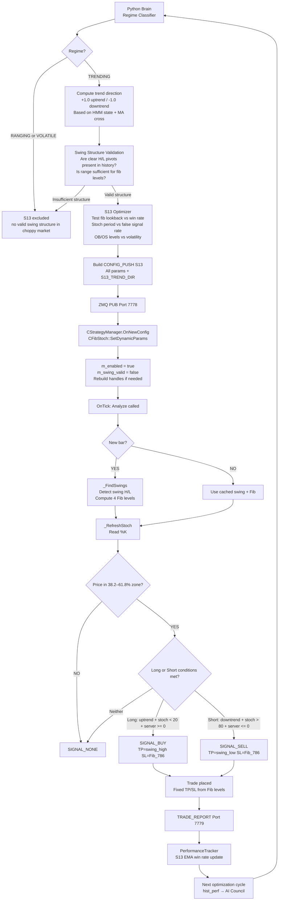
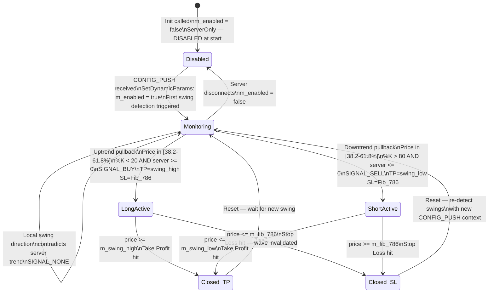

# S13 — Fibonacci + Stochastic
## FlashEASuite V2 | Strategy Deep Dive Manual
### Generated: 2026-02-26 | Phase P9-5

---

## 1. Strategy Overview

| Field | Value |
|-------|-------|
| **Strategy ID** | S13 |
| **Name** | Fibonacci Retracement + Stochastic Oscillator |
| **Type** | Full MQL5 — Server Only |
| **Standalone Capable** | No |
| **Magic Number** | 1013 |
| **MQL5 Class** | `CFibStoch` (`Include/Logic/Strategies/S13_FibStoch.mqh`) |
| **Preferred Regime** | TRENDING (clear swing structure needed) |
| **Poor Regimes** | VOLATILE (no clean swings), RANGING (no swing High/Low) |
| **Strategy Family** | Counter-Trend Retracement — Pullback Trading |

### สรุปแนวคิด (Thai)

S13 ใช้การผสมผสาน **Fibonacci Retracement** กับ **Stochastic Oscillator** เพื่อจับจังหวะ **Pullback** ในแนวโน้มหลัก:

1. ตรวจหา **Swing High** และ **Swing Low** ที่ชัดเจนในช่วง 100 แท่งที่ผ่านมา
2. คำนวณ **Fibonacci Levels** — โซนเข้า: 38.2%–61.8%, SL: 78.6%, TP: Swing High/Low
3. รอให้ราคา **pullback** เข้าสู่โซน Fibonacci (38.2%–61.8%)
4. ยืนยันด้วย **Stochastic** — Long เมื่อ %K < 20 (Oversold), Short เมื่อ %K > 80 (Overbought)
5. รับ **m_server_trend** จาก Python Brain ผ่าน `SetDynamicParams` เพื่อยืนยันทิศทางหลัก

กลยุทธ์นี้เป็น **ServerOnly** — จะไม่ทำงานจนกว่าจะได้รับ CONFIG_PUSH จาก Python Brain โดย `m_enabled = false` ที่ Init

---

## 2. Core Theory

### 2.1 Swing Detection

```
Lookback: m_fib_lookback bars (default=100) + m_swing_min_bars×2 padding

Algorithm: Local Extrema over sliding window of ±m_swing_min_bars (default 5):

  For each bar i in range [swing_min_bars .. lookback - swing_min_bars]:

    Swing High candidate: bar[i].High is the LARGEST in bars [i-5 .. i+5]
    Swing Low  candidate: bar[i].Low  is the SMALLEST in bars [i-5 .. i+5]

  Among all candidates, select:
    m_swing_high = highest of all swing high candidates
    m_swing_low  = lowest  of all swing low  candidates

  Trend Direction:
    m_is_uptrend = (low_bar_index > high_bar_index)
    // Swing Low appears FURTHER BACK in time (higher index in series array)
    // meaning price moved Low → High = uptrend; now pulling back
    // m_is_uptrend = false: price moved High → Low = downtrend
```

### 2.2 Fibonacci Retracement Levels

```
Range = m_swing_high - m_swing_low

If m_is_uptrend (price moved Low → High, now retracing DOWN):
  // Retracement measured from High downward:
  Fib_38.2% = m_swing_high - Range × 0.382   ← inner entry boundary
  Fib_50.0% = m_swing_high - Range × 0.500   ← mid-zone reference
  Fib_61.8% = m_swing_high - Range × 0.618   ← outer entry boundary (Golden Ratio)
  Fib_78.6% = m_swing_high - Range × 0.786   ← SL level (invalidation point)

If !m_is_uptrend (price moved High → Low, now retracing UP):
  // Retracement measured from Low upward:
  Fib_38.2% = m_swing_low + Range × 0.382
  Fib_50.0% = m_swing_low + Range × 0.500
  Fib_61.8% = m_swing_low + Range × 0.618
  Fib_78.6% = m_swing_low + Range × 0.786

Entry Zone:
  lo = min(Fib_38.2%, Fib_61.8%)
  hi = max(Fib_38.2%, Fib_61.8%)
  Price must satisfy: lo <= price <= hi
```

### 2.3 Fibonacci Level Significance

| Level | Ratio | Significance |
|-------|-------|-------------|
| 38.2% | 0.382 | First retracement zone — shallow pullback (strong trend) |
| 50.0% | 0.500 | Psychological mid-point — not a true Fibonacci ratio |
| 61.8% | 0.618 | Golden Ratio — deepest valid entry zone |
| 78.6% | 0.786 | Stop Loss level — break here invalidates the wave structure |

### 2.4 Stochastic Oscillator

```
Stochastic(%K=14, %D=3, Slowing=3, Mode=SMA, Price=Low/High):

  %K (fast line) = 100 × (Close - Lowest_Low_14) / (Highest_High_14 - Lowest_Low_14)
  %D (slow line) = SMA(%K, 3)

Entry Thresholds:
  Long  entry: %K < m_stoch_oversold  (default 20) → Oversold in pullback zone
  Short entry: %K > m_stoch_overbought (default 80) → Overbought in pullback zone

Indicator handle: iStochastic(symbol, tf, 14, 3, 3, MODE_SMA, STO_LOWHIGH)
```

### 2.5 Server Trend Context

```
m_server_trend (double):
  Received from Python Brain via SetDynamicParams (key: "S13_TREND_DIR")
  +1.0 = Python confirms uptrend
  -1.0 = Python confirms downtrend
   0.0 = Neutral / not set (strategy remains disabled)

Usage in entry logic:
  Long:  m_is_uptrend == true  AND m_server_trend >= 0  (server agrees: up)
  Short: m_is_uptrend == false AND m_server_trend <= 0  (server agrees: down)

// If server_trend contradicts local swing direction → NO trade
// This prevents counter-trend trades when macro regime disagrees
```

### 2.6 Entry and Exit Rules

```
Long Entry (ALL required):
  1. m_is_uptrend == true                         (local swing: Low → High)
  2. price in [Fib_38.2% .. Fib_61.8%]           (price inside retracement zone)
  3. Stoch %K < m_stoch_oversold (20)             (momentum confirms oversold)
  4. m_server_trend >= 0                           (Python confirms uptrend)

  TP = m_swing_high                               (target: return to swing high)
  SL = m_fib_786                                  (stop: 78.6% invalidation level)

Short Entry (ALL required):
  1. m_is_uptrend == false                        (local swing: High → Low)
  2. price in [Fib_38.2% .. Fib_61.8%]           (price inside retracement zone)
  3. Stoch %K > m_stoch_overbought (80)           (momentum confirms overbought)
  4. m_server_trend <= 0                           (Python confirms downtrend)

  TP = m_swing_low                                (target: return to swing low)
  SL = m_fib_786                                  (stop: 78.6% invalidation level)

Exit:
  Fixed TP/SL prices returned by GetTakeProfit() and GetStopLoss()
  StrategyManager places limit/stop orders at these levels on entry
```

### 2.7 Confidence Score

```
fib_accuracy   = 1.0 - min(|price - Fib_61.8%| / range, 1.0)
  // Closer to 61.8% Golden Ratio = higher accuracy
  // range = |Fib_38.2% - Fib_61.8%|

stoch_extremity:
  if %K <= m_stoch_oversold (20):
    stoch_ext = 1.0 - (%K / m_stoch_oversold)           // deeper oversold = higher ext
    // e.g.: %K=5 → ext = 1.0 - (5/20) = 0.75
  if %K >= m_stoch_overbought (80):
    stoch_ext = (%K - m_stoch_overbought) / (100 - m_stoch_overbought)
    // e.g.: %K=95 → ext = (95-80)/(100-80) = 0.75

trend_strength = |m_server_trend|
  // Normalized absolute value of server trend (0.0–1.0 or ±1.0)

Confidence = min(fib_accuracy × stoch_extremity × trend_strength, 1.0)
```

| Confidence Value | Interpretation |
|-----------------|----------------|
| 0.0 | No signal — not in fib zone or stoch not extreme |
| 0.10–0.30 | Weak — price at edge of zone or mild stoch extreme |
| 0.30–0.55 | Acceptable — near 61.8%, moderate stoch reading |
| 0.55–0.80 | Strong — price near golden ratio + deep stoch extreme |
| > 0.80 | Exceptional — at 61.8%, stoch at limit, strong server trend |

---

## 3. System Architecture & Responsibility Split

```
┌──────────────────────────────────────────────────────────────────────┐
│               S13 SERVER-ONLY ARCHITECTURE                           │
├─────────────────────────────┬────────────────────────────────────────┤
│  PYTHON BRAIN (Required)    │  MQL5 TRADER (Client Side)             │
├─────────────────────────────┼────────────────────────────────────────┤
│  • Regime classification    │  • _FindSwings()                       │
│  • Trend direction scoring  │    CopyHigh / CopyLow over 100+ bars   │
│  • m_server_trend value     │    Local extrema detection (±5 bars)   │
│  • Fib period optimization  │  • Fibonacci level computation         │
│  • Stoch period tuning      │    4 levels from swing range           │
│  • OB/OS level adjustment   │  • _PriceInFibZone() check            │
│  • CONFIG_PUSH dispatch:    │  • _RefreshStoch() from iStochastic    │
│    S13_FIB_LOOKBACK         │  • Confidence: fib × stoch × server   │
│    S13_FIB_INNER            │  • TP = swing_high/low (exact price)  │
│    S13_FIB_OUTER            │  • SL = Fib_786 (exact price)         │
│    S13_FIB_SL               │  • m_enabled = false until first push  │
│    S13_STOCH_K              │  • Handle rebuild on K/D change       │
│    S13_STOCH_OB             │  • Bar-gate: swings re-detected once  │
│    S13_TREND_DIR            │    per bar (not every tick)           │
│                             │  • TRADE_REPORT via ZMQ Port 7779    │
└─────────────────────────────┴────────────────────────────────────────┘
```

**Critical Design Constraint:** `m_enabled = false` at Init. S13 is intentionally disabled at startup. It becomes active only after `SetDynamicParams()` is called with a valid CONFIG_PUSH containing at minimum `S13_TREND_DIR`. This prevents the strategy from trading without knowing the macro trend direction from Python Brain.

---

## 4. Full System Dataflow

```mermaid
flowchart TD
    A[FeederEA\nTICK_DATA Port 7777] -->|ZMQ MessagePack| B[Python Brain\ncore/ingestion.py]
    B --> C[InfluxDB\nOHLC history per symbol]
    B --> D[Regime Classifier\nIdentify TRENDING structure]

    D --> E{Regime?}
    E -- TRENDING --> F[Trend Direction Scoring\n+1.0 uptrend / -1.0 downtrend]
    E -- RANGING or VOLATILE --> G[S13 excluded this cycle\nno clear swing structure]

    F --> H[S13 Parameter Optimization\nFib lookback vs ATR\nStoch K/D periods\nOB/OS thresholds]
    H --> I[Build CONFIG_PUSH S13\nS13_FIB_LOOKBACK\nS13_STOCH_K, S13_STOCH_OB\nS13_TREND_DIR = ±1.0]

    I --> J[ZMQ PUB Port 7778\nCONFIG_PUSH type=10]
    J --> K[ProgramC_Trader\nCStrategyManager.OnNewConfig]
    K --> L[CFibStoch::SetDynamicParams\nUpdate all params\nm_enabled = true\nm_swing_valid = false\nRebuild handles if K/D changed]

    L --> M[Real-Time Tick Loop\nCFibStoch::Analyze every tick]

    M --> N{New bar opened?}
    N -- YES --> O[_FindSwings\nScan 100+ bars\nDetect swing H/L\nCompute is_uptrend\nCompute 4 Fib levels]
    N -- NO same bar --> P[Skip swing re-detection\nUse cached swing values]

    O & P --> Q[_RefreshStoch\nRead %K %D from buffer]

    Q --> R{m_swing_valid?}
    R -- NO --> S[SIGNAL_NONE\nNo valid swing structure]
    R -- YES --> T{price in Fib zone\n38.2% to 61.8%?}
    T -- NO --> S
    T -- YES --> U{Compute confidence\nfib_acc × stoch_ext × |server_trend|}

    U --> V{Long conditions:\nis_uptrend\n%K < 20\nserver_trend >= 0}
    V -- YES --> W[SIGNAL_BUY\nTP = swing_high\nSL = Fib_786]

    U --> X{Short conditions:\n!is_uptrend\n%K > 80\nserver_trend <= 0}
    X -- YES --> Y[SIGNAL_SELL\nTP = swing_low\nSL = Fib_786]

    V & X -- NO --> S

    W & Y --> Z[MM Method\nLot sizing]
    Z --> AA[Place Order\nFixed TP and SL prices]
    AA --> AB[TRADE_REPORT Port 7779]
    AB --> AC[PerformanceTracker\nS13 EMA update]
```

---

## 5. Signal Logic

### 5.1 Swing Detection in MQL5

```mql5
void _FindSwings()
{
    int total = m_fib_lookback + m_swing_min_bars * 2;
    double highs[], lows[];
    ArraySetAsSeries(highs, true);
    ArraySetAsSeries(lows,  true);
    CopyHigh(m_symbol, m_timeframe, 0, total, highs);
    CopyLow (m_symbol, m_timeframe, 0, total, lows);

    int best_hi_bar = -1, best_lo_bar = -1;
    double best_hi = -DBL_MAX, best_lo = DBL_MAX;
    int n = m_swing_min_bars;  // default 5

    for (int i = n; i < total - n; i++)
    {
        // Local High: highs[i] is max within window [i-n .. i+n]
        bool is_sh = true;
        for (int j = i-n; j <= i+n; j++)
            if (j != i && highs[j] >= highs[i]) { is_sh = false; break; }
        if (is_sh && highs[i] > best_hi) { best_hi = highs[i]; best_hi_bar = i; }

        // Local Low: lows[i] is min within window [i-n .. i+n]
        bool is_sl = true;
        for (int j = i-n; j <= i+n; j++)
            if (j != i && lows[j] <= lows[i]) { is_sl = false; break; }
        if (is_sl && lows[i] < best_lo) { best_lo = lows[i]; best_lo_bar = i; }
    }

    m_swing_high  = best_hi;
    m_swing_low   = best_lo;
    m_is_uptrend  = (best_lo_bar > best_hi_bar);  // low is older = uptrend
    m_swing_valid = (best_hi_bar >= 0 && best_lo_bar >= 0);

    // Compute all 4 Fib levels from detected swing:
    double range = m_swing_high - m_swing_low;
    if (m_is_uptrend)  // retracing downward from high
    {
        m_fib_382 = m_swing_high - range * 0.382;
        m_fib_500 = m_swing_high - range * 0.500;
        m_fib_618 = m_swing_high - range * 0.618;
        m_fib_786 = m_swing_high - range * 0.786;
    }
    else               // retracing upward from low
    {
        m_fib_382 = m_swing_low + range * 0.382;
        m_fib_500 = m_swing_low + range * 0.500;
        m_fib_618 = m_swing_low + range * 0.618;
        m_fib_786 = m_swing_low + range * 0.786;
    }
}
```

### 5.2 Entry Logic

```mql5
// In CFibStoch::Analyze — per tick, after swing detected on bar open:

double price = tick.bid;
if (!_PriceInFibZone(price)) return;   // zone: [38.2%, 61.8%] — sorted lo/hi

// Confidence components:
double fib_acc  = _FibAccuracy(price);     // proximity to 61.8%
double stoch_ext = 0.0;
if (m_stoch_main <= (double)m_stoch_oversold)
    stoch_ext = 1.0 - (m_stoch_main / (double)m_stoch_oversold);
else if (m_stoch_main >= (double)m_stoch_overbought)
    stoch_ext = (m_stoch_main - m_stoch_overbought) / (100.0 - m_stoch_overbought);

double trend_str = MathAbs(m_server_trend);
double conf = MathMin(fib_acc * stoch_ext * trend_str, 1.0);

// Long:
if (m_is_uptrend && m_stoch_main < (double)m_stoch_oversold && m_server_trend >= 0)
{
    m_state.last_signal     = SIGNAL_BUY;
    m_state.last_confidence = conf;
    m_state.last_sl         = m_fib_786;    // SL = 78.6% level (absolute price)
    m_state.last_tp         = m_swing_high; // TP = swing high (absolute price)
}
// Short:
else if (!m_is_uptrend && m_stoch_main > (double)m_stoch_overbought && m_server_trend <= 0)
{
    m_state.last_signal     = SIGNAL_SELL;
    m_state.last_confidence = conf;
    m_state.last_sl         = m_fib_786;    // SL = 78.6% level
    m_state.last_tp         = m_swing_low;  // TP = swing low
}
```

### 5.3 CONFIG_PUSH Parameter Parsing

```mql5
// CFibStoch::SetDynamicParams:
bool rebuild = false;
int new_sk = (int)params.GetParam("S13_STOCH_K", (double)m_stoch_k);
int new_sd = (int)params.GetParam("S13_STOCH_D", (double)m_stoch_d);
if (new_sk != m_stoch_k || new_sd != m_stoch_d) rebuild = true;

m_fib_lookback     = (int)params.GetParam("S13_FIB_LOOKBACK", (double)m_fib_lookback);
m_stoch_k          = new_sk;
m_stoch_d          = new_sd;
m_stoch_oversold   = (int)params.GetParam("S13_STOCH_OB",  (double)m_stoch_oversold);
m_stoch_overbought = (int)params.GetParam("S13_STOCH_OS",  (double)m_stoch_overbought);
m_swing_min_bars   = (int)params.GetParam("S13_SWING_MIN", (double)m_swing_min_bars);

// Server trend direction — critical for enable:
if (params.HasParam("S13_TREND_DIR"))
    m_server_trend = params.GetParam("S13_TREND_DIR", 0.0);

if (rebuild) _CreateHandles();    // rebuild iStochastic if K/D changed

m_enabled     = true;             // NOW enabled (was false at Init)
m_swing_valid = false;            // force fresh swing detection with new params
```

### 5.4 Fib Accuracy Calculation

```mql5
// _FibAccuracy: how close price is to the 61.8% Golden Ratio level
double _FibAccuracy(double price)
{
    double lo = MathMin(m_fib_382, m_fib_618);
    double hi = MathMax(m_fib_382, m_fib_618);
    double range = hi - lo;
    if (range < 1e-10) return 0.0;

    double dist = MathAbs(price - m_fib_618);   // distance from golden ratio
    return 1.0 - MathMin(dist / range, 1.0);    // 1.0 = exactly at 61.8%
}
```

---

## 6. Parameter Reference

### 6.1 MQL5 Input Parameters

| Parameter | Default | Range | Description |
|-----------|---------|-------|-------------|
| `FS_Fib_Lookback` | 100 | 50–200 | Bars to scan for swing High/Low detection |
| `FS_Fib_Inner` | 0.382 | 0.236–0.500 | Inner Fibonacci boundary (38.2%) |
| `FS_Fib_Outer` | 0.618 | 0.500–0.786 | Outer Fibonacci boundary — Golden Ratio (61.8%) |
| `FS_Fib_SL` | 0.786 | 0.618–1.000 | Stop Loss Fibonacci level (78.6% invalidation) |
| `FS_Stoch_K` | 14 | 5–21 | Stochastic %K period |
| `FS_Stoch_D` | 3 | 1–5 | Stochastic %D smoothing period |
| `FS_Stoch_Slowing` | 3 | 1–5 | Stochastic slowing period |
| `FS_Stoch_Oversold` | 20 | 10–30 | Stochastic oversold level for Long entry |
| `FS_Stoch_OB` | 80 | 70–90 | Stochastic overbought level for Short entry |
| `FS_Swing_Min_Bars` | 5 | 2–10 | Minimum bars required between swing points |

### 6.2 CONFIG_PUSH Keys (Server Mode)

| Key | Type | Description |
|-----|------|-------------|
| `S13_FIB_LOOKBACK` | int | Optimized lookback for swing detection |
| `S13_FIB_INNER` | float | Optimized inner fib level (default 0.382) |
| `S13_FIB_OUTER` | float | Optimized outer fib level (default 0.618) |
| `S13_FIB_SL` | float | Optimized SL fib level (default 0.786) |
| `S13_STOCH_K` | int | Optimized Stochastic %K period |
| `S13_STOCH_OB` | int | Regime-tuned oversold level |
| `S13_SWING_MIN` | int | Optimized minimum bars between pivots |
| `S13_TREND_DIR` | float | Python Brain trend direction (+1.0/-1.0) — REQUIRED to enable |

### 6.3 Diagnostic Accessors

| Method | Returns |
|--------|---------|
| `IsSwingValid()` | Whether valid swing H/L was detected |
| `IsUptrend()` | Whether current swing structure is uptrend |
| `GetSwingHigh()` | Current detected swing high price |
| `GetSwingLow()` | Current detected swing low price |
| `GetFib382()` | Current 38.2% Fibonacci level price |
| `GetFib618()` | Current 61.8% Fibonacci level price (Golden Ratio) |
| `GetFib786()` | Current 78.6% Fibonacci level price (SL level) |
| `GetStochMain()` | Current Stochastic %K value |

---

## 7. Standalone vs Server Mode

### 7.1 Standalone Mode

S13 is **NOT standalone capable** (`IsStandaloneCapable() = false`).

- `m_enabled = false` at Init — strategy produces zero signals without CONFIG_PUSH
- When server disconnects, `CStandaloneSelector` excludes S13
- No fallback mode exists

**Reason:** The server trend direction (`m_server_trend`) is structurally required in the signal logic. Without it, the confidence score becomes `fib_accuracy × stoch_extremity × 0 = 0.0`, and neither Long nor Short conditions can pass. Additionally, identifying whether the current macro structure is a genuine retracement versus a trend reversal requires Python Brain's regime analysis.

### 7.2 Server Mode (Full Operation)



---

## 8. State Diagram



---

## 9. Performance Characteristics

| Aspect | Detail |
|--------|--------|
| **Best Market Condition** | Clear trending market with identifiable swings (TRENDING regime) |
| **Second Best** | Trending + pullback to 61.8% Golden Ratio with stoch confirmation |
| **Worst Market Condition** | Volatile market (swings constantly invalidated by new extremes) |
| **Also Poor** | Ranging market (no clear directional swing High/Low structure) |
| **Signal Frequency** | Low — requires coincidence of price zone + stoch extreme + server confirmation |
| **Typical Trade Duration** | Hours to days (measured by return to swing High or Low) |
| **Win Rate Target** | 55–65% (high R:R due to TP = full swing, SL = 78.6% level) |
| **R:R Profile** | Variable but typically 2:1 to 4:1 (TP is full swing recovery) |
| **Stop Loss Type** | Fixed Fibonacci price level (78.6% retracement = wave invalidation) |
| **Take Profit Type** | Fixed Fibonacci price level (swing High or Low = wave target) |
| **Server Dependency** | Required — completely disabled without `S13_TREND_DIR` in CONFIG_PUSH |
| **Indicator Handles** | 1 (iStochastic — rebuilt if K or D period changes) |
| **Swing Recompute** | Once per bar (bar-gated, not per tick) |

---

## 10. Files Reference

| File | Role |
|------|------|
| `Include/Logic/Strategies/S13_FibStoch.mqh` | `CFibStoch` class — full strategy: swing detection, Fib, Stoch, confidence |
| `Include/Logic/IStrategy.mqh` | Abstract base class — `IStrategy`, `SDynamicParams`, signal enums |
| `Include/Logic/StrategyConstants.mqh` | Strategy ID `S13_FIB_STOCH`, magic `MAGIC_S13_FIB_STOCH` |
| `03_Trader/ProgramC_Trader.mq5` | Strategy manager — instantiates `CFibStoch`, routes CONFIG_PUSH |
| `02_Brain/core/intelligence/strategy_council.py` | AI Council — TRENDING gate, S13_TREND_DIR computation |
| `02_Brain/config_push/config_builder.py` | Builds S13 CONFIG_PUSH, includes trend direction as float |
| `02_Brain/core/execution_listener.py` | Receives TRADE_REPORT for S13, updates `PerformanceTracker` |

---

## 11. Quick Diagnostics

### Check S13 Initialization State

```
MetaTrader 5 → Experts log filter [S13]:
Init:
  [S13] Init OK (DISABLED - ServerOnly) | EURUSD PERIOD_H1 | Lookback=100 Stoch(14,3,3) OB/OS=80/20

After CONFIG_PUSH with S13_TREND_DIR:
  [S13] SetDynamicParams: enabled=true | FibLB=100 StochK=14 TrendDir=1.0
```

### Inspect Current Swing and Fib Levels

```mql5
// In MQL5 OnTimer or diagnostic button:
if (fibstoch_strategy.IsSwingValid())
{
    PrintFormat("[S13 Diag] Swing High=%.5f Low=%.5f Uptrend=%s",
        fibstoch_strategy.GetSwingHigh(),
        fibstoch_strategy.GetSwingLow(),
        fibstoch_strategy.IsUptrend() ? "YES" : "NO");

    PrintFormat("[S13 Diag] Fib 38.2=%.5f 61.8=%.5f 78.6=%.5f",
        fibstoch_strategy.GetFib382(),
        fibstoch_strategy.GetFib618(),
        fibstoch_strategy.GetFib786());

    PrintFormat("[S13 Diag] Stoch %%K=%.1f",
        fibstoch_strategy.GetStochMain());
}
else
    Print("[S13 Diag] Swing not valid — waiting for clear structure");
```

### Validate CONFIG_PUSH Contains Required S13 Key

```bash
python tools/validate_live_readiness.py --zmq
# CRITICAL: verify S13_TREND_DIR is present in CONFIG_PUSH output
# Missing S13_TREND_DIR → strategy stays disabled even if other params present
```

### Test Fib Level Logic Manually

```python
# Verify Fibonacci computation for a known swing:
swing_high = 1.09000
swing_low  = 1.07000
rng        = swing_high - swing_low  # 0.02000

# Uptrend retracement (retracing from High):
fib_382 = swing_high - rng * 0.382  # 1.09000 - 0.00764 = 1.08236
fib_618 = swing_high - rng * 0.618  # 1.09000 - 0.01236 = 1.07764 (Golden Ratio)
fib_786 = swing_high - rng * 0.786  # 1.09000 - 0.01572 = 1.07428 (SL level)

print(f"Entry zone: {fib_618:.5f} to {fib_382:.5f}")
print(f"SL level:   {fib_786:.5f}")
print(f"TP target:  {swing_high:.5f}")
```

### Full System Readiness

```bash
python tools/validate_live_readiness.py
# Expected: 60/60 PASS
```

---

*S13 Manual — FlashEASuite V2 | Phase P9-5 | Generated 2026-02-26*
