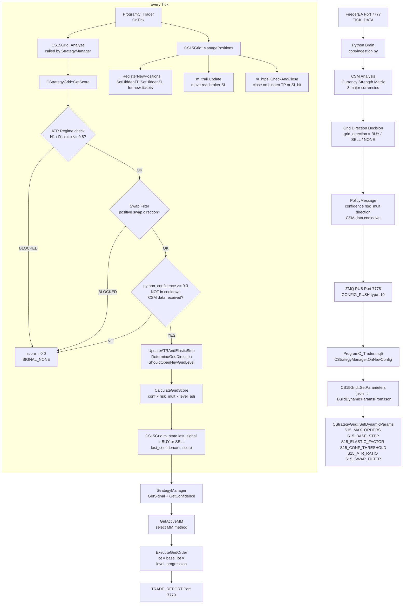
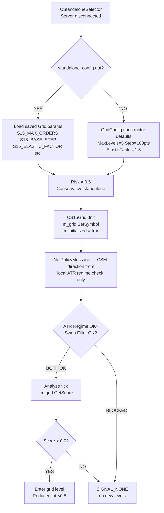
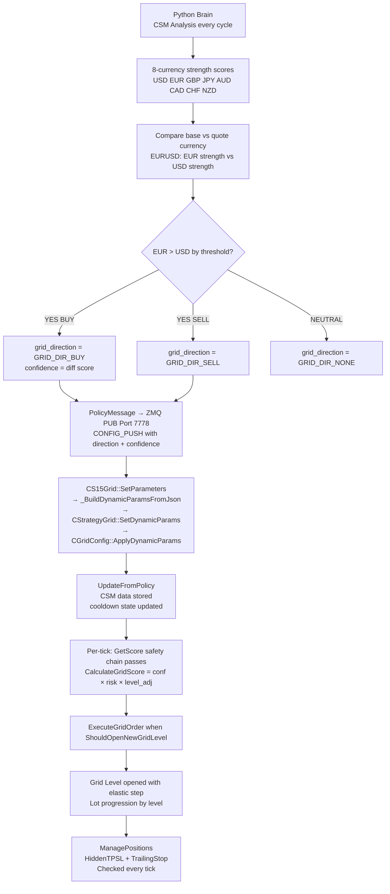
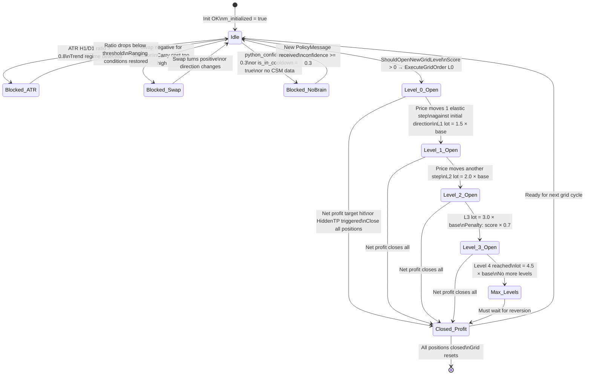

# S15 — Immortal Grid (Legacy Wrapper)
## FlashEASuite V2 | Strategy Deep Dive Manual
### Generated: 2026-02-26 | Phase P9-5

---

## 1. Strategy Overview

| Field | Value |
|-------|-------|
| **Strategy ID** | S15 |
| **Name** | Immortal Grid (Legacy) |
| **Type** | Full MQL5 — Legacy Wrapper over `CStrategyGrid` |
| **Standalone Capable** | Yes |
| **Preferred Regime** | RANGING (grid profits from oscillation) |
| **Poor Regimes** | Strong TRENDING (directional runaway loss) |
| **MQL5 Class** | `CS15Grid` wraps `CStrategyGrid` |
| **Magic Number** | 1015 |
| **Python Analyzer** | Grid direction supplied via CONFIG_PUSH / PolicyMessage |
| **Version** | 6.03 |

### สรุปแนวคิด (Thai)

S15 คือกลยุทธ์ **Grid Trading** แบบ Elastic — เปิด Order ซื้อหรือขายซ้อนกันเป็นระดับ (Level) ตามระยะห่างที่กำหนด (Grid Step) เมื่อราคาเคลื่อนที่ตามทิศทาง ระบบจะเปิด Level ใหม่โดยอัตโนมัติ Grid Step ปรับตัวตาม ATR ทำให้สามารถรองรับตลาดที่ volatility เปลี่ยนแปลงได้ มีระบบป้องกัน Trend ผ่าน ATR Ratio (H1/D1) และ Swap Filter เพื่อหลีกเลี่ยงตลาดที่มีแนวโน้มแรง S15 รองรับ HiddenTPSL (ซ่อน TP/SL จาก broker) และ TrailingStop เป็น P6-3 Enhancement

---

## 2. Core Theory

### 2.1 Elastic Grid Step

```
Base_Step = m_base_elastic_step (default = 100 points)

ATR_Ratio = ATR_H1_current / ATR_H1_reference

Elastic_Step = Base_Step × ATR_Ratio

Constrained:
  min_step = Base_Step × 0.5  (never below 50 points)
  max_step = Base_Step × 2.0  (never above 200 points)
```

The elastic step ensures grid spacing adapts to current volatility. In low-volatility conditions, the grid is tighter (more frequent entries). In high-volatility conditions, the grid widens to reduce over-trading.

### 2.2 Lot Progression (Martingale-Style)

```
Level 0: 1.0 × base_lot
Level 1: 1.5 × base_lot
Level 2: 2.0 × base_lot
Level 3: 3.0 × base_lot
Level 4: 4.5 × base_lot
```

Each new grid level opened at a further adverse price uses a larger lot size. This allows total profit recovery when price reverts. **WARNING:** This creates significant drawdown risk in trending markets.

### 2.3 ATR Regime Protection (Phase 3.5)

```
ATR_Ratio = ATR_H1(14) / ATR_D1(14)

if ATR_Ratio > m_atr_ratio_threshold (default 0.8):
    GetScore() returns 0.0
    → Grid BLOCKED — short-term volatility is disproportionately
      high relative to daily range, suggesting a trend regime

if ATR_Ratio <= 0.8:
    → Grid ALLOWED — H1 volatility is proportionate to daily range
      (ranging / oscillating conditions)
```

This multi-timeframe filter is the primary protection against grid trading into a strongly trending market.

### 2.4 Swap Filter (Phase 3.6)

```
if grid_direction = BUY:
    check SYMBOL_SWAP_LONG
    if swap_long <= 0: block grid (negative carry cost)

if grid_direction = SELL:
    check SYMBOL_SWAP_SHORT
    if swap_short <= 0: block grid
```

Grid positions accumulate carry (swap) costs over time due to multiple open positions. The swap filter prevents opening grid levels when the overnight carry would work against accumulated floating positions.

### 2.5 Grid Score

```
score = 1.0
score *= m_python_confidence    (confidence from Python Brain or CSM)
score *= m_python_risk_multiplier

if active_grid_count == 0: score *= 1.5   (bonus for fresh grid start)
if active_grid_count >= 3: score *= 0.7   (penalty for deep grid)

Score range: 0.0 (blocked) → 1.5+ (fresh start, high confidence)
```

---

## 3. System Architecture — Legacy Wrapper Design

```
┌────────────────────────────────────────────────────────────────────────┐
│              S15 LAYERED ARCHITECTURE                                   │
├──────────────────────────┬─────────────────────────────────────────────┤
│  IStrategy Interface     │  CS15Grid (S15_Grid.mqh)                    │
│  (V6 Standard)           │  • GetSignal() / GetConfidence()            │
│                          │  • SetDynamicParams() / SetParameters()     │
│                          │  • ManagePositions() — every tick           │
│                          │  • EmergencyTransferToGrid()                │
│                          │  • SetMMManager() / GetActiveMM()           │
│                          │  • SetTPSLConfig()                          │
├──────────────────────────┼─────────────────────────────────────────────┤
│  P6-3 Extensions         │  CHiddenTPSL m_htpsl (direct member)        │
│  (Added in Phase 6-3)    │  CTrailingStop m_trail (direct member)      │
│                          │  CMMManager* m_mm_mgr (external pointer)    │
├──────────────────────────┼─────────────────────────────────────────────┤
│  Legacy Core             │  CStrategyGrid m_grid (direct member)       │
│  (Original Algorithm)    │  ← from Include/Logic/Grid/GridCore.mqh    │
│                          │  ← uses CGridConfig + CGridState base chain│
├──────────────────────────┼─────────────────────────────────────────────┤
│  Python Brain            │  PolicyMessage via ZMQ Port 7778            │
│  (Server Side)           │  • grid_direction (BUY/SELL/NONE)          │
│                          │  • python_confidence (min 0.3 to trade)     │
│                          │  • python_risk_multiplier                   │
│                          │  • is_in_cooldown flag                      │
│                          │  • CSM currency strength data (8 pairs)     │
└──────────────────────────┴─────────────────────────────────────────────┘
```

**Why Legacy Wrapper?** The original `CStrategyGrid` was developed before the V6 `IStrategy` interface existed. Rather than rewriting the battle-tested grid algorithm, a thin wrapper (`CS15Grid`) was added to expose the `IStrategy` interface while delegating all grid logic to `CStrategyGrid`.

---

## 4. Full System Dataflow



---

## 5. CStrategyGrid: Grid Execution Logic

### 5.1 Safety Check Sequence in GetScore()

```mql5
double GetScore()
{
    // 1. Rate limiting: cache result within same second
    if(current_time == m_last_score_time && m_cached_score >= 0)
        return m_cached_score;

    // 2. ATR Regime Protection (Phase 3.5)
    if(!CheckATRRegime()) return 0.0;
    //    → ATR_H1 / ATR_D1 > 0.8 → trend regime detected → block

    // 3. Swap Filter (Phase 3.6)
    if(m_swap_filter_enabled && !CheckSwapFilter()) return 0.0;
    //    → negative carry for grid direction → block

    // 4. Python Brain cooldown flag
    if(m_is_in_cooldown) return 0.0;

    // 5. Python confidence minimum
    if(m_python_confidence < 0.3) return 0.0;

    // 6. CSM data required (direction from Brain)
    if(!m_csm_data_received || m_current_direction == GRID_DIR_NONE)
        return 0.0;

    // All checks passed: compute elastic step + determine if new level needed
    UpdateATRAndElasticStep();
    UpdateGridState();
    DetermineGridDirection();

    if(ShouldOpenNewGridLevel())
        return CalculateGridScore();

    return 0.0;
}
```

### 5.2 ATR Regime Check

```mql5
bool CheckATRRegime()
{
    double atr_h1 = CopyBuffer(m_atr_handle, 0, 0, 1, buf);   // H1 ATR(14)
    double atr_d1 = CopyBuffer(m_atr_d1_handle, 0, 0, 1, buf); // D1 ATR(14)

    double ratio = atr_h1 / atr_d1;

    // If H1 volatility is disproportionately high vs daily range → trend
    if(ratio > m_atr_ratio_threshold) return false;  // BLOCK grid
    return true;                                       // ALLOW grid
}
```

### 5.3 PolicyMessage Integration (from Python Brain)

```mql5
void UpdateFromPolicy(const PolicyMessage &policy)
{
    m_python_risk_multiplier = policy.risk_multiplier;
    m_python_confidence      = policy.confidence;
    m_is_in_cooldown         = policy.is_in_cooldown;

    // Grid direction set by CSM currency strength matrix
    if(policy.grid_direction == 1) m_current_direction = GRID_DIR_BUY;
    else if(policy.grid_direction == 2) m_current_direction = GRID_DIR_SELL;
    else                               m_current_direction = GRID_DIR_NONE;

    // 8-currency CSM data stored for direction confirmation
    m_csm_usd = policy.csm_usd;
    // ... m_csm_eur, m_csm_gbp, etc.
    m_csm_data_received = true;
}
```

### 5.4 HiddenTPSL Registration (ManagePositions)

```mql5
void _RegisterNewPositions()
{
    double atr = _GetATR14();   // ATR(14) on current symbol/tf

    for each position with MAGIC_S15_GRID:
        if(!_IsHiddenTracked(ticket) && atr > 0.0)
        {
            // Hidden TP: broker never sees this level
            if(m_tp_atr_mult > 0.0)
                m_htpsl.SetHiddenTP(ticket,
                    is_buy ? open_price + m_tp_atr_mult * atr
                           : open_price - m_tp_atr_mult * atr);

            // Hidden SL: broker never sees this level
            if(m_sl_atr_mult > 0.0)
                m_htpsl.SetHiddenSL(ticket,
                    is_buy ? open_price - m_sl_atr_mult * atr
                           : open_price + m_sl_atr_mult * atr);
        }

        if(m_trail_enabled)
            m_trail.Register(ticket);  // CTrailingStop dup-checks internally
}
```

### 5.5 Emergency Transfer to Grid

```mql5
STransferResult EmergencyTransferToGrid(ENUM_TRANSFER_REASON reason)
{
    // 1. Clean up hidden tracking for all non-grid positions (e.g., from S16)
    for each position NOT with MAGIC_S15_GRID:
        m_htpsl.ClearHidden(ticket);
        m_trail.Unregister(ticket);

    // 2. Close spike/other positions → open grid positions at same net exposure
    return TransferToGrid(m_symbol, MAGIC_S15_GRID, reason);
}
```

---

## 6. Parameter Reference

### 6.1 MQL5 Internal Defaults (from GridConfig)

| Parameter | Default | Description |
|-----------|---------|-------------|
| `m_max_grid_levels` | 5 | Maximum concurrent grid levels (max 10) |
| `m_base_lot` | 0.01 | Base lot for Level 0 |
| `m_base_elastic_step` | 100.0 points | Base grid spacing (adapted by ATR) |
| `m_elastic_factor` | 1.5 | ATR scaling multiplier for step |
| `m_conf_threshold` | 0.65 | Minimum confidence to open new level |
| `m_atr_ratio_thresh_dyn` | 0.8 | ATR H1/D1 ratio protection threshold |
| `m_swap_filter_dyn` | true | Enable/disable swap filter |

### 6.2 CONFIG_PUSH Keys (Server Mode)

| Key | Type | Default | Description |
|-----|------|---------|-------------|
| `S15_MAX_ORDERS` | int | 5 | Maximum grid levels / concurrent positions |
| `S15_BASE_STEP` | float | 100.0 | Base grid step in points |
| `S15_ELASTIC_FACTOR` | float | 1.5 | ATR-based step scaling multiplier |
| `S15_CONF_THRESHOLD` | float | 0.65 | Min confidence to open new grid level |
| `S15_ATR_RATIO` | float | 0.8 | ATR H1/D1 regime protection threshold |
| `S15_SWAP_FILTER` | float | 1.0 | Swap filter: 1.0=enabled, 0.0=disabled |
| `S15_TP_ATR_MULT` | float | 0.0 | Hidden TP in ATR multiples (0=disabled) |
| `S15_SL_ATR_MULT` | float | 0.0 | Hidden SL in ATR multiples (0=disabled) |
| `S15_TRAIL_ENABLED` | float | 0.0 | Trailing stop: 1.0=enabled, 0.0=disabled |
| `S15_RISK_MULT` | float | 1.0 | Risk multiplier (0.5 in standalone mode) |

### 6.3 Standalone Mode Defaults

| Setting | Value | Source |
|---------|-------|--------|
| Risk Multiplier | 0.5 | CStandaloneSelector applies ×0.5 |
| Grid Params | From `standalone_config.dat` if exists | Last CONFIG_PUSH saved to disk |
| Grid Params (fallback) | GridConfig constructor defaults | No file available |
| HiddenTPSL | Disabled (m_tp_atr_mult=0, m_sl_atr_mult=0) | Default constructor |
| Trailing Stop | Disabled (m_trail_enabled=false) | Default constructor |

---

## 7. Standalone vs Server Mode

### 7.1 Standalone Mode



**Important limitation in standalone mode:** Without Python Brain's CSM analysis, `m_csm_data_received = false` and `m_current_direction = GRID_DIR_NONE`. This means `GetScore()` returns 0 at Safety Check 3 in pure standalone. The standalone grid operates only after receiving at least one PolicyMessage or CONFIG_PUSH that includes `grid_direction`.

### 7.2 Server Mode



---

## 8. Grid State Diagram



---

## 9. Performance Characteristics

| Aspect | Detail |
|--------|--------|
| **Best Market Condition** | Ranging / oscillating market (RANGING regime) |
| **Worst Market Condition** | Sustained directional trend without reversion |
| **Typical Trade Duration** | Hours to days (grid holds until net profit target) |
| **Win Rate Target** | 70–80% (grid profits from oscillation, many closed levels) |
| **Maximum Drawdown Risk** | High — 5 levels at martingale progression can be severe |
| **Lot Progression** | 1.0 / 1.5 / 2.0 / 3.0 / 4.5 × base lot |
| **ATR Protection** | H1/D1 ratio blocks grid in trend regimes automatically |
| **Swap Filter** | Prevents negative-carry grid accumulation |
| **HiddenTPSL** | Optional per-position hidden exits (broker never sees them) |
| **Trailing Stop** | Optional broker-side trailing SL via CTrailingStop |
| **Emergency Transfer** | Can receive positions from S16 spike strategy |
| **Latency** | Grid score cached per second — O(1) after first computation |
| **Standalone Ready** | Yes — requires at least one CONFIG_PUSH for grid_direction |

---

## 10. Files Reference

| File | Role |
|------|------|
| `Include/Logic/Strategies/S15_Grid.mqh` | `CS15Grid` wrapper class — IStrategy interface |
| `Include/Logic/Grid/GridCore.mqh` | `CStrategyGrid` — core elastic grid algorithm |
| `Include/Logic/Grid/GridConfig.mqh` | `CGridConfig` — configuration and state base class |
| `Include/Logic/Grid/GridState.mqh` | `CGridState` — grid order tracking, ShouldOpenNewGridLevel |
| `Include/Logic/Common/HiddenTPSL.mqh` | `CHiddenTPSL` — virtual TP/SL tracking (broker-invisible) |
| `Include/Logic/Common/TrailingStop.mqh` | `CTrailingStop` — real broker SL trailing |
| `Include/Logic/Common/TransferToGrid.mqh` | `TransferToGrid()` utility — emergency position transfer |
| `Include/Logic/MM/MMManager.mqh` | `CMMManager` — MM method selection by regime |
| `Include/Network/Protocol/Definitions.mqh` | `ENUM_GRID_DIRECTION`, `PolicyMessage`, `SDynamicParams` |
| `03_Trader/ProgramC_Trader.mq5` | StrategyManager routes ticks and CONFIG_PUSH to CS15Grid |
| `02_Brain/core/strategy/engine.py` | Python Brain: grid direction decision from CSM analysis |

---

## 11. Quick Diagnostics

### Check S15 Grid Activity in EA Log

```
Expert Journal → search "[S15]" and "[Grid]":
  [S15] Grid initialized | Symbol=EURUSD TF=PERIOD_H1 MaxLevels=5
  [Grid] ATR regime check passed | ATR H1: 0.00123 | D1: 0.00180 | Ratio: 0.683 (OK < 0.80)
  [Grid] Swap filter passed | Direction: BUY | Swap Long: 0.42 (POSITIVE)
  [Grid] Opened Grid Level 0 | Type: BUY | Lot: 0.01 | Price: 1.08423
```

### Print S15 Diagnostics from EA

```mql5
CS15Grid* s15 = GetStrategy(S15_GRID);
s15.PrintDiagnostics();
// Output:
//   [S15] Grid | Symbol=EURUSD | MaxLevels=5 | ActiveLevels=2
//   [S15] Signal=BUY | Confidence=0.7350 | RiskMult=1.00
//   [S15] MM=Kelly | ActiveMM=MM03_Kelly
//   [S15] HiddenTPSL=2 tracked | Trail=0 tracked | TP×0.0 SL×0.0
```

### ATR Regime Blocked — What to Do

```
Log shows: [Grid] ATR REGIME PROTECTION ACTIVE | Ratio: 0.923 (threshold: 0.80)
→ Market is trending. Do not increase threshold.
→ Wait for ranging conditions or reduce S15_ATR_RATIO via CONFIG_PUSH.
```

### Validate CONFIG_PUSH contains S15 params

```bash
python tools/validate_live_readiness.py --zmq
# Look for: S15_MAX_ORDERS, S15_BASE_STEP, S15_ELASTIC_FACTOR,
#           S15_CONF_THRESHOLD, S15_ATR_RATIO, S15_SWAP_FILTER
```

### Common Issues

| Symptom | Likely Cause | Fix |
|---------|-------------|-----|
| Grid never opens positions | `m_csm_data_received = false` — no PolicyMessage yet | Confirm Python Brain sends `grid_direction` field |
| ATR Regime always blocking | Market is genuinely trending | Reduce `S15_ATR_RATIO` or wait for RANGING regime |
| Too many levels open | `S15_MAX_ORDERS` too high for account balance | Reduce to 3–4 levels for small accounts |
| Swap filter always blocking | Symbol has negative swap in grid direction | Disable with `S15_SWAP_FILTER=0` or change symbol |
| HiddenTPSL not closing | `m_tp_atr_mult` is 0 (default) | Set `S15_TP_ATR_MULT` to desired value via CONFIG_PUSH |

---

*S15 Manual — FlashEASuite V2 | Phase P9-5 | Generated 2026-02-26*
