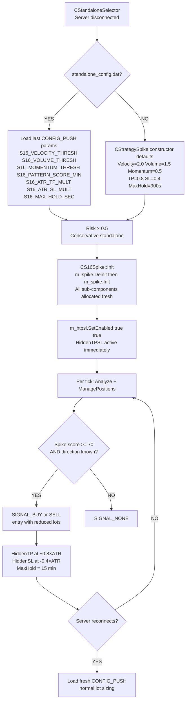
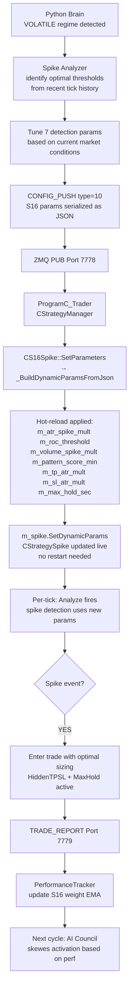
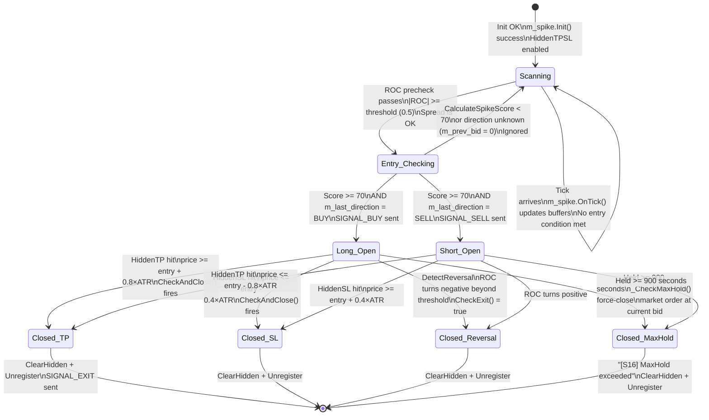

# S16 — Spike Hunter (Legacy Wrapper)
## FlashEASuite V2 | Strategy Deep Dive Manual
### Generated: 2026-02-26 | Phase P9-5

---

## 1. Strategy Overview

| Field | Value |
|-------|-------|
| **Strategy ID** | S16 |
| **Name** | Spike Hunter (Legacy) |
| **Type** | Full MQL5 — Legacy Wrapper over `CStrategySpike` |
| **Standalone Capable** | Yes |
| **Preferred Regime** | VOLATILE (spikes are most common) |
| **Poor Regimes** | RANGING (no spike events; strategy sits idle) |
| **MQL5 Class** | `CS16Spike` wraps `CStrategySpike` |
| **Magic Number** | 1016 |
| **Python Analyzer** | Spike params supplied via CONFIG_PUSH |
| **Version** | 6.05 |
| **Critical Bug Fix** | v2.02 (P9-4b): Memory leak FIXED — direct member allocation |

### สรุปแนวคิด (Thai)

S16 คือกลยุทธ์ **Spike Hunter** — ตรวจจับการเคลื่อนที่แบบฉับพลัน (Spike) ของราคาโดยใช้ตัวกรองหลายตัวร่วมกัน: ความเร็วราคา (ROC), ปริมาณการซื้อขาย (Volume), ความหนาแน่นของ tick (Tick Density) และ Z-Score ของ ATR เมื่อคะแนนรวมถึง threshold (ค่าเริ่มต้น 70 คะแนน) ระบบจะเปิด Trade ตามทิศทางของ Spike โดยมี TP 0.8×ATR (ปิดกำไรเร็ว) และ SL 0.4×ATR (Stop Loss แน่น) พร้อมระบบบังคับปิด Trade หลัง 15 นาที (Max Hold Time) เพื่อป้องกันการถือ Position นานเกินไป

**หมายเหตุสำคัญ:** S16 เคยมีปัญหา Memory Leak ใน version เก่า — แก้ไขแล้วใน v2.02 โดยเปลี่ยนจากการ `new/delete` sub-objects เป็น direct member (stack allocation)

---

## 2. Core Theory

### 2.1 Multi-Component Spike Score

The spike detection engine (`CStrategySpike.CalculateSpikeScore()`) combines four independent signals into a total score out of 100:

```
Component 1: Price Velocity (max 40 points)
  price_change = |current_bid - entry_price|
  if price_change >= ATR × m_atr_spike_mult:
      score += 40.0          (full velocity score)
  else:
      score += (price_change / (ATR × mult)) × 40.0   (partial)

Component 2: Rate of Change — ROC (max 30 points)
  roc = ROCCalculator.Calculate(m_roc_period)
  if |roc| >= m_roc_threshold (default 0.5):
      score += 30.0          (full momentum score)
  else:
      score += (|roc| / m_roc_threshold) × 30.0       (partial)

Component 3: Volume Spike (max 10 points)
  if VolumeAnalyzer.IsVolumeSpike(m_volume_spike_mult = 1.5x):
      score += 10.0

Component 4: Tick Density (max 20 points)
  if TickDensity.IsHighDensity(m_density_threshold = 3.0):
      score += 20.0

TOTAL = Component1 + Component2 + Component3 + Component4
Entry condition: TOTAL >= m_pattern_score_min (default 70.0)
```

A score of 70+ means at minimum: strong price velocity AND strong momentum, OR velocity + modest momentum + volume spike + high tick density.

### 2.2 ATR-Based TP/SL

```
Hidden TP (default):  entry_price + m_tp_atr_mult × ATR
                    = entry_price + 0.8 × ATR

Hidden SL (default):  entry_price - m_sl_atr_mult × ATR
                    = entry_price - 0.4 × ATR

R:R = 0.8 / 0.4 = 2.0

Notes:
  - TP and SL are HIDDEN from the broker (CHiddenTPSL system)
  - Broker sees no SL/TP on the order ticket
  - ManagePositions() monitors and closes at virtual levels
```

### 2.3 Max Hold Time (Force-Close)

```
m_max_hold_sec = 900 seconds (15 minutes) by default

Every tick in _CheckMaxHold():
  hold_time = TimeCurrent() - position.open_time
  if hold_time >= m_max_hold_sec:
      → Force-close the position immediately
      → Log: "[S16] MaxHold 900s exceeded for #TICKET — closing"
      → ClearHidden(ticket)
      → Unregister(ticket) from TrailingStop
```

The max hold time is the last resort exit: if neither HiddenTP nor HiddenSL triggers within 15 minutes, the position is closed at market price regardless of current P&L.

### 2.4 Exit via Reversal Detection

```
DetectReversal():
  roc = ROCCalculator.Calculate(m_roc_period)

  if position is BUY  and roc < -m_roc_threshold → reversal down → exit
  if position is SELL and roc > +m_roc_threshold → reversal up   → exit
```

`CheckExit()` also checks `DetectReversal()`. However, the primary exit mechanism in the P6-3 wrapper is `CHiddenTPSL.CheckAndClose()` which is more precise (price-level based) than the ROC reversal check.

### 2.5 Direction Inference

```
// CStrategySpike has no GetSpikeDirection() in its API
// CS16Spike infers direction from bid price movement:

if tick.bid > m_prev_bid:  m_last_direction = SIGNAL_BUY
if tick.bid < m_prev_bid:  m_last_direction = SIGNAL_SELL
(if equal: m_last_direction unchanged)

Entry fires only when:
  CStrategySpike.CheckEntry() returns true   (score >= 70)
  AND m_last_direction != SIGNAL_NONE        (direction known)
```

### 2.6 Confidence Score

```
Confidence = min(CStrategySpike.GetScore() / 100.0, 1.0)
           = min(spike_score / 100, 1.0)

Range: 0.0 → 1.0
At threshold entry: min confidence = 70/100 = 0.70
```

---

## 3. System Architecture — Legacy Wrapper Design

```
┌─────────────────────────────────────────────────────────────────────────┐
│              S16 LAYERED ARCHITECTURE                                    │
├──────────────────────────┬──────────────────────────────────────────────┤
│  IStrategy Interface     │  CS16Spike (S16_Spike.mqh)                   │
│  (V6 Standard)           │  • GetSignal() / GetConfidence()             │
│                          │  • SetDynamicParams() / SetParameters()      │
│                          │  • ManagePositions() — every tick            │
│                          │  • EmergencyTransferToGrid()                 │
│                          │  • SetMMManager() / GetActiveMM()            │
│                          │  • SetTPSLConfig()                           │
│                          │  • m_prev_bid direction tracking             │
├──────────────────────────┼──────────────────────────────────────────────┤
│  P6-3 Extensions         │  CHiddenTPSL m_htpsl (direct member)         │
│  (Added in Phase 6-3)    │  CTrailingStop m_trail (direct member)       │
│                          │  _CheckMaxHold() — time-based force close    │
│                          │  CMMManager* m_mm_mgr (external pointer)     │
├──────────────────────────┼──────────────────────────────────────────────┤
│  Legacy Core             │  CStrategySpike m_spike (direct member)      │
│  (Original Algorithm)    │  ← from Include/Logic/Strategy_Spike.mqh    │
│                          │  ← Sub-components (heap allocated):         │
│                          │    CVolumeAnalyzer m_volume                  │
│                          │    CADXFilter m_adx                          │
│                          │    CZScoreFilter m_zscore                    │
│                          │    CROCCalculator m_roc                      │
│                          │    CTickDensity m_density (100 tick window)  │
│                          │    CSpreadFilter m_spread                    │
├──────────────────────────┼──────────────────────────────────────────────┤
│  Python Brain            │  CONFIG_PUSH via ZMQ Port 7778               │
│  (Server Side)           │  • S16_VELOCITY_THRESH → m_atr_spike_mult   │
│                          │  • S16_SPREAD_THRESH                         │
│                          │  • S16_VOLUME_THRESH                         │
│                          │  • S16_MOMENTUM_THRESH → m_roc_threshold     │
│                          │  • S16_VOLATILITY_THRESH → m_zscore_thresh   │
│                          │  • S16_PATTERN_SCORE_MIN (70.0 default)      │
│                          │  • S16_ATR_TP_MULT, S16_ATR_SL_MULT          │
│                          │  • S16_MAX_HOLD_SEC                          │
└──────────────────────────┴──────────────────────────────────────────────┘
```

**Why Legacy Wrapper?** `CStrategySpike` was developed with its own lifecycle before V6 IStrategy. `CS16Spike` adds the standard interface without rewriting the battle-tested detection engine. The v2.02 bug fix changed `CStrategySpike` from a pointer member (`new/delete`) to a **direct member** (`CStrategySpike m_spike`), eliminating the memory leak when `Init()` was called multiple times.

---

## 4. Memory Leak Fix History (v2.02 / P9-4b)

### The Bug (Pre-v2.02)

```mql5
// OLD CODE — caused memory leak:
class CS16Spike : public IStrategy
{
private:
    CStrategySpike* m_spike;   // POINTER — heap allocated

    CS16Spike() { m_spike = new CStrategySpike(); }

    bool Init()
    {
        // If Init() called again: m_spike->Init() re-allocates sub-objects
        // BUT old sub-objects (m_volume, m_adx etc.) were NOT freed first
        // → Memory leak every re-init
        m_spike->Init();
    }
};
```

### The Fix (v2.02)

```mql5
// NEW CODE — memory-safe direct member:
class CS16Spike : public IStrategy
{
private:
    CStrategySpike m_spike;    // DIRECT MEMBER — stack allocated

    // CStrategySpike.Deinit() is now explicitly idempotent:
    void Deinit()
    {
        // CheckPointer(m_volume) == POINTER_DYNAMIC before delete
        // Prevents double-free on repeated calls
        if(CheckPointer(m_volume) == POINTER_DYNAMIC) { delete m_volume; m_volume = NULL; }
        // ... same for m_adx, m_zscore, m_roc, m_density, m_spread
        // IndicatorRelease(m_atr_handle) with INVALID_HANDLE guard
    }

    bool Init()
    {
        // BUG-001 FIX: always call Deinit() first to free previous Init's allocations
        Deinit();
        m_volume  = new CVolumeAnalyzer();
        m_adx     = new CADXFilter();
        // ... safe re-initialization
    }
};

// CS16Spike::Deinit() explicitly calls m_spike.Deinit():
virtual void Deinit() override
{
    m_htpsl.SetEnabled(false, false);
    m_trail.SetEnabled(false);
    m_spike.Deinit();    // BUG-001 FIX: explicit call required for direct member
    m_initialized    = false;
    m_prev_bid       = 0.0;
    m_last_direction = SIGNAL_NONE;
    IStrategy::Deinit();
}
```

---

## 5. Full System Dataflow

```mermaid
flowchart TD
    A[FeederEA Port 7777\nTICK_DATA] --> B[Python Brain\ncore/ingestion.py]
    B --> C[Spike Pattern Analyzer\nidentify spike events from tick data]
    C --> D[Tune detection thresholds\nVelocity Spread Volume Momentum]
    D --> E[CONFIG_PUSH type=10\nS16_VELOCITY_THRESH S16_SPREAD_THRESH\nS16_VOLUME_THRESH S16_MOMENTUM_THRESH\nS16_PATTERN_SCORE_MIN S16_ATR_TP_MULT\nS16_ATR_SL_MULT S16_MAX_HOLD_SEC]
    E --> F[ZMQ PUB Port 7778]
    F --> G[ProgramC_Trader\nCStrategyManager.OnNewConfig]
    G --> H[CS16Spike::SetParameters\n→ _BuildDynamicParamsFromJson]
    H --> I[CStrategySpike::SetDynamicParams\n11 detection + execution params applied]

    subgraph Per Tick — Analyze
        J[ProgramC_Trader OnTick] --> K[CS16Spike::Analyze]
        K --> L[m_spike.OnTick\nUpdate CTickDensity CROCCalculator CVolumeAnalyzer]
        L --> M[Direction inference\nif bid > prev_bid → BUY\nif bid < prev_bid → SELL]
        M --> N[m_spike.CheckEntry\nSpreadFilter.IsSpreadOK?\nROC >= threshold?\nCalculateSpikeScore >= 70?]
        N -- YES + direction known --> O[SIGNAL_BUY or SIGNAL_SELL\nconf = min score/100 1.0]
        N -- NO --> P[SIGNAL_NONE\nconf = 0.0]
    end

    subgraph Per Tick — ManagePositions
        J --> Q[CS16Spike::ManagePositions]
        Q --> R[_RegisterNewPositions\nSetHiddenTP = open + 0.8×ATR\nSetHiddenSL = open - 0.4×ATR]
        Q --> S[m_trail.Update\nmove broker SL if trail enabled]
        Q --> T[m_htpsl.CheckAndClose\nclose when hidden TP or SL hit]
        Q --> U[_CheckMaxHold\nforce-close if held >= 900 sec]
    end

    O --> V[StrategyManager\nGetSignal + GetConfidence]
    V --> W[GetActiveMM\nselect MM by regime + account state]
    W --> X[Lot sizing → OrderSend]
    X --> Y[TRADE_REPORT Port 7779]
    Y --> Z[PerformanceTracker\nEMA weight update for S16]
```

---

## 6. CStrategySpike: Sub-Component Details

### 6.1 CVolumeAnalyzer

```
Purpose: Detect abnormal volume at time of spike
Window:  20-tick rolling volume history
Spike:   current_volume > mean_volume × m_volume_spike_mult (1.5×)
Score:   +10 points if volume spike confirmed
```

### 6.2 CROCCalculator (Rate of Change)

```
Purpose: Measure price momentum (speed of price change)
Period:  m_roc_period (default = 10)
Formula: ROC = (price_now - price_N_ago) / price_N_ago × 100

Usage:
  CheckEntry:  |ROC| >= m_roc_threshold (0.5) → pre-condition to enter
  Score:       |ROC| / threshold × 30 points (capped at 30)
  CheckExit:   ROC reverses beyond threshold → DetectReversal() = true
```

### 6.3 CTickDensity (100-tick window)

```
Purpose: Measure tick activity rate (ticks per second)
Window:  Last 100 ticks' timestamps stored
Check:   tick_count_last_second >= m_density_threshold (3.0 ticks/sec)
Score:   +20 points if high tick density confirmed

High tick density during a spike = genuine market event, not noise
```

### 6.4 CSpreadFilter

```
Purpose: Block entry when spread is abnormally wide (common during spikes!)
Max:     m_spread_max_atr_pct × ATR / _Point  (default = 0.20 × ATR)
         Example: ATR=0.0010, point=0.00001 → max spread = 20 points

Prevents entering when broker widens spread to capture spike move
```

### 6.5 CADXFilter (Optional)

```
Purpose: Directional strength filter (disabled by default)
Config:  m_use_adx_filter = false (default)
         m_adx_minimum = 20.0
When enabled: ADX(14) must be >= 20 to allow entry
```

### 6.6 CZScoreFilter (Optional)

```
Purpose: Volatility normalization filter (disabled by default)
Config:  m_use_zscore_filter = false (default)
         m_zscore_threshold = 2.0
When enabled: Z-Score of ATR must be >= 2.0 (extreme volatility event)
```

### 6.7 Full Score Calculation

```mql5
double CalculateSpikeScore()
{
    // Component 1: ATR Velocity (0–40 points)
    double price_change = |tick.bid - m_entry_price|;
    if(price_change >= ATR * m_atr_spike_mult)
        score += 40.0;
    else
        score += (price_change / (ATR * m_atr_spike_mult)) * 40.0;

    // Component 2: ROC Momentum (0–30 points)
    double roc = |m_roc.Calculate(m_roc_period)|;
    if(roc >= m_roc_threshold)
        score += 30.0;
    else
        score += (roc / m_roc_threshold) * 30.0;

    // Component 3: Volume Spike (+10 points binary)
    if(m_volume.IsVolumeSpike(m_volume_spike_mult))
        score += 10.0;

    // Component 4: Tick Density (+20 points binary)
    if(m_density.IsHighDensity(m_density_threshold))
        score += 20.0;

    return score;  // Total: 0–100
}
```

---

## 7. Parameter Reference

### 7.1 MQL5 Internal Defaults (CStrategySpike Constructor)

| Parameter | Default | Description |
|-----------|---------|-------------|
| `m_atr_period` | 14 | ATR period for spike magnitude comparison |
| `m_atr_spike_mult` | 2.0 | Spike velocity: price move >= N×ATR for full score |
| `m_atr_tp_mult` | 0.8 | Hidden TP = 0.8 × ATR from entry |
| `m_atr_sl_mult` | 0.4 | Hidden SL = 0.4 × ATR from entry |
| `m_roc_period` | 10 | ROC lookback bars |
| `m_roc_threshold` | 0.5 | Minimum ROC for momentum confirmation |
| `m_volume_spike_mult` | 1.5 | Volume spike: current > 1.5× mean |
| `m_density_threshold` | 3.0 | High density: >= 3 ticks per second |
| `m_spread_max_atr_pct` | 0.20 | Max spread = 20% of ATR (in points) |
| `m_max_hold_seconds` | 900 | Force-close after 15 minutes |
| `m_pattern_score_min` | 70.0 | Minimum total score to enter |
| `m_use_adx_filter` | false | ADX directional filter (disabled) |
| `m_use_zscore_filter` | false | Z-Score volatility filter (disabled) |

### 7.2 CS16Spike Defaults (Wrapper Layer)

| Parameter | Default | Description |
|-----------|---------|-------------|
| `m_tp_atr_mult` | 0.8 | Passed to CHiddenTPSL for position tracking |
| `m_sl_atr_mult` | 0.4 | Passed to CHiddenTPSL for position tracking |
| `m_trail_enabled` | false | CTrailingStop disabled by default |
| `m_max_hold_sec` | 900 | Force-close timeout (15 min) |
| `m_risk_multiplier` | 1.0 | (0.5 in standalone mode) |

### 7.3 CONFIG_PUSH Keys (Server Mode)

| Key | Type | Default | Description |
|-----|------|---------|-------------|
| `S16_VELOCITY_THRESH` | float | 2.0 | Maps to `m_atr_spike_mult` — spike magnitude threshold |
| `S16_SPREAD_THRESH` | float | 1.5 | Maps to `m_spread_max_atr_pct` — max spread (% ATR) |
| `S16_VOLUME_THRESH` | float | 2.0 | Maps to `m_volume_spike_mult` — volume spike multiplier |
| `S16_MOMENTUM_THRESH` | float | 0.5 | Maps to `m_roc_threshold` — ROC momentum threshold |
| `S16_VOLATILITY_THRESH` | float | 1.5 | Maps to `m_zscore_threshold` — Z-Score volatility filter |
| `S16_DIRECTION_CONSIST` | float | 0.7 | Maps to `m_adx_minimum` — ADX directional strength |
| `S16_PATTERN_SCORE_MIN` | float | 70.0 | Minimum score to trigger entry |
| `S16_ATR_TP_MULT` | float | 0.8 | Hidden TP multiplier (ATR-based) |
| `S16_ATR_SL_MULT` | float | 0.4 | Hidden SL multiplier (ATR-based) |
| `S16_MAX_HOLD_SEC` | int | 900 | Force-close timeout in seconds |
| `S16_TRAIL_ENABLED` | float | 0.0 | Trailing stop: 1.0=enabled, 0.0=disabled |
| `S16_RISK_MULT` | float | 1.0 | Risk multiplier (0.5 in standalone) |

---

## 8. Standalone vs Server Mode

### 8.1 Standalone Mode



**Standalone properties:**
- HiddenTPSL is enabled by default in `Init()` (`m_htpsl.SetEnabled(true, true)`)
- All 6 sub-components (VolumeAnalyzer, ADXFilter, ZScoreFilter, ROCCalculator, TickDensity, SpreadFilter) are instantiated in `CStrategySpike.Init()`
- No CSM or PolicyMessage required — spike detection is fully independent
- `m_enabled = true` is set indirectly when `m_initialized = true` in `CStrategySpike.Init()`

### 8.2 Server Mode



---

## 9. Entry/Exit State Diagram



---

## 10. Performance Characteristics

| Aspect | Detail |
|--------|--------|
| **Best Market Condition** | VOLATILE regime: news events, session opens, sudden moves |
| **Worst Market Condition** | RANGING market — no spike events, strategy sits idle |
| **Typical Trade Duration** | 30 seconds to 15 minutes (MaxHold enforced) |
| **Win Rate Target** | 50–60% (TP:SL ratio 2:1 compensates for lower win rate) |
| **R:R Ratio** | 2.0 (0.8×ATR TP / 0.4×ATR SL) |
| **Maximum Score** | 100 (all 4 components full points) |
| **Entry Threshold** | 70 / 100 (configurable via `S16_PATTERN_SCORE_MIN`) |
| **Force-Close Mechanism** | MaxHold: 15 minutes regardless of P&L |
| **HiddenTPSL** | Enabled by default — broker never sees TP/SL levels |
| **Trailing Stop** | Disabled by default — enable via `S16_TRAIL_ENABLED=1.0` |
| **Emergency Transfer** | Can transfer positions to S15 Grid via EmergencyTransferToGrid() |
| **Memory Safety** | v2.02+ — direct member prevents double-free and leak |
| **Sub-component Heap** | 6 objects allocated on each Init(), freed on Deinit() |
| **Latency** | Tick-level detection — CTickDensity tracks every tick |
| **Standalone Ready** | Yes — full spike detection without Python Brain |

---

## 11. Files Reference

| File | Role |
|------|------|
| `Include/Logic/Strategies/S16_Spike.mqh` | `CS16Spike` wrapper class — IStrategy interface + P6-3 extensions |
| `Include/Logic/Strategy_Spike.mqh` | `CStrategySpike` — core spike detection algorithm (v2.02) |
| `Include/Logic/Spike/VolumeAnalyzer.mqh` | `CVolumeAnalyzer` — volume spike detection (20-tick window) |
| `Include/Logic/Spike/ROCCalculator.mqh` | `CROCCalculator` — Rate of Change momentum calculator |
| `Include/Logic/Spike/ADXFilter.mqh` | `CADXFilter` — optional ADX directional filter |
| `Include/Logic/Spike/ZScoreFilter.mqh` | `CZScoreFilter` — optional Z-Score volatility filter |
| `Include/Logic/TickDensity.mqh` | `CTickDensity` — tick-per-second density tracker (100-tick window) |
| `Include/Logic/SpreadFilter.mqh` | `CSpreadFilter` — spread width guard (ATR-percentage based) |
| `Include/Logic/Common/HiddenTPSL.mqh` | `CHiddenTPSL` — virtual TP/SL management (broker-invisible) |
| `Include/Logic/Common/TrailingStop.mqh` | `CTrailingStop` — real broker SL trailing |
| `Include/Logic/Common/TransferToGrid.mqh` | `TransferToGrid()` — emergency handoff to S15 |
| `Include/Logic/MM/MMManager.mqh` | `CMMManager` — MM method selection by regime/account |
| `Include/Logic/Strategies/S16_Spike_Deinit_Fix.mqh` | Supplemental deinit safety patch (P9-4b reference) |
| `03_Trader/ProgramC_Trader.mq5` | StrategyManager routes ticks and CONFIG_PUSH to CS16Spike |
| `Include/Network/Protocol/Definitions.mqh` | `SDynamicParams`, CONFIG_PUSH message format |
| `02_Brain/core/strategy/engine.py` | Python Brain: spike regime detection, threshold optimization |
| `02_Brain/tests/test_p9_1_python.py` | Memory leak regression test for S16 (P9-1 validation suite) |

---

## 12. Quick Diagnostics

### Check S16 Activity in EA Log

```
Expert Journal (MetaTrader) → search "[S16]":
  [S16] Spike initialized | Symbol=EURUSD TF=PERIOD_M1 | TP×0.8 SL×0.4 ATR
  [S16] Registered hidden TP/SL #12345678 | BUY | ATR=0.00098
  [S16] MaxHold 900s exceeded for #12345678 — closing
```

### Print S16 Diagnostics from EA

```mql5
CS16Spike* s16 = GetStrategy(S16_SPIKE);
s16.PrintDiagnostics();
// Output:
//   [S16] Spike | Symbol=EURUSD | ATR=0.00098 | RawScore=78.5
//   [S16] Signal=BUY | Confidence=0.785 | Direction=BUY | RiskMult=1.00
//   [S16] MM=ATR_Based | ActiveMM=MM08_ATR
//   [S16] HiddenTPSL=1 tracked | Trail=0 tracked | MaxHold=900s
//   [S16] TPSL config: TP×0.8 ATR | SL×0.4 ATR
```

### Check Spike Score Components

```mql5
CS16Spike* s16 = GetStrategy(S16_SPIKE);
PrintFormat("S16 raw_score=%.1f | ATR=%.5f | trail_count=%d | htpsl_count=%d",
            s16.GetRawScore(),
            s16.GetSpikeATR(),
            s16.GetTrailCount(),
            s16.GetHiddenTPSLCount());
```

### Memory Leak Regression Test

```bash
# Run after any change to CStrategySpike or CS16Spike:
python 02_Brain/tests/test_p9_1_python.py
# MQL5 side: Tester/Test_P9_1_S16_MemoryLeak.mq5
```

### Validate CONFIG_PUSH contains S16 params

```bash
python tools/validate_live_readiness.py --zmq
# Look for: S16_VELOCITY_THRESH, S16_VOLUME_THRESH, S16_MOMENTUM_THRESH,
#           S16_PATTERN_SCORE_MIN, S16_ATR_TP_MULT, S16_ATR_SL_MULT,
#           S16_MAX_HOLD_SEC
```

### Common Issues

| Symptom | Likely Cause | Fix |
|---------|-------------|-----|
| S16 fires constantly in quiet markets | `S16_PATTERN_SCORE_MIN` too low | Raise to 80+ for stricter filtering |
| S16 never fires even during volatile moves | `S16_VELOCITY_THRESH` too high | Lower to 1.5; check ROC threshold too |
| Memory usage grows over time | `CStrategySpike.Init()` called without `Deinit()` | Ensure v2.02+ in `Strategy_Spike.mqh` header |
| MaxHold fires immediately | `S16_MAX_HOLD_SEC` too low | Check CONFIG_PUSH; default should be 900 |
| HiddenTPSL not triggering | `m_tp_atr_mult` is 0 | Default constructor sets 0.8 — check if overridden to 0 |
| Direction always NONE | No tick movement (`m_prev_bid` not updating) | Check that `Analyze()` is called every tick with valid MqlTick |

---

*S16 Manual — FlashEASuite V2 | Phase P9-5 | Generated 2026-02-26*
