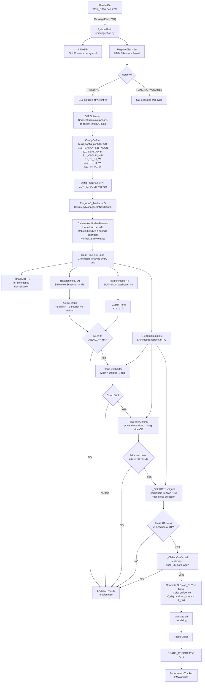
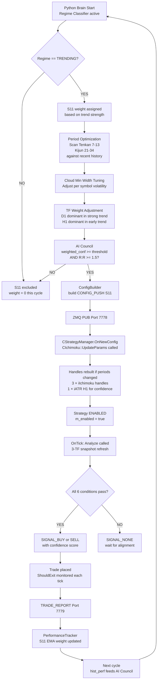
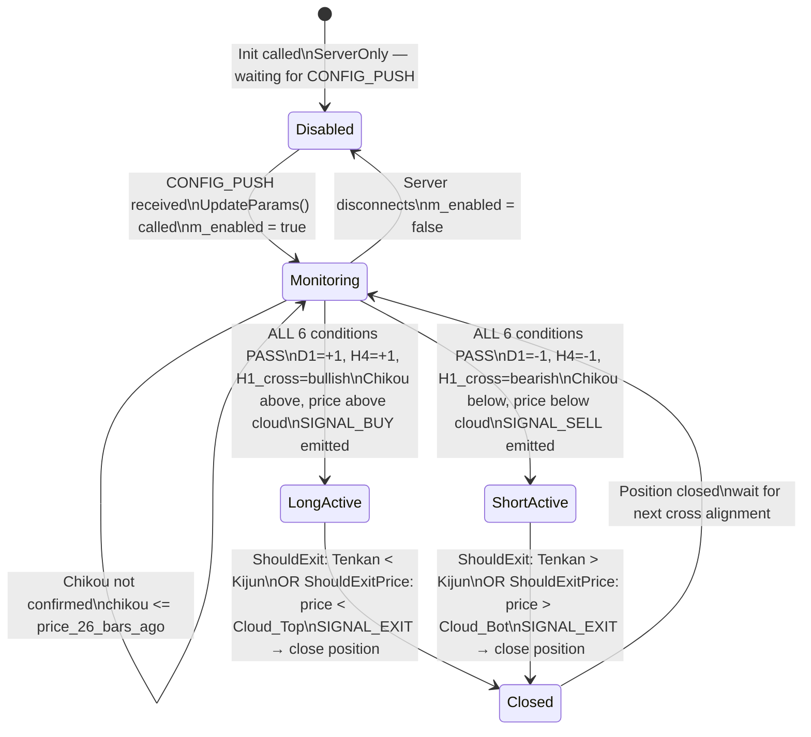

# S11 — Multi-Timeframe Ichimoku
## FlashEASuite V2 | Strategy Deep Dive Manual
### Generated: 2026-02-26 | Phase P9-5

---

## 1. Strategy Overview

| Field | Value |
|-------|-------|
| **Strategy ID** | S11 |
| **Name** | Multi-Timeframe Ichimoku |
| **Type** | Full MQL5 — Server Only |
| **Standalone Capable** | No |
| **Magic Number** | 1011 |
| **MQL5 Class** | `CIchimoku` (`Include/Logic/Strategies/S11_Ichimoku.mqh`) |
| **Helper Struct** | `SIchimokuSnapshot` (per-timeframe data container) |
| **Preferred Regime** | TRENDING |
| **Poor Regimes** | RANGING, VOLATILE |
| **Strategy Family** | Trend Following — Japanese Technical Analysis |

### สรุปแนวคิด (Thai)

S11 ใช้ระบบ **Ichimoku Kinko Hyo** 3 ระดับ timeframe (D1, H4, H1) เพื่อยืนยันแนวโน้มก่อนเข้า trade โดยหลักการ "สมดุล" ของราคาในช่วงเวลาต่าง ๆ

- **D1 (40%)**: กำหนดทิศทางหลัก — ราคาอยู่เหนือ Kumo Cloud = Bullish
- **H4 (35%)**: ยืนยันแนวโน้ม — Tenkan ตัดผ่าน Kijun = บวก
- **H1 (25%)**: จังหวะเข้า trade — Tenkan cross Kijun + Chikou ชัดเจน

ระบบจะ **ไม่เข้า trade** หากทั้ง 3 Timeframe ไม่ align กัน และจะกรองออกหาก Cloud บาง (< 10 pips) ซึ่งบ่งชี้ว่า Support/Resistance อ่อนแอ เนื่องจาก S11 เป็น **ServerOnly** จึงต้องรับ CONFIG_PUSH จาก Python Brain ก่อนจึงจะทำงานได้

---

## 2. Core Theory

### 2.1 Ichimoku Components

```
Tenkan-sen (Conversion Line, period=9):
  Tenkan = (Highest High over 9 periods + Lowest Low over 9 periods) / 2

Kijun-sen (Base Line, period=26):
  Kijun = (Highest High over 26 periods + Lowest Low over 26 periods) / 2

Senkou Span A (Leading Cloud Boundary A):
  Senkou_A = (Tenkan + Kijun) / 2
  Plotted 26 periods FORWARD in time

Senkou Span B (Leading Cloud Boundary B, period=52):
  Senkou_B = (Highest High over 52 periods + Lowest Low over 52 periods) / 2
  Plotted 26 periods FORWARD in time

Kumo Cloud:
  Cloud_Top = max(Senkou_A, Senkou_B)
  Cloud_Bot = min(Senkou_A, Senkou_B)
  Width (pips) = (Cloud_Top - Cloud_Bot) / pip_size

Chikou Span (Lagging Span):
  Chikou = Current Close plotted 26 periods BACKWARD in time
  Confirmation: Chikou must be ABOVE price 26 bars ago (Long) or
                BELOW price 26 bars ago (Short)
```

### 2.2 3-Tier Timeframe Alignment

```
D1 Trend (Weight 40%):
  Bullish: price_D1 > Cloud_Top_D1  AND  Tenkan_D1 >= Kijun_D1
  Bearish: price_D1 < Cloud_Bot_D1  AND  Tenkan_D1 <= Kijun_D1
  Neutral: price inside cloud OR mixed signals

H4 Trend (Weight 35%):
  Bullish: Tenkan_H4 > Kijun_H4  AND  price_H4 > Cloud_Top_H4
  Bearish: Tenkan_H4 < Kijun_H4  AND  price_H4 < Cloud_Bot_H4
  Neutral: inside cloud or cross not aligned

H1 Entry Signal (Weight 25%):
  Detected on completed bar (bar index=1, not current forming bar)
  Bullish cross: Tenkan[1] <= Kijun[1] AND Tenkan[0] > Kijun[0]  (cross just happened)
  Bearish cross: Tenkan[1] >= Kijun[1] AND Tenkan[0] < Kijun[0]
  Only fires ONCE per H1 bar (m_last_h1_cross_bar gate)
```

### 2.3 Entry Conditions (All Must Pass)

```
Long Entry — ALL of the following:
  1. D1_trend  == +1  (D1 bullish)
  2. H4_trend  == +1  (H4 bullish, same direction as D1)
  3. H1 cloud width   >= IKU_Cloud_Min_Width pips  (cloud not too thin)
  4. price_H1  > Cloud_Top_H1                      (price above H1 cloud)
  5. H1 Tenkan/Kijun cross = bullish  (fresh cross on last closed bar)
  6. Chikou confirmed: chikou_H1 > close_26_bars_ago

Short Entry — ALL of the following:
  1. D1_trend  == -1
  2. H4_trend  == -1
  3. H1 cloud width   >= IKU_Cloud_Min_Width pips
  4. price_H1  < Cloud_Bot_H1
  5. H1 Tenkan/Kijun cross = bearish
  6. Chikou confirmed: chikou_H1 < close_26_bars_ago
```

### 2.4 Exit Conditions

```
Exit Long (ShouldExit returns true) when EITHER:
  • Tenkan_H1 < Kijun_H1  (Tenkan/Kijun cross against position)
  • price < Cloud_Top_H1   (price re-enters Kumo cloud)

Exit Short when EITHER:
  • Tenkan_H1 > Kijun_H1
  • price > Cloud_Bot_H1
```

### 2.5 Cloud Width Filter

```
pip_size = 0.0001   (5-digit broker: point × 10)
         = 0.01     (JPY pairs)

cloud_width_pips = (Cloud_Top_H1 - Cloud_Bot_H1) / pip_size

If cloud_width_pips < IKU_Cloud_Min_Width (default 10.0):
  → SKIP: thin cloud means weak support/resistance, unreliable signals
```

### 2.6 Confidence Score

```
d1_score = 1.0 if D1 trend == entry direction, else 0.0
h4_score = 1.0 if H4 trend == entry direction, else 0.0
h1_score = 1.0 if H1 cross == entry direction, else 0.0

tf_align = d1_score × m_tf_d1_weight      (default 0.40)
          + h4_score × m_tf_h4_weight      (default 0.35)
          + h1_score × m_tf_h1_weight      (default 0.25)

cloud_bonus = min(1.0, cloud_thickness_H1 / ATR_H1)  // thick cloud = better S/R

tk_dist = min(1.0, |Tenkan_H1 - Kijun_H1| / (Cloud_Top_H1 - Cloud_Bot_H1))
          // wide Tenkan/Kijun separation = stronger signal

Confidence = tf_align × 0.6 + cloud_bonus × 0.2 + tk_dist × 0.2

Clamped to [0.0, 1.0]

Note: Weights are normalized to sum 1.0 when updated via CONFIG_PUSH:
  w_sum = D1_w + H4_w + H1_w
  each weight /= w_sum
```

| Confidence Value | Interpretation |
|-----------------|----------------|
| < 0.40 | Weak 3-TF alignment — typically filtered by AI Council |
| 0.40 – 0.60 | Partial alignment — acceptable in strong TRENDING regime |
| 0.60 – 0.80 | Strong 3-TF alignment + thick cloud |
| > 0.80 | All three TF aligned + wide cloud + wide Tenkan/Kijun separation |

---

## 3. System Architecture & Responsibility Split

```
┌──────────────────────────────────────────────────────────────────────┐
│               S11 SERVER-ONLY ARCHITECTURE                           │
├─────────────────────────────┬────────────────────────────────────────┤
│  PYTHON BRAIN (Required)    │  MQL5 TRADER (Client Side)             │
├─────────────────────────────┼────────────────────────────────────────┤
│  • Regime classification    │  • 3 Ichimoku handles (D1, H4, H1)    │
│  • S11 weight decision      │  • SIchimokuSnapshot per TF           │
│  • Period optimization      │  • _ReadIchimoku() buffer reads       │
│  • Cloud min width tuning   │  • D1/H4 trend scoring                │
│  • TF weight adjustment     │  • H1 fresh cross detection           │
│  • CONFIG_PUSH dispatch     │  • Chikou confirmation check          │
│    S11_TENKAN               │  • Cloud width pip filter             │
│    S11_KIJUN                │  • Confidence = 3-TF weighted score   │
│    S11_SENKOU_B             │  • ShouldExit() price/cross check     │
│    S11_CHIKOU_SHIFT         │  • Hot-reload: rebuild handles on     │
│    S11_CLOUD_MIN            │    period change (UpdateParams)       │
│    S11_TF_D1_W              │  • TRADE_REPORT via ZMQ Port 7779    │
│    S11_TF_H4_W              │                                       │
│    S11_TF_H1_W              │                                       │
└─────────────────────────────┴────────────────────────────────────────┘
```

**Design Principle:** Because S11 requires multi-timeframe indicator handles for 3 separate timeframes simultaneously, and because the Kumo cloud analysis depends on accurate period calibration from recent data, Python Brain must supply at least the initial CONFIG_PUSH before S11 becomes active (`m_enabled = false` at init until `UpdateParams()` is called in server mode).

---

## 4. Full System Dataflow



---

## 5. Signal Logic

### 5.1 D1 Trend Detection

```mql5
int _GetD1Trend(const SIchimokuSnapshot &s)
{
    if (!s.valid) return 0;
    bool price_above_cloud = (s.close > s.cloud_top);
    bool price_below_cloud = (s.close < s.cloud_bot);

    if (price_above_cloud && s.tenkan >= s.kijun) return  1;   // Bullish
    if (price_below_cloud && s.tenkan <= s.kijun) return -1;   // Bearish
    return 0;  // inside cloud or signals mixed
}
```

### 5.2 H4 Trend Confirmation

```mql5
int _GetH4Trend(const SIchimokuSnapshot &s)
{
    if (!s.valid) return 0;
    if (s.tenkan > s.kijun && s.close > s.cloud_top) return  1;
    if (s.tenkan < s.kijun && s.close < s.cloud_bot) return -1;
    return 0;
}
```

### 5.3 H1 Cross Detection (Bar-Gated)

```mql5
// Reads 2 completed bars (shift=1 and shift=2):
// tenkan[0] = shift 1 (just closed), tenkan[1] = shift 2 (prior bar)
bool bullish_cross = (tenkan[1] <= kijun[1]) && (tenkan[0] > kijun[0]);
bool bearish_cross = (tenkan[1] >= kijun[1]) && (tenkan[0] < kijun[0]);

// Gate: only fire once per H1 bar to prevent re-triggering on same bar
datetime current_h1_bar = iTime(m_symbol, PERIOD_H1, 1);
if (current_h1_bar != m_last_h1_cross_bar)
{
    int cross = _GetH1CrossSignal(m_iku_h1_handle);
    if (cross != 0)
    {
        m_last_h1_cross_bar = current_h1_bar;
        m_h1_signal = cross;
    }
    else
        m_h1_signal = 0;  // no fresh cross — reset
}
```

### 5.4 Chikou Confirmation

```mql5
// Chikou = close shifted 26 bars back
// For Long: chikou must be ABOVE the price that existed 26 bars ago
bool _ChikouConfirmed(int handle, int direction)
{
    double chikou_buf[1], price_ago[1];
    CopyBuffer(handle, 4, 1, 1, chikou_buf);               // buffer 4 = Chikou Span
    CopyClose(m_symbol, PERIOD_H1, m_chikou_shift + 1, 1, price_ago);

    if (direction > 0) return chikou_buf[0] > price_ago[0];  // Chikou above old price
    if (direction < 0) return chikou_buf[0] < price_ago[0];  // Chikou below old price
    return false;
}
```

### 5.5 Exit Logic

```mql5
// ShouldExit — called by StrategyManager each tick:
bool ShouldExit(int position_direction)
{
    if (!m_h1.valid) return false;
    // Tenkan/Kijun crossed against position:
    if (position_direction > 0 && m_h1.tenkan < m_h1.kijun) return true;
    if (position_direction < 0 && m_h1.tenkan > m_h1.kijun) return true;
    return false;
}

// ShouldExitPrice — price re-enters cloud:
bool ShouldExitPrice(double current_price, int position_direction)
{
    if (position_direction > 0 && current_price < m_h1.cloud_top) return true;
    if (position_direction < 0 && current_price > m_h1.cloud_bot) return true;
    return false;
}
```

### 5.6 CONFIG_PUSH Parameter Parsing

```mql5
// CIchimoku::UpdateParams — handles period change + handle rebuild:
m_tenkan_period   = new_tenkan;
m_kijun_period    = new_kijun;
m_senkou_b_period = new_senkou_b;
m_chikou_shift    = new_chikou;
m_cloud_min_width = params.GetParam("S11_CLOUD_MIN",  m_cloud_min_width);
m_tf_d1_weight    = params.GetParam("S11_TF_D1_W",    m_tf_d1_weight);
m_tf_h4_weight    = params.GetParam("S11_TF_H4_W",    m_tf_h4_weight);
m_tf_h1_weight    = params.GetParam("S11_TF_H1_W",    m_tf_h1_weight);

// Normalize weights:
double w_sum = m_tf_d1_weight + m_tf_h4_weight + m_tf_h1_weight;
if (w_sum > 0.0) { m_tf_d1_weight /= w_sum; m_tf_h4_weight /= w_sum; m_tf_h1_weight /= w_sum; }

// If Tenkan/Kijun/SenkouB changed → rebuild all 3 indicator handles:
if (needs_reinit) _InitIndicators();
```

---

## 6. Parameter Reference

### 6.1 MQL5 Input Parameters

| Parameter | Default | Range | Description |
|-----------|---------|-------|-------------|
| `IKU_Tenkan_Period` | 9 | 5–20 | Conversion Line period (fast line) |
| `IKU_Kijun_Period` | 26 | 13–52 | Base Line period (slow line) |
| `IKU_Senkou_B_Period` | 52 | 26–104 | Senkou Span B period (defines cloud far boundary) |
| `IKU_Chikou_Shift` | 26 | 13–52 | Bars to shift Chikou back for comparison |
| `IKU_Cloud_Min_Width` | 10.0 | 5–30 | Minimum Kumo cloud width in pips to accept signal |
| `IKU_TF_D1_Weight` | 0.40 | 0.1–0.8 | D1 alignment contribution to confidence |
| `IKU_TF_H4_Weight` | 0.35 | 0.1–0.7 | H4 alignment contribution to confidence |
| `IKU_TF_H1_Weight` | 0.25 | 0.1–0.5 | H1 cross contribution to confidence |

### 6.2 CONFIG_PUSH Keys (Server Mode)

| Key | Type | Description |
|-----|------|-------------|
| `S11_TENKAN` | int | Optimized Tenkan-sen period |
| `S11_KIJUN` | int | Optimized Kijun-sen period |
| `S11_SENKOU_B` | int | Optimized Senkou Span B period |
| `S11_CHIKOU_SHIFT` | int | Optimized Chikou lookback |
| `S11_CLOUD_MIN` | float | Regime-tuned minimum cloud width (pips) |
| `S11_TF_D1_W` | float | D1 weight (normalized with H4+H1 after push) |
| `S11_TF_H4_W` | float | H4 weight |
| `S11_TF_H1_W` | float | H1 weight |

### 6.3 MQL5 Buffer Index Map (iIchimoku)

| Buffer Index | Content |
|-------------|---------|
| 0 | Tenkan-sen |
| 1 | Kijun-sen |
| 2 | Senkou Span A |
| 3 | Senkou Span B |
| 4 | Chikou Span |

---

## 7. Standalone vs Server Mode

### 7.1 Standalone Mode

S11 is **NOT standalone capable** (`IsStandaloneCapable() = false`).

When the Python server is disconnected:
- `CStandaloneSelector` detects server loss
- S11 is **excluded** from the active strategy set
- The EA continues with standalone-capable strategies only (e.g., S10 Turtle, S16 Spike)
- S11 `m_enabled` remains `false` until the next successful CONFIG_PUSH is received

**Reason:** S11 requires server-side regime classification to determine whether a TRENDING market exists across D1/H4/H1 — operating blindly in an unknown regime would generate false signals.

### 7.2 Server Mode (Full Operation)



---

## 8. State Diagram



---

## 9. Performance Characteristics

| Aspect | Detail |
|--------|--------|
| **Best Market Condition** | Clean directional trends on all 3 timeframes |
| **Worst Market Condition** | Ranging markets (Chikou crosses randomly, cloud thin) |
| **Signal Frequency** | Low to medium — 3-TF filter is restrictive by design |
| **Typical Trade Duration** | Hours to days (H1 trigger, D1 trend context) |
| **Win Rate Target** | 55–65% (quality over quantity due to 6-condition filter) |
| **R:R Profile** | Moderate to high — Tenkan/Kijun exits protect profits |
| **Stop Loss Type** | Not explicit in base — StrategyManager applies ATR-based SL |
| **Take Profit Type** | Dynamic — Tenkan/Kijun cross exit or cloud re-entry |
| **Server Dependency** | Required — strategy disabled without CONFIG_PUSH |
| **Indicator Handles** | 4 total (D1 Ichimoku, H4 Ichimoku, H1 Ichimoku, H1 ATR) |
| **Handle Rebuild** | Auto on period change in UpdateParams() |

---

## 10. Files Reference

| File | Role |
|------|------|
| `Include/Logic/Strategies/S11_Ichimoku.mqh` | `CIchimoku` class + `SIchimokuSnapshot` struct — full 3-TF logic |
| `Include/Logic/IStrategy.mqh` | Abstract base class — `IStrategy`, `SDynamicParams` |
| `Include/Logic/StrategyConstants.mqh` | Strategy ID `S11_ICHIMOKU`, magic `MAGIC_S11_ICHIMOKU` |
| `03_Trader/ProgramC_Trader.mq5` | Strategy manager — instantiates `CIchimoku`, routes CONFIG_PUSH |
| `02_Brain/core/intelligence/strategy_council.py` | AI Council — TRENDING regime gate, weight × confidence |
| `02_Brain/config_push/config_builder.py` | Builds S11 CONFIG_PUSH with optimized periods + weights |
| `02_Brain/core/execution_listener.py` | Receives TRADE_REPORT, updates `PerformanceTracker` for S11 |

---

## 11. Quick Diagnostics

### Check S11 Initialization

```
MetaTrader 5 → Experts log filter [S11]:
Expected:
  [S11] Init OK (DISABLED) | EURUSD | D1/H4/H1 Ichimoku | Tenkan=9 Kijun=26
After CONFIG_PUSH:
  [S11] Params updated | Tenkan=9 Kijun=26 SenkouB=52 Chikou=26 CloudMin=10.0 D1w=0.40 H4w=0.35 H1w=0.25
```

### Print Full Multi-TF Ichimoku Status

```
// Call in MQL5 OnTimer or debug button:
ichimoku_strategy.PrintIchimokuStatus();

// Expected output:
[S11] ===== Ichimoku Multi-TF Status =====
[S11] D1  | Trend=+1 | Close=1.08520 vs Cloud [1.07800 - 1.08100] | Tenkan=1.08450 Kijun=1.08200
[S11] H4  | Trend=+1 | Close=1.08510 vs Cloud [1.08200 - 1.08400] | Tenkan=1.08480 Kijun=1.08350
[S11] H1  | Signal=+1 | Close=1.08505 vs Cloud [1.08300 - 1.08450] | Tenkan=1.08490 Kijun=1.08460
[S11] Alignment: D1=+1 H4=+1 H1_entry=+1 | LastSignal=BUY Conf=0.73
```

### Validate CONFIG_PUSH Contains S11 Params

```bash
python tools/validate_live_readiness.py --zmq
# Look for: S11_TENKAN, S11_KIJUN, S11_CLOUD_MIN, S11_TF_D1_W in output
```

### Full System Readiness

```bash
python tools/validate_live_readiness.py
# Expected: 60/60 PASS
```

---

*S11 Manual — FlashEASuite V2 | Phase P9-5 | Generated 2026-02-26*
