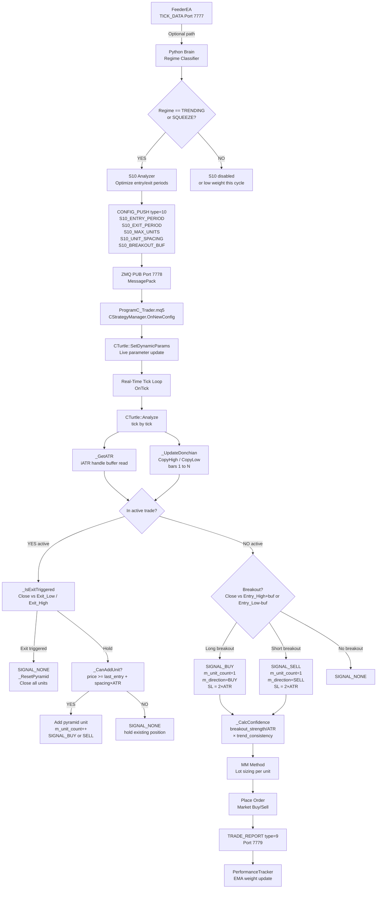
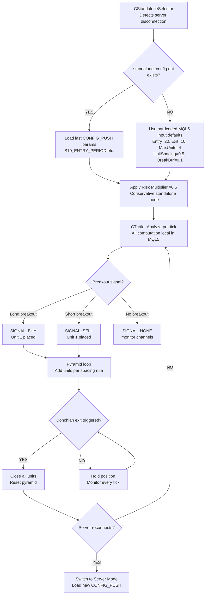
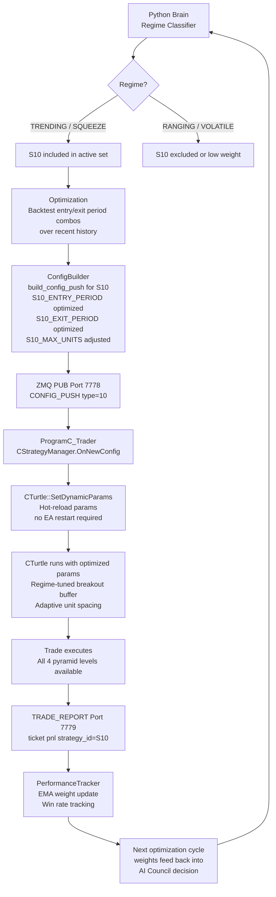
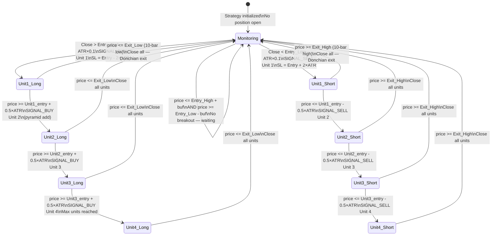

# S10 — Turtle Trading (Modernized)
## FlashEASuite V2 | Strategy Deep Dive Manual
### Generated: 2026-02-26 | Phase P9-5

---

## 1. Strategy Overview

| Field | Value |
|-------|-------|
| **Strategy ID** | S10 |
| **Name** | Turtle Trading (Modernized) |
| **Type** | Full MQL5 — no Python Brain required |
| **Standalone Capable** | Yes |
| **Magic Number** | 1010 |
| **MQL5 Class** | `CTurtle` (`Include/Logic/Strategies/S10_Turtle.mqh`) |
| **Preferred Regime** | TRENDING |
| **Alt Regime** | SQUEEZE (pre-breakout compression) |
| **Poor Regimes** | RANGING, VOLATILE |
| **Strategy Family** | Trend Following |

### สรุปแนวคิด (Thai)

S10 คือกลยุทธ์ **Turtle Trading** ที่ถูกปรับปรุงให้ทันสมัย โดยอิงหลักการของ **Richard Dennis (1983)** — เปิด trade เมื่อราคา **ทะลุผ่าน (Breakout)** แนวสูงสุดหรือต่ำสุดของ 20 แท่งเทียนที่ผ่านมา (Donchian Channel 20) พร้อม buffer ของ ATR×0.1 เพื่อกรองสัญญาณปลอม

จุดเด่นสำคัญคือระบบ **Pyramiding** — เพิ่ม position สูงสุด 4 ครั้ง ทุกระยะห่าง 0.5×ATR เมื่อราคาเคลื่อนที่ในทิศทางที่ต้องการ ช่วยให้ได้กำไรสูงในแนวโน้มที่แข็งแกร่ง

การออกจาก trade ใช้ **Donchian Channel 10 แท่ง** (ช่องที่สั้นกว่า) แทนการกำหนด Take Profit คงที่ และ Stop Loss อยู่ที่ 2×ATR จากจุดเข้า ตามสูตรคลาสสิกของ Turtle

---

## 2. Core Theory

### 2.1 Donchian Channel Breakout

```
Entry Channel (N=20):
  Entry_High = max(High[1], High[2], ..., High[20])   // 20 closed bars
  Entry_Low  = min(Low[1],  Low[2],  ..., Low[20])

Exit Channel (N=10):
  Exit_High  = max(High[1], High[2], ..., High[10])   // 10 closed bars (faster)
  Exit_Low   = min(Low[1],  Low[2],  ..., Low[10])

Breakout Buffer:
  Long  trigger = Entry_High + ATR × Turtle_BreakoutBuf   (default 0.1)
  Short trigger = Entry_Low  - ATR × Turtle_BreakoutBuf
```

The 20-bar channel captures the **dominant swing range**. A close beyond this range — with the ATR buffer absorbing micro-fakeouts — signals that a genuine new trend is beginning.

### 2.2 ATR-Based Stop Loss (N-Stop)

```
ATR(N) = Average True Range over last N bars (default N=20)

Stop Loss (Long)  = Entry Price - 2 × ATR
Stop Loss (Short) = Entry Price + 2 × ATR
```

The factor of 2 is the original Turtle "N" multiplier. It places the stop beyond typical daily noise while allowing the trade breathing room during trend development.

### 2.3 Pyramiding (Unit Addition)

```
Pyramid Condition:
  Can add unit when:
    1. Current units < max_units (default 4)
    2. Price moved >= unit_spacing × ATR from last_entry_price

  Long:  price >= last_entry + (Turtle_UnitSpacing × ATR)   // default 0.5 × ATR
  Short: price <= last_entry - (Turtle_UnitSpacing × ATR)

Example (ATR = 0.0050, starting entry = 1.2000):
  Unit 1: Entry @ 1.2000
  Unit 2: Entry @ 1.2025  (+0.5 ATR)
  Unit 3: Entry @ 1.2050  (+1.0 ATR from start)
  Unit 4: Entry @ 1.2075  (+1.5 ATR from start)
```

### 2.4 Exit Rule (Donchian Exit Channel)

```
Exit Long  : Close <= Exit_Low  (10-bar low)
Exit Short : Close >= Exit_High (10-bar high)

No fixed Take Profit. The Donchian exit keeps the trader in
the trend until price reverses to a 10-bar extreme.
```

### 2.5 Confidence Score

```
breakout_strength  = Close - Entry_High             (for Long)
                   = Entry_Low - Close              (for Short)

trend_consistency  = count_of_consecutive_closes_in_direction / (N - 1)
                   where N = Turtle_EntryPeriod (20)

Confidence = (breakout_strength / ATR) × trend_consistency

Clamped to [0.0, 1.0]
```

| Confidence Value | Interpretation |
|-----------------|----------------|
| < 0.30 | Weak breakout — likely false signal |
| 0.30 – 0.55 | Moderate breakout — acceptable |
| 0.55 – 0.80 | Strong breakout — good trend alignment |
| > 0.80 | Exceptional breakout with full trend consistency |

---

## 3. System Architecture & Responsibility Split

```
┌──────────────────────────────────────────────────────────────────────┐
│                    S10 STANDALONE ARCHITECTURE                        │
├─────────────────────────────┬────────────────────────────────────────┤
│  PYTHON BRAIN (Optional)    │  MQL5 TRADER (Primary)                  │
├─────────────────────────────┼────────────────────────────────────────┤
│  • CONFIG_PUSH optimization │  • Donchian channel calculation         │
│    S10_ENTRY_PERIOD         │  • ATR computation via iATR handle      │
│    S10_EXIT_PERIOD          │  • Breakout detection per tick          │
│    S10_MAX_UNITS            │  • Pyramid unit tracking                │
│    S10_UNIT_SPACING         │  • Donchian exit monitoring             │
│    S10_BREAKOUT_BUF         │  • SL = 2 × ATR offset (GetStopLoss)   │
│  • Regime classification    │  • TP = 0.0 (Donchian exit, no fixed TP)|
│  • Trend-consistency boost  │  • Confidence scoring (local)           │
│                             │  • Standalone: uses hardcoded defaults  │
│                             │  • TRADE_REPORT via ZMQ PUSH            │
└─────────────────────────────┴────────────────────────────────────────┘
```

**Design Principle:** S10 is fully self-contained in MQL5. Python Brain provides optional parameter optimization but is NOT required. In standalone mode, all inputs use the hardcoded defaults defined in the `input` declarations.

---

## 4. Full System Dataflow



---

## 5. Signal Logic

### 5.1 Entry Conditions

```mql5
// Tick-level check in CTurtle::Analyze()

// Update Donchian channels from completed bars (shift=1..N)
_UpdateDonchian();    // sets m_entry_high, m_entry_low, m_exit_high, m_exit_low
m_atr = _GetATR();

// Long Breakout Entry:
if (price > m_entry_high + m_breakout_buf * m_atr)
{
    sig           = SIGNAL_BUY;
    m_direction   = SIGNAL_BUY;
    m_unit_count  = 1;
    m_state.last_sl = 2.0 * m_atr;   // offset from entry
    m_state.last_tp = 0.0;            // no fixed TP — Donchian exit
}

// Short Breakout Entry:
if (price < m_entry_low - m_breakout_buf * m_atr)
{
    sig           = SIGNAL_SELL;
    m_direction   = SIGNAL_SELL;
    m_unit_count  = 1;
    m_state.last_sl = 2.0 * m_atr;
    m_state.last_tp = 0.0;
}
```

### 5.2 Pyramid Addition

```mql5
// While in active trade, on each tick check pyramid condition:

bool _CanAddUnit(double price)
{
    if (m_unit_count >= m_max_units) return false;    // max 4 units
    if (m_unit_count == 0)           return true;

    double spacing = m_unit_spacing * m_atr;          // default 0.5 × ATR

    if (m_direction == SIGNAL_BUY)
        return (price >= m_last_entry_price + spacing);
    if (m_direction == SIGNAL_SELL)
        return (price <= m_last_entry_price - spacing);
    return false;
}
// If CanAddUnit → signal m_direction (BUY or SELL again), increment m_unit_count
```

### 5.3 Exit Conditions

```mql5
// Donchian exit — no fixed TP:

bool _IsExitTriggered(double price)
{
    if (m_direction == SIGNAL_BUY)  return (price <= m_exit_low);   // 10-bar low
    if (m_direction == SIGNAL_SELL) return (price >= m_exit_high);  // 10-bar high
    return false;
}
// On exit: SIGNAL_NONE returned, _ResetPyramid() called
// StrategyManager closes ALL open units for this strategy
```

### 5.4 CONFIG_PUSH Parameter Parsing

```mql5
// CTurtle::SetDynamicParams (called by StrategyManager on CONFIG_PUSH):

m_entry_period = (int)params.GetParam("S10_ENTRY_PERIOD", m_entry_period);
m_exit_period  = (int)params.GetParam("S10_EXIT_PERIOD",  m_exit_period);
m_max_units    = (int)params.GetParam("S10_MAX_UNITS",    m_max_units);
m_unit_spacing =      params.GetParam("S10_UNIT_SPACING", m_unit_spacing);
m_breakout_buf =      params.GetParam("S10_BREAKOUT_BUF", m_breakout_buf);
m_risk_pct     =      params.GetParam("S10_RISK_PCT",     m_risk_pct);

// Regime-adaptive breakout buffer (OnConfigUpdate):
if (config.regime == REGIME_TRENDING)     m_breakout_buf = 0.05;  // tighter
else if (config.regime == REGIME_RANGING) m_breakout_buf = 0.20;  // wider filter
```

---

## 6. Parameter Reference

### 6.1 MQL5 Input Parameters

| Parameter | Default | Range | Description |
|-----------|---------|-------|-------------|
| `Turtle_EntryPeriod` | 20 | 10–50 | Donchian channel bars for breakout detection |
| `Turtle_ExitPeriod` | 10 | 5–25 | Donchian channel bars for exit (shorter = faster exit) |
| `Turtle_ATR_Period` | 20 | 10–30 | ATR calculation period (classic Turtle = 20) |
| `Turtle_BreakoutBuf` | 0.1 | 0.0–0.5 | ATR multiplier added beyond channel edge (fakeout filter) |
| `Turtle_MaxUnits` | 4 | 1–4 | Maximum pyramid units per direction |
| `Turtle_UnitSpacing` | 0.5 | 0.25–1.0 | ATR spacing between successive pyramid additions |
| `Turtle_RiskPct` | 1.0 | 0.5–2.0 | Risk % per unit for lot sizing |

### 6.2 CONFIG_PUSH Keys (Server Mode)

| Key | Type | Description |
|-----|------|-------------|
| `S10_ENTRY_PERIOD` | int | Optimized Donchian entry period |
| `S10_EXIT_PERIOD` | int | Optimized Donchian exit period |
| `S10_ATR_PERIOD` | int | Optimized ATR period |
| `S10_MAX_UNITS` | int | Regime-adjusted max pyramid units |
| `S10_UNIT_SPACING` | float | Regime-adjusted pyramid spacing (ATR units) |
| `S10_BREAKOUT_BUF` | float | Regime-adjusted breakout buffer |
| `S10_RISK_PCT` | float | Adjusted risk % per unit |

### 6.3 GetCurrentParams Export Keys

These keys are available for TRADE_REPORT and system monitoring:

| Key | Description |
|-----|-------------|
| `S10_UNITS_ACTIVE` | Current number of active pyramid units |
| `S10_ENTRY_HIGH` | Last computed 20-bar Donchian high |
| `S10_ENTRY_LOW` | Last computed 20-bar Donchian low |
| `S10_ATR` | Last ATR value used in computations |

---

## 7. Standalone vs Server Mode

### 7.1 Standalone Mode (No Python Server)



**Key Properties of Standalone Mode:**
- Fully self-contained — no network dependency
- Uses `iATR` and `CopyHigh`/`CopyLow` built-in MQL5 functions
- Risk reduced to 50% of normal (`standalone_config.risk_multiplier = 0.5`)
- `IsStandaloneCapable()` returns `true` in strategy table

### 7.2 Server Mode (Full Optimization)



**Key Properties of Server Mode:**
- `Turtle_BreakoutBuf` dynamically adjusted: 0.05 in strong trend, 0.20 in mixed conditions
- Python Brain optimizes `EntryPeriod` and `ExitPeriod` based on recent backtested Sharpe ratio
- AI Council applies regime multipliers: ×1.5 weight in TRENDING, ×0.3 in RANGING

---

## 8. State Diagram



---

## 9. Performance Characteristics

| Aspect | Detail |
|--------|--------|
| **Best Market Condition** | Sustained directional trends (TRENDING regime) |
| **Worst Market Condition** | Choppy/ranging markets (repeated false breakouts) |
| **Signal Frequency** | Low — only on genuine 20-bar channel breaks |
| **Typical Trade Duration** | Days to weeks (trend-following timeframe) |
| **Win Rate Profile** | Lower win rate (30–45%) but large wins compensate losses |
| **R:R Profile** | High potential R:R (3:1 to 10:1) via pyramiding |
| **Stop Loss Type** | Fixed ATR offset (2×ATR) — no trailing in base implementation |
| **Take Profit Type** | Dynamic — Donchian 10-bar exit (no fixed TP price) |
| **Lot Sizing** | Per-unit sizing via active MM method; 4 units can compound exposure |
| **Latency** | MQL5 tick processing: ~0ms (fully local computation) |
| **Standalone** | Yes — operates without Python server |

---

## 10. Files Reference

| File | Role |
|------|------|
| `Include/Logic/Strategies/S10_Turtle.mqh` | `CTurtle` class — full strategy logic, Donchian, pyramiding |
| `Include/Logic/IStrategy.mqh` | Abstract base class — `IStrategy`, `SDynamicParams`, signals |
| `Include/Logic/StrategyConstants.mqh` | Strategy ID `S10_TURTLE`, magic `MAGIC_S10_TURTLE`, regime table |
| `03_Trader/ProgramC_Trader.mq5` | Strategy manager — instantiates `CTurtle`, routes CONFIG_PUSH |
| `02_Brain/core/intelligence/strategy_council.py` | AI Council — regime weight × confidence gate |
| `02_Brain/config_push/config_builder.py` | Builds S10 CONFIG_PUSH payload with optimized params |
| `02_Brain/core/execution_listener.py` | Receives TRADE_REPORT, updates `PerformanceTracker` |

---

## 11. Quick Diagnostics

### Check S10 Active Channels

```
MetaTrader 5 → Experts tab → filter [S10]
Expected log line on init:
  [S10] Init OK | EURUSD PERIOD_H1 | Entry:20 Exit:10 MaxUnits:4
```

### Validate CONFIG_PUSH Updates S10

```bash
python tools/validate_live_readiness.py --zmq
# Look for TEST 5: CONFIG_PUSH dry-run
# Expected output: S10_ENTRY_PERIOD, S10_EXIT_PERIOD, S10_MAX_UNITS present
```

### Inspect Pyramid State

```
MetaTrader 5 → Experts log filter [S10]:
  [S10] DynamicParams | Entry:20 Exit:10 MaxUnits:4 Spacing:0.50
  [S10] SIGNAL_BUY | units=1 | entry_high=1.08540 | ATR=0.00520
  [S10] SIGNAL_BUY | units=2 | pyramid add | price=1.08806
```

### Validate Standalone Self-Sufficiency

```bash
# Disconnect Python server, verify S10 continues trading:
python -c "
from tools.validate_live_readiness import check_standalone
check_standalone('S10')
# Expected: S10 IsStandaloneCapable = True
"
```

### Full System Readiness

```bash
python tools/validate_live_readiness.py
# Expected: 60/60 PASS
```

---

*S10 Manual — FlashEASuite V2 | Phase P9-5 | Generated 2026-02-26*
