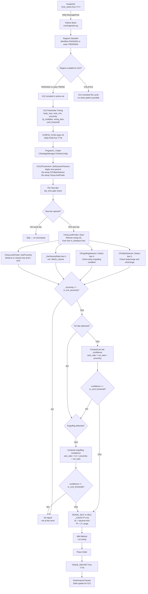
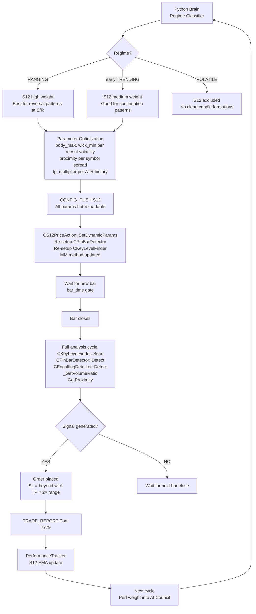
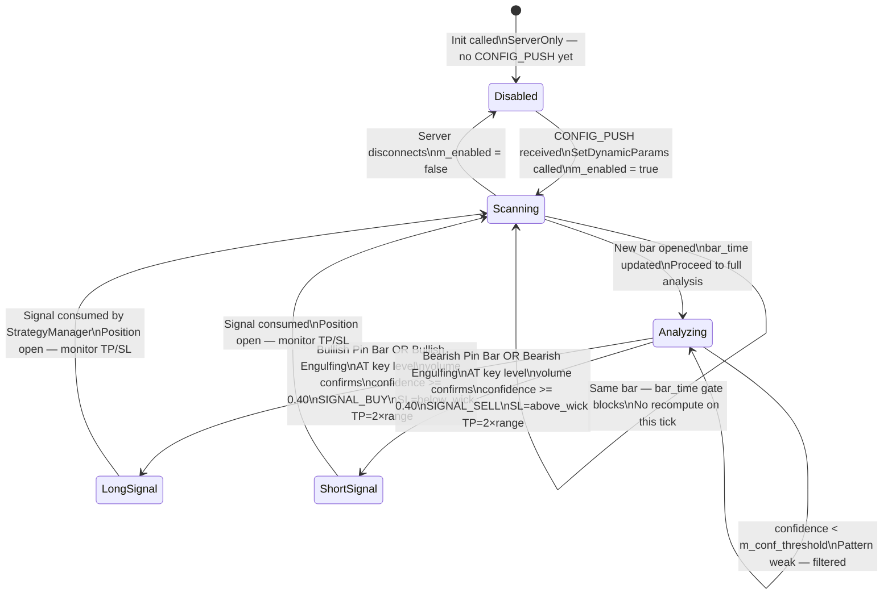

# S12 — Price Action (Pin Bar + Engulfing)
## FlashEASuite V2 | Strategy Deep Dive Manual
### Generated: 2026-02-26 | Phase P9-5

---

## 1. Strategy Overview

| Field | Value |
|-------|-------|
| **Strategy ID** | S12 |
| **Name** | Price Action (Pin Bar + Engulfing) |
| **Type** | Full MQL5 — Server Only |
| **Standalone Capable** | No |
| **Magic Number** | 1012 |
| **MQL5 Class** | `CS12PriceAction` (`Include/Logic/Strategies/S12_PriceAction.mqh`) |
| **Sub-Detectors** | `CPinBarDetector`, `CEngulfingDetector`, `CKeyLevelFinder` |
| **Preferred Regime** | RANGING, early TRENDING |
| **Poor Regimes** | VOLATILE (no clean pattern formation) |
| **Strategy Family** | Price Action — Reversal / Continuation |

### สรุปแนวคิด (Thai)

S12 วิเคราะห์ **Price Action** โดยตรงจากรูปแบบของแท่งเทียน แทนการใช้ indicators ทั่วไป โดยตรวจจับ 2 รูปแบบหลัก:

- **Pin Bar** — แท่งที่มี body เล็ก (< 30% ของ range) และ Wick ยาว (> 60% ของ range) บ่งชี้การ Rejection ของระดับราคา
- **Engulfing** — แท่งที่ body ปัจจุบัน "กลืน" body ของแท่งก่อนหน้า บ่งชี้การเปลี่ยนทิศของ momentum

**Key Level Filter** — สัญญาณจะถูกยืนยันก็ต่อเมื่อเกิดขึ้น "ใกล้" Key Level (Swing High/Low, Round Number, Support/Resistance) โดยวัดเป็นระยะห่างจาก ATR

**Volume Filter** — ต้องการ volume สูงกว่าค่าเฉลี่ย 20 แท่ง เพื่อยืนยัน momentum

S12 ประมวลผลเพียง **ครั้งละ 1 แท่ง** (ไม่ใช่ทุก tick) เพื่อความแม่นยำ โดยอ้างอิงจากแท่งที่ปิดสมบูรณ์แล้ว (bar index = 1)

---

## 2. Core Theory

### 2.1 Pin Bar Pattern

```
Candle Range  = High - Low
Body          = |Close - Open|
Upper Wick    = High - max(Open, Close)
Lower Wick    = min(Open, Close) - Low

Pin Bar Condition:
  body / range < m_body_max_ratio       (default 0.30 = 30% max)
  dominant_wick / range > m_wick_min_ratio (default 0.60 = 60% min)

Bullish Pin Bar (reversal up — rejection of lower price):
  Lower wick is dominant  → Long signal
  Lower wick = min(Open, Close) - Low
  Lower wick > Upper wick AND lower_wick / range > 0.60

Bearish Pin Bar (reversal down — rejection of higher price):
  Upper wick is dominant  → Short signal
  Upper wick = High - max(Open, Close)
  Upper wick > Lower wick AND upper_wick / range > 0.60

Pin Bar SL: beyond the tip of the dominant wick ± 5 points buffer
  Long SL  = Low  - 5 × _Point
  Short SL = High + 5 × _Point

Pin Bar TP: 2× candle range from current close
  Long TP  = Close_current + range × m_tp_multiplier
  Short TP = Close_current - range × m_tp_multiplier
```

### 2.2 Engulfing Pattern

```
Engulfing Condition:
  Current candle body COMPLETELY COVERS previous candle body:
    curr_body_low  < prev_body_low
    curr_body_high > prev_body_high

  where body_low  = min(Open, Close)
        body_high = max(Open, Close)

Bullish Engulfing:
  Current bar = green (Close > Open)
  Previous bar = red (Close < Open)
  Green body fully engulfs red body → Long signal

Bearish Engulfing:
  Current bar = red (Close < Open)
  Previous bar = green (Close > Open)
  Red body fully engulfs green body → Short signal

Engulfing strength (size_ratio):
  size_ratio = curr_body_size / prev_body_size
  Larger ratio = stronger engulfing = higher confidence component
```

### 2.3 Key Level Filter

```
Key Levels detected by CKeyLevelFinder:
  1. Swing Highs: bar[i].High is the highest of m_swing_bars bars left AND right
  2. Swing Lows:  bar[i].Low  is the lowest  of m_swing_bars bars left AND right
  3. Round Numbers: price levels that are multiples of round pip values
  4. Support/Resistance: historically significant price clusters

Proximity Score:
  proximity = 1.0 - (distance_to_nearest_level / ATR)
  Clamped to [0.0, 1.0]

  distance_to_nearest_level = |current_price - nearest_key_level|

  proximity >= m_min_proximity (default 0.30) → signal valid
  proximity < m_min_proximity                 → signal discarded

Example:
  ATR = 0.0050, nearest_level = 1.08500, current_price = 1.08480
  distance = 0.00020
  proximity = 1.0 - (0.00020 / 0.0050) = 1.0 - 0.04 = 0.96  ✅ accepted
```

### 2.4 Volume Filter

```
Volume Ratio = current_bar_volume / MA(volume, 20)

Capped at 2.0 for confidence calculation (extreme volume does not give extra credit).

Used as multiplier in confidence formula.
volume_ratio >= 1.0 indicates above-average participation (stronger signal).
volume_ratio < 1.0 indicates weak volume (confidence penalty).
```

### 2.5 Confidence Scores

```
Pin Bar Confidence:
  confidence = pb.wick_ratio × min(volume_ratio, 1.5) × proximity
  Clamped to [0.0, 1.0]

  pb.wick_ratio = dominant_wick / range  (range = 0.60–1.0 for valid pin bars)

Engulfing Confidence:
  confidence = eng.size_ratio × 0.4 × proximity × min(volume_ratio, 1.5)
  Clamped to [0.0, 1.0]

  The ×0.4 factor reflects that engulfing is structurally weaker
  than a pin bar — it requires volume and key level support.

Threshold gate:
  confidence >= m_conf_threshold (default 0.40) → signal emitted
  confidence <  0.40             → signal discarded regardless of pattern
```

| Confidence Value | Interpretation |
|-----------------|----------------|
| < 0.40 | Pattern detected but filtered — no signal output |
| 0.40 – 0.55 | Acceptable signal — low key level proximity or volume |
| 0.55 – 0.75 | Good signal — at key level with confirming volume |
| > 0.75 | Strong signal — textbook pin bar at major S/R with high volume |

### 2.6 Bar-by-Bar Processing Gate

```mql5
// S12 runs once per newly completed bar only:
datetime bar_time = iTime(m_symbol, m_timeframe, 1);   // time of last closed bar
if (bar_time == m_last_bar_time) return;               // same bar — skip tick
m_last_bar_time = bar_time;                            // new bar — proceed
```

This prevents re-firing the same pin bar pattern multiple times within one bar's worth of ticks.

---

## 3. System Architecture & Responsibility Split

```
┌──────────────────────────────────────────────────────────────────────┐
│              S12 SERVER-ONLY ARCHITECTURE                            │
├─────────────────────────────┬────────────────────────────────────────┤
│  PYTHON BRAIN (Required)    │  MQL5 TRADER (Client Side)             │
├─────────────────────────────┼────────────────────────────────────────┤
│  • Regime classification    │  CS12PriceAction main class            │
│  • S12 weight decision      │  ├─ CPinBarDetector                   │
│  • Parameter optimization   │  │   Detect(bar_index) → SPinBarResult │
│    S12_BODY_MAX             │  ├─ CEngulfingDetector                 │
│    S12_WICK_MIN             │  │   Detect(bar_index) → SEngulfingResult│
│    S12_PROXIMITY            │  └─ CKeyLevelFinder                   │
│    S12_TP_MULT              │       Scan() → GetProximity(price)     │
│    S12_CONF_THRESH          │  • Volume MA handle (iMA on VOLUME_TICK)│
│    S12_SWING_BARS           │  • _GetVolumeRatio() per bar           │
│  • CONFIG_PUSH dispatch     │  • _CalcSLTP(bar, is_buy, sl, tp)     │
│                             │  • Bar-gate: process once per new bar  │
│                             │  • Priority: Pin Bar > Engulfing       │
│                             │  • TRADE_REPORT via ZMQ Port 7779     │
└─────────────────────────────┴────────────────────────────────────────┘
```

**Sub-Detector Composition:** `CS12PriceAction` uses **direct member objects** (not pointers), per the MQL5 no-heap-allocation design principle. Sub-detectors are initialized via `Setup()` calls rather than constructors with parameters.

---

## 4. Full System Dataflow



---

## 5. Signal Logic

### 5.1 Pin Bar Detection Flow

```mql5
// CPinBarDetector::Detect(int bar_index):
double high  = iHigh(m_symbol, m_tf, bar_index);
double low   = iLow(m_symbol,  m_tf, bar_index);
double open  = iOpen(m_symbol, m_tf, bar_index);
double close = iClose(m_symbol, m_tf, bar_index);

double range        = high - low;
double body         = MathAbs(close - open);
double body_ratio   = body / range;              // must be < 0.30

double upper_wick   = high  - MathMax(open, close);
double lower_wick   = MathMin(open, close) - low;
double dominant_wick= MathMax(upper_wick, lower_wick);
double wick_ratio   = dominant_wick / range;     // must be > 0.60

if (body_ratio >= m_body_max_ratio)  return PINBAR_NONE;
if (wick_ratio <  m_wick_min_ratio)  return PINBAR_NONE;

if (lower_wick > upper_wick) return PINBAR_BULLISH;   // rejection below
if (upper_wick > lower_wick) return PINBAR_BEARISH;   // rejection above
```

### 5.2 Engulfing Detection Flow

```mql5
// CEngulfingDetector::Detect(int bar_index):
// bar_index=1: current (engulfing) bar
// bar_index=2: previous bar

double curr_body_high = MathMax(open[1], close[1]);
double curr_body_low  = MathMin(open[1], close[1]);
double prev_body_high = MathMax(open[2], close[2]);
double prev_body_low  = MathMin(open[2], close[2]);

bool engulfs = (curr_body_low < prev_body_low) && (curr_body_high > prev_body_high);
if (!engulfs) return ENGULF_NONE;

bool curr_bullish = (close[1] > open[1]);
bool prev_bearish = (close[2] < open[2]);
bool curr_bearish = (close[1] < open[1]);
bool prev_bullish = (close[2] > open[2]);

if (curr_bullish && prev_bearish) return ENGULF_BULLISH;
if (curr_bearish && prev_bullish) return ENGULF_BEARISH;
```

### 5.3 Key Level Scanning

```mql5
// CKeyLevelFinder::Scan() — called once per new bar:
// Scans m_lookback bars for swing pivots

for (int i = m_swing_bars; i < m_lookback - m_swing_bars; i++)
{
    // Swing High: bar[i].High is highest within ±swing_bars window
    bool is_swing_high = true;
    for (int j = i - m_swing_bars; j <= i + m_swing_bars; j++)
        if (j != i && High[j] >= High[i]) { is_swing_high = false; break; }
    if (is_swing_high) AddLevel(High[i]);

    // Swing Low: bar[i].Low is lowest within ±swing_bars window
    bool is_swing_low = true;
    for (int j = i - m_swing_bars; j <= i + m_swing_bars; j++)
        if (j != i && Low[j] <= Low[i]) { is_swing_low = false; break; }
    if (is_swing_low) AddLevel(Low[i]);
}
```

### 5.4 SL/TP Calculation

```mql5
void _CalcSLTP(int bar_index, bool is_buy, double &sl, double &tp)
{
    double high  = iHigh(m_symbol, m_timeframe, bar_index);
    double low   = iLow(m_symbol,  m_timeframe, bar_index);
    double range = high - low;
    double buffer = _Point * 5;

    if (is_buy)
    {
        sl = low  - buffer;                              // below lower wick
        tp = iClose(m_symbol, m_timeframe, 0)
           + (range * m_tp_multiplier);                  // 2× range above current close
    }
    else
    {
        sl = high + buffer;                              // above upper wick
        tp = iClose(m_symbol, m_timeframe, 0)
           - (range * m_tp_multiplier);
    }
}
```

### 5.5 CONFIG_PUSH Parameter Parsing

```mql5
// CS12PriceAction::SetDynamicParams / _ApplyDynamicParams:
m_body_max_ratio  = p.GetParam("S12_BODY_MAX_RATIO",  m_body_max_ratio);
m_wick_min_ratio  = p.GetParam("S12_WICK_MIN_RATIO",  m_wick_min_ratio);
m_min_proximity   = p.GetParam("S12_MIN_PROXIMITY",   m_min_proximity);
m_tp_multiplier   = p.GetParam("S12_TP_MULT",         m_tp_multiplier);
m_conf_threshold  = p.GetParam("S12_CONF_THRESHOLD",  m_conf_threshold);
m_swing_bars      = (int)p.GetParam("S12_SWING_BARS", (double)m_swing_bars);
m_lookback        = (int)p.GetParam("S12_LOOKBACK",   (double)m_lookback);

m_config.mm_method = p.mm_method;  // REQUIRED: copy MM method

// Re-setup sub-detectors with new params:
m_pinbar.Setup(m_symbol, m_timeframe, m_body_max_ratio, m_wick_min_ratio);
m_key_levels.Setup(m_symbol, m_timeframe, m_swing_bars, m_lookback);
```

---

## 6. Parameter Reference

### 6.1 MQL5 Default Parameters

| Parameter | Default | Range | Description |
|-----------|---------|-------|-------------|
| `m_body_max_ratio` | 0.30 | 0.10–0.45 | Max body-to-range ratio for valid pin bar |
| `m_wick_min_ratio` | 0.60 | 0.45–0.85 | Min dominant-wick-to-range ratio for pin bar |
| `m_min_proximity` | 0.30 | 0.10–0.70 | Min key level proximity score (0=far, 1=on level) |
| `m_tp_multiplier` | 2.0 | 1.0–4.0 | TP = N × candle range |
| `m_conf_threshold` | 0.40 | 0.25–0.65 | Minimum confidence to emit signal |
| `m_swing_bars` | 5 | 3–10 | Bars each side for swing pivot detection |
| `m_lookback` | 100 | 50–200 | Bars to scan for key levels |

### 6.2 CONFIG_PUSH Keys (Server Mode)

| Key | Type | Description |
|-----|------|-------------|
| `S12_BODY_MAX_RATIO` | float | Regime-tuned body ratio threshold |
| `S12_WICK_MIN_RATIO` | float | Regime-tuned wick ratio threshold |
| `S12_MIN_PROXIMITY` | float | Regime-tuned key level proximity minimum |
| `S12_TP_MULT` | float | Optimized TP multiplier |
| `S12_CONF_THRESHOLD` | float | Regime-tuned confidence gate |
| `S12_SWING_BARS` | int | Optimized swing pivot detection window |
| `S12_LOOKBACK` | int | Key level scan depth |

### 6.3 Diagnostic Accessors

| Method | Returns |
|--------|---------|
| `GetLastProximity()` | Last computed key level proximity score |
| `GetLastVolumeRatio()` | Last bar volume / MA20 volume ratio |
| `GetKeyLevelCount()` | Number of active key levels detected |
| `GetLastPinBar()` | `SPinBarResult` struct from last analysis |
| `GetLastEngulfing()` | `SEngulfingResult` struct from last analysis |
| `GetTP()` | Last computed take-profit price |
| `GetSL()` | Last computed stop-loss price |

---

## 7. Standalone vs Server Mode

### 7.1 Standalone Mode

S12 is **NOT standalone capable**.

- `IsStandaloneCapable()` returns `false`
- When server disconnects, `CStandaloneSelector` excludes S12
- The EA falls back to standalone-capable strategies (S10, S16 etc.)

**Reason:** Key Level identification is most accurate with server-side regime classification determining whether RANGING or early TRENDING conditions are present. Without this context, pin bars and engulfing patterns generate excessive false signals.

### 7.2 Server Mode (Full Operation)



---

## 8. State Diagram



---

## 9. Performance Characteristics

| Aspect | Detail |
|--------|--------|
| **Best Market Condition** | Ranging market with clear Support/Resistance levels |
| **Second Best** | Early trend formation — pullback pin bars at key levels |
| **Worst Market Condition** | Volatile/choppy markets — candles malformed, no clean patterns |
| **Signal Frequency** | Medium-low — only one signal per bar, only at key levels |
| **Typical Trade Duration** | Hours (intraday) to 1–2 days |
| **Win Rate Target** | 55–65% (quality filter: key level + volume + confidence) |
| **R:R Profile** | Fixed 2:1 (TP = 2× candle range, SL = wick tip) |
| **Processing Mode** | Bar-by-bar (not tick-by-tick) — efficient, no signal re-firing |
| **Priority** | Pin Bar takes priority over Engulfing if both detected same bar |
| **Server Dependency** | Required — disabled without CONFIG_PUSH |
| **Sub-Detector Handles** | 2 volume handles (tick volume + MA) |

---

## 10. Files Reference

| File | Role |
|------|------|
| `Include/Logic/Strategies/S12_PriceAction.mqh` | `CS12PriceAction` main class — pattern orchestration |
| `Include/Logic/Strategies/PriceAction/PinBarDetector.mqh` | `CPinBarDetector` + `SPinBarResult` struct |
| `Include/Logic/Strategies/PriceAction/EngulfingDetector.mqh` | `CEngulfingDetector` + `SEngulfingResult` struct |
| `Include/Logic/Strategies/PriceAction/KeyLevelFinder.mqh` | `CKeyLevelFinder` — swing H/L, round numbers, proximity |
| `Include/Logic/IStrategy.mqh` | Abstract base class — `IStrategy`, `SDynamicParams` |
| `Include/Logic/StrategyConstants.mqh` | Strategy ID `S12_PRICE_ACTION`, magic `MAGIC_S12_PRICE_ACTION` |
| `03_Trader/ProgramC_Trader.mq5` | Strategy manager — routes CONFIG_PUSH to `CS12PriceAction` |
| `02_Brain/config_push/config_builder.py` | Builds S12 CONFIG_PUSH with regime-tuned params |
| `02_Brain/core/execution_listener.py` | Receives TRADE_REPORT, updates `PerformanceTracker` |

---

## 11. Quick Diagnostics

### Check S12 Initialization and First Pattern

```
MetaTrader 5 → Experts log filter [S12]:
Init OK:
  [S12] Init OK | EURUSD PERIOD_H1 | KeyLevels:OK

Pin bar signal example:
  [S12] PinBar BULL | Conf:0.621 | Prox:0.84 | Vol:1.42 | SL:1.08345 TP:1.08680

Engulfing signal example:
  [S12] Engulfing BULL | Conf:0.445 | SizeR:1.38 | Prox:0.72 | SL:1.08340 TP:1.08660
```

### Inspect Key Level Count

```mql5
// In MQL5 diagnostic button or OnTimer:
int levels = price_action_strategy.GetKeyLevelCount();
PrintFormat("[S12 Diag] Active key levels: %d", levels);
// Expected: 5–20 levels depending on m_lookback and m_swing_bars
```

### Validate Pattern Components

```mql5
// After a signal fires:
SPinBarResult pb = price_action_strategy.GetLastPinBar();
PrintFormat("[S12 Diag] PinBar type=%d wick_ratio=%.3f", pb.type, pb.wick_ratio);

double prox = price_action_strategy.GetLastProximity();
double volr = price_action_strategy.GetLastVolumeRatio();
PrintFormat("[S12 Diag] Proximity=%.3f VolumeRatio=%.3f", prox, volr);
```

### Validate CONFIG_PUSH Contains S12 Params

```bash
python tools/validate_live_readiness.py --zmq
# Look for: S12_BODY_MAX_RATIO, S12_WICK_MIN_RATIO, S12_MIN_PROXIMITY in output
```

### Full System Readiness

```bash
python tools/validate_live_readiness.py
# Expected: 60/60 PASS
```

---

*S12 Manual — FlashEASuite V2 | Phase P9-5 | Generated 2026-02-26*
