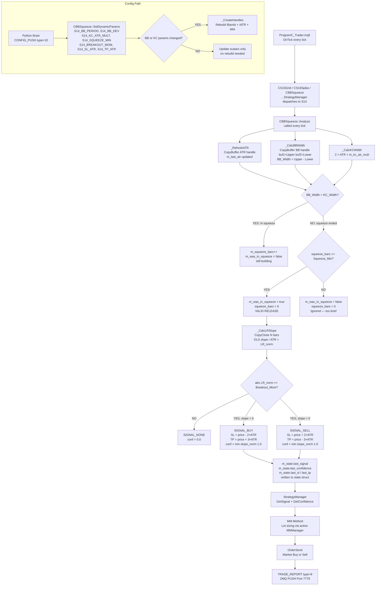
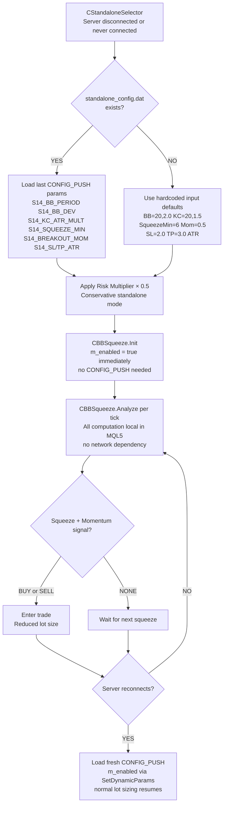
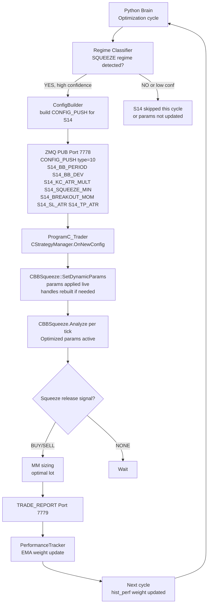
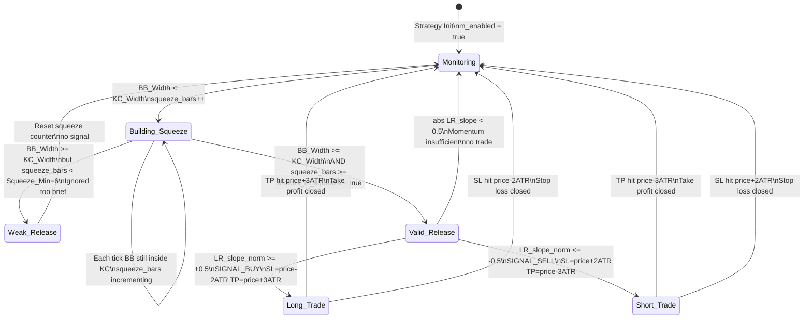

# S14 — Bollinger Squeeze Breakout
## FlashEASuite V2 | Strategy Deep Dive Manual
### Generated: 2026-02-26 | Phase P9-5

---

## 1. Strategy Overview

| Field | Value |
|-------|-------|
| **Strategy ID** | S14 |
| **Name** | Bollinger Squeeze Breakout |
| **Type** | Full MQL5 (no Python dependency) |
| **Standalone Capable** | Yes |
| **Preferred Regime** | SQUEEZE → VOLATILE / TRENDING (post-release) |
| **Poor Regimes** | Already VOLATILE (no squeeze buildup phase) |
| **MQL5 Class** | `CBBSqueeze` (Include/Logic/Strategies/S14_BBSqueeze.mqh) |
| **Magic Number** | 1014 |
| **Python Analyzer** | None — pure MQL5 indicator logic |

### สรุปแนวคิด (Thai)

S14 เป็นกลยุทธ์ **Bollinger Squeeze Breakout** — ตรวจจับช่วงที่ตลาดถูก "บีบ" (Squeeze) คือ Bollinger Bands อยู่ภายใน Keltner Channel และรอจนกว่าแรงดันจะระเบิดออกมา (Breakout) เมื่อ BB ขยายออกนอก KC ระบบจะใช้ **Linear Regression Slope** เป็นตัววัดทิศทางและโมเมนตัม — หากความชันเป็นบวกให้ซื้อ หากเป็นลบให้ขาย โดยมีกำไรเป้าหมาย 3×ATR และ Stop Loss 2×ATR กลยุทธ์นี้ทำงานได้ด้วยตัวเองโดยไม่ต้องพึ่ง Python Brain

---

## 2. Core Theory

### 2.1 Bollinger Bands (BB)

```
BB_Upper(t) = SMA(Close, N) + k × StdDev(Close, N)
BB_Lower(t) = SMA(Close, N) - k × StdDev(Close, N)

BB_Width(t) = BB_Upper(t) - BB_Lower(t)
            = 2 × k × StdDev(Close, N)

where:
  N  = BB_Period (default = 20)
  k  = BB_Deviation (default = 2.0)
```

Bollinger Bands narrow when volatility **compresses** and widen when volatility **expands**. This compression → expansion cycle is the core mechanism S14 exploits.

### 2.2 Keltner Channel (KC)

```
KC_Mid(t)   = EMA(Close, M)
KC_Upper(t) = KC_Mid(t) + ATR(P) × m
KC_Lower(t) = KC_Mid(t) - ATR(P) × m

KC_Width(t) = 2 × ATR(P) × m

where:
  M = KC_Period (default = 20)
  P = ATR_Period (default = 14)
  m = KC_ATR_Mult (default = 1.5)
```

The Keltner Channel uses ATR-based bands, making it **volatility-adaptive** but less sensitive to short-term spikes than Bollinger Bands.

### 2.3 Squeeze Detection

```
Squeeze Condition:
  BB_Width(t) < KC_Width(t)
  ↔  2k × StdDev(Close, N) < 2 × ATR(P) × m
  ↔  BB is INSIDE KC

Squeeze Counter:
  if BB_Width < KC_Width:
      squeeze_bars += 1
  else:
      was_in_squeeze = (squeeze_bars >= Squeeze_Min)
      squeeze_bars   = 0
```

The squeeze counter accumulates consecutive bars where BB is inside KC. Only when the count reaches `BS_Squeeze_Min` (default = 6) is the setup considered **valid**. This filters out brief, low-significance compressions.

### 2.4 Linear Regression Slope

```
LR Slope (14-bar, raw):
  Given N close prices: y_0 (oldest) … y_{N-1} (newest)

  sx  = sum(i,  i=0..N-1)
  sy  = sum(y_i, i=0..N-1)
  sxy = sum(i × y_i)
  sxx = sum(i²)

  slope = (N × sxy - sx × sy) / (N × sxx - sx²)

Normalized by ATR:
  LR_slope_norm = slope / ATR(P)
```

Normalization by ATR makes the slope dimensionless and comparable across symbols and timeframes. A value of 1.0 means the price is rising at a rate equal to one full ATR per bar.

### 2.5 Entry Conditions & Risk/Reward

```
Long Entry:
  was_in_squeeze = true          (BB just exited KC after ≥6 bars)
  AND LR_slope_norm >= +BS_Breakout_Mom   (upward momentum ≥ 0.5)
  → SIGNAL_BUY

Short Entry:
  was_in_squeeze = true
  AND LR_slope_norm <= -BS_Breakout_Mom   (downward momentum ≤ -0.5)
  → SIGNAL_SELL

TP = entry_price ± BS_TP_ATR_Mult × ATR   (default: +3.0 × ATR)
SL = entry_price ∓ BS_SL_ATR_Mult × ATR   (default: -2.0 × ATR)

R:R = TP_dist / SL_dist = 3.0 / 2.0 = 1.5
```

### 2.6 Confidence Score

```
Confidence = min(|LR_slope_norm|, 1.0)
           = min(|slope / ATR|, 1.0)

Range: 0.0 (no momentum) → 1.0 (maximum momentum)
```

The stronger the directional momentum at the moment of squeeze release, the higher the confidence. This is used by the MM system for lot sizing.

---

## 3. System Architecture & Responsibility Split

```
┌────────────────────────────────────────────────────────────┐
│             S14 ARCHITECTURE — FULL MQL5                    │
├─────────────────────────────┬──────────────────────────────┤
│  PYTHON BRAIN (Server Side) │  MQL5 TRADER (Client Side)   │
├─────────────────────────────┼──────────────────────────────┤
│  • Regime classification    │  • iBands → BB_Width         │
│  • CONFIG_PUSH (params)     │  • iATR → ATR, KC_Width      │
│  • Performance tracking     │  • iMA(EMA) → KC midline     │
│  • AI Council gating        │  • CopyClose → LR slope      │
│                             │  • Squeeze counter (state)   │
│  (No dedicated S14 Python   │  • Entry/SL/TP computation   │
│   Analyzer — logic is all   │  • Standalone capable        │
│   MQL5-side)                │  • CONFIG_PUSH hot-reload    │
└─────────────────────────────┴──────────────────────────────┘
```

**Design Principle:** All signal computation runs in MQL5 with zero network latency. The Python Brain's only role for S14 is to supply optimized parameter values via CONFIG_PUSH. Without a server connection, S14 uses hardcoded input defaults and operates fully autonomously.

---

## 4. Full System Dataflow



---

## 5. MQL5 CBBSqueeze: Signal Generation Detail

### 5.1 Indicator Handle Creation

```mql5
bool _CreateHandles()
{
    // Bollinger Bands (20 period, 2 std dev, shift 0, price CLOSE)
    m_bb_handle  = iBands(m_symbol, m_timeframe,
                          m_bb_period, 0, m_bb_deviation, PRICE_CLOSE);

    // ATR (14 period) — used for KC width AND TP/SL calculation
    m_atr_handle = iATR(m_symbol, m_timeframe, m_atr_period);

    // EMA (20 period) — Keltner Channel centerline
    m_ema_handle = iMA(m_symbol, m_timeframe,
                       m_kc_period, 0, MODE_EMA, PRICE_CLOSE);
}
```

Buffer indices: `BB buffer 0 = midline (SMA)`, `buffer 1 = Upper Band`, `buffer 2 = Lower Band`.
The EMA handle (`m_ema_handle`) is created but KC width is computed purely from ATR (the midline is not needed for width comparison — only `KC_Width = 2 × ATR × mult`).

### 5.2 Squeeze State Machine (per tick)

```mql5
void Analyze(const MqlTick &tick)
{
    _RefreshATR();                          // update m_last_atr

    double bb_w = _CalcBBWidth();           // Upper[0] - Lower[0]
    double kc_w = _CalcKCWidth();           // 2 × ATR × m_kc_atr_mult

    bool in_squeeze = (kc_w > 1e-10) && (bb_w < kc_w);

    if(in_squeeze)
    {
        m_squeeze_bars++;
        m_was_in_squeeze = false;           // still inside, not released yet
    }
    else
    {
        // BB just expanded beyond KC
        m_was_in_squeeze = (m_squeeze_bars >= m_squeeze_min_bars);
        m_squeeze_bars   = 0;               // reset for next squeeze
    }

    m_lr_slope = _CalcLRSlope();            // OLS slope / ATR
}
```

### 5.3 Entry Signal Logic

```mql5
if(m_was_in_squeeze && MathAbs(m_lr_slope) >= m_breakout_momentum)
{
    sig  = (m_lr_slope > 0) ? SIGNAL_BUY : SIGNAL_SELL;
    conf = MathMin(MathAbs(m_lr_slope), 1.0);

    double price = tick.bid;
    if(sig == SIGNAL_BUY)
    {
        sl = price - m_sl_atr_mult * m_last_atr;  // price - 2×ATR
        tp = price + m_tp_atr_mult * m_last_atr;  // price + 3×ATR
    }
    else
    {
        sl = price + m_sl_atr_mult * m_last_atr;  // price + 2×ATR
        tp = price - m_tp_atr_mult * m_last_atr;  // price - 3×ATR
    }
}
```

**Important:** `m_was_in_squeeze` is `true` for exactly **one tick** per squeeze event (the first tick where BB re-expands beyond KC). On the next tick, either the squeeze counter resets or the squeeze re-enters, so the entry window is single-tick. The StrategyManager should act immediately on the signal.

### 5.4 Linear Regression Slope (OLS, 14 bars)

```mql5
double _CalcLRSlope()
{
    // Load N=14 close prices (index 0 = newest)
    CopyClose(m_symbol, m_timeframe, 0, n, closes);

    // Reorder: x=0 is oldest, x=N-1 is newest
    for(int i = 0; i < n; i++)
    {
        double x = (double)i;
        double y = closes[n - 1 - i];    // reverse: oldest first
        sx  += x;   sy  += y;
        sxy += x*y; sxx += x*x;
    }

    double denom = n * sxx - sx * sx;
    double slope = (n * sxy - sx * sy) / denom;

    return (m_last_atr > 1e-10) ? slope / m_last_atr : 0.0;
}
```

### 5.5 CONFIG_PUSH Parameter Parsing (SetDynamicParams)

```mql5
void SetDynamicParams(SDynamicParams &params)
{
    // Inherited base call first (copies mm_method — Lesson 5)
    IStrategy::SetDynamicParams(params);

    bool rebuild = false;

    int    new_bb_p   = (int)params.GetParam("S14_BB_PERIOD",   m_bb_period);
    double new_bb_dev =      params.GetParam("S14_BB_DEV",      m_bb_deviation);
    int    new_kc_p   = (int)params.GetParam("S14_KC_PERIOD",   m_kc_period);
    double new_kc_m   =      params.GetParam("S14_KC_ATR_MULT", m_kc_atr_mult);

    // Rebuild indicator handles only if period/deviation changed
    if(new_bb_p != m_bb_period || MathAbs(new_bb_dev - m_bb_deviation) > 0.001 ||
       new_kc_p != m_kc_period || MathAbs(new_kc_m   - m_kc_atr_mult)  > 0.001)
        rebuild = true;

    m_bb_period         = new_bb_p;
    m_bb_deviation      = new_bb_dev;
    // ... plus Squeeze_Min, Breakout_Mom, SL_ATR, TP_ATR

    if(rebuild) _CreateHandles();   // Releases old + creates new handles
    m_enabled = true;               // Activate on first CONFIG_PUSH
}
```

---

## 6. Parameter Reference

### 6.1 MQL5 Input Parameters (Standalone Defaults)

| Parameter | Default | Range | Description |
|-----------|---------|-------|-------------|
| `BS_BB_Period` | 20 | 10–50 | Bollinger Bands SMA period |
| `BS_BB_Deviation` | 2.0 | 1.5–3.0 | BB standard deviation multiplier |
| `BS_KC_Period` | 20 | 10–50 | Keltner Channel EMA period |
| `BS_KC_ATR_Mult` | 1.5 | 1.0–2.5 | ATR multiplier for KC bands |
| `BS_Squeeze_Min` | 6 | 3–20 | Minimum bars inside squeeze for valid setup |
| `BS_Breakout_Mom` | 0.5 | 0.2–1.5 | Min normalized LR slope at release |
| `BS_SL_ATR_Mult` | 2.0 | 1.0–3.0 | Stop loss distance in ATR multiples |
| `BS_TP_ATR_Mult` | 3.0 | 1.5–5.0 | Take profit distance in ATR multiples |
| `BS_ATR_Period` | 14 | 7–21 | ATR period for KC width and TP/SL |
| `BS_LR_Period` | 14 | 7–21 | Linear Regression lookback bars |

### 6.2 CONFIG_PUSH Keys (Server Mode)

| Key | Type | Default | Description |
|-----|------|---------|-------------|
| `S14_BB_PERIOD` | int | 20 | BB period — triggers handle rebuild if changed |
| `S14_BB_DEV` | float | 2.0 | BB std dev multiplier — triggers handle rebuild |
| `S14_KC_PERIOD` | int | 20 | KC EMA period — triggers handle rebuild |
| `S14_KC_ATR_MULT` | float | 1.5 | KC ATR multiplier — triggers handle rebuild |
| `S14_SQUEEZE_MIN` | int | 6 | Minimum squeeze bar count (scalar, no rebuild) |
| `S14_BREAKOUT_MOM` | float | 0.5 | Breakout momentum threshold (scalar) |
| `S14_SL_ATR` | float | 2.0 | Stop loss ATR multiplier (scalar) |
| `S14_TP_ATR` | float | 3.0 | Take profit ATR multiplier (scalar) |

---

## 7. Standalone vs Server Mode

### 7.1 Standalone Mode (No Python Server)



**Standalone properties:**
- S14 sets `m_enabled = true` inside `Init()` — it does not require a CONFIG_PUSH to activate (unlike server-dependent strategies)
- All indicator handles created from input parameters at startup
- Risk multiplier applied at 50% by `CStandaloneSelector`
- No network calls, no InfluxDB dependency

### 7.2 Server Mode (Full Optimization)



---

## 8. Entry/Exit State Diagram



---

## 9. Performance Characteristics

| Aspect | Detail |
|--------|--------|
| **Best Market Condition** | Post-squeeze breakout in SQUEEZE → TRENDING regime transition |
| **Worst Market Condition** | Already volatile market with no consolidation phase |
| **Typical Trade Duration** | Minutes to hours (ATR-based TP/SL resolves quickly) |
| **Win Rate Target** | 45–55% (compensated by R:R of 1.5) |
| **R:R Ratio** | Fixed 1.5 (3×ATR TP / 2×ATR SL) |
| **Lot Sizing** | Determined by active MM method (uses `conf` for Kelly, ATR-based) |
| **Signal Frequency** | Low — requires minimum 6-bar squeeze before each entry |
| **False Signal Risk** | Filtered by LR momentum threshold (`BS_Breakout_Mom = 0.5`) |
| **Indicator Handles** | 3 handles (iBands, iATR, iMA) — rebuilt only when periods change |
| **Latency** | All computation MQL5-local: ~0ms per tick |
| **Standalone Ready** | Yes — activates immediately on Init() without CONFIG_PUSH |

---

## 10. Files Reference

| File | Role |
|------|------|
| `Include/Logic/Strategies/S14_BBSqueeze.mqh` | MQL5 `CBBSqueeze` class — all S14 logic |
| `Include/Logic/IStrategy.mqh` | IStrategy interface: Analyze(), GetSignal(), SetDynamicParams() |
| `03_Trader/ProgramC_Trader.mq5` | StrategyManager dispatches ticks and CONFIG_PUSH to S14 |
| `Include/Logic/StrategyConstants.mqh` | S14_BB_SQUEEZE enum, MAGIC_S14_BB_SQUEEZE, strategy table entry |
| `Include/Network/Protocol/Definitions.mqh` | SDynamicParams struct, CONFIG_PUSH message format |
| `02_Brain/config_push/config_builder.py` | Python side: builds S14 CONFIG_PUSH packet |
| `02_Brain/core/intelligence/strategy_council.py` | AI Council: activates S14 based on SQUEEZE regime confidence |

---

## 11. Quick Diagnostics

### Check S14 is Active in EA Log

```
Expert Journal (MetaTrader) → search for "[S14]":
  [S14] Init OK | EURUSD PERIOD_H1 | BB(20,2.0) KC(20,1.5) SqueezeMin=6
  [S14] ...squeeze_bars=7 → VALID RELEASE | LR_slope=0.73 → SIGNAL_BUY
```

### Validate Squeeze Parameters via Diagnostics API

```mql5
// From StrategyManager or test EA:
CBBSqueeze* s14 = GetStrategy(S14_BB_SQUEEZE);
PrintFormat("S14 squeeze_bars=%d | was_in_squeeze=%s | LR_slope=%.4f | ATR=%.5f",
            s14.GetSqueezeCount(),
            s14.IsInSqueezeState() ? "YES" : "NO",
            s14.GetLRSlope(),
            s14.GetLastATR());
```

### Validate CONFIG_PUSH contains S14 params

```bash
python tools/validate_live_readiness.py --zmq
# Look for TEST 5: CONFIG_PUSH dry-run
# Should show S14_BB_PERIOD, S14_BB_DEV, S14_KC_ATR_MULT,
#              S14_SQUEEZE_MIN, S14_BREAKOUT_MOM, S14_SL_ATR, S14_TP_ATR
```

### Validate Full System

```bash
python tools/validate_live_readiness.py
# Expected: 60/60 PASS
```

### Common Issues

| Symptom | Likely Cause | Fix |
|---------|-------------|-----|
| S14 never fires signals | `BS_Squeeze_Min` too high or market is always volatile | Reduce `BS_Squeeze_Min` to 4 |
| Too many false breakouts | `BS_Breakout_Mom` too low | Increase `BS_Breakout_Mom` to 0.8 |
| Handle init fails in log | Symbol/TF not available | Check `m_symbol` is valid before Init |
| Handles rebuilt every tick | BB/KC params float comparison issue | Check `SDynamicParams.GetParam` precision |

---

*S14 Manual — FlashEASuite V2 | Phase P9-5 | Generated 2026-02-26*
